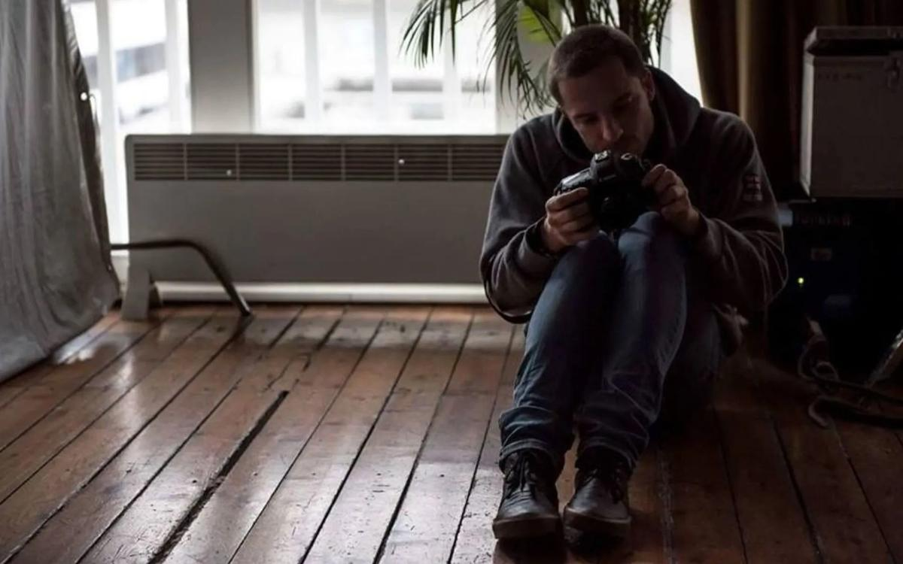

# Влюбленный в кино. Памяти погибшего в ЦАР оператора Кирилла Радченко

- **URL:** https://novayagazeta.ru/articles/2018/08/01/77364-vlyublennyy-v-kino
- **Дата:** 2018-08-01
- **Автор:** Лариса Малюкова

## Влюбленный в кино

## Памяти погибшего в ЦАР оператора Кирилла Радченко

Кирилл Радченко. Фото из архиваКирилл Радченко снимал на протяжении многих лет, но в профессию оператора только входил. С волнением, готовностью на любые трудности, на самую тяжкую ненормированную работу. Его отличала несовременная и непривычная в кино – скромность и отзывчивость. Коллеги говорят, что он был «чистым, светлым, искренним, молодым, прямолинейным и добродушным». Настоящим идеалистом.

«Где было опасно, там был он»

Друзья и коллеги вспоминают Орхана Джемаля, Александра Расторгуева и Кирилла Радченко, убитых в Африке

Он любил кино всегда. Бескорыстно. Самоотверженно. Подрабатывал киномеханики в старом, в том настоящем Музее кино. Пил маленькими глотками старое черно-белое кино ненасытно. Смотрел. Учился. Когда Музей разогнали, работал в кинотеатре Моссовета.

Кирилл Радченко. Фото из архиваВ 2015 он начал работу в «Районе тьмы. Хрониках повседневного зла» помощником оператора и фотографом. Это один из первых и действительно успешных российских жанровых веб-сериалов. Снятый без государственной финансовой поддержки за счет энтузиазма команды. За два года существования проект набрал более двух миллионов просмотров в YouTube.

Поддержите нашу работу!

1000 500 300 Нажимая кнопку «Стать соучастником», я принимаю условия и подтверждаю свое гражданство РФ

Если у вас есть вопросы, пишите [email protected] или звоните:+7 (929) 612-03-68

Все, кто его знал, говорят о его благородстве. О беспримерной честности. Неожиданно для друзей поехал в Чечню на выборы наблюдателем. Благодаря его усилиям фальсификации на его участке в разы уменьшились. Он просил паспорта голосующих, тихо, но твердо отсекал хотя бы какой-то процент «круизников», курсирующих между участками. На него ругались покладистые члены комиссии. А он просто делал то, ради чего приехал. При этом о людях Чечни говорил с неподдельным теплом, уважением. Точно разделяя интересы власти и простых чеченцев.

Кирилл Радченко (второй справа) — наблюдатель на выборах в Чечне. Фото из архиваВместе с Александром Расторгуевым, с которым и познакомился на выборах в Чечне, они сняли документальный фильм «Выбирая Россию/Electing Russia» совместного немецко-российского производства. О российской политической жизни накануне президентских выборов. Среди героев фильма Собчак, Навальный. Расторгуев – режиссер, Радченко – один из группы операторов. Решили вместе с продюсером Евгением Гиндилисом сделать русскую версию картины, которая будет не столько про выборы, сколько про выбор.

Саша Расторгуев. Я тебя люблю

Наш товарищ и брат. Поверить в его гибель невозможно

Они выбрали Россию, сколь бы ни труден, ни дорог, ни наказуем был этот выбор. Они мечтали о свободной, открытой, достойной России. Честного человека можно подвергнуть преследова­нию, даже убить. Но не обесчестить. Ужасно обидно, что люди чести, мечтающие о лучшей доле для своей страны, такие, как Кирилл, Орхан, Саша погибают. И кажется, что район тьмы с его хрониками повседневного зла, покинул экран. Он уже здесь. Рядом.

Поддержите нашу работу!

1000 500 300 Нажимая кнопку «Стать соучастником», я принимаю условия и подтверждаю свое гражданство РФ

Если у вас есть вопросы, пишите [email protected] или звоните:+7 (929) 612-03-68
