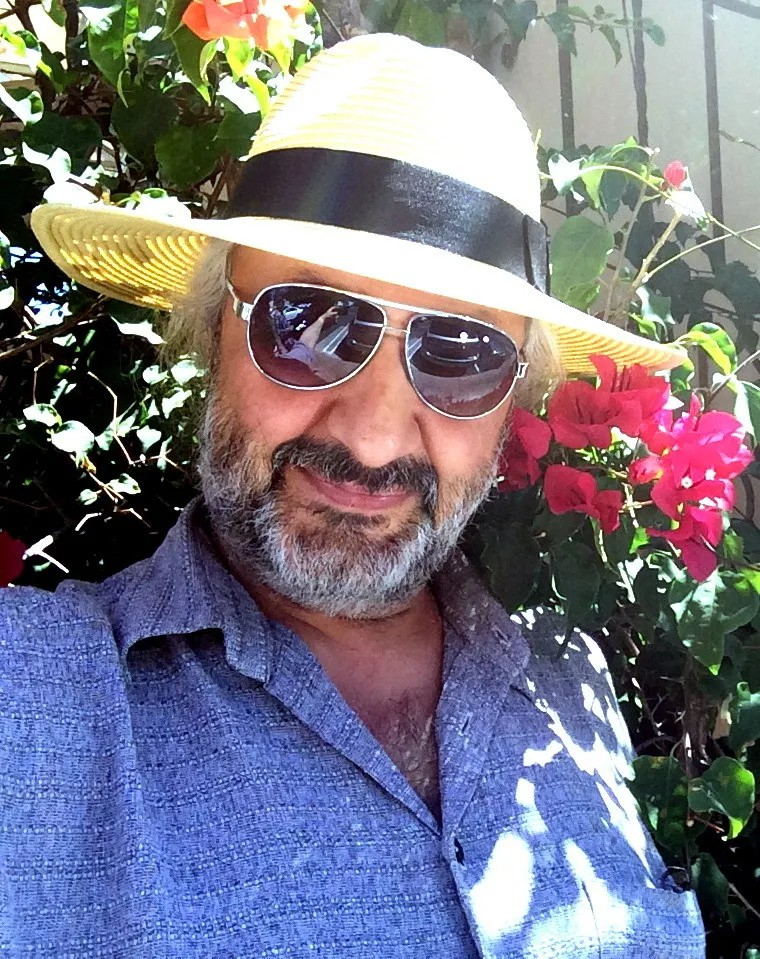

# Стас Намин: «Продажный политик может убить целые страны». Известный музыкант — о новых проектах про Кубу, Анастаса Микояна и Михаила Горбачева

- **URL:** https://novayagazeta.ru/articles/2018/08/24/77594-stas-namin-prodazhnyy-politik-mozhet-ubit-tselye-strany
- **Дата:** 2018-08-24
- **Автор:** Лариса Малюкова

## Стас Намин: «Продажный политик может убить целые страны»

## Известный музыкант — о новых проектах про Кубу, Анастаса Микояна и Михаила Горбачева

Фото: Центр Стаса Намина— Я дружил с Сашей Кайдановским, и когда меня совсем запретили в рок-н-ролле, он сагитировал поступать вместе с ним. Саша хотел учиться у Тарковского, но тот снимал «Ностальгию» в Италии, поэтому и Саша учился у Митты. После окончания курсов Георгий Данелия пригласил меня на «Мосфильм». В этот момент случилась перестройка, опрокинув мои киноначинания, и я вернулся к рок-н-ролльным «глупостям». Но перестройка открыла и нереальную палитру возможностей…

— Параллельную реальность Стаса Намина.

— Не только Намина, думаю, тогда огромное количество людей начали заниматься всем, что только можно было вообразить.

— Музыки вам было мало? Отчего такая всеядность?

— Никогда не видел себя исключительно музыкантом. У меня всегда были разные интересы. Музыка была одним из увлечений, я ведь не окончил консерваторию — у меня скорее общее гуманитарное образование, а дальше университеты жизни. Эйфория перестройки стала окном в свободу, я занимался всем, что мне в тот момент приходило в голову, от фестивалей до ресторанов, от организации фирмы грамзаписи, радио и ТВ до выпуска журнала, привозил каких-то суперзвезд и что только не придумывал…

— Эти сферы как-то еще близки музыке. Но живопись, фотография, спорт…

— Много чего было неожиданного и для меня самого. Отправил своего друга хоккеиста Славу Фетисова работать в Америку, потом зачем-то создал спортивное агентство и отправил в Америку Касатонова… Через нас впервые в стране заключили прямые контракты с западными агентствами теннисист Чесноков и другие спортсмены. Я не собирался заниматься этим профессионально. Увлекла возможность прорыва через запреты и железный занавес, который достал за предыдущую жизнь.

— Что дают эти заныривания в другие сферы жизни? Фотография, например, или живопись.

— Не «другие сферы» — языки разных искусств, на которых мне интересно научиться разговаривать. Это как бы одна языковая семья, как романо-германская — пытаюсь быть «полиглотом»… Интересно, потому что каждый язык предоставляет разные возможности сформулировать мысли и эмоции.

— Мне показалось, что ваше увлечение кинематографом не путь реализации режиссерских амбиций, скорее способ познания мира с помощью другого инструмента.

— Наверное, так можно сказать обо всем, чем я занимаюсь. Не знаю, как сформулировать, скорее это поиск красоты. Инстинктивно ищу ее во всем. А понимание красоты у всех ведь разное, поэтому мои находки не претендуют на объективность.

— В русле этого поиска интерес к Кубе. Ваш фильм «Реальная Куба» — попытка ответить на вопрос, что такое счастье. А еще фильм демонстрирует вашу любовь к старым американским машинам.

— Смеетесь? Они действительно красивые, и они неотъемлемая часть сегодняшней Кубы, которая живет как будто в другом времени. Ведь если вы будете делать фильм про модельное агентство — там, очевидно, будут красивые женщины. Этот фильм о том, как живет и о чем думает сегодняшняя Куба, а не о машинах. Почему все поют и танцуют, несмотря на отсутствие больших достатков? Какие у них ценности и как они видят счастье? Да и что такое счастье вообще?

Че уже не тот

Гаванский дневник Виктора Шендеровича

— Среди причин создания фильма — смерть Фиделя Кастро?

— Нет, но документальность фильма и в том, что Кастро умер в момент съемок, и эта тема тоже вошла в картину.

— Ваша семья через вашего деда была связана с Кастро на протяжении многих лет.

— Куба мне близка, начиная со времен моего деда и заканчивая опытом моих личных поездок туда, каких-то фантасмагорических встреч и впечатлений. Нам даже удалось заснять мистический ритуал вуду.

— Вы Кастро вроде бы видели, да?

— Фидель в 60–70-х годах бывал у нас в гостях в Москве, потом как-то даже научил меня курить сигары.

— Вы были подростком?

— Да нет, какой же подросток, я с Леонардо Ди Каприо вместе приехал на Кубу в конце 90-х. Это мне было уже за сорок. Меня за границу-то выпустили только в тридцать пять.

Джордж Ди Каприо, Леонардо Ди Каприо и Стас Намин. Фото: Центр Стаса Намина— Курите сигары до сих пор?

— Случается. Но ни одной сигареты в своей жизни не выкурил, марихуана не в счет, это, конечно, не наркотик, но тоже ее не особо жалую…

— Рок-музыкант, который не выкурил ни одной сигареты и травку не жалует…

— Правда, никогда не тянуло на интоксикации. Единственный мой наркотик — кайф красоты, которую вижу вокруг себя. Это, боюсь, действительно неизлечимая болезнь. Оказалось, что мне не нужен допинг, чтобы ловить каф от жизни…

— Фильм о Кубе — ваш замысел, а не вашего сорежиссера, четырехкратного лауреата премии «Эмми» Джима Брауна?

— С Джимом дружим давно, сделали с ним вместе фильм Free to Rock. Когда я решил снимать «Реальную Кубу», Джим говорит: «Ой, Куба, это потрясающе…» Я и предложил ему быть сорежиссером, чтобы никто не говорил, что это российская пропаганда. Тогда Обама хотел снять эмбарго, и всем казалось, что это уже близко.

— Границы действительно стали более прозрачными?

— До этого, как оказалось, далеко, тем не менее запах свободы там почувствовали. Собственно, свобода передвижения там давно есть и даже частный бизнес, но если всерьез придет капитализм, интересно — а что же будет? Уникальность Кубы в том, что при своей бедности она полна радости и счастья. Парадокс. Обычно впрямую связывают счастье с деньгами, а тут как-то все наоборот.

— И вы задались целью этот парадокс прояснить.

— Мы проехали через всю Кубу и брали интервью у разных людей. Встречали уличных музыкантов, спортсменов, крестьян, рыбаков, старушек в ветхих хибарах. Заходили в рестораны, интересовались у владельцев, как складывается бизнес, какие трудности. И у всех спрашивали, что вы такое знаете про счастливую жизнь, чему русские и американцы должны у вас научиться. В результате подтвердилось то, что я давно утверждаю: счастье — внутреннее ощущение человека, не связанное с внешней средой. Ну, разумеется, если среда не слишком агрессивна.

— В том-то и дело.

— Что значит «в том-то и дело»? Если тебя иголками колоть — не будешь счастлив даже с деньгами. Счастье — вопрос твоего внутреннего ощущения. Кубинцы подтверждают это просто своим существованием — оптимистическим, жизнеутверждающим духом.

— Кажется, Вальзер высказал мысль, что счастье — трудная тема для писателя, оно довольно собой и не требует комментариев. Об этом говорили и Толстой, и Тургенев: человек, не испытавший драмы, не почувствует счастья. Мне в вашей безбрежно счастливой картине не хватило контрапункта, некоторой драматичности.

— Если бы я ставил задачу сделать драматическое произведение, то, по закону жанра, естественно, в нем была бы борьба добра со злом и т. п. Но мне кажется, в истории Кубы было достаточно драмы и испытаний, чтобы их лишний раз показывать. Мы решили, что просто реальный срез сегодняшней жизни на Кубе подразумевает знание ее непростой и драматичной истории и будет интересным для многих.

— Свобода до сих пор ограничена…

— Ну да, как, собственно, и везде. Смотря что это за ограничения. Они могут в США и по миру ездить, когда захотят, и живут там сколько захотят, потом возвращаются. Начал развиваться частный бизнес, при этом — бесплатные образование и медицина. В фильме видно, как простые люди на улице говорят по видеотелефонам и сидят в Интернете. В общем, не так все однозначно.

Может, лет через десять придет жесткий капитализм, будет иная картина: пробки на дорогах, ни одной старой машины — их вывезут и продадут в США, все изменится, в том числе люди. Когда мы их спрашиваем, что будет, когда к вам капитализм придет, одни говорят, что Куба останется Кубой и ее дух не сломается, другие признаются: «Боимся, что сломается наша хрупкая счастливая жизнь».

— До сих пор держатся за социализм?

— В общем, да, и внятно, и убедительно это аргументируют. Но лучше смотреть фильм, потому что когда это рассказываю я или Джим Браун — это одна история, а когда видишь и слушаешь реальных кубинцев — совсем другая.

— Ну да, счастье — это семья, работа, дети…

— Не только. И ощущение кайфа от жизни в целом. Кому-то труднее, они признаются: «Есть проблемы с работой, в семье». Но на ген счастья это не влияет: они танцуют порой просто на улице, поют, улыбаются. Там не встретишь серых холодных глаз, как порой у нас или в Нью-Йорке на улицах… Наша «Реальная Куба» — не только о стране, но и о том, как устроено счастье вообще. Это две параллельные темы, и, может, вторая даже главнее.

Стас Намин с Робертом Де Ниро (крайний слева) и Мартином Скорсезе (второй слева). Фото: Центр Стаса Намина— Знаю, что ваш следующий фильм, условно говоря, «Реальный Микоян» — основанная на подлинных документах история, посвященная вашему знаменитому деду, о котором мы вроде бы столько знаем и при этом не знаем ничего. Зато столько анекдотов, клише: «от Ильича до Ильича» или «Микоян умел лавировать между каплями».

— Это понятно. Должны же люди как-то объяснить его уникальную жизнь, а простой формулой всегда легче объяснить необъяснимое. Хорошо помню деда, много с ним разговаривал, но когда начал изучать архивы, обнаружил много неожиданного. Жаль, не задал ему кучу вопросов, волнующих меня сейчас. У меня тогда был рок-н-рольный ветер в голове, политика не интересовала, как, собственно, и сейчас не интересует. Но феномен жизни Анастаса Микояна в политике мне, собственно, как и всем, кто интересуется и изучает историю, чрезвычайно любопытен.

— Уникальное политическое долгожительство в правительстве тоталитарной страны.

— Знаете, не только долгожительство — самое невероятное, а то, что он реально был в дружеских человеческих отношениях с противоположными во всех отношениях крупнейшими политиками мира — личностями непростыми. С Мао Цзэдуном — хотя китайский лидер в то время сложно общался с Хрущевым, которого после Сталина всерьез не воспринимал. Со строптивым Фиделем, с бескомпромиссными братьями Кеннеди, с Джавахарлалом Неру, с Ганди и другими…

Думаю что Карибский кризис, грозящий третьей мировой войной, ему удалось приостановить именно потому, что он разговаривал неформально, по-дружески и с Кеннеди, и с Кастро. Журнал «Тайм» с его фотографией на обложке провозгласил его тогда «кризисным менеджером СССР». Он действительно умел разрешать сложнейшие вопросы, такие, например, как кризис в Индонезии, о котором мало кто знает, и другие тупиковые ситуации. Его посылали даже в Новочеркасск — уже после того, как там произошла не им созданная трагедия. После событий в Венгрии, которые тоже случились без его участия, его к венгерским «братьям» отправили «улаживать» испорченные отношения. Он вел переговоры едва ли не со всеми ведущими политиками эпохи, с четырьмя президентами Америки, и все, кто с ним встречался, выражали ему уважение и говорили о нем только самое лучшее, несмотря на холодную войну.

— Когда смотришь такого рода документы, и человека открываешь по-новому.

— Удивительным оказалось то, что (судя по стенограммам) он не боялся и часто решался спорить даже со Сталиным по фундаментально критическим вопросам. Вытаскивал из тюрем большое количество людей. А когда снимали Хрущева, с которым он был в хороших отношениях…

— Да, я читала, что он не предал Хрущева и не стал участвовать в заговоре против него…

— И на Политбюро, когда снимали Хрущева, унижая его так, что он расплакался, Микоян занял альтернативную всем позицию, предложив (это есть в протоколах) «оставить Хрущева в руководстве», тем самым подписав себе приговор и положив конец политической карьере.

— Но вы же не собираетесь писать «парадный портрет»…

— В мире не бывает «белых и пушистых». Люди есть люди, и они редко бывают однозначны. Во многом их поступки зависят от обстоятельств. Со стороны, когда вы далеки от того времени и ситуации, судить просто. Но мне кажется, важно то, что остается в сухом остатке, после жизни человека. Даже в самых сложных ситуациях можно почувствовать, какую этическую позицию занимал человек. Инициировал ли негатив или старался по возможности делать добро и избегать плохого. Подняв реальные документы и архивы, будет очевидно, кто был Микоян как политик и как человек. Думаю, факты, поступки и память людей обмануть трудно.

— И в фильме будут какие-то негативные моменты, вроде речи Микояна на процессе Бухарина…

— Все существенное, что раскапываем в архивах, будет в фильме. Надеюсь, получится документальная драма, возможно, даже многосерийная. Обнаружился поразительный документ, который станет основой фильма, рассказ самого Микояна о всей его жизни, снятый на камеру в 70-х.

— Его никогда не показывали?

— Это, собственно, и не фильм, рабочий материал для фильма. Монолог будет подкреплен документами, проиллюстрирован документальными видео и фото.

Фото: Центр Стаса Намина— Расскажите о будущем продюсерском проекте «Рейкьявик» — о Горбачеве.

Поддержите нашу работу!

1000 500 300 Нажимая кнопку «Стать соучастником», я принимаю условия и подтверждаю свое гражданство РФ

Если у вас есть вопросы, пишите [email protected] или звоните:+7 (929) 612-03-68

— Скорее не о Горбачеве — о встрече двух лидеров конфликтующих империй — СССР и США. О переломном моменте, повлиявшем на историю человечества, — когда Рейган и Горбачев смогли остановить самую страшную в истории холодную войну. От взаимной ненависти сумели перейти к человеческому и даже дружескому общению: они гуляли по Арбату вместе с женами, дружили семьями даже после отставки. В этой истории тоже, как и в жизни Микояна, много неизвестного, и поэтому много слухов и сплетен. В большинстве абсурдных и нелепых. Мало кто даже знает, как был подписан договор о разоружении, кто в нем выиграл, кто проиграл. Вообще, о Горбачеве, как ни странно, мало что известно людям, мы попробуем это исправить. Это будет также основанный на документах, но игровой художественный фильм…

— А режиссер?

— Еще точно не определен. Фильм будет американский — я давно занимаюсь разными проектами в Голливуде. Этот проект продюсируем с моим давнишним другом Томом Ньюманом. Предполагается участие крупнейших американских сценаристов, актеров. Работа только началась.

— Ваш фильм с Джимом Брауном Free to Rock — про то, как рок-музыка ломала железную стену и остановила холодную войну.

— Оказалось, что драйвом и внутренней свободой рок-музыка была опасна для режима. И как Сталин создавал «советскую интеллигенцию», уничтожив настоящую, так и с рок-музыкой — в СССР ее запрещали, подменяя послушными комсомольскими ВИА. Но она не исчезла. Не поддавалась контролю власти, развивалась, пробивала брешь в блокаде железного занавеса и, наверное, внесла в 70-х и 80-х свой вклад в распад режима. Фильм представляет музей Грэмми, а мировая премьера прошла в прошлом году на канале PBS.

— Почему рок-н-ролл, который по определению несет свободу, сегодня в России если и не умер, то превратился в нечто маргинальное?

— Не только в России — везде происходит вырождение рок-н-ролла, который в какой-то период был рупором самовыражения человечества, как до него джаз. Когда в СССР появился джаз, его тоже гнобили: «Сегодня он играет джаз… От саксофона до ножа один шаг». Почему? Там же и текста не было. Драйв свободы в самой музыке, в звуке каким-то образом противоречил идеологическим установкам империи, желающей все контролировать. Схожая история с рок-н-роллом, причем не только у нас. Прорыв случился, когда рок-н-ролл появился в Англии, потом в Америке. Стал языком протеста, способом самовыражения с помощью новых технологий, динамиков, усилителей. И там власть его не хотела воспринимать.

«Вудсток» 1969 года был своеобразной революцией, провозгласившей рок-н-ролл идеологией масс, но и после него в Штатах эта музыка мешала политикам. Сегодня этот рупор перешел в другие «руки». Выразителем дум и криком души стал Интернет. Там можно получить любую информацию, заявить на весь мир что угодно. Даже то, что запрещено государственной идеологией и режимом. Драйв новаторства технологии, позволяющей говорить с массами, существовавший в рок-н-ролле, как бы потерял актуальность. Рок-н-ролл пропал как рупор масс, но остался, как и джаз, заняв сугубо музыкальную нишу «для тех, кто понимает». С другой стороны, перестав быть рупором протеста, в большинстве своем транспонировался в поп-рок и стал развлекающей эстрадой.

Русский рок между дискотекой и революцией

Как хитпарад-1993 стал хитпарадом-2018

— Все-таки у рока был этот условный микрофон — его слышали. В Интернете такой поток информации — в ней захлебываешься, труднее отличить настоящее от подделки.

— Важно, что человек там может высказать и услышать, что хочет. До телевизионной эры доступ к массовой информации был ограничен. Интернет забирает у телевизора и у рок-музыки эксклюзивность общения с массами людей, и я не вижу в этом ничего плохого. Как и в том, что наметился вектор движения популярной музыки в развлекательность. В 80-е появилось диско — транспонирование рок-музыки в эстрадность.

Развлекательность, существующая в рок-музыке до этого, была относительная, с надрывом (у Хендрикса, Джанис Джоплин, «Лед Зепеллин», «Битлз» и «Роллинг Стоунз») — в ней была пружина, энергия альтернативного мышления. С диско началась милая, ублажающая, эмоциональная танцевальная музыка. Конечно, параллельно были и талантливые исполнители рок-музыки («Ю-Ту», «Нирвана» и даже Эминем), которые, безусловно, не развлекались. Но это не массовый рок-н-ролл — отдельные яркие личности.

Почему «Нирвана» и другие долго не прожили? Это, наверное, особая порода людей с особым предназначением… Музыканты с таким надрывом коротко живут. Джанис Джоплин и ее современное воплощение — Эми Уайнхаус — из таких примеров. Рано ушел и Володя Высоцкий.

— Джими Хендрикс, Джим Моррисон, Курт Кобейн — список можно продолжать, увы… Зато попса нетленная — заливает эфир без края.

— Попса в таком массовом размножении и в такой уродливой форме существует, наверное, только у нас в стране как результат воспитания запрограммировано-радостной, фальшивой «советской песней». Имею в виду то мракобесие, которое сегодня звучит везде, но не воспринимается ни одним мыслящим человеком. Но у нас уже существует и поп-музыка, и это вполне приличный жанр. В ней нет щемящего протеста и драйва, как в роке, но она бывает достойная и даже глубокая.

— Но нет и такой боли.

— Да, такой боли там нет. А та рок-музыка, с которой все начиналось, на которой учатся по сей день все, и рэп-, и поп-музыканты, стала классикой жанра.

— Нашей попсе до их Элтона Джона, как до луны. Вы как-то подметили: «Попса — ложь, а люди любят, когда им лгут». Это многое объясняет.

— Элтон не попса, а поп-музыкант и неправильно его с ней даже сравнивать. А впоп-музыке у нас есть талантливые ребята, играющие совсем не дешевую попсу.

— Как бы вы сформулировали сегодняшнее российское музыкальное мировоззрение?

— Не хотел бы формулировать, я вообще уже давно потерял к легкой музыке интерес, не занимаюсь ей и ничего в ней не понимаю…

Фото: Центр Стаса Намина— Да вы действительно внук своего дедушки-дипломата! Мне-то кажется, что Кобзон, по сравнению с пришедшими ему на смену, — человек, не чуждый музыкальной культуре.

— Наверное. Здесь скорее надо говорить о нерушимом советском мировоззрении. Вроде бы за 30 лет изменилась страна, вроде бы другие люди и другое время… Но оказывается, что он так же популярен, просто поменяв репертуар, а значит, далеко от СССР мы не ушли… Для меня в жанре «советская песня» безусловное исключение — военная песня. Она действительно монументальна. В ней не подыгрывали конъюнктуре. И появлялись такие великие песни, как «Темная ночь». И появился Марк Бернес, который не голосом пел — сердцем. Все было честно, без фальши… даже патриотизм.

— «Вставай, страна огромная…» Александрова при всей патетике мощнейшее произведение.

— Вообще, военные песни — отдельная культура. Страшное испытание для людей, не позволявшее фальшивить, родило честную музыку.

— Когда вы сформулировали идею взаимосвязи лжи и попсы, я подумала о близости попсы с политикой. Мне хочется понять, почему более чем у 90 % политиков на земле, а среди наших едва ли не у 99 %, нет амбиций сделать жизнь людей легче, образ страны — привлекательней, чтобы хотелось сюда приезжать, а не уезжать отсюда.

— Мне кажется, есть профессии, подразумевающие отрешение от обычной мещанской жизни и почти монашеский образ жизни. Например, врач-хирург. Для меня это человек, который должен посвятить себя… хирург не может быть попсовым. Вот так же я вижу ответственность и тех, кому доверено решать судьбы народа. Это, конечно, наивный идеализм, но ведь так, наверное, и должно быть.

— Настоящие математики.

— Вы говорите про талант. А я — про ответственность в профессии. Талант — прозрение в музыке, в математике… Ну, неправильно посчитал, не открыл новой теоремы, не написал новую мелодию — но люди как жили, так и будут без этого жить.

А равнодушный, циник-хирург убьет десятки людей. Продажный политик может убить миллионы и целые страны.

К сожалению, вижу часто врачебную фальшь, когда лечение превращают в бизнес. Я уж не говорю о фармацевтике и прививках. С политикой та же ситуация. Если ты стал сильным мира сего, от тебя зависят судьбы людей, ты должен отрешиться от своих личных интересов. Эта идеалистическая модель не работает нигде. За исключением, может быть, эпохи Ганди в Индии, Гавела в Чехии. Но они белые вороны.

Зачем люди идут в политику, чего хотят? Как правило, теплого места, власти, денег. А разве иначе в церковных институтах? Они часто тоже бизнесмены, ездят на поршах, не экономят на часах и другой роскоши и в жизни редко кто не на словах несет людям добро. Вообще, в мире происходят странные трансформации.

Наверняка вы заметили, что, по сравнению с эпохой Кеннеди, Черчилля или Де Голля, масштаб личности политиков уменьшился. Вижу подобные тенденции и в людях, и в том, чем они занимаются. В искусстве, к примеру, новые технологии позволяют, не имея школы, не зная академического рисунка, основ музыки и не имея даже таланта, скомпилировать то, что существует, и считаться художником. Почему быть ди-джеем стало модно и даже более востребовано, чем настоящим музыкантом: они ведь ничего нового не создают — компилируют сочиненное другими?

Фото: Центр Стаса Намина— Даже в кино сегодня нередко используют компьютерные программы, стилизующие музыку к фильму под знаменитых композиторов.

— Формально, как мне кажется, это проистекает из основ концептуального искусства, когда концепция важнее выразительности самого произведения. «Черный квадрат» Малевича — один из символов, провозгласивших концептуальное искусство как мировоззрение. Малевич написал в теории супрематизма: «Я преобразился в нуле форм и выловил себя из омута дряни академического искусства». Амбиции подменить собой Бога, которые провозглашает Малевич, оказались заразной болезнью. На эту концепцию в конце ХХ века подсел весь мир так называемого «актуального» искусства. Притом что сам Малевич в конце жизни ушел от супрематической концепции, вернувшись к романтическому импрессионизму.

— Выходит, что человечество развивается в технологическом смысле, а потом благодаря технологиям, в том числе компьютерным, упрощается язык искусства?

— Если технологии упрощают, это неплохо, а если подменяют, то что-то важное исчезает. Сегодня дизайнерские технологии во многом подменили серьезное искусство. Хорошие дизайнеры — Херст, Ланг, Рабан — считаются полноценными художниками, продают работы за десятки и сотни миллионов долларов. А художники, действительно умеющие рисовать, стараются не показать свое умение, чтоб остаться в тренде. Парадокс развития цивилизации…

— Да, сейчас модно скрывать академию.

— С музыкой та же история. Востребовано как бы неумение писать мелодии. А мелодия — душа музыки, как сказал Чайковский, между прочим, на сегодняшний день самый исполняемый композитор в мире. Но для тех, кто не имеет таланта и пытается оправдать это «концепцией», ни Чайковский, ни Моцарт не авторитеты. Собственно, как и «Битлз». Нынче признано, что мелодия мешает симфонической музыке, это прошлый век. Мелодическая основа музыки подменяется аранжировкой, которая существовала всегда для того, чтобы развивать и расцвечивать мелодии. В результате в веках остаются именно мелодии. И в симфонической музыке, и в песенной. Останется ли в истории музыка без мелодии или концептуальные заспиртованные акулы и распиленные свиньи Херста, большой вопрос.

— Получается, здание сегодня строят без фундамента?

— В определенном смысле. Отсутствие фундамента ощутимо во всех сферах искусства, включая кино. Неслучайно главная проблема современного кинематографа — кризис драматургии. Есть мнение, что драматургия в театре и кино уже не нужна. На театральной сцене так называемый постмодернизм подменил драматургию стебом. Подобные подмены, похоже, олицетворяют собой сегодняшний виток развития культуры. Не вижу и в этом ничего страшного. Просто поменялась мода, и, соответственно, коммерция в искусстве или, правильней сказать, в шоу-бизнесе, в который опрокинулся современный арт. Раньше это были две конфликтующие единицы измерения, сейчас — одно и то же.

Стас Намин и Харрисон Форд. Фото: Центр Стаса Намина— Но в установках государства театр и кино, напротив, должны двигаться в сторону архаики, разворота от современного искусства в направлении традиционных ценностей.

— Я лично не встречался с давлением цензуры. У меня в театре есть много из того, что официально запрещено. Думаю, если заниматься даже современной драматургией, но не провоцировать специально скандалы, никакая цензура свободно работать не мешает. Понимаю, о чем вы говорите. Формальная логика государства в этом смысле простая: мы вам платим деньги, поэтому имеем право требовать от вас как продюсеры то, что мы хотим.

— Чьи деньги платит государство?

— Бюджетные.

— Что такое «государственные деньги»?

— Сложный вопрос. Ведь если они изначально от ресурсов или налогов, они вроде народные, и государство ими просто командует. Но государство не меньше народ, чем руководство и режиссеры театров. Поэтому однозначно ответить трудно. В Америке государственные деньги на кино и театры вообще не дают. Но цензура в Голливуде круче нашей.

— Это известно, но в Америке не требуется получить для выхода фильма прокатное удостоверение. И его не проверяют на идеологическую благонамеренность.

— Цензура есть во всем мире. В цивилизованных странах прокатных удостоверений нет. Но существуют другие механизмы, как не допустить кино к большому экрану или даже не дать снять его на больших студиях.

— Деньги, например, да?

— Не «например, а прежде всего. Есть влияние на студии, на мейджеров, на дистрибуцию, на кинотеатры. Не говорю уже о телеканалах. Далеко не все фильмы идут в прокат. Везде есть цензура. Давление через деньги, налоги и т. п. И в массовом искусстве, и в СМИ. Механизмы хитроумные, цивилизованные и изощренные, не такие примитивные, как у нас, но есть везде.

Чаплин, прощай!

Новый законопроект, принятый Госдумой, ставит под запрет все независимые кинофестивали и ретроспективы в России

— Разная степень закручивания гаек.

— Любая власть хочет контролировать всех, особенно творческих людей, так как они влияют на массы, а это всегда опасно для политиков и больших корпораций.

— Ваше отношение к недавним революционным событиям в Армении.

— То, что там получилось, действительно фантастика. Поздравляю Армению, что все это произошло без крови и беспорядков. У масс хватило генетической мудрости и единения, чтобы не сжигать и не переворачивать машины и не рушить и грабить витрины, как это принято в мире, а у власти — здравого смысла не привлекать армию и полицию и уйти.

Не знаю всех деталей. Но нынешний премьер Никола Пашинян, несомненно, человек честный, и, я уверен, не сорвется в коррупцию и авторитаризм, как это обычно бывает с облеченными властью. Был оппозиционером всю жизнь, прошел непростую жизнь с преследованием и тюрьмой.

Мы знакомы уже лет пятнадцать. Я сделал фильм о великом армянском дирижере Огане Дуряне, который тоже был оппозиционером, открыто выступал против коррупции. Премьеру фильма проигнорировало правительство Кочеряна, но пришла оппозиция: первый президент Армении Тер-Петросян, Никола Пашинян, Ваган Вардапетян — показ превратился в своеобразную акцию протеста.

Мне кажется, революцию спровоцировала прежде всего сама власть. Так всех достала беспределом и коррупцией, что поднялся весь народ. Пошел за Пашиняном как за человеком, ведущим в новую честную жизнь. Армения мечтает развиваться и жить по честным, цивилизованным правилам и законам, и я уверен — это может получиться. В Израиле же получилось, а там тоже сложное геополитическое положение. Во всяком случае, потенциал для этого есть.

Путь Пашиняна

После революции в Армении уже стали меньше воровать. Но пока не начали больше зарабатывать

— В России подобное невозможно?

— В России другая ситуация. Огромная страна с разной культурой и разным этническим населением — так же, как и США, а этническое единство, мне кажется, и стало основной причиной всеобщего и при этом мирного процесса революции в Армении. Редкий случай — революция без крови. Даже не помню, когда и где подобное в современном мире происходило.

Поддержите нашу работу!

1000 500 300 Нажимая кнопку «Стать соучастником», я принимаю условия и подтверждаю свое гражданство РФ

Если у вас есть вопросы, пишите [email protected] или звоните:+7 (929) 612-03-68
