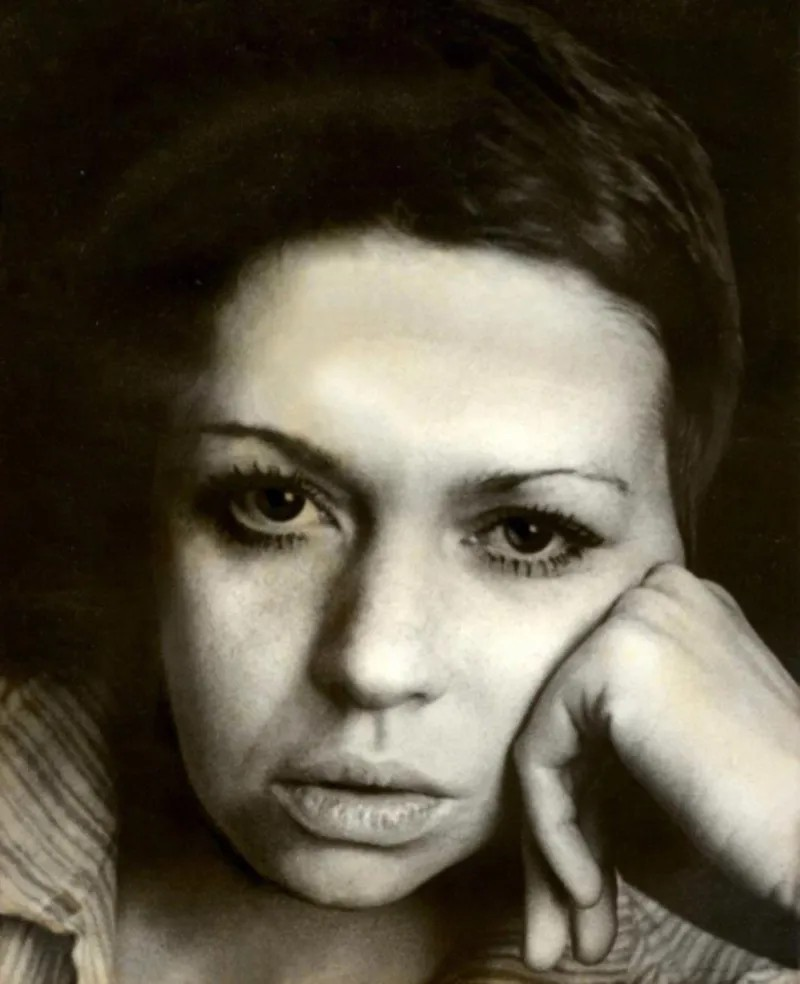

# Надя – такое пространство. Выход собрания сочинений Надежды Кожушаной — повод вспомнить самого одаренного сценариста эпохи перемен, автора необыкновенных фильмов переходного периода «Зеркало для героя», «Прорва», «Нога»

- **URL:** https://novayagazeta.ru/articles/2018/08/29/77639-nadya-takoe-prostranstvo
- **Дата:** 2018-08-29
- **Автор:** Лариса Малюкова

## Надя – такое пространство

## Выход собрания сочинений Надежды Кожушаной — повод вспомнить самого одаренного сценариста эпохи перемен, автора необыкновенных фильмов переходного периода «Зеркало для героя», «Прорва», «Нога»

Фото из архиваВы, конечно, помните — как такое забыть. Двое мужчин — постарше и помладше — шли себе по улице родного шахтерского города, споткнулись о кусок арматуры да и провалились в сорок девятый год. И завертелась карусель времени израненного недавней войной, оседланного семидесятилетним генералиссимусом. Очеловеченного поколением, для которого война оказалась не только трагедией, но и опытом самостоятельного решения, достоинства. В фильме «Зеркало для героя» Хотиненко/Кожушаной — 8 мая, «День повышенной добычи», — равен жизни. Как бы ни хотелось ее починить, исправить героям, забредшим сюда из будущего, предотвратить гибель людей — минута неотступно следует за минутой. У каждого настоящего — свое будущее. И как же странно в прошлом встретить своих родителей. Совсем молодых.

Эта история была написана за пять лет до голливудского «Дня сурка», сильно упростившего сюжет про «петлю времени». Кожушаная чувствовала время, как никто другой. Кожей, пропускала его через сердце, легкие, может быть, потому и сгорела так внезапно и быстро. Ее завораживало время «между»: точка абсолютного перехода, как в древнегреческом эпосе — инициация преобразования, путешествие во внутренний мир через смерть прошлого и его возрождение в будущем.

«Зеркало…» было про незацикленность — про связанность времен. Про то, что прошлого не изменить. Но можно понять, всмотревшись в его уродство и красоту, в глаза его людей. Для Кожушаной, не любившей слово «совок», — у каждой эры — своя правда: «Итак, время, — говорит она в сценарии «Бессонница», — оно придумано человеком, и только им. Для того, чтобы имитировать несколько миллионов жизней. День — жизнь. Час — жизнь. В детстве это естественно и неосознанно. Время — это придуманная условность».

Она терпеть не могла имитацию. В ее текстах голоса живых людей. Мальчиков, пришедших из Афгана не полностью. Выживших под сталинским Молохом: «выигравших свою жизнь». Одиноких женщин, способных любить насмерть — со своим невостребованным даром. Народа, который несколько лет подряд утром и вечером смотрит по телеку сериал «Тысяча и одна ночь», воочию мечтая о страстях, грезах, чудесах. Ее герои умеют не только стариться, но — молодеть. Она, как никто, писала и говорила о детях (сценарий «Забор» по своей жизненной силе, цепкому юмору не уступает хиту «Добро пожаловать, или Посторонним вход запрещен»). При этом детство в ее неснятом кино — кульминация жизни, пик уязвимости, честности, одиночества, неразделенной любви, предательства, которое невозможно пережить.

Попкорновому зрителю с ней неуютно. Кому понравится предложение: «Давайте, я буду рвать вам душу». Не каждый режиссер отважится ставить ее драматургию. Но само кино, киногения плещется в текстах — материя и воздух, крупность характеров, мягкий юмор и язвительность. Александр Митта недаром говорил, что Надя пишет не тексты — сразу фильмы. Это кино не чернуха. В нем необратимый поток жизни во всей ее полноте. И в то же время ее сценарии, эссе — высококлассная литература. Сложная, полифоническая, современная. В ней — тайна. Попытка оторваться от земли хотя бы на несколько сантиметров. Понимание, что слово — бессмертно.

Для меня в ее текстах вот что самое ценное. Никогда не знаешь, чем закончится фраза, эпизод, сценарий. Все равно автор оставит тебя с носом. Как финал в несостоявшемся фильме «В ночь перед коммунизмом». Все вроде бы заканчивается плохо. Но Надя приписывает: «А возможно, герои встретятся через полминуты». Она никогда не закрывала дверь плотно — оставляла щель «для чуда возможности».

Начальники Кожушаную терпеть не могли. Один был готов плашмя лечь, лишь бы ее не взяли на Высшие курсы: «Зачем нам еще один Шпаликов или Высоцкий!» А она — не еще один. Уникальная. Даже себя повторять не умела. Поэтому и не считала себя профессионалом, не умела «по заказу». Писать регулярно, как советовал Мережко: по три страницы в день. Надя говорила: «Пока не поплачу, не расшибусь лбом о стенку, писать не могу».

Поддержите нашу работу!

1000 500 300 Нажимая кнопку «Стать соучастником», я принимаю условия и подтверждаю свое гражданство РФ

Если у вас есть вопросы, пишите [email protected] или звоните:+7 (929) 612-03-68

Иван Дыховичный снял «Прорву» о силе и слабости тоталитарного мира, его энергии и разъедающей изнутри фальши величия. О том, как притягательна «прорва», примагничивающая, уничтожающая человека. Из кружева Надиного текста сшил большой киностиль. И говорил, что актеры не могли изменить ни одной реплики. Диалоги были сцеплены намертво. Александр Феклистов вспоминал, как на съемках «Прорвы» Надя подошла к нему и по-родительски строго велела: «Играй хорошо!» Актеров она воспринимала как детей, ею рожденных, говорящих ее словами. И когда они на экране умирали, умирала вместе с ними.

Неизвестно, в другое время появился бы такой автор? Болевая точка — станция отправления ее исканий. На этой станции, в сумасшедшем доме социальных катаклизмов был необходим регистратор. Тот, кто зафиксирует происходящее с людьми. Постигнет. Прочувствует. Будет честным настолько, что спустя десятилетия, смотря фильмы, читая сценарии, поймет про утекшую эпоху что-то существенное. Спрятанное в складках, в нервных окончаниях, между строк.

Она умела транспортироваться в разные времена. Шестидесятые. Сороковые. В коротком фильме «Про войну» шестнадцатилетняя оторва, замарашка Таня встречает красноносого молоденького лейтенанта. Встреча превращает обмылок, щенка в угловатую Джульетту, готовую умереть за ослепительное счастье каждой минуты этой ночи. За каждую минуту краткой жизни, которую гулко отстукивает большой будильник в ее холодной квартире.

У нее было взаимное притяжение с неблагополучными. Рассказывала про своих знакомых алкоголиков, воров, уголовников и даже убийц. Для русского писателя человек и боль — синонимы. Она их слушала, выплакивала их грехи. «Нервов не хватает: мне рассказывают, я слушаю и реву. Пореву, пореву, потом сяду и сделаю — по-честному». Вот почему афганцы считали ее своей. Рассказывали как на духу, о чем боялись говорить близким. Она пряталась от них — нервов не хватало, но любила. Через эту любовь по уши влезла в войну.

«Нога» Никиты Тягунова и Надежды Кожушаной — лучший игровой фильм об Афганистане. Иррациональная история фантомной боли. Горючая смесь Гоголя с Фолкнером: ампутированная нога превращается в двойника «шурави» Мартына (Иван Охлобыстин). Афганский синдром превращает обрубок человеческого тела, начинающего жить по законам войны рядом с выжившими. В 90-е тоже выжить удавалось не всем. Никита Тягунов ушел из жизни в 92-м. Тогда едва ли не во всех кинематографических профессиях мы теряли самых одаренных, перспективных. Режиссеров и авторов Луцика и Саморядова, актрис Майорову и Метлицкую, критиков Добротворского и Ерохина, написавшего текст под названием «Никто не хотел выживать».

Через пять лет после добровольного ухода Тягунова умерла Надя Кожушаная. Ушла, как отрезала. Востребованная, счастливая в семейной жизни, красивая, пылкая, настоящая. Должна была писать сценарий о Первой чеченской. Писать своей болью, оголенными нервами, напившись горя и смерти бессмысленной, глупой. Ее отговаривали. А она обратилась к властям, которых без почтения именовала «господами спикерами и сникерсами»: «Говорят, что для того, чтобы проститься с человеком, надо потрогать рукой его труп. Начальники! Потрогайте трупы тех, кто погиб в Чечне. С той и другой стороны. Пальцев у вас не хватит, это понятно. Жизни не хватит, понятно».

В одной из ее заявок прочитала: «А правда, что здесь можно сойти с ума, — спросила одна из прилетевших на вертолете. — Ну прямо, — обиделась тетя Маруся. — Наоборот».

Уже после ее смерти вышли два фантастических мультфильма. «Бабушка» Андрея Золотухина и «Розовая кукла» Валентина Ольшванга. В чувственной графике пульсировало, оживало детское подсознание «с игрушечной шашкой наголо». Детство как саспенс, пропитанный ожиданием чего-то грандиозного, головокружительного. Как падение в пропасть фантазий, снов. Как обещание бесконечной жизни.

Даже в самых счастливых Надиных сценариях, превратившихся в культовое кино, есть ощущение недовоплощения. Не исключаю, что снять их конгениально невозможно. Так не пишут. Так не живут. И все же. Сегодня при чудовищном дефиците драматургии в кино, смысловой импотенции, самоповторов и наглого плагиата, не могу понять продюсеров, режиссеров. Куда вы смотрите? Вот же — настоящий клад идей, фантазии, поступков, героев. Под обложками сеансовских книг. Стоит лишь протянуть руку и увидеть, как «они встретятся после смерти. В таком пространстве, которого нет. Где можно все. Можно любить. Можно не любить. Можно молчать. Такое пространство».

Поддержите нашу работу!

1000 500 300 Нажимая кнопку «Стать соучастником», я принимаю условия и подтверждаю свое гражданство РФ

Если у вас есть вопросы, пишите [email protected] или звоните:+7 (929) 612-03-68
