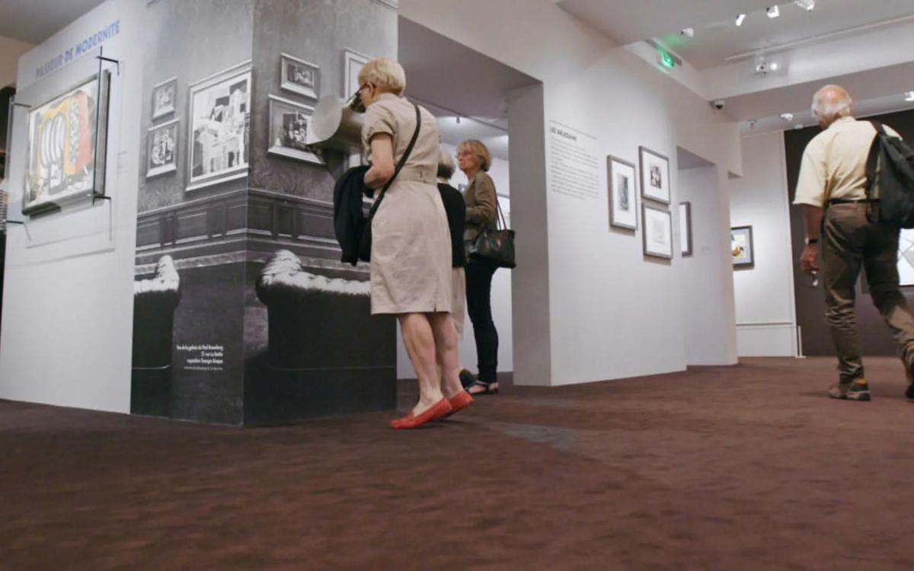

# Прокатка для «коллекции Гитлера». Очередной скандал с отменой фильма, не получившего прокатного удостоверения, по уверениям министерства культуры, разрешился

- **URL:** https://novayagazeta.ru/articles/2018/09/05/77715-prokatka-dlya-kollektsii-gitlera
- **Дата:** 2018-09-05
- **Автор:** Лариса Малюкова

## Прокатка для «коллекции Гитлера»

## Очередной скандал с отменой фильма, не получившего прокатного удостоверения, по уверениям министерства культуры, разрешился

Кадр из фильма «Похищенные сокровища Европы»/ КинопоискВ Третьяковской галерее была сорвана премьера фильма «Похищенные сокровища Европы» о так называемой «коллекции Гитлера». Показ планировался к годовщине окончания Второй мировой войны. Музейное киношоу — повествование о европейских шедеврах, вывезенных в годы Второй мировой войны в нацистскую Германию. Фильм знакомит зрителя с неизвестными широкой публике произведениями рубежа 1930-1940-х годов.

Олег Березин

гендиректор «Невафильм»

Видимо, фильм не допускают к прокату из-за использования в нем кадров кинохроники с запрещенной фашистской символикой. Я огорчен сорванными показами. Но прежде всего тем, насколько глупо у нас исполняются спорные законы, которые так широко трактуются. Буквально разбиваем лбы без причины. В фильме не содержится призыва к экстремизму. Нет в нем пропаганды нацизма. Все наоборот. Но получается, сегодня нельзя и наоборот? Товарищи, это часть истории. Что о ней будут знать наши дети? Что русские геройски воевали во Второй Мировой — с кем-то? С тем, кого мы вам не покажем. В этой картине про сокровища есть хроника, которую использовал и Ромм в «Обыкновенном фашизме».

Все это из разряда преследований за размещение в cоцсетях Парада Победы. Солдаты-победители бросают знамена поверженного врага. Но на знамена смотреть не велено. Получается, только чиновники знают, как было. Как должно быть. Все остальные в стране не в состоянии отличить призыва к экстремизму от описания нашего драматического прошлого. Тенденция печальная. И она будет развиваться. Недавно видел в cоцсетях фото одной музейной выставки с экспонатами Великой Отечественной войны. Среди них оригинал фашистской листовки, призывающей наших солдат сдаваться. Так вот орел и свастики на этом артефакте — замазана. Но это же наша общая история. Мы не можем ее замазывать.

Ольга Любимова

директор Департамента кинематографии Минкультуры России

В первую очередь я бы хотела обратить внимание на то, что приходится комментировать посты в Фейсбуке. Учитывая, что дверь моего кабинета открыта, то я бы предпочла для начала познакомится с представителями компании «Невафильм» и решить эту проблему в течение получаса.

Часто представители профессионального сообщества и ассоциаций упрекают министерство культуры в том, что мы нарушаем федеральные законы или невнимательно к ним относимся. Удивительно, что когда законы касаются их самих, а минкультуры России их исполняет, это вызывает еще большее негодование.

Поддержите нашу работу!

1000 500 300 Нажимая кнопку «Стать соучастником», я принимаю условия и подтверждаю свое гражданство РФ

Если у вас есть вопросы, пишите [email protected] или звоните:+7 (929) 612-03-68

Когда к нам принесли документы на фильм «Похищенные сокровища Европы», сотрудники Департамента кинематографии обратили внимание на то, что в картине присутствует свастика. У нас есть федеральный закон «Об увековечении Победы советского народа в Великой Отечественной войне 1941–1945 годов», запрещающий пропаганду либо публичное демонстрирование нацистской символики. Сотрудник департамента минкультуры России предупредил прокатчика о том, что ведомству требуется дополнительное время, так как необходима дополнительная экспертиза картины — или придется свастику замазывать, или убирать кадры, где она присутствует.

Поэтому никакого отказа в получении прокатного удостоверения не было, мы просто попросили время для дополнительной экспертизы. Мы получили соответствующее экспертное мнение юристов Нормативно-правового департамента минкультуры, сверились с законом, с постановлением правительства и приняли решение, что мы можем выдать прокатное удостоверение. И если сотрудник «Невафильм» сегодня придет в Департамент кинематографии, он получит прокатное удостоверение на этот фильм. Поэтому причина вот таких высказываний, негодований, грустной иронии по поводу действий министерства культуры для меня остается абсолютной загадкой.

Но, конечно, благодаря ряду публикаций в СМИ, ряду комментариев, большее количество зрителей увидит теперь этот фильм.

О фильме «Похищенные сокровища Европы»

80 лет прошло с открытия печально известной выставки в Мюнхене в 1937 году, заклеймившей авангардную живопись и прославившей «чистое арийское искусство». На протяжении Второй мировой войны нацисты забирали произведения искусства из музеев и домов крупных коллекционеров в Германии и на оккупированных территориях. На родине Гитлера в Линце планировалось создание австрийского Лувра. По оценкам историков, количество разграбленных нацистами артефактов достигло в Германии свыше 16 тысяч, а по всей Европе — 5 миллионов. В черном списке «дегенеративных художников» числились такие выдающиеся мастера, как Пикассо, Матисс, Бекманн, Клее, Кокошка, Дикс, Шагал, Лисицкий.

Фильм, снятый талантливыми итальянскими кинематографистами, — продолжение знаменитой «музейной серии». Режиссер Клаудио Поли предлагает нам путешествие по Европе, гидом в нем стал знаменитый итальянский актер Тони Сервилло. Цель одиссеи – не только рассмотреть «запрещенное искусство», но и пролить свет на беспрецедентное преступление против культуры.

На парижской экспозиции «21 rue La Boétie» видим часть восстановленного наследия из коллекции Поля Розенберга, одного из самых именитых коллекционеров XX века. Его собрание включало в себя работы Пикассо, Матисса. В голландском Девентере рассматриваем выставку похищенных нацистами в годы войны картин. Одна из любопытнейших сцен – посещение выставки «Досье Гурлитта» в Берне и Бонне. Корнелиус Гурлитт — наследник семьи торговцев шедеврами, сотрудничавшей с нацистами. В его тайной коллекции только в 2010 году немецкие полицейские случайно обнаружили целый клад: похищенные картины Шагала, Моне, Пикассо и Матисса. История едва ли не каждого шедевра – выжившего или погибшего — плотно переплетена с трагической историей ХХ века.

Среди комментаторов — историк и автор книги «Каталог Геринга» Жан-Марк Дрейфус и Майк Хоффманн, эксперт по «дегенеративному искусству» и автор биографии известного арт-дилера Хильденбранда Гурлитта.

### P.S.

Поддержите нашу работу!

1000 500 300 Нажимая кнопку «Стать соучастником», я принимаю условия и подтверждаю свое гражданство РФ

Если у вас есть вопросы, пишите [email protected] или звоните:+7 (929) 612-03-68
