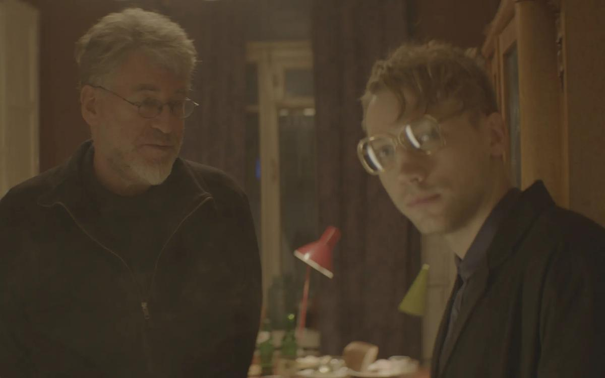

# Эпоха «между». 7 сентября — второй день рождения Кирилла Серебренникова под арестом. Центр документального кино представляет его неигровой фильм «После Лета»

- **URL:** https://novayagazeta.ru/articles/2018/09/05/77707-epoha-mezhdu
- **Дата:** 2018-09-05
- **Автор:** Лариса Малюкова

## Эпоха «между»

## 7 сентября — второй день рождения Кирилла Серебренникова под арестом. Центр документального кино представляет его неигровой фильм «После Лета»

Кадр из фильмаВ кино довольно часто снимают «фильм о фильме». Вспомогательное кино про то, как снимается блокбастер, как с актерами работает режиссер, — помогает продвижению проекта. «После Лета»—особый случай. Похоже, задачу снять параллельно игровому документальное кино Кирилл Серебренников поставил едва ли не с самого начала съемок. Уже тогда вокруг будущего фильма «Лето» о первопроходцах российского рока бурлили споры. Борис Гребенщиков во всеуслышание раскритиковал один из вариантов сценария. Да и выход на российские экраны картины, представлявшей Россию на Каннском фестивале, напряжения и интереса к теме не снял. Сейчас про Цоя и рок-музыкантов того поколения снимается сразу несколько фильмов.

«После Лета» — документальное послесловие, фильм-расследование. Цель — нащупать материю, обнаружить токи истекшего времени. Исполнитель роли Скептика в «Лете» Александр Кузнецов расспрашивает очевидцев и участников описанных в фильме событий: Наталью Науменко, Артемия Троицкого, Игоря Петровского, Севу Новгородцева, Андрея Тропилло, Николая Михайлова — о русском роке, о восьмидесятых. О том, как они жили, чем дышал Ленинград со своим рок-клубом и коммуналками. В коммуналки, доморощенные студии звукозаписи и даже Ленинградский рок-клуб — воссозданные для съемок — они заходят. Сверяют свои воспоминания с тем, как их одушевили художники, декораторы. Вместе погружаемся в пространство четвертьвековой давности, в дух событий.

Скептик здесь — засланный из нашего времени в восьмидесятые казачок. Он и в игровом фильме Серебренникова в самые неожиданные моменты врывается в действие с замечанием вроде «Нет, все было не так». Здесь он — представитель зрителя. Участники документального постскриптума к фильму рассказывают ему о прототипах киногероев «Лета» — Майке Науменко, Викторе Цое, их товарищах.

Наташа Науменко вспоминает, как пыталась научиться играть на гитаре, Майк ее учил. Она показывает Скептику, как курить папиросы фабрики Урицкого на ветру. Скептик интересуется: «Почему Майк помогал пришедшему из ниоткуда Цою?» Наташе сама постановка вопроса непонятна: «Да он просто мог порадоваться, потому что общее дело делаем». Артемий Троицкий рассказывает, как выбирали жилье для квартирников, подбирали гостей, дань брали тортиками, бутылками, деньгами. По его мнению, Науменко был парнем наивным: не очень понимал, в какой стране живет. В своих мыслях, представлениях, в творчестве музыкант находился где-то в Нью-Йорке. И писал свои песни о друзьях, наркотиках, «уличных девках».

Наташа внимательно осматривает комнату с плакатами рок-звезд, в которой они «как бы жили с Майком». И неожиданно заключает: «Здесь не хватает пассатижей — без них телек не переключался». Потом вспоминает, как на такой же плите готовили плов по-ливерпульски — корюшка в томатном соусе, хмели-сунели, рис.

Игорь (Иша) Петровский показывает Скептику свою любимую в то время пластинку PINK FLOYD 1975 года Wish You Were Here («Жаль, что тебя здесь нет»).

Сева Новгородцев размышляет про скептицизм русского рока, его славянскую матрицу. Тропилло ругается: «Все мусор. Какие микрофоны? Мониторы, стойки, все не так». Он полагает, что рок-н-ролльная культура связывала нас прежде всего с миром. Из одиночек, выросших на школе западной музыки, складывались новые поколения. И на плечах Гребенщикова и Науменко появлялся Цой, затем Кинчев и другие.

Вспоминаем, как под присмотром комсомольских оперативных отрядов проходили условно свободные концерты. Управление по идеологии КГБ включилось чуть позже. Люди в штатском одобрили идею «рок-резерваций»: за музыкантами удобней наблюдать, чем гонять по подвалам.

От вопроса, почему ушла от Майка, Наташа уклоняется: «А разве у вас фильм про это?» Нет, не «про это». Но без Наташи Майк жил совсем мало. «И цепь на руках, и нечего есть. <…> Как бы я хотел, чтобы ты была здесь…»

Поддержите нашу работу!

1000 500 300 Нажимая кнопку «Стать соучастником», я принимаю условия и подтверждаю свое гражданство РФ

Если у вас есть вопросы, пишите [email protected] или звоните:+7 (929) 612-03-68

«Лето» — не реконструкция событий, не байопик, а музыкальная фантазия на тему субъективных воспоминаний. И поэтому странны упреки фильму в его недостоверности. Для Серебренникова было важно воспроизвести атмосферу, зыбкость настроений, нежность отношений. И он это сделал.

«Лето» про любовь, про молодость отечественного рока, замешанного на любви.

«После Лета» — сравнительный анализ того, как было и как стало.

«Нынешние молодые нам завидуют, — делится впечатлением Наташа Науменко. — Я их спрашиваю: «А вы хотели бы, чтобы вам насильно обрезали волосы, никуда не выпускали?» Мы жили в болотной стабильности, не веря в возможность перемен».

Артемий Троицкий говорит о характерной особенности времени — разрыве между отстоем, убогостью жизни, быта (колченогие стулья, грязные газовые плитки, отсутствие горячей воды) и величием того, что происходило, созданием песен-титанов. Появление культовых героев поколения. Начало 80-х — время мрачное: Афганистан, генсеки мерли один за другим, национальный вид спорта «шаром покати». При этом жили насыщенной радостной жизнью, хотя перспектив вроде не было. Зато было твердое ощущение, что будущее есть. Сейчас все наоборот. Потому что у нас есть опыт поражения. Контрреволюция была ползучей. И она побеждает.

Документальные фрагменты, смонтированные с игровыми, создают портрет изменчивого времени, его внутренние связи и разрывы.

«Лето», съемки которого были прерваны арестом режиссера, как мне кажется, во многом стало символичной вехой не только в судьбе режиссера. Но возможно, для всего современного российского кино, да и для общества, свыкающегося с тоталитарной эквилибристикой управления верхов низами. Сейчас этот фильм про легкость трудного бытия смотрится как прощание с кратким мигом свободы. В российской истории эти миги, сквозняки вольности всегда мимолетны. Как короткое лето — в отличие от затяжной многомесячной непогоды.

«После Лета» — свидетельство об эпохе «между»: когда решетку в железной стене приоткрыли — и еще не захлопнули. О стыке времен, о свободе, которую завоевывают трудно и которую просто и не аргументированно отбирают.

Над монтажом фильма Кирилл Серебренников работал под домашним арестом, периодически выезжая на судебные заседания, где ему продлевали меру пресечения.

### P.S.

Поддержите нашу работу!

1000 500 300 Нажимая кнопку «Стать соучастником», я принимаю условия и подтверждаю свое гражданство РФ

Если у вас есть вопросы, пишите [email protected] или звоните:+7 (929) 612-03-68
