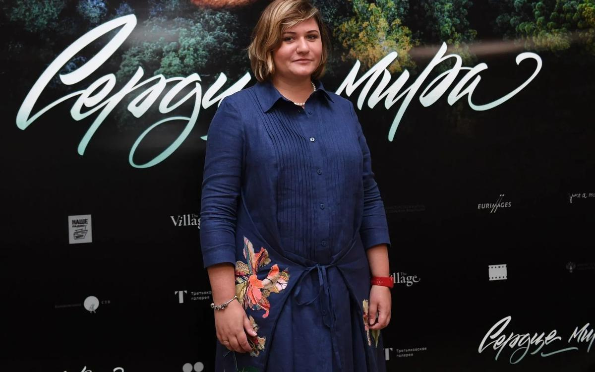

# «Подождите, почему все молчат?». Режиссер Наталья Мещанинова — про мат, притравку и митинги как средство решения психологических проблем

- **URL:** https://novayagazeta.ru/articles/2018/09/20/77899-podozhdite-pochemu-vse-molchat
- **Дата:** 2018-09-20
- **Автор:** Лариса Малюкова

## «Подождите, почему все молчат?»

## Режиссер Наталья Мещанинова — про мат, притравку и митинги как средство решения психологических проблем

Фото: РИА НовостиНаталья Мещанинова — ключевая фигура в новейшем российском авторском кинематографе. Среди ее работ резонансные — «Комбинат «Надежда», «Школа», «Аритмия», «Война Анны», «Красные браслеты». Только что на экраны вышел фильм «Сердце мира» (главный приз «Кинотавра»), представлявший Россию на фестивалях в Торонто, Сан-Себастьяне и других престижных смотрах.— Изначально у твоей истории был другой вектор. В центре сюжета про притравочную станцию (место содержания диких животных с целью обучения и ведения племенной деятельности на них собак охотничьих пород. — Ред.) были экологи-террористы. В книге «Банда гаечного ключа», по мотивам которой снят фильм, радикалы-зеленые не вызывают сочувствия. А ты ушла от этого.

— Поначалу книга зацепила своим вызовом, фактурой. Типа — ах, как это интересно, неожиданно, остро. Мы написали синопсис. Но чем больше погружались в материал, тем больше понимали: нет у нас в стране таких банд. Тех, кого причислили к экстремизму, разогнали. Нынешние экологи радикальных акций не предпринимают. В основном какие-то детские выходки: сорвать плакат меховых шуб, например.

— Но ты помнишь смертельные битвы за Химкинский лес?

— Это все-таки не экорадикализм. Яростная романтичность, которую мы вложили в историю, не могла бы долго существовать в нашей стране, ее бы быстро придушили. К тому же я поняла, что не могу быть на стороне радикалов.

— А как бороться с уничтожением Байкала? Радикализм вызван тем, что бесповоротно разрушается мир вокруг нас. Нет?

— В эту сторону я и пошла, пока не возник внутренний тупик. Видимо, публицистические мысли мне не близки. То, о чем ты говоришь, публицистика. Помню, сидели мы со Степой (Степан Девонин — муж, Натальи Мещаниновой, соавтор сценария, сыгравший в фильме главную роль неприкаянного ветеринара Егора), я говорю: «Знаешь, скажу страшную вещь: не хочу снимать то, что мы написали». И вдруг он соглашается: «Неделю с этой мыслью хожу, все кажется фальшивкой». Начали думать о том, что нас по-настоящему волнует.

Все началось с героя. Он поначалу был сыном владельца притравочной станции. А Степа предложил: «Слушай, а давай он не сын, а работник, который хочет быть сыном». От этой мысли оттолкнулись, поняли, что нам интересно про отречение, побег из своей семьи.

Кадр из фильма «Сердце мира»— Скорее про поиск дома. У тебя же и в дебютном «Комбинате «Надежда» — про побег, попытку вырваться. А вот «Сердце мира», напротив, поиск семьи. Егор — человек со стороны, обделенный любовью, обиженный матерью. Вот и ищет это «сердце мира». Кино про обретение.

— По сути, «Комбинат «Надежда» и «Сердце мира» вообще похожи. Их связывают темы, по-настоящему меня беспокоящие. В «Сердце мира» все про меня. И все про Степана. Не только сцены с животными, но и отношения в семье — ершистые, болезненные — тоже его опыт. Или как он внезапно выходит из себя, чувствуя над собой какое-то насилие. «Аритмия» — про меня и про моего соавтора Борю Хлебникова. Писали с Любой Мульменко «Еще один год», там вообще есть перенесенные на бумагу эпизоды из моей и из Любиной жизни. Скажем, сцена, когда героиня тусуется на вечеринке с новым приятелем, и муж приходит: «Чего, весело?»

— Не боишься доверять экрану интимные признания? Или со времен твоей учебы у Разбежкиной для тебя все личное — и есть топливо поиска?

— Мне не страшно говорить про личное. В первый раз было боязно выложить свой рассказ в фейсбук. Страшно было публиковать предпоследний рассказ «Желание» — про отчима и детство. Но я поняла, что это отчасти терапия, которая не позволяет в страшных мыслях закопаться и погибнуть.

— У тебя часто само место действия определяет основной конфликт. Норильск в «Комбинате «Надежда». Или притравочная станция. Как бы ты ни защищала ее, все равно это место боли. Я уже не говорю про камин, в котором проходит жизнь девочки, прячущейся в фашистской комендатуре в фильме «Война Анны».

— Камин — это Леши Федорченко идея.

— А cкорая помощь в «Аритмии»?

— Пространство для меня столь же важно, как герой. Помню, Разбежкина говорила: «Надо сделать так: вырвешь фигуру человека из квадрата экрана, останется дыра». «Что она говорит? — думала я. — Как это сделать?» Теперь ясно: человек вне своего пространства превращается в абстракцию. Мне неинтересно про героя в типичной квартире-студии, непонятно чем занимающегося. Не знаю, почему ведет себя так или эдак.

— Без доктора Олега в «Аритмии», для которого нет понятия «человеко-часы», есть люди, которых он спасает. Без ветеринара Егора — окружающий мир действительно полый, они воссоздают его хрупкую гармонию. Сцена, в которой увечная собака плывет на плечах Егора сквозь лес, для меня центральная в фильме.

— Я сразу задумала эту сцену, мне говорили: «Дура, понапридумывала. У нас же реализм, зачем эти сновидения». Я рада, что хватило смелости этот вроде бы непонятный эпизод отстоять.

Кадр из фильма «Сердце мира»— А сама история с притравкой лисы? Ясно, что автор фильма — на стороне притравщиков, которые обучают собак охоте. Но с точки зрения гуманизма это невыносимо. Как бы правильно все ни делалось, лису все равно травмируют. Почему ты не показала все противоречие проблемы, неоднозначность работы станции?

— Когда я первый раз приехала на такую станцию, сердце колотилось: было непонятно, что происходит. Начала проникать в материал и поняла: всего не рассказать. Мы решили сосредоточиться на истории человека. Происходящее на станции — фон. Там действительно много необъяснимого. И только пытливый зритель начнет думать: «Отчего так происходит?»

Взбешивает, когда, не разобравшись ни в чем, начинают страшно херачить саблей — подписывать петиции, требуя уничтожить все притравочные станции и заодно охоту запретить.

В фейсбуке жуткие комменты под моим постом, в котором я пыталась объяснить, как эти станции устроены. Зачем вообще охотиться? Давайте выращивать капусту! Ребята, это цивилизационная проблема. У нас огромная страна, если не будем охотиться, медведь придет к тебе. Ну не на твой 14-й этаж, а к бабушке в деревне.

Кадр из фильма «Сердце мира»Люди воспринимают станции как какие-то собачьи, петушиные бои без правил. Если собака необученной пойдет в лес, скорее всего, погибнет. На станциях собак учат охотиться. И да, схватка — момент боли для обоих животных, но и момент работы, понимания — для чего они. И в диком лесу лиса, сталкиваясь с другими зверями, испытывает боль.

Кровный интерес

Думы нескольких созывов сражались за сохранение в России притравочных станций. А теперь депутаты поищут компромисс между охотниками и их добычей

— Существование едва ли не всех твоих героев связано с болью. Егор недолюблен матерью, Света из Норильска брошена женихом. Доктор Саши Яценко — на протяжении всего действия корчится в переживаниях из-за потери любимой, из-за невозможности выполнять свое врачебное предназначение.

— Ну да, мне интересно залезть поглубже в человека, а когда погружаешься — в каждом нахожу эти мучения.

Поддержите нашу работу!

1000 500 300 Нажимая кнопку «Стать соучастником», я принимаю условия и подтверждаю свое гражданство РФ

Если у вас есть вопросы, пишите [email protected] или звоните:+7 (929) 612-03-68

— Твои герои придуманы или у них есть прототипы?

— Отчасти списанные — «с натуры». Скажем, доктор Олег — отчасти портрет Степы, он мой источник вдохновения. Но вообще Олег собрал черты огромного количества людей. Мы столько разговаривали с врачами. Люди начинают открываться, доверять личные признания. Например, как ломаются на скорой. Как впечатление от внезапной смерти может выбить человека из колеи.

Один реаниматолог, проработав 20 лет, ушел из профессии. Приехал на вызов, бухали на кухне три мужика, ему махнули: «Иди, у нас там ребенок утонул». Открывает ванну — там плавает девочка трехмесячная.

Кровь, боль, смерть, жестокость — могут разрушить. И вот у героя Саши Яценко есть эта ломкость — существование на грани, когда сложно справляться. Как ни тверди про броню врачебную — а без нее не выжить в профессии — все равно какая-то брешь да находится у человека, потому что мы все люди. Наш фильм еще и про это.

Борис Хлебников: «Мы живем в экстремальной стране»

Совсем скоро на наших экранах «Аритмия» — самый человечный российский фильм последнего времени

— Когда ты пишешь для таких непохожих режиссеров, как Гай-Германика, Хлебников, Федорченко, — становишься разной? Или все-таки сохраняешь себя, свой почерк?

— Стараюсь быть гибкой, пытаюсь влезть в мозг режиссера. И все-таки не могу на чужом языке думать, говорить. Бессмысленно меня звать на какую-то поверхностную историю. Просто не умею, не хочу. Мои соавторы-режиссеры точно понимают — зачем я, знают, что часть себя несу в любую историю.

— Мне Леша Федорченко рассказывал, как долго ты отказывалась от работы над сценарием «Войны Анны».

— Он буквально заболел этой реальной историей о девочке, прятавшейся два года от немцев в камине. И говорит: «Мне ребята писали сценарий, но я хочу, чтобы за рамками камина не было сюжета. Не хочу конкретных историй, мне нужен хаос». Я обещала попытаться. И… у меня не получилось.

Кинотавр-2018: Лабиринт Анны

Первые впечатления: без Серебренникова фильм Алексея Федорченко – претендент на главный приз

— Федорченко нужно было показать, что черная дыра камина — единственно безопасное место в аду.

— Да. Вокруг слышны обрывки разговоров ни о чем. Мы все видим глазами ребенка: какие-то рисовальщицы, свидания, вечеринка. Я начала писать — получалась голимая романтическая фигня. Год промучившись, отказалась. А Леша за свое: «Ладно-ладно, я подожду». Не понимаю, откуда он знал, что все-таки стану писать. История нравилась, просто не знала, как к ней подобраться. Встретились с Лешей, хотелось понять его — не знаю — ощущения. Какие-то дебильные вопросы задавала, типа: музыка? цвет? свет? запах? Чтобы он задал какие-то векторы. Ритм? Настучи мне.

— Настучал?

— Что-то стучал, музыку дал. Рассказывал про цвет, запах. Потом я разыскала историка, досконально знающего все о событиях в Полтаве 1941–1942 года. Такой спитой дед, с удовольствием со мной общался — его давно никто ни о чем не спрашивал. Сидели с ним, он рассказывал, чертил, как все было устроено, объяснял, какие чины там были, сколько человек расстреляли. Мне нужны были подробности для понимания, как этот мир был устроен. Он стал живым для меня. И все. Начала писать.

— А как ты объясняла себе, почему девочка сидит в этом камине, превратившись в летучую мышь, делает ночные вылазки, но не убегает?

— Для меня было абсолютно ясно, что камин — единственное безопасное место, потому что мир сошел с ума. А куда бежать? Некуда. Кому она может верить, если старики, ее приютившие, и сдали ее в комендатуру.

Кадр из фильма «Война Анны»— Мне кажется, ты уже обрела свою нишу в кино. Помнишь, еще недавно говорили о приходе «новых тихих»? Хлебников, Попогребский, Вырыпаев. Вслед за ними через несколько лет на «Кинотавре» появилось несколько талантливых девушек — режиссеров и сценаристов, готовых к бескомпромиссному личностному высказыванию, снимающих кино со своей интонацией. Причисляешь ли ты себя к очередному поколению в кинематографе?

— Я как-то сама по себе. Или с кем-то рядом. Вот сейчас пишем с Борей Хлебниковым новый сценарий, и я не чувствую себя частью какой-то волны. В тот год на «Кинотавре» так сложилось: было сразу два моих фильма («Комбинат «Надежда» и «Еще один год») и сразу три сценария Любы Мульменко. Люба писала и со мной, и с Нигиной Сайфулаевой для ее фильма «Как меня зовут». Получилось, что вроде мы выступили командой. Хотя у нас разные пути.

— И все-таки в ваших работах увиделась общность взгляда. Даже не скажу, женского — более камерного, чувственного, проницательного.

— Я бы сказала, взгляда более раскрепощенного и в хорошем смысле — спокойного. То, что было предъявлено на «Кинотавре», не имело целью шокировать, обличить, заявить проблемно-глобальное. Кино про личное, рассказанное нормальным честным языком. Но что удивительно: это было разговорное кино. «Новые тихие» избегали, боялись речи. У нас считалось, что разговорное кино это плохо: надо стараться, чтобы и без слов все было понятно. Тут пришли девушки, которые сказали: «Подождите, почему они все молчат? Мы что, в жизни вот так молча ходим, являя собой метафоры? А поговорить?» В этой «киноволне» заговорили живые люди — не символы.

Наталья Мещанинова. Фото: РИА Новости— В том фильме о норильской молодежи было много обсценной лексики — ну так там молодежь разговаривает. Тут вышел указ о запрете мата в кино. Продюсеры предложили для прокатной версии заглушить или вырезать всю нецензурщину. И ты отказалась выпускать подчищенный вариант, хотя это был твой первый, выстраданный фильм. Трудный выбор.

— Помимо внятной позиции там еще сложность была: нужно было полностью перемонтировать кино. Когда складывала фильм, я же выбирала не дубли с матом — просто лучшие сцены. Смотришь на экран — речь льется. А нужно было искать худшие дубли, резать, подправлять. Выбросить, к примеру, сцену, с которой нас бы не взяли на экран, где парни говорят: «Водка — зло, трава — добро». Это же пропаганда наркотиков! Притом что это списанный с реальности текст. Для меня все это было равнозначно кастрации, осознанному ухудшению фильма. Когда продюсеры пытались «запикать» мат, получалось чудовищно. Там мат — не междометия, это глаголы, существительные.

Герои были обыкновенными ребятами со своей увечной, но оригинальной речью, которые вырастут, и с ними все будет хорошо. А «запиканные» они превратились в запрещенное мурло, будущих бандитов и насильников.

Кадр из фильма «Комбинат "Надежда"»— Как сегодня ты решаешь для себя проблему свободы — авторской, творческой? Запреты и ограничения с каждым днем выстраиваются выше, прочнее.

— Каждый раз принимаю решения точечно. Очень сложно с этим законом о подчищенной речи. Тогда возникает эзопов язык, мне не симпатичный. Стараюсь изобретать слова, которые не уступают по колоритности мату. В «Сердце мира» я оправдала отсутствие мата тем, что там ребенок. Когда ребенок в семье, взрослые стараются не ругаться. При мне в семье, например, никогда не ругались. А в кино пришлось мне нашего начальника станции Николая Ивановича наградить особенной речью, будто он изобретает какие-то слова. Сейчас мы с Борей пишем сценарий игрового фильма про моряков. Я там одно нехорошее слово заменяю «долбодятлом». Вроде и не мат. Первый вариант «Аритмии» писала с обсценной лексикой, так проще. Но продюсер Сергей Михайлович Сельянов сказал: «Наташ, не будем делать вид, что так оставим, поэтому давай-ка сразу убирай». Трудно переформатировать эту речь, тут автозамена не работает. Сейчас думаю об этой проблеме с самого начала.

— У тебя был документальный фильм «Псевдеж и симулякры». Если б надо было двумя словами описать сегодняшнее время, точнее не скажешь. Как ты относишься к тому, что происходит с коллегами, когда неправедно судят, что от голодовки погибает кинорежиссер Олег Сенцов. Никогда не видела даже в фейсбуке твоей реакции на происходящее.

— На митинги не хожу. Для меня все это сложная вещь. Кажется, если включусь в эти «активности», отчасти буду оправдывать происходящее: «Я хотя бы что-то делаю». В реальности ничего не могу сделать. Если от меня хотя бы что-то зависело, конечно, пыталась бы помочь. Не с помощью митингов, криков в ФБ. Соцсети для многих способ решения проблем, в том числе внутренних. Свой способ я обретаю в попытке наблюдать, понять, что происходит в нашем времени. Погрузиться в его проблемы и драмы. Боюсь оказаться ввязанной в эти войны. Меня это может сбить со сложности, о которой мне хочется думать. Про сложность выбора Сенцова. Почему он принял это решение, как к нему пришел? Что происходит с Кириллом Серебренниковым и почему? У меня нет ответов на эти вопросы, но хочу задавать их себе. Сегодня кажется, если ты не пришел на площадь Сахарова, не перепостил призыв к демонстрации — ты равнодушная молчаливая тварь. Знаю многих людей, которые по-настоящему обеспокоены, но не ходят с плакатами. И точно, если возникнет хотя бы микроскопическая возможность предпринять что-то — я обязательно это сделаю.

Поддержите нашу работу!

1000 500 300 Нажимая кнопку «Стать соучастником», я принимаю условия и подтверждаю свое гражданство РФ

Если у вас есть вопросы, пишите [email protected] или звоните:+7 (929) 612-03-68
