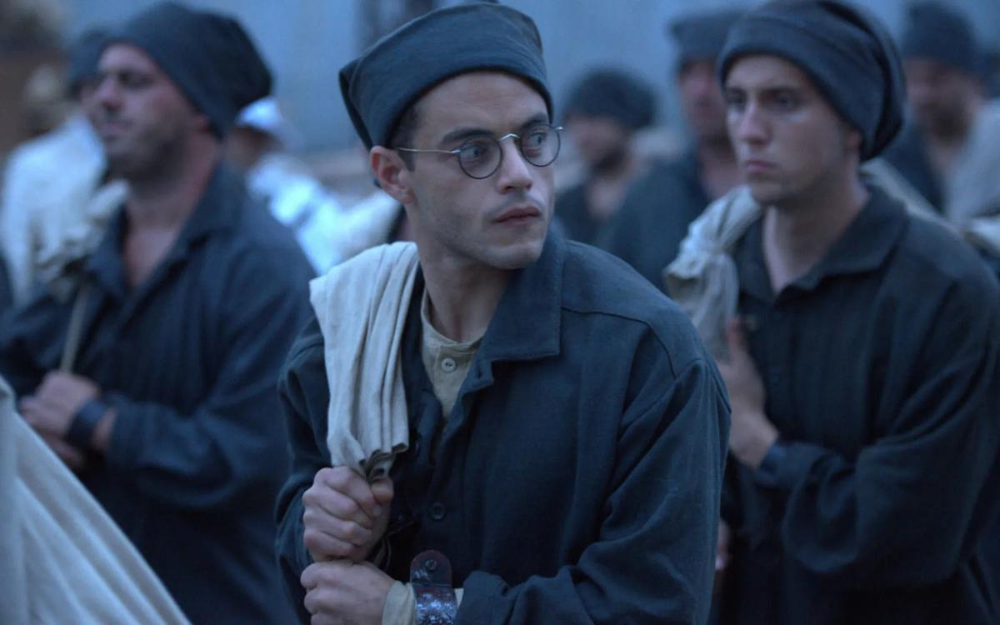

# Черные куклуксклановцы или смерть Дон Кихота? Что смотреть в ближайшие дни в кино. Рекомендации «Новой»

- **URL:** https://novayagazeta.ru/articles/2018/09/28/77980-chernye-kukluksklanovtsy-ili-smert-don-kihota
- **Дата:** 2018-09-28
- **Автор:** Лариса Малюкова

## Черные куклуксклановцы или смерть Дон Кихота?

## Что смотреть в ближайшие дни в кино. Рекомендации «Новой»

«Мотылек»«Мотылек»Новая экранизация легендарного автобиографического (хотя к его документальности много претензий) романа бывшего заключенного Анри Шарьера, приговоренного к пожизненному заключению. Его судьбу отчасти повторил киногерой по прозвищу Мотылек, ложно обвиненный в убийстве сутенера и отбывающий наказание в тюрьме для особо опасных преступников во Французской Гвиане. В 1973-м Стив МакКуин и Дастин Хоффман сделали имя Шарьера знаменитым на весь мир. Актеры были на пике славы, фильм Франклина Шаффнера собрал 53 миллиона долларов только в США.

И вот спустя 45 лет ремейк Михаэля Ноера с Чарли Ханнэмом и Рами Малеком.

Ханнэм («Тихоокеанский рубеж», «Багровый пик») играет харизматика, в прошлом наглого «медвежатника», выдернутого прямо из объятий возлюбленной в мансарде теплого джазового Парижа тридцатых и брошенного в кипяток каторги. Он зациклен на идее побега, убежден, что бежать можно даже из преисподней, куда попал. Сериальному актеру Рами Малеку достался образ щуплого экс-миллионера и мошенника Дега, которому только и остается, как припасть к спасительной дружбе и спасительной силе товарища по несчастью.

В романе о грандиозном и невыносимом приключении режиссура Ноера силится обнаружить человеческую подоплеку отношений внутри зверски жестокого, подлого мира. Эпизоды страданий заключенных, выживающих исключительно благодаря взаимовыручке, сменяются очередными сумасбродными планами и попытками бегства.

Хамелеон Хоффман, перевоплощаясь в эксцентричного «ботаника» Дега, создавал объемный образ находчивости и уязвимости. Неслучайно глаза его были спрятаны за толстыми стеклами самодельных очков на веревочке. А сам он напоминал бабочку. Малек играет художественную натуру, нуждающуюся в защите и покровительстве, но в критические моменты способную обнаружить лазейку из безвыходной ситуации. Это история о дружбе, которая пробивается сквозь стену подозрений, испытаний и даже предательств. Она и есть единственно верная соломинка, за которую стоит держаться.

Финал «Мотылька-2» столь же сентиментален, что и в оригинальном фильме. Сравнивать киноварианты довольно любопытно. Хотя, на мой взгляд, «вариация» Ноера не предлагает качественно нового решения старой темы и истории, некоторые кадры едва ли не дословно повторяют первую киноверсию.

Ну да, новый фильм более техничен, зато менее эмоционален. Линия Дега страдает пропусками, а изменения в психофизике героя никак не мотивированы. Но возможно, для нынешнего поколения зрителей притяжением фильма станут зрелищные в своей жестокости картины каторги, украшенные «мебелью правосудия» — гильотиной, дикие пейзажи острова Дьявола, снятые на Мальте. Ремейк «Мотылька» заканчивается архивной съемкой: заключенные сходят с корабля на землю Французской Гвианы в каторжной одежде с мешками на плечах и растерянно озираются — доказательство правдивости невероятных событий киноистории.

## «Черный клановец»

Награждение Гран-при Каннским жюри режиссера Спайка Ли, одного из столпов афроамериканского кино, за социальный памфлет «Черный клановец» многих удивило. Все-таки фестиваль открывает новые территории киноискусства, авторского кинематографа. Но видимо, язвительная криминальная комедия так понравилась жюри под управлением Кейт Бланшетт, что ее не смогли не отметить.

Поддержите нашу работу!

1000 500 300 Нажимая кнопку «Стать соучастником», я принимаю условия и подтверждаю свое гражданство РФ

Если у вас есть вопросы, пишите [email protected] или звоните:+7 (929) 612-03-68

Семидесятые. Чернокожий полицейский Рон Сталворт (Джон Дэвис Вашингтон из сериала «Футболисты») внедряется в отделение Ку-клукс-клана в Колорадо-Спрингс по телефону. Своим бархатным «белым голосом» он обольщает ксенофобов. «Я искренне рад поговорить с настоящим американцем», — умиляется их вожак. На встречу с расистами хитроумный Рон посылает своего коллегу Филипа Циммермана (Адам Драйвер), белокожего детектива, обладающего целым рядом достоинств, но долго отказываюшегося повесить на шею проводок для прослушки вместо звезды Давида. Самое поразительное, что в основе фильме — реальные факты. Фильм основан на мемуарах отставного полицейского Рона Шталлоуорта — ставшего прототипом главного героя. Благодаря этой опасной и дерзкой операции была раскрыта банда, готовившая теракт в городе.

Комедийный боевик Ли смотрится на одном дыхании, в нем отличные диалоги, и главное, отказ от стереотипов. Знатоков порадуют многочисленные цитаты из речей Трампа (американские журналисты на показе в Каннах хохотали громче других). О финале фильма надо бы написать отдельно, но не хочу портить впечатление от показа спойлером. Скажу лишь, что он в духе яростных выступлений трибуна и борца за права чернокожих Спайка Ли.

## «Человек, который убил Дон Кихота»

Об этом фильме мы услышали лет 20 назад, когда волшебник и безумец Терри Гиллиам рассказал о своем очередном киновояже журналистам. На главные роли были назначены Джонни Депп и Жан Рошфор. Потом была череда непреодолимых проблем: декорации гибли, деньги не приходили, актеры отказывались от сотрудничества. Продолжить работу удалось лишь в 2016-м. Адам Драйвер, звезда «Черного клановца», здесь — Тоби Грисони, скромный рекламный режиссер, который встречает ветхого колоритного чудака. Этот деревенский сапожник называет себя Дон Кихотом (Джонатан Прайс), а самого Тоби принимает за Санчо Пансу. Так начинается хитрый средневековый квест. В сюрреалистических приключениях странников иллюзия без труда проглатывает реальность, прошлое — настоящее. Романтическое безумие великой книги Сервантеса умножается необузданной энергией Гиллиама, заваривая на экране бурнокипящую смесь, приводя одних в ярость, других — в восхищение. И если к середине фильма у вас закружится голова от этого крутого серпантина, не переживайте. В послевкусии маскарада, изъеденного шрамами многолетнего производства, останутся прозрачные идеи сервантесовской книги. Ее тоски по простодушным мечтателям, романтикам, подвиги которых, быть может, и смехотворны, но именно они — последние защитники идеализма, давно проигравшего битву с расчетливой действительностью. И ни персонажи этой киносаги, ни зрители уже не смогут отличить правду от вымысла.

В лучших фильмах Гиллиама есть герои, которые не могут или не хотят различать фантазию и реальность. Стоит ли удивляться его приверженности роману Сервантеса. Это идеальное совпадение групп крови, настроения, совпадение с материалом, в котором карнавализация связывает в один узел исповедальное начало с фантастикой. Смеховую культуру — с человеческой трагедией.

Сам Гиллиам, десятилетиями создающий это путаное, изумляющее изобретательностью, анархичное и восторженное кино — отчасти напоминает хитроумного и наивного идальго, объявившего многолетнюю битву мельницам корпораций и бокс-офисов (кстати, сам фильм продюсеры у него отобрали через суд). С настойчивостью обманывающего себя рыцаря напоминает нам о недостижимом романтическом идеале, бросая вызов всем выгодным и разумным конвенциям. От Бразилии до «Нулевой теоремы», от «Монти Пайтона» до «Человека, который убил Дон Кихота» режиссер продолжает строить воздушные замки, засылает своих Парцифалей и Ланселотов отыскивать Грааль. Но внутри этого воображариума доктора Гиллиама психологически достоверные герои живут правдивой жизнью, до последнего вздоха стремясь быть верными себе, хранить честь смолоду и до паклеобразных донкихотовских седин.

## «Сердце мира»

На экранах фильм Натальи Мещаниновой — редкое для отечественного кино сочетание прозы и поэзии. В воздушной камерной драме, ее щемящей недосказанности нет однозначности. И даже само место действия — притравочная станция вызывает поначалу оторопь, потом желание понять: что это? зачем? «Сердце мира» — история хрупкости мира вокруг нас и внутри нас. История непрочности, ненадежности связей между близкими. Про нашу привязанность к месту. Про боль сиротства, которая не утихает с взрослением. Про несвободу, которая обнимает — и душит. Про одиночество крови. Самый запоминающийся кадр: герой фильма, ветеринар Егор (Степан Девонин) забирается в клетку к белым теплым алабаям, свертывается беззащитным калачиком (как Макаров в «Полетах во сне и наяву»). Невидимая граница между смертью и жизнью обозначена едва заметным пунктиром, как полоски проволоки в клетке, запирающей/защищающей Егора и его сердце — от мира.

«Подождите, почему все молчат?»

Режиссер Наталья Мещанинова — про мат, притравку и митинги как средство решения психологических проблем

Поддержите нашу работу!

1000 500 300 Нажимая кнопку «Стать соучастником», я принимаю условия и подтверждаю свое гражданство РФ

Если у вас есть вопросы, пишите [email protected] или звоните:+7 (929) 612-03-68
