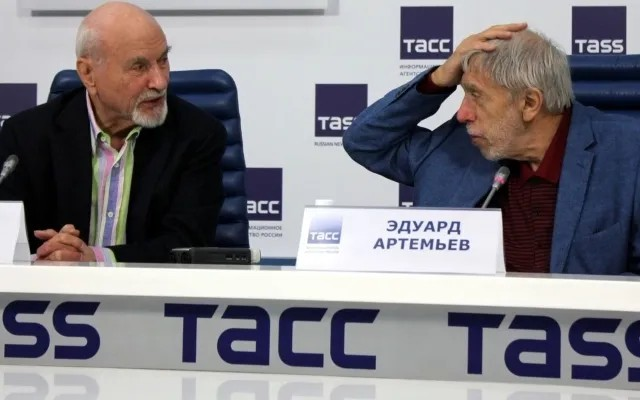

# Разговор на три голоса. Интервью музыкантов Эдуарда Артемьева и Владимира Минина — «Новой»

- **URL:** https://novayagazeta.ru/articles/2018/10/14/78198-razgovor-na-tri-golosa
- **Дата:** 2018-10-14
- **Автор:** Лариса Малюкова

## Разговор на три голоса

## Интервью музыкантов Эдуарда Артемьева и Владимира Минина — «Новой»

Владимир Минин и Эдуард Артемьев. Фото: Карэн КазаковЭдуард Артемьев: Да, начинал сочинять давно, бросал, снова начинал. Если б не просьба Владимира Николаевича Минина, никогда бы не завершил реквием. Благодаря его натиску «Девять шагов» сочинились за 9 месяцев, как ребенок. Бросил все остальное. Какое счастье заниматься одним произведением с утра до ночи.

— Почему вы решили обратиться к Новому завету — к эпизоду, в котором божественное явлено в человеческой природе, когда происходит Откровение всех ликов святой Троицы?

Э.А.Просто месса написана почти по канону реквиема. Должно быть 16 номеров, пока есть только девять. Но возможно, напишу и остальные. Вот Credo (Верую) — не получилось. Может, еще вернусь.

Владимир Минин. A propos замечу, что Credo практически никому не удавалось, даже Бетховен еле-еле справился.

Э.А.Почему реквием? Мы все идем к встрече с Господом. Завершение земной жизни, подготовка и таинство смерти и есть преображение. Великое событие. Я не знал, как назвать произведение, было много вариантов — все они повторяли имена уже существующих творений. Реквиемом называть не хотел, потому что нарушил каноны.

— Кажется, получилось актуальное прочтение латинских молитв, канон преображен звучанием электрогитары, голосом рок-исполнителя, многозвучием синтезатора, который вливается в строй симфонического оркестра, органа, хора. Как вы ищете баланс между каноном и современным звуком?

Э.А. Много лет назад, еще в «Солярисе» я нащупал меру и способ скрыть пружины совмещения симфонического оркестра, хора, электронной музыки. Не могу уже по-другому мыслить. Сегодня мир музыки бесконечен. Одной симфонической музыки мне недостаточно.

В.М.В этом творении выражены чувства мятущегося человечества в нашем вздыбленном мире. Современный человек разбирается в техническом прогрессе, но не может осознать глубины падения морали и совести. В этой музыке слышны страх, боль, одиночество, брошенность маленького человека. А еще наивные иллюзии, мечтания. Все это выражено в столкновении культур — академической и роковой. Сегодня люди делятся на тех, кто признает рок, кто тянется к чему-то более высокому — к классике, а есть и любители попсятины.

— Вы говорите об огромных группах людей, разорванных в своих пристрастиях, но вот сегодня я услышала музыку, способную объединять, и быть при этом нетривиальной. Владимир Николаевич, а вы с хором исполняли что-то близкое к року?

В. М.К приезду Стинга мы аранжировали, спели и подарили ему его песню. Стинг был тронут.

— Как вы заказали эту музыку Артемьеву?

В.М.Я услышал оперу Артемьева «Преступление и наказание», поразившую мощью, драматизмом. Мое обращение к нему — как бы продолжение этого слушания. У композитора было много подготовленного материла. Это просто провидение господне, когда есть вспаханная почва, и нужен импульс — тогда на этой почве прорастает подобное произведение.

Э. А.За этот импульс огромное спасибо. Я уже отчаялся его завершить. И посвящение Минину — знак моей признательности. Я же знаю Владимира Николаевича давно. Мы заканчивали одно хоровое училище Свешникова. Его помню девятиклассником. Для нас, первоклашек, они казались недосягаемыми богами музыки.

— А что вы скажете об особенности Минина как музыканта и о его уникальном камерном хоре?

Э.А.Владимир Николаевич совершил для меня одно из главных открытий в жизни — познакомил с музыкой Свиридова. Я знал ее, но как-то мимо ушей. И вот услышал кантаты на стихи Есенина — невероятное прочтение мининского хора: простыми средствами, и так глубоко, с духовной мощью. Что-то очень мне близкое. Отец работал под Рязанью, мы ездили к нему на родину. Не забуду гигантский обрыв — дух захватывает, а вокруг бесконечные заливные поля, леса…

— Да ведь вы сейчас описываете свою музыку! Спрошу Минина, какая музыка композитора Артемьева вам особенно близка?

В.М.Конечно, киномузыка. Для «Сталкера» Тарковского, но прежде всего, для «Соляриса». Там и простор, и сосредоточенность, ожидание чего-то, поток времени.

— Вы разделяете музыку на высокую и общедоступную, симфоническую и киномузыку, которая для многих композиторов — способ заработка?

Э.А.Давно прошло время, когда киномузыка была прикладной, она превратилась в отдельный жанр, близкий к опере.

В.М.Поспорю с вами, это не время прошло. Все зависит от отношения режиссера и композитора к фильму. Увертюра Дунаевского к «Детям капитана Гранта» стала самостоятельной пьесой, прокофьевская партитура для «Ивана Грозного», свиридовская сюита «Время, вперед!» — не просто киномузыка, это гениальные произведения искусства. Если музыка из фильма исполняется в концертных залах — это не приложение к фильму, а самостоятельное творение композитора. Наш хор записывал произведения для кино. Для фильма «Иди и смотри» Элема Климова, для «Бориса Годунова» с Бондарчуком в главной роли. А в картине Вадима Абдрашитова «Слуга» было так много музыки Владимира Дашкевича, что ее хватило на целый реквием, который мы и исполнили.

— Эдуард Николаевич, ваши произведения вы воспринимаете как отдельные вещи или это главы единого долгого пути? Слушая вашу разнообразную музыку, с первых тактов можно угадать автора.

Э.А.Никогда над этим не задумывался. Видимо, есть какая-то своя стилистика. Но я много работал в кино, делая то, что нужно режиссеру. Помню, спорил с режиссером Самсоном Самсоновым, пока он не сказал: «Леша, хочешь работать в кино — подчиняйся режиссеру, не тяни на себя одеяло. Послушаешь меня, будешь звучать в Голливуде, иначе дальше Бердичева не продвинешься».

—Я слышала, что у Андрея Кончаловского, с которым вы учились в консерватории и делали несколько фильмов, в том числе «Сибириаду», свои жесткие представления о музыке в картине.

Э. А.Это правда, и это беда. Каждый раз думаю: «Ну все, в последний раз работаем». Но проходит время, начинаем новую картину. Одна из последних совместных работ «Преступление и наказание». Андрей предложил в 70-ые эту идею, либретто он написал вместе с Марком Розовским и Юрием Ряшенцевым. Ряшенцев бережно зарифмовал текст. Я понял, что до такой высоты в музыке мне не подняться. Но там была стратегическая ошибка. Я написал все партии для рок-певцов. Режиссер из театра Станиславского и Немировича-Данченко сказал: «Мы можем пригласить максимум двух рок-исполнителей. Хочешь всех? Создавай свой театр». Для спектакля, который идет сегодня, Кончаловский убрал всю симфоническую сторону, взял сцены, связанные с рок-музыкой. Это обеднило задуманный мир.

— Вы писали эту оперу почти 30 лет, наверное, и замысел менялся.

Э.А.Неисчислимое количество эскизов — и не складывалось. Однажды перечитывая Достоевского, наткнулся на фразу: «Раскольников идет по Сенной площади, и там кто-то на балалайке играет, голоса пьяных мужиков». Все стало ясно: надо играть на всех инструментах, которые хочу использовать.

— Ваш учитель, создатель первого синтезатора Евгений Мурзин говорил, что если можно использовать колебание воздуха, струны, электрического тока, гипотетически можно уловить и колебания души.

Э.А. Это его идея. Он полагал, что постепенно музыка осваивает все звучащие средства: струны, дерево, метал. Потом появилось электричество. Все колеблется в мире, все связано: движение, резонанс, вспомните эксперименты Теслы. Постепенно музыка сможет не условно, а непосредственно влиять на душу. Дело это опасное.

— Разве музыканты не пытаются проникнуть в тонкие сферы, в тайный внутренний мир человека?

Э.А.Это не задача, а результат работы.

В.М.Веризм весь построен на том, чтобы проникнуть в тайные закоулки и передать тончайшие оттенки душевного движения.

— Какое музыкальное впечатление перевернуло ваше сознание?

Э.А.Первое было лет в 14, я тогда занимался музыкой из-под палки. Мой дядя, хормейстер в консерватории, принес ноты Скрябина, играл его последние сочинения. Ничего подобного я не слышал — стоял за дверью, окаменев. И к музыке начал иначе относиться. Вторая революционная встреча — с роком. Он буквально обрушился на меня. DeepPurple, KingCrimson, Yes, Питер Габриэл, Genesis, PinkFloyd — величайшая музыка. Революция в истории человечества. Все же ждали, что ХХ век принесет новую музыку. Были поиски Стравинского, Шенберга, додекафонии, но все это продолжение классики. От Малера во многом Шенберг и шел. А эта музыка совершенно новаторская: ни инструментов таких не было, ни играть, ни петь, ни строить так не умели.

— Выходит, это последнее открытие человечества — в области музыки?

Поддержите нашу работу!

1000 500 300 Нажимая кнопку «Стать соучастником», я принимаю условия и подтверждаю свое гражданство РФ

Если у вас есть вопросы, пишите [email protected] или звоните:+7 (929) 612-03-68

Э. А.Думаю, сейчас все движется к Мистерии. Все искусства разбрелись по разным уголкам, а теперь технология позволяет соединить их в общий мир. Когда я начинал работу с электроникой, инженеры меня ограничивали: «Это невозможно сделать». Сегодня композитор вновь оказался перед чистым листом — пиши, что хочешь! Открываются новые ресурсы, вслед за электроникой и цифрой — голография. Все вместе это окажется самым могучим прорывом человечества в музыке.

В. М.Пожалуй, для меня подобным открытием была не музыка, а беседы со Свиридовым. Одно дело окончить консерваторию, получить портфель знаний. Но что с этим делать? Во имя чего? Ключевые вопросы посчастливилось задать самому себе на заре жизни в живом общении с классиком. Если про музыку — то самым незабываемым впечатлением было услышать, как у Караяна хор и оркестр запели Мессу Баха одними штрихами — я просто оторопел: это же какая виртуозность и музыкальная культура хора!

— Андрей Тарковский боготворил Баха, использовал его музыку в кино. Как в «Солярисе» соединилась баховская прелюдия с вашей музыкой и возник звуковой космический океан Соляриса.

Э. А.А вы знаете, что у Андрея была самая большая в мире библиотека баховских нот и пластинок? Вначале Андрей сказал: «Мне не нужен композитор. У меня есть Бах. Я осторожно спрашиваю: «А можно ли как-то к Баху прикоснуться? Там несколько раз повторяется одна и та же тема». Андрей упирается: «Потому что это символ». Тогда я использовал технику Cantus firmus — сверху хоралла, над которым звучит баховская музыка, я еще надстроил эту композицию — написал «пятна», добавил орган. Хотелось большей чувственности, которая у Баха запрятана вглубь.

— А почему бы вашему хору не спеть многоголосное произведение Баха-Артемьева?

В.М.А знаете, это любопытно, пользуясь случаем, попросим автора это сделать.

Э. А. Для хорового переложения мне надо его доработать.

— Вот и вероятность нового заказа от Минина! Знаю, что вы уважительно относитесь к слову «заказ», как многие композиторы во все времена.

В.М.Просто для многих композиторов заказ является лишь импульсом для собственного воображения.

— Как обычно заказ формулируется? Насколько внутри заказа чувствуете себя свободным? Известно, что ваш финал в «Докторе Живаго» существенно изменился.

Э.А.Чаще всего так. Раздается звонок: «Старик, начинаю картину. Не хочешь поработать?» «Какая тема? Подходит. Давай сценарий». Много раз предлагали делать мюзиклы. Этого не могу. А с режиссерами беседы во многом схожи: слова-то у всех одни и те же. Конечно, с появлением синтезатора стало проще показать музыку.

В «Сибириаде» Кончаловский меньше лез в партитуру. Дальше было намного хуже: все не нравилось: «Старик, фактура не та».

— Зато Никита Михалков, кажется, с лету принимает все, что вы для него пишете. А потом ваша музыка, например соло трубы в фильме «Свой среди чужих» становится визитной карточкой режиссера.

Э.А.Просто удивительным образом я попадаю в его замысел, интонацию. Мы сделали 17 картин вместе, может, пару раз сходу не угадал его идею.

— Не странно ли, как картина замечательная, вроде «Своего среди чужих», «Неоконченной пьесы…», «Рабы любви», то и музыка на все времена. Но если кино слабее, как у позднего Михалкова, и музыка — менее выразительная.

Э.А.Да, это секрет. Знаете, у Никиты гигантская энергетика, невероятная сила воздействия. Ты даже не понимаешь, просто ощущаешь, что он хочет. Поэтому и актеры у него так играют.

— В «Рабе любви» музыка дала драматическое расширение истории, ощущение умирания целой эпохи. Вы ориентировались на музыку 20-х годов?

Э. А.Мне тогда самому было тяжело: жена и сын попали в страшную автокатастрофу. Артему было семь лет. Я думал, не смогу писать, откажусь. Днем — по больницам, ночью писал. Вот вам и музыка.

— Посвящение музыкального произведения — это больше, чем просто исполнение, это личный разговор с композитором.

В.М.Для меня посвящение — это признание композитором меня как своего единомышленника. Он доверяет мне премьеру своего новорожденного творения. Возлагает ответственность, и есть страх, чтобы это «дитя» в купели не утопить.

Э.А.Признаться, я рисковал, когда это писал, и когда отдал партитуру Владимиру Николаевичу, страшно волновался, вдруг скажет: «Это никуда не годится!»

— Вы прожили долгую жизнь в искусстве, чем вы по-настоящему гордитесь?

В.М.Могу считать себя счастливым человеком: удалось создать Московский академический камерный хор. Хоров ведь много. Но у нашего состава музыкантов с первого выступления был свой художественный почерк, выраженный в первую очередь в качестве звука.

Э.А.А я не знаю, как ответить: во мне критик живет, больше чем сочинитель. Ну, наверное, опера «Преступление и наказание». Во-первых я сам изумился, что его завершил. И кажется, это мой потолок. Неподъемная глубокая работа. И да, здесь я отвечаю за каждую ноту. Когда Кончаловский предложил мне «Преступление…», я сразу сказал, что это произведение мне не близко. Уговаривал его позвонить Шнитке. Но он упорный: «Только ты». И я преодолел себя, что важно и дорого. Были тяжелые кризисные моменты. Потом совершенно застрял, а Кончаловский уже жил в Лос-Анджелесе. Звонил все время, а я ему врал, будто продолжаю работу, хотя давно ее бросил. Он человек невероятно воспитанный, никогда не повышает голос. И вот спустя время — мне уже около 60-ти — звонит, и жестко:

«Если не оставишь все свои работы — ты никогда не напишешь. Станешь стариком: пенсия, болезни, конец. У тебя максимум два года!» И бросил трубку. Меня проняло.

Отказался от всех работ. За два года написал. Но я буквально ушел из мира. Писал сутками, спал когда придется: утром, днем, боялся упустить найденное, снилось все это бесконечно.

— Что не удалось?

В.М.Отечественная война прервала системное музыкальное образование. В 1941-ом мне было 12 лет. И свои занятия я возобновил только в 1944-ом. Этот разрыв сказался на моем развитии. Но я приучил себя не завидовать тому, что мне что-то не удалось, а другим удалось. Не удалось? Значит так было угодно небесам.

Э.А.Я совершенно покорен судьбе. Никогда против нее не шел. После консерватории радостно вприпрыжку понес свои сочинения в издательства, на радио, телевидение. Наткнулся на непреодолимую стену. Все мною сочиненное отрицалось. Я впал в отчаяние. Преподавал в музыкальной школе, в Институте культуры. Думал бросить занятия музыкой. И все же нашел силы пойти дальше. Что касается моей музыки, я самый нетерпимый свой критик. Никогда ничего не нравилось. Не слушал свою музыку и не слушаю, считаю это нелепым.

— Окружающий мир с его политическими оргиями, войнами пробивается сквозь музыкальную стену?

В. М.Душа содрогается от негативных явлений, от агрессии. В нашем обществе у людей отняли право на справедливость. Это кощунственно. Души не хватает охватить эту беспредельную боль. И думаешь: «Какое счастье, что на два часа можешь уйти в музыку, возделывая свою делянку».

Э. А.На меня внешний мир никак не влияет.

Я кабинетная крыса. Даже гулять не люблю, считаю это потерей времени. Моя жена следит за происходящим, порой рассказывает: «Смотри, что творится».

Есть глубокое ощущение приближающейся катастрофы. И не обязательно смотреть новости, чтобы чувствовать, как мир к ней катится с огромным наслаждением и ускорением. У меня это ощущение не проходит. Думаешь: «Ну ладно, ты уже свою жизнь прожил, но как внуки?»

В. М.В музыке «Преображения» — все это слышно, в ней философия жизни и смерти и современное ощущение неизбежности трагедии, в которую погружается наша цивилизация.

Поддержите нашу работу!

1000 500 300 Нажимая кнопку «Стать соучастником», я принимаю условия и подтверждаю свое гражданство РФ

Если у вас есть вопросы, пишите [email protected] или звоните:+7 (929) 612-03-68
