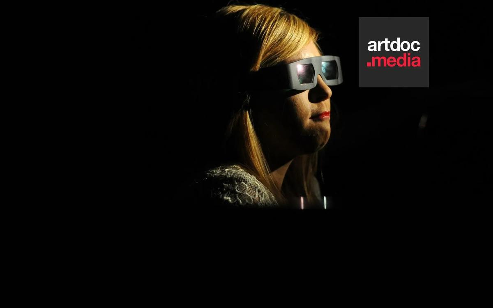

# VII докфест от «Новой» и «Артдок.Медиа» завершен. Спасибо! 10 фильмов посмотрели почти 70 тысяч зрителей

- **URL:** https://novayagazeta.ru/articles/2018/12/30/79093-docfest
- **Дата:** 2018-12-30
- **Автор:** Лариса Малюкова

## VII докфест от «Новой» и «Артдок.Медиа» завершен. Спасибо!

## 10 фильмов посмотрели почти 70 тысяч зрителей

Фото: «Новая газета»Вместе с «Артдок.Медиа» с 3 по 12 января «Новая газета» показывала 10 документальных работ прошлого года, которые заслуживают вашего внимания. Один день — один фильм (с 0:00 — 23:59), все по одной ссылке — на этот материал

### «Век Солженицына»

### «От рабства к свободе»

### «Еда по-советски»

### «Коля как зеркало русской революции»

Поддержите нашу работу!

1000 500 300 Нажимая кнопку «Стать соучастником», я принимаю условия и подтверждаю свое гражданство РФ

Если у вас есть вопросы, пишите [email protected] или звоните:+7 (929) 612-03-68

### «Последнее фото»

### «Наш новый президент»

### «Миссия»

### «Восточный фронт»

### «Курс молодого шамана»

### «Детство, лето и война»

Поддержите нашу работу!

1000 500 300 Нажимая кнопку «Стать соучастником», я принимаю условия и подтверждаю свое гражданство РФ

Если у вас есть вопросы, пишите [email protected] или звоните:+7 (929) 612-03-68
