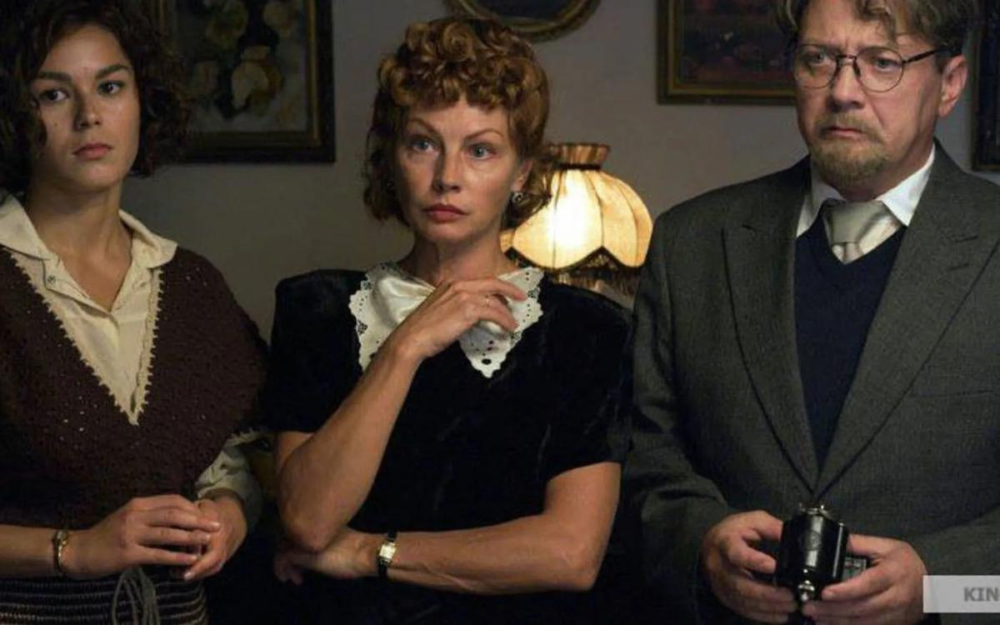

# «Праздник» прорвал блокаду. Телепропагандисты, депутаты и чиновники развернули грандиозный скандал, требуя запретить еще никем не виденную картину — и тогда автор выложил ее в Youtube

- **URL:** https://novayagazeta.ru/articles/2019/01/03/79104-prazdnik-prorval-blokadu
- **Дата:** 2019-01-03
- **Автор:** Лариса Малюкова

## «Праздник» прорвал блокаду

## Телепропагандисты, депутаты и чиновники развернули грандиозный скандал, требуя запретить еще никем не виденную картину — и тогда автор выложил ее в Youtube

Кадр из фильма «Праздник»Премьера должна была состояться в новогоднюю ночь, но режиссер Алексей Красовский отложил показ из-за взрыва газа в магнитогорской многоэтажке.

Вообще-то авторы мечтали, чтобы их картина жила нормальной жизнью. Сначала вышла в кинотеатрах, а уже потом в интернете. Тем более, бесплатно. Ведь фильм снимался без поддержки государства и каких-либо фондов на личные средства создателей, о чем мы узнаем в первых титрах.

Но где же вы видели сегодня «нормальную жизнь»?

Когда любой хайп, спекулирующий на теме «оскорбленных чувств», востребован и расходится по стране быстрей новости о подорожании платы за ЖКХ. И уже никому не интересно, что фильма никто не видел.

Но вот теперь каждый может сложить собственное впечатление о «Празднике».

Как и в предыдущей картине «Коллектор» с Константином Хабенским, действие происходит в одном месте в течение одного дня.

31 декабря. Блокадный Ленинград. Мы в загородном доме профессора Воскресенского (в исполнении взлохмаченного Яна Цапника — эдакая помесь профессора Преображениского и доктора Гаспара Арнери). Микробиолог Георгий Александрович Воскресенский работает в секретной лаборатории. Ну очень секретной. Выращивает бактерии. Разумеется, речь не идет о бактериологическом оружии, использование которого запрещено. Но у партии и правительства профессор и его семья на особом счету, потому что он выполняет важное партийное задание. У него и наградной пистолет есть от самого товарища Сталина.

К новогоднему столу у них будет курица. Что возмущает хозяйку дома, профессорскую жену Маргариту (Алена Бабенко) и ее трясущиеся папильотки — ведь отделу кадров обкома выдали утку. К тому же кухарку пришлось отпустить, и теперь Маргарите придется надеть фартук и самой ощипывать «горячее».

Все это мелочи. Настоящие неприятности приходят вместе со взрослыми детьми. Романтический сынок-студент (Павел Табаков) приводит в дом встреченную в бомбоубежище девушку Машу (Ася Чистякова). Избалованная безалаберная дочурка Лиза (Анфиса Черных) вместо ожидаемого жениха Максима подхватила на рынке плешивого проходимца, одноногого Виталия из Череповца (Тимофей Трибунцев).

Теперь эти люди увидят, как жируют приближенные к власти.

Придется оправдываться, объяснять, откуда в доме деликатесы, две ванных, обслуга. Сочинять специально для теряющей от голода сознание сироте Маше откуда в доме горячая вода и столько хлеба. А номенклатура, ой, как не любит рассказывать про привилегии, спецпайки, льготы.

Кадр из фильма «Праздник»Номенклатура рождается и умирает с понятием собственной исключительности: «положено», «на всех не хватит». В доме Воскресенских все привычно лгут друг другу и себе.

Поддержите нашу работу!

1000 500 300 Нажимая кнопку «Стать соучастником», я принимаю условия и подтверждаю свое гражданство РФ

Если у вас есть вопросы, пишите [email protected] или звоните:+7 (929) 612-03-68

Для Красовского не важно, о какой элите идет речь: о политической или научной. Это вечный, несменяемый «Правящий класс Советского Союза» — так, кстати, называлась книга Михаила Восленского, посвящённая вопросам истории «номенклатуры» как политической элиты Советского Союза. Этот «правящий класс» — фундаментальное понятие для системы, существенный инструмент «партийного строительства в СССР».

Поэтому не «кощунство», не «топтание на священной теме», не «надругательство над памятью наших соотечественников и героической историей Города-героя Ленинграда» — стали причиной яростных нападок на фильм, артобстрела едва ли не со всех телеканалов. Раздражает, бесит актуальность темы глобального разрыва между «прикрепленными к власти», избранными — и всеми остальными.

Слишком очевидны параллели между героями фильма и нынешними депутатами.

Свою собственную привилегированность осознают, тщательно оберегают, скрывают и Воскресенские, у которых в неопубликованной табели о рангах — «высшая категория».

За праздничным столом встречаются два мира — «свои» и «чужие». Они презирают, ненавидят друг друга. А над этими мирами — третий, который периодически напоминает о себе стуком. Это лежачая бабушка гремит палкой. Или «судьба стучится в дверь».

В этом микробюджетном кино все гротескно преувеличено, условно. Словно перед нами разыгрывается пьеса, написанная в советские времена, но разыгранная актерами в театре абсурда. В какой-то момент свет доме Воскресенских гаснет — начинается авианалет — и черный квадрат экрана съедает всю семейку, которая умирает от страха: не их ли прилетели бомбить фашисты? Будут здесь разоблачения, шпионы, шантаж. И ружье… то есть пистолет, заявленный в первом акте — в последнем непременно выстрелит. В финале то ли Алена Бабенко, то ли ее героиня Маргарита подмигнет зрителю, мол, видали?

Будет и постскриптум. Режиссер Алексей Красовский в костюме Медведя вместе с замечательным оператором Сергеем Астаховым (фильмы Балабанова «Брат», «Война», «Мне не больно») с бородой Деда Мороза поздравят нас с Новым годом, расскажут о том, как их обвиняли в нацизме, фальсификации истории… Как к кампании против «Праздник» подключили прокуратуру…

Но они нашли способ добраться до зрителя.

Номенклатура тоже знает проверенные временем способы добраться до рычагов управления кинематографом и зрителем.

- Во-первых, мифологизация и героизация прошлого, прежде всего руководителей — военных и гражданских, благодаря которым наш народ побеждал исключительно во всех битвах. Мифологизация посредством телеэфира воздушно-капельным путем пробирается в мозг аудитории — и готовых оскорбляться по любому поводу с каждым месяцем становится все больше.
- Во-вторых, страх: есть темы, исторические события, институции, герои к которым даже подступаться не велено.
- В-третьих, цензура, которая апробирует сегодня разные варианты легального существования.
- В-четвертых, прямые угрозы, которые начали поступать режиссеру по телефону и в мессенджерах сразу после объявления в СМИ о съемках фильма.

Как и в случае с «Убийством Сталина» или «Матильдой» речь идет о праве зрителя самостоятельно решать, стоит ли ему смотреть кино. Можно ли? У меня есть целый ряд претензий к фильму. Только возможности обнародовать их меня лишают те строгие судьи и хулители, которые гнобят фильм, не видя его.

В Конституции сказано, что художник имеет право на свободу самовыражения. Санкциями, запретами, обвинениями может заняться суд, но не чиновники или партократы, тревожащиеся за собственное благополучие.

Алексей Красовский нисколько не был намерен оскорблять ни святой горестной темы блокады, ни памяти погибших. Он снял кино о болезненной границе, установленной самими людьми между собой. Насколько хорошо у него получилось, судить вам.

Поддержите нашу работу!

1000 500 300 Нажимая кнопку «Стать соучастником», я принимаю условия и подтверждаю свое гражданство РФ

Если у вас есть вопросы, пишите [email protected] или звоните:+7 (929) 612-03-68
