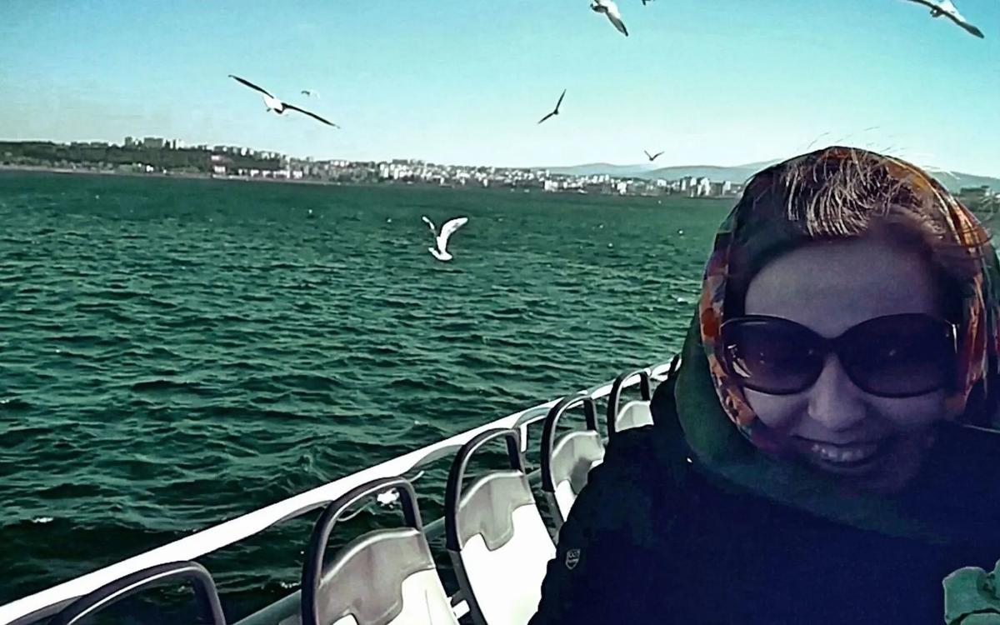

# «Синяя чайка». Как пережить самую страшную потерю в жизни. Большая премьера картины Елены Погребижской

- **URL:** https://novayagazeta.ru/articles/2019/03/23/79969-sinyaya-chayka-premiera
- **Дата:** 2019-03-23
- **Автор:** Лариса Малюкова

## «Синяя чайка». Как пережить самую страшную потерю в жизни

## Большая премьера картины Елены Погребижской

Фото: «Новая газета»Мы рады, что один из ведущих российских документалистов Елена Погребижская («Доктор Лиза», «Мама, я убью тебя») решила представить свой новый фильм «Синяя чайка» на сайте «Новой». По традиции нашего фестиваля неигрового кино, приветствуем ваши высказывания о фильме, о проблеме, которую он ставит. Потому что «Синяя и чайка», как и весь проект Погребижской «Пережить потерю» касается каждого.Катя плачет. Кадр из фильма «Синяя чайка»В пять утра Катю разбудил телефонный звонок: «Приезжай. Был пожар. Надя и Денис погибли». Так буднично, внезапно, страшно, безвозвратно была перечеркнута, сожжена ее привычная жизнь. Катин муж Денис, яркий ученый, урбанист, вместе с 11-летней дочерью Надей были на даче в Белорецке, родине Дениса. У его мамы. Казалось, такое тихое, прекрасное… самое счастливое и безопасное место на свете.

Что делать с дырой в душе?

Фильм Погребижской основан на домашней «хронике одного счастливого семейства», на монологах Кати, которая не выжила бы без своего внутреннего хранителя — «синей чайки».

У работ Елены Погребижской мощный терапевтический эффект.

У нее даже есть целый цикл о проблемах, с которыми следует обратиться к психотерапевту, но наши люди не любят ходить к психологам, психоаналитикам, психоневрологам. И сами не справляются. Поэтому уровень нетерпимости, агрессии, безумства в обществе зашкаливает.

Проект «Пережить потерю» состоит из двух частей — полнометражного документального фильма «Синяя чайка» и видео «Как пережить потерю», в котором психологи и психотерапевты отвечают на вопросы о горевании — и потерь по-прежнему табуирована в общественном сознании.

Поддержите нашу работу!

1000 500 300 Нажимая кнопку «Стать соучастником», я принимаю условия и подтверждаю свое гражданство РФ

Если у вас есть вопросы, пишите [email protected] или звоните:+7 (929) 612-03-68

Этот проект создавался с помощью краудфандинга. Участвовали почти 400 человек и было собрано 820 000 рублей.

Экран помогает узнать нечто важное себя. Про неврозы, панические атаки, посттравматические синдромы. Слушайте, у нас вся страна переживает постравматический синдром после многочисленных социальных переломов. Для Погребижской душевные переживания, душевная боль отдельно взятого человека — грандиозная проблема, с которой в одиночку не справиться. Ее кино помогает увидеть себя со стороны, понять, принять себя.

Катя и Денис. Кадр из фильма «Синяя чайка»Поначалу фильм о трагедии семьи моей коллеги журналиста Кати Визгаловой должен был быть научпопом, «наглядным пособием». Но личность Кати, ее судьба, ее внутренняя сила и свет — поглотили.

Честно признаюсь, вообще не понимаю, как Елена Погребижская нашла в себе мужество, осмелилась обратиться к этой напугавшей всех нас, заворожившей беспредельным кошмаром истории, о которой мы узнали несколько лет назад в фейсбуке. И даже не знали, как подобрать слова поддержки. Слова — это тоже важно, — делится с нами Катя.

Пустые, формальные слова ранят.

«Если бы не было смерти, мы были бы очень злыми», — говорит Катя. Она доверилась автору, и получился фильм, в котором человек больше, важнее трагедии, проблемы, истории. От «синей чайки» Кати, медленно и трудно научившейся жить со свои горем — жить, любить, а не функционировать — невозможно оторвать глаз. Какая же она красивая! И как хорошо улыбается в брекетах — такие же носила ее дочь Надежда.

Денис и Надя танцуют. Кадр из фильма «Синяя чайка»отклики первых зрителей «Сильный фильм, без какой-либо двусмысленности. Даже не хотелось обсуждать его, а хотелось узнать больше и больше дополнительных фактов. Достойно уважение ваше мужество, которое позволяет пропускать через себя крайне непростые истории своих героев, и продолжать дальше своё Дело! Оно многое даёт вашим зрителям, будьте уверены». «Пусть этот фильм станет для других такой же терапией в пережитии горя как для Кати». «Умеете вы, Лена, фильмы снимать. Я тоже, как и многие, плакала где-то с середины фильма… Не ожидала вчера от себя таких эмоций. В некоторых моментах узнала себя, родственников. У них дома тоже есть «комната-мемориал». В конце я была рада изменениям Кати, несомненно важную роль в этом сыграли именно съемки. Пусть у неё всё сложится, и найдутся силы на позитивные события в жизни». «На твоих глазах душа Кати оживает, душа, которая сгорела в тот страшный день. Лена, не имея опыта психолога, смогла помочь Кате. Фильм обязательно поможет другим людям. Это также сложно, как найти своего врача, а помощь психотерапевта жизненно необходима в этот тяжелейший период. Фильм о жизни, о большой любви, «синяя птица», как птица феникс, возродилась из пепла. Мне было не просто решится пойти на просмотр фильма, но на душе очень тепло! Лена, спасибо вам за фильм!» «Весь фильм плакала, но это были очищающие слёзы. Фильм прошёлся по всем больным точкам, буквально по всем, однако сама структура «Синей чайки», на мой взгляд, идеальна. Такие эмоциональные качели, но не до головокружения и тошноты и спазмов в теле, а как получить наслаждение от процесса, спокойно остановиться и пойти, не пошатываясь и при этом остаться удовлетворенной. Эмоционально насыщенный фильм, гамма эмоций: раскручивающаяся воронка в груди, горечь, сожаление, радость от того, что бывают на свете такие потрясающие люди, как семья Визгаловых, путь героини принятия неизбежного ошеломил её открытостью, процесс говорения, её способность рассуждать о таких непростых событиях и её трезвость мышления…» «Очень крутой фильм получился. Вчера после премьеры пересказывала мужу. Захлебываясь от восторга. Фильм-терапия. Спасибо!» «Лена, спасибо большое за фильм и за возможность после фильма услышать вас и друг друга. Захотелось узнать Катю ближе, приехала вчера домой, нашла Катин фейсбук и еще долго-долго его читала».Режиссер Елена Погребижская представила фильм «Синяя чайка»Поддержите нашу работу!

1000 500 300 Нажимая кнопку «Стать соучастником», я принимаю условия и подтверждаю свое гражданство РФ

Если у вас есть вопросы, пишите [email protected] или звоните:+7 (929) 612-03-68
