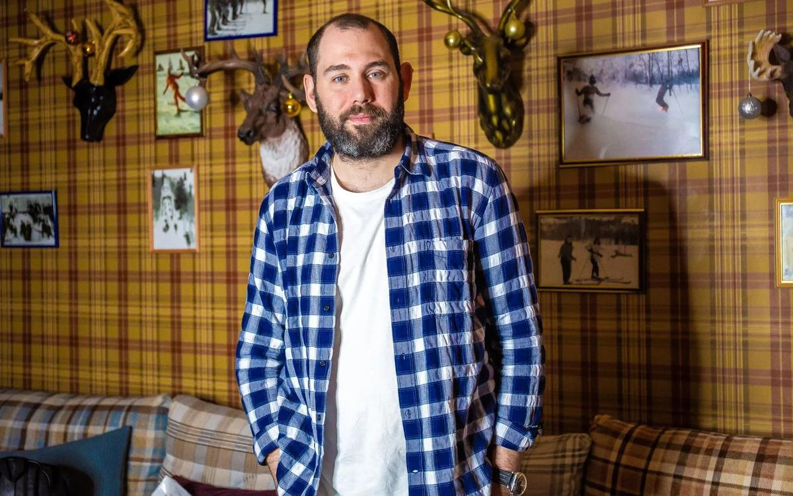

# Семен Слепаков: «Сегодня стадионы — это интернет». «Голос поколения» — о свободе, цензуре и самоцензуре

- **URL:** https://novayagazeta.ru/articles/2019/07/08/81172-semen-slepakov-segodnya-stadiony-eto-internet
- **Дата:** 2019-07-08
- **Автор:** Лариса Малюкова

## Семен Слепаков: «Сегодня стадионы — это интернет»

## «Голос поколения» — о свободе, цензуре и самоцензуре

Фото: Natache, URA.RU/TASSСочинитель популярнейших музыкальных стендапов, автор и продюсер одного из главных сериалов последнего времени «Домашний арест» в интервью «Новой» рассказал о небывалом сближении искусства и политики.— В «нулевых», когда вы начинали, было можно почти все. И вот едва ли не в ежедневном режиме правила ужесточаются. Я даже не про цензуру сверху, включается самоцензура. Работа сатирика превращается в слалом между остроумием и осмотрительностью. Или в работу минера, ошибающегося однажды. Как вам в этих обстоятельствах пишется?

— Вы правильно сказали об ужесточении разных типов цензуры: со стороны государства и со стороны общества, готового на все обидеться, требовать извинения, раскаяния. Но люди творческие, увлекающиеся, все равно в какой-то момент теряют контроль. Придумываем, чтобы было смешно. Уже потом начинаем анализировать, насколько это опасно, чем чревато.

— Да ведь не всегда можно спрогнозировать, на какую шутку комиков ТНТ может обидеться дагестанский боец Хабиб, у которого 13 миллионов подписчиков.

— Я недавно смотрел интервью Ларса фон Триера Ксении Собчак. Он говорил о нынешней власти толпы. Интернет напоминает власть толпы, которая без суда и следствия готова обвинять, без вынесения приговора осуждать. Это действительно серьезная проблема. Человечество не предполагало, что с ней столкнется, теперь надо думать, как ее решать.

— Сатира в принципе вещь обидная. Вольтер говорил, про особую чувствительность обид. Существуют ли возможности расширения дозволенного?

— Всегда есть возможность, как мне кажется, не изменять себе. А у кого какие границы, кто чем в этой ситуации рискует — уже вопрос другой. Как ни странно от меня услышать: людей, которые обижаются, я тоже могу понять. Но обиды не всегда адекватны нанесенному оскорблению. Да и исполнитель не планирует кого-то обидеть. Просто все это разрастается, как снежный ком.

Сегодня можно на одно обидеться, завтра — на другое, а послезавтра лучше вообще рта не открывать: просто ходи красиво-вежливо, перед всеми снимай шляпу, кланяясь в пояс.

Но опасный маятник раздражения качается все с большей амплитудой. Общество у нас неравномерное, разное, нервное. И для кого-то получить извинения — единственная возможность сдержаться и не нанести «обидчику» физический вред. Мимо оскорбления — реального или мнимого — пройти трудно. Как быть? У нас не прописаны, к сожалению, поведенческие каноны.

— При этом уровень агрессии в обществе — выше карниза.

— И общество агрессивное, и мы сами еще не поняли, сколь сильно вокруг нас все изменилось.

— Вот вы сочувствуете превентивно «обиженным», а они приходят взрывать кинотеатр в Екатеринбурге.

— Порой доходит и до худшего — мы это видим. Это действительно новое время, и надо придумать, по каким законам в нем должно существовать.

— Соглашусь с тем, что общество сегментировано, но и юмор тоже. А способен ли юмор быть объединяющим началом? Как в советское время юмор Аркадия Райкина. Как «теория общего дела», придуманная философом Николаем Федоровым.

— Конечно. Когда в кинотеатре собираются 500 человек и смеются в одних местах над одним и тем же, и потом вместе выходят в хорошем настроении, значит, юмор этих людей объединил.

— Гайдай, к примеру.

— Естественно. Или когда что-то нас пугает, и мы смеемся над своими страхами. Другое дело, что сейчас крайне тяжело объединять, потому что каждый смотрит со своей… Ну, мне кажется, мы в такой степени разрозненности, как сейчас, не были уже очень давно. Не только в России, во всем мире. Но, поскольку я живу здесь, то и чувствую острее этот разрыв здесь. Бывают редкие случаи, когда смеются все, и от этого всем становится легко.

— У вас получалось?

— Ну, вот «Домашний арест», к примеру.

Кадр из сериала «Домашний арест». Kinopoisk.ru— А из ваших хитов?

— Да много. «Газпром» хотя бы. В той или иной степени, любой. «Разговор мужа с женой», «Одноклассники».

— «День Победы».

— Ну, в «Дне Победы» тоже находили кощунство.

— Да? А какое же?

— Слушайте, ну идиотов полно. Но, в принципе, у меня практически все песни… просто такое, видимо, чувство юмора, такое восприятие действительности. Можно поддеть, спровоцировать, но я изначально не хочу, чтобы было обидно. Мы сочиняем вместе с Джавидом Курбановым, изначально настраиваясь на объединяющий и позитивный посыл.

— По отношению даже к самым гротескным смешным персонажам вроде «Любы, звезды ютюба» или «российского чиновника» — есть симпатия, и сочувствие.

— Существует много сатириков, а в последнее время они выпукло проявляются, которые стараются быть более злыми, нежели веселыми. Доминирует ядовитое желание обидеть. Это не идет на пользу.

— Обидеть зачем?

— Просто человек не всегда может себя контролировать, транслируя то, что он испытывает. Если в данный момент мне хорошо, я буду этим делиться, если верю в какие-то идеи, то и мои шутки, они будут в той или иной мере отстаивать мои идеалы.

— Даже в сатире?

— Безусловно. Буду бичевать явление, меня раздражающее. А если человека обидели и его разрывает от этого — он будет транслировать свою обиду. Смотришь и думаешь — господи, как же сильно тебя задели: не можешь оправиться, потерял чувство реальности. Не заметил, что ты уже даже не сатирик, похож вот на злую волшебницу, которую на бал не позвали, она пришла, всех прокляла и заколдовала. Имен называть не буду, но такое бывает.

Фото: Вадим Тараканов/TASS— Да, можно и некоторые общества заколдовывать. Бывают такие волшебники. Скажите, ваши хиты очень популярны, много миллионников. Можно ли провести параллель между подобными музыкальными стендапами и поэтическими вечерами в «оттепель», когда поэты собирали стадионы.

— Мне кажется, что так и есть. Сегодня стадион — это интернет, там все и собираются в какой-то момент. У каждого поколения свои голоса. И у совсем молодых людей есть те, кто их собирает. Какой-то общественный протест, какой-то человек, который скажет нечто смелое, откровенное. То, что остальные чувствуют, но либо не могут точно сформулировать, либо не решаются высказать. Безусловно, такие люди есть.

Все это как эффект сжавшейся и разжавшейся пружины. Чем сильнее общество пытаются сжимать, тем больше оно будет разжиматься, выражая протест. Невозможно запретить, условно говоря, «оскорблять чувства верующих», надеясь, что это улучшит отношение к религии. Кто-то согласится, кто-то промолчит. Но в итоге все выльется во что-то более тревожное, непредсказуемое.

— Как в Екатеринбурге в связи со строительством храма.

— Ну, например. Как можно не учитывать это принимающим запретительные законы? Человеку раздраженному нельзя приказать: «Не испытывай раздражение!» Или: «Мы власть, нас оскорблять нельзя!» Окей, он вас не будет оскорблять, но в другой форме вы его отношение почувствуете, потому что эта энергия не растворится в воздухе.

— Вам представляется опасным это наступление навстречу: раздражение снизу и все новые карательные указы сверху — уже за посты в интернете.

— Меня обескураживает то, что власть перестала вести с обществом диалог. Они что-то другое говорят. Есть распространенный тип спора, когда люди ожесточенно доказывают друг другу совершенно разные вещи. Один говорит, что, например, после шести вечера есть нельзя, а другой, что вредно курить. Таков сегодня диалог власти с народом, но в более агрессивной форме, типа: «Заткнитесь, мы не хотим вас слушать» или: «А кто это там? Кто вы все такие?», или: «Мы очень заняты, нам не до вас». Контакт полностью потерян.

«Вы хотите цензурировать интернет?» — «Нет, мы не хотим цензурировать интернет». «Вы запрещаете нам высказываться?» — «Нет, мы не запрещаем». — «Ну вот же: запретили». — «Потому это нельзя, можно другое». «А как же свободный интернет?» — «Почему вы вообще подобные вопросы задаете?»

— Кафкианская пьеса.

— Большая вероятность, что у власти просто этих ответов нет. Когда ребенок тебя о чем-то спрашивает, а у тебя нет ответа, то ребенку скажешь либо: «Отстань», либо «Пойди в книжке посмотри», либо сделаешь вид, что страшно занят.

— Общество инфантилизируют те, кто сами инфантильны. Про такое общество вы недавно сняли кино. Хотя мне кажется, к кино шаг за шагом вы начали приближаться еще с «Нашей Раши». И вот мега-успешный многосерийный фильм «Домашний арест», вами придуманный, спродюсированный, снятый Петром Бусловым. Дикое поле российской жизни, засеянное борщевиком коррупции, танец политтехнологов в обществе слепых. Десятки миллионов просмотров. Доброжелательная критика, профессиональные премии. Но кино — еще и инструмент познания действительности, самого себя. Чем для вас стал этот опыт?

— Это первое драматическое произведение, которое я написал. До этого занимался в основном ситкомами. Здесь история развивается от начала до конца. Может, это полотно не столь безупречно, как кинополотна больших художников, которые можно рассматривать по фрагментам. Но мы с моим соавтором Максимом Туханиным пытались создать большое полотно нашей современной страны.

Поддержите нашу работу!

1000 500 300 Нажимая кнопку «Стать соучастником», я принимаю условия и подтверждаю свое гражданство РФ

Если у вас есть вопросы, пишите [email protected] или звоните:+7 (929) 612-03-68

И если об опыте, я на всех этапах не просто присутствовал, но брал на себя инициативу. И кажется, многому научился. У нас была мощная команда: талантливые режиссер Петр Буслов и оператор Сергей Козлов, профи в монтаже — Руслан Габдрахманов. Оскароносец Александр Петров делал анимацию. Людовик Бурс написал музыку. Колоссальная школа.

Съемочная группа сериала «Домашний арест». Фото: Артем Геодакян/ТАСС— В процессе съемок что-то дописывали прямо на съемочной площадке?

— О, это мой случай. Постоянно все дописываю, все меняю. Порой ошибаюсь. Могут снять первый дубль, а я все перепишу. Снимем заново — мне понравится. А на монтаже увижу, что именно первый дубль был лучшим. Люблю перестраховываться.

— А насколько актеры Анна Уколова, Павел Деревянко, Александр Робак, Марина Александрова, Светлана Ходченкова меняли придуманный рисунок роли?

— Они постоянно что-то придумывали. Марина Александрова просто сочинила свой образ: «Мне нужно, — говорит, — добавить себе какие-то маленькие недостатки, чтобы быть с некоторой придурошностью». К примеру, у нас она не шепелявила.

— А до осознания беды, боли происходящего вокруг вы в этой разухабистой картине докапывались?

— Помните, был фильм «Фанатик» с молодым Райаном Гослингом? Он играет еврея, несостоявшегося раввина, который становится скинхедом, устраивает погромы, взрыв в синагоге, и погибает. Дальше он бежит по лестнице бесконечной, а раввин его спрашивает: «Куда ты бежишь? Ты же знаешь, что там, наверху, ничего нет».

Кадр из фильма «Фанатик». Kinopoisk.ruВот мне кажется, что нашу страну можно бесконечно исследовать и ничего не понять из того, что происходит. Это касается вообще мироустройства, и природы человека. Но само погружение в этот бескрайний океан невероятно захватывает.

— Не символично ли, что в России главным хитом сезона становится «Домашний арест», а в Украине «Слуга народа»? Один про подписку о невыезде, другой — про выборы обычного человека в президенты. И ведь оба находят рифму в реальности.

— Такие знаки времени. И они не связаны со сложной ситуацией между нашими странами, это, скорее, говорит об одинаковости нашей жизни, о нашей внутренней близости. Уже был снят пилот «Домашнего ареста», когда вышел первый сезон «Слуги народа». Я посмотрел две серии, и увидел много общего, несмотря на разность сюжетов. И сознательно перестал смотреть «Слугу народа», потому что даже на подсознании может что-то проявиться. Хотелось, самому себе сказать, что не видел фильма «Квартала 95» — вдруг возникнут конкретные пересечения. И придется от каких-то линий отказываться.

Кадр из сериала «Домашний арест». Kinopoisk.ru— Или оправдываться потом.

— Ну да. Просто у них меньше страна, поэтому все вот так гиперболизированным образом отражается, сбывается. У нас при всей буйности вымысла, сюжет немного ближе к реальности. И в отзывах на фильм пишут: «Ну, у нас же все так и есть в стране». А в «Слуге народа» сама по себе идея — романтика, утопия. И вот в действительности сейчас мы посмотрим этот утопический сериал еще раз. Хотя, скорее всего, это будет совсем другой сериал.

ФСБ и немного нежно

Как «Домашний арест» распространился на ТНТ-Premier

— Вам не кажется, что стираются границы между искусством и жизнью, кино и реальностью, придуманным и воплощенным? И уже не знаешь, что первично.

— Это правда, жизнь и искусство идут друг другу навстречу, сталкиваются лбами. Потому что, благодаря интернету — как сейчас говорят популярные блогеры — востребована «трушность», от слова «правда» (true). Ты успешный, если «трушный»: абсолютно прозрачный для всех и открытый. Готов показать все: от цвета трусов до тайных мыслей, от того, что ешь, до того, о чем думаешь, кого любишь, с кем расстался, сколько раз у тебя секс в день или в месяц. Тем самым, полностью стираешь грань между реальностью и ее интернет-воплощением. Из-за чего так популярен инстаграм? Люди привыкают все больше заглядывать в твою жизнь. Сначала раз в день выкладывали фотографии. Потом появились stories. Условно говоря, у Ольги Бузовой 70 stories в день: вот она идет по улице, вот она пришла в кафе. И человек не отходит о монитора, живет жизнью этого блогера вместе с ним. И это откладывает отпечатки на обоих.

— Жизнь без окон, без дверей, по обе стороны камеры?

— Да. Ведь и Бузова, которая всегда на виду, знает, что позволено видеть. Раньше говорили: «Это вмешательство в личную жизнь». Сейчас, если ты публичная персона, у тебя не может быть личной жизни (к моему большому сожалению, потому что я не такого рода человек). Твоя жизнь превращается в сериал. Как жизнь той же Ольги Бузовой, Амирана Сардарова. Люди смотрят этот сериал, который интереснее написанного мной. Это как смотреть футбольный матч: ты никогда не знаешь, что произойдет. Такая же непредсказуемость в жизни: мы все в разной степени творцы, которые создают мир вокруг себя.

В какой-то степени в Украине произошло схожее. Человек живет, переживает за происходящее в стране; обращается посредством искусства к людям. Люди ему верят, говорят: «Окей, мы дадим тебе эту историю прожить в реальности».

Кадр из сериала «Слуга народа». Kinopoisk.ru— Это же еще и о воздействии экрана говорит. Голосуют отчасти за персонажа. У нас вообще ментально часто путают актера с его персонажем.

— Тоже правда. Мы сейчас в интересный период живем, никто не ведает, что в следующую секунду может произойти.

—Вам не кажется, что сериал как способ диалога со зрителем становится значительнее, интереснее, чем кино?

— Наверное. Хотя у меня на этот счет личное мнение. Да, люди хотят все больше и больше проживать чужие жизни, а не свою — во многом трудную, связанную с преодолением, с трагическим финалом. Предпочитают безопасно в разной степени приближения наблюдать за другими. Поэтому сериалов теперь гигантское количество. Если я захочу посмотреть все более-менее интересные, не хватит времени в сутках. Для меня это не так привлекательно: когда я проживаю чужую жизнь, перестаю жить своей. Я напротив, пытаюсь отгородиться от этого потока, смотрю выборочно, если услышу несколько рекомендаций. Но большинство людей ищет возможность перемещения в другую реальность, проживания нескольких жизней у себя на диване.

— Сериалы еще и психотерапия.

— Один психотерапевт говорил, что у меня самого есть желание уйти в другую реальность, но с помощью книг, хорошего кино. Я готов потратить два часа жизни на фильм, и быть свободным. Смотря сериал, становлюсь рабом истории. Я начал смотреть «Чернобыль». Здорово. Но дальше второй серии уже не хочу продолжать. Просто надо было закрыть этот гештальт, чтобы быть в курсе. Или выясняется, что почему-то надо посмотреть второй сезон «Убивая Еву», словно выполнить чье-то задание. Вокруг все ахают: «Как, ты не видел «Игры престолов»? Не может быть!»

— Вам пригодилось ваше лингвистическое образование, это видно по текстам. А пригодилась ли ваша диссертация, написанная в пятигорском университете о «рыночной адаптации воспроизводственного комплекса рекреационного региона»?

— Если в философском плане на этот вопрос смотреть, то да. Потому что все, что ты ни делаешь, тебе дает багаж, оставляет отпечаток. Но конкретно, конечно, нет.

— То есть реальную пользу родному пятигорскому краю вы не принесли?

— Очень сложно принести пользу родному пятигорскому краю. Потому что надо на это потратить столько… Вот если бы там Олимпиаду собрались провести, наверное, это было бы легче сделать.

Режиссер сериала «Домашний арест» Петр Буслов и сценарист Семен Слепаков. Фото: Артем Геодакян/ТАСС— Почему спрашиваю? Меня удивил ваш ответ в одном интервью. Вы сказали, что не зарекаетесь, быть может, и в политику когда-то уйдете. Тогда действительно и экономика, и лингвистика вам бы пригодились.

— Это Жанна Немцова меня спрашивала насчет политики. Я признался: «Откуда я знаю, если я перестану придумывать, может, где-нибудь еще пригожусь».

Вообще, я в страшном сне себе такое представить не могу. Для меня политика во многих случаях синонимична жлобству, нет страшнее исхода.

— Жаль. Я уже вообразила, особенно насмотревшись всех ваших сериалов… Вот встреча на высшем уровне. Украинский президент Зеленский встречается с российским президентом Семеном Слепаковым. Им есть о чем поговорить, над чем посмеяться.

— Никогда бы не взял на себя подобной ответственности.

— А мне кажется, вы бы сумели понять друг друга.

— С Зеленским-то мы бы договорились о чем-нибудь. Но там не так просто договориться: это не ты с человеком договариваешься — надо, чтобы сто сорок миллионов людей договорились с пятьюдесятью миллионами. Я не умею и не хочу подобным заниматься. Мне кажется, я бы быстро сдох, если бы стал президентом: за все бы переживал, ничего бы не смог изменить, и меня, наверное бы, накрыло. Когда все обсуждали выборы и претендента Зеленского: будет он — не будет, правильно ли, что пошел во власть — неправильно. Способен ли изменить что-то?

А я думал: «Вова, как же тебе тяжело будет в ближайшие 5 лет». Неважно, будет у него получаться, нет, но как ему будет физически и морально невыносимо трудно.

И он уже не будет получать той беспримесной любви, которую он получал. Это чувство как бы расколется, разлетится на тысячи оттенков, в том числе неприятие, негатив и т.д. Да, это отважный поступок, отчаянный. Дай бог, чтобы получилось.

Ну, шо?

Как Владимир Зеленский решил стать слугой народа

— Ну, может быть, и там наверху, чувство юмора каким-то образом помогает, спасает?

— Знаете, чувство юмора хорошо проявляется в определенных ситуациях. Не представляю себе момента, когда идет бой, все с шашками наголо бегут, рубят друг друга, а ты решаешь спасти ситуацию, пошутив. Чувство юмора может помочь после или до. А на поле битвы? Черт его знает. Мне кажется, что сегодня ситуация такова, что уже все находятся не над схваткой, а внутри нее.

Поддержите нашу работу!

1000 500 300 Нажимая кнопку «Стать соучастником», я принимаю условия и подтверждаю свое гражданство РФ

Если у вас есть вопросы, пишите [email protected] или звоните:+7 (929) 612-03-68
