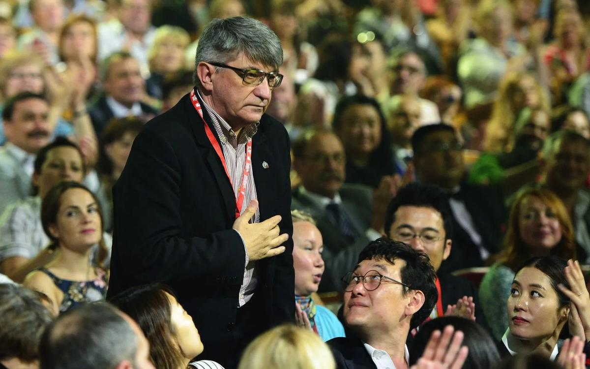

# Решение «Примера». Почему Александр Сокуров решил закрыть свой фонд?

- **URL:** https://novayagazeta.ru/articles/2019/07/15/81251-reshenie-primera
- **Дата:** 2019-07-15
- **Автор:** Лариса Малюкова

## Решение «Примера»

## Почему Александр Сокуров решил закрыть свой фонд?

Фото: Смитюк Юрий / ИТАР-ТАСССМИ распространили информацию о том, что режиссер с мировым именем собирается остановить работу своего фонда «Пример интонации» в связи с «общими внешними обстоятельствами», а также разногласиями с Министерством культуры. По словам Александра Николаевича, Минкульт относится к нему недружелюбно, агрессивно.Некоммерческий фонд поддержки кинематографа «Пример интонации» учрежден в 2013-м для поддержки режиссеров-дебютантов. Из 12 сокуровских студентов, окончивших его курс в Кабардино-Балкарском университете, пятеро сняли полнометражные картины, что является, по его словам, «совершенно невероятным случаем». Благодаря фонду сняты:

- «Теснота» Кантемира Балагова, получившая приз ФИПРЕССИ на Каннском фестивале в 2017-м;
- фильм «Глубокие реки» Владимира Битокова, названного «лучшим дебютом на «Кинотавре-2018»;
- картина «Софичка» Киры Коваленко по повести Искандера, получившая спецприз «За сохранение культурных традиций» на фестивале «Дух огня» в Ханты-Мансийске и приз за лучшую режиссуру на «Горький fest».
- «Мальчик русский» Александра Золотухина, участник «Берлинале», отмечен критиками на «Кинотавре». О молодом авторе этого фильма его учитель сказал: «Я благодарен, что среди моих учеников есть человек такого нравственного и морального содержания».

И вдруг новость. «Мы закроем наш фонд «Пример интонации» в следующем году из-за недостатка средств к существованию, — говорит Сокуров. — Мы больше не можем в таких условиях существовать».

В Министерстве культуры признались, что не знают о закрытии «Примера интонации». «Честно говоря, я пока не слышала, что Сокуров закрывает свой фонд, — комментирует это известие глава департамента кинематографии Ольга Любимова. — В свое время нами была оказана поддержка нескольким проектам фонда, почему сейчас он закрывается, я сказать не могу. У нас не было никаких контактов, я даже не могу представить себе повод. Влиять на открытие или закрытие фонда, конечно, Минкультуры не может».

Нам же представляется, что среди разнообразных причин прекращения деятельности «Примера интонации» одной из основных могут быть нововведения в финансировании кинодебютов, которые вот-вот вступят в силу и коснутся, прежде всего, негосударственных киношкол.

Старикам здесь не место!

Доступ к субсидиям для режиссеров-дебютантов хотят ограничить. Какие картины мы никогда не увидели бы с такими правилами?

Поддержите нашу работу!

1000 500 300 Нажимая кнопку «Стать соучастником», я принимаю условия и подтверждаю свое гражданство РФ

Если у вас есть вопросы, пишите [email protected] или звоните:+7 (929) 612-03-68

Теперь дебютанты будут бороться за средства на свое кино в двух разных конкурсах. Один — для выпускников государственных вузов «до тридцати» с дипломами «Режиссер игрового кино», другой — для всех остальных, кто намерен снять свой первый фильм. Соотношение денежных возможностей примерно один к трем в пользу выпускников вузов.

Кроме того, последнее время фонд сотрясали обыски и проверки, что также не способствовало работе фонда.

Сокуров рассказывал о прослушке его телефона ФСБ и доносе бывшего коллеги, спровоцировавшего очередную волну «инспекций».

Однако Александр Сокуров не отказывается от своей воспитательно-педагогической работы, которую воспринимает как миссию: «Может, потому, что я слишком русский человек, может, потому, что мне не все равно, что происходит в Отечестве. И, может, потому, что я столь наивен, продолжая верить призывам президента совершенствовать систему образования».

Кроме того, с сентября 2019-го начинает работу Мастерская А.Н. Сокурова «Режиссер игрового и документального фильма, режиссер монтажа» в Санкт-Петербургском институте кино и телевидения. Курс уже набран.

В отличие от учеников мастерской в Кабардино-Балкарии это взрослые, состоявшиеся люди, имеющие за плечами высшее образование. В основном им больше 35 лет, поэтому они не могут претендовать на «зеленый свет» государственной поддержки дебютов.

Однако обучение у Александра Сокурова это еще и школа воспитания характера, способности отстаивать свои ценности. Его ученики не только достигают профессиональной состоятельности, мировой известности, они сохраняют свое достоинство и индивидуальность. Качества хоть и не самые востребованные в нынешней России, но Сокуров доверяет будущему, разделяя завет Голсуорси: «Если вы не думаете о будущем, его у вас не будет». Жаль, что эти простые идеи не разделяют те, кто обязан по долгу службы поддерживать уникальные инициативы, подобные «Примеру интонации».

Поддержите нашу работу!

1000 500 300 Нажимая кнопку «Стать соучастником», я принимаю условия и подтверждаю свое гражданство РФ

Если у вас есть вопросы, пишите [email protected] или звоните:+7 (929) 612-03-68
