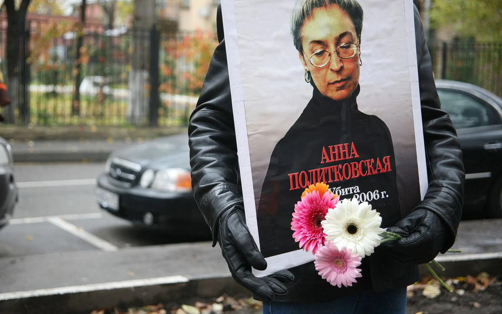

# «Камертон» нашей памяти. Международный день солидарности журналистов в Большом зале консерватории

- **URL:** https://novayagazeta.ru/articles/2019/08/21/81677-kamerton-nashey-pamyati
- **Дата:** 2019-08-21
- **Автор:** Лариса Малюкова

## «Камертон» нашей памяти

## Международный день солидарности журналистов в Большом зале консерватории

Фото: Влад Докшин / «Новая газета»30 августа — ​день рождения Анны Политковской. А 8 сентября — ​Международный день солидарности журналистов. В этот день в Большом зале консерватории традиционно будут вспоминать погибших коллег и отмечать тех, кто талантливо и мужественно продолжает дело жизни Анны Политковской. Премия ее имени вручается уже четвертый раз.Как говорится в положении о премии, «Камертон» присуждается за профессиональное мастерство, за мужество и последовательность в отстаивании принципов свободы слова, за честность, достоинство, гражданскую ответственность и человеческое сострадание. Первым лауреатом стала специальный корреспондент газеты «Коммерсантъ» Ольга Алленова.

В этом году в концертной программе выступят знаменитые пианисты Екатерина Державина и Алексей Любимов. Прозвучат произведения И.С. Баха, В.А. Моцарта, экспромты Ф. Шуберта.

Билеты продаются в кассах консерватории.

Вырученные средства будут направлены на создание памятника погибшим журналистам.

Поддержите нашу работу!

1000 500 300 Нажимая кнопку «Стать соучастником», я принимаю условия и подтверждаю свое гражданство РФ

Если у вас есть вопросы, пишите [email protected] или звоните:+7 (929) 612-03-68
