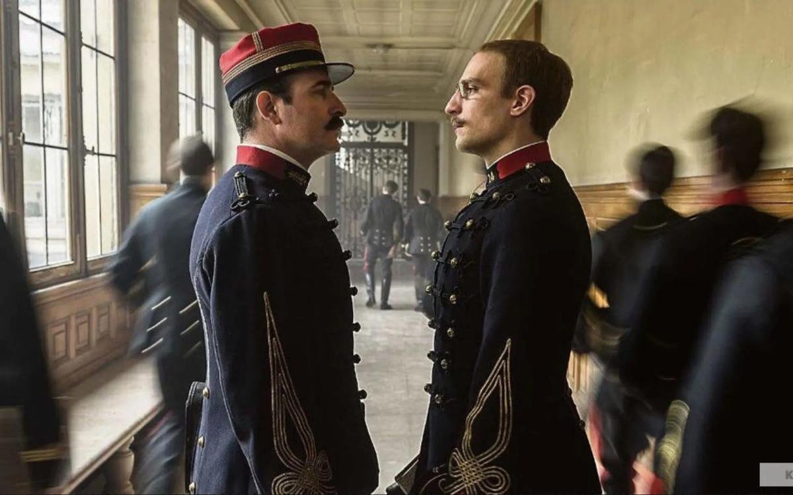

# Правда о «прачечной». 28 августа открывается 76-й Венецианский кинофестиваль, который все увереннее метит на место главного смотра артистического кино в мире.

- **URL:** https://novayagazeta.ru/articles/2019/08/26/81732-pravda-o-prachechnoy
- **Дата:** 2019-08-26
- **Автор:** Лариса Малюкова

## Правда о «прачечной»

## 28 августа открывается 76-й Венецианский кинофестиваль, который все увереннее метит на место главного смотра артистического кино в мире.

Кадр из фильма «Дело Дрейфуса». Kinopoisk.ruС того момента, как Каннский смотр поссорился с крупнейшим онлайн-сервисом Netflix, такие фильмы, как прекрасная черно-белая лента «Рома» двукратного обладателя «Оскара» Альфонса Куарона, перетекают в Венецию и даже становятся триумфаторами фестивального марафона.

Рассказываем о картинах, которые стоит искать в репертуаре кинотеатров и онлайн-залов.

Политическая драма «Прачечная» обладателя «Золотой пальмовой ветви» и премии «Оскар» Стивена Содерберга рассказывает о панамском скандале. «Новая газета» принимала участие в изучении «Панамского досье», исследовании незаконных денежных сетей мировой элиты, обнаружив там имена наших чиновников, депутатов, президентских друзей.

Кадр из фильма «Прачечная»В основе сценария — книга Пулитцеровского лауреата Джейка Бернштайна «Секретный мир». В ней старший корреспондент Международного консорциума журналистских расследований (ICIJ), который помог обнародовать многочисленные документы, связанные с оффшорами, пытается предать гласности ранее не опубликованные данные о финансовых махинациях представителей властной элиты и известных персон. Пулитцеровскую премию Бернштайн получил в 2011 году за серию онлайн-репортажей о сомнительных бизнес-практиках банкиров с Уолл-Стрит, внесших посильный вклад в экономический кризис в стране.

Фильм Стивена Содерберга выходит под брендом Netflix. Снимались в нем звезды первой величины: Мерил Стрип, Гэри Олдмен, Антонио Бандерас.

Кадр из фильма «Прачечная»Новый фильм шведского классика Роя Андерссона можно рассматривать как продолжение его великолепной философской трилогии («Песни со второго этажа», «Ты, живущий» и «Голубь сидел на ветке, размышляя о жизни»), посвященной экзистенциальным вопросам. На создание фильма«О бесконечном» его вдохновила «Книга тысячи и одной ночи». Андерссон рассказывает: «Книга посвящена драгоценности и красоте нашего существования, она будит в нас желание сохранить это вечное сокровище и передать его дальше в противоположность изображениям, которые запечатлевают отдельные моменты существования». Шахерезада ведет повествование о судьбах отдельных людей, о разных способах преодоления «банальности повседневности».

Среди персонажей истории о бесконечной уязвимости человеческого бытия обещаны Адольф Гитлер, Христос, директор отдела маркетинга, любительница шампанского и священник.

Роман Полански снял свою 35-ю полнометражную картину, посвятив ее известному делу капитана Альфреда Дрейфуса, обвиненного в конце 19-го века в шпионаже и оправданного спустя 12 лет. В фильме «Дело Дрейфуса» («Я обвиняю») снялись Жан Дюжарден, Луи Гаррель, Эммануэль Сенье и Матье Амальрик. Это экранизация книги британского писателя Роберта Харриса «Офицер и шпион», которая рассказывает о всемирно известном процессе, в конце 19-го века взорвавшем не только французское общество, но вызвавшем бурные обсуждения в других европейских государствах, включая Россию. Одним из главных персонажей фильма становится Жорж Пикар, бывший наставник Дрейфуса, а затем начальник одного из отделов департамента разведки. Он ведет собственное расследование противоречивого дела, к тому же откровенно окрашенного в националистические тона.

Кадр из фильма «Дело Дрейфуса» («Я обвиняю»)Интерес к персоне Романа Полански («Китайский квартал», «Ребенок Розмари», «Пианист») вновь на пике после выхода фильма Квентина Тарантино «Однажды в… Голливуде», в котором банда Мэнсона нападет на дом Полански.

Поддержите нашу работу!

1000 500 300 Нажимая кнопку «Стать соучастником», я принимаю условия и подтверждаю свое гражданство РФ

Если у вас есть вопросы, пишите [email protected] или звоните:+7 (929) 612-03-68

Тарантино: «Мой фильм — погружение во вселенную кино»

Режиссер решил сам представить свою девятую картину «Однажды в Голливуде» российской публике, и, кажется, ему понравилось

Оливье Ассаяс («Зильс Мария», «Персональный покупатель») представит триллер «Осиная сеть». Названием фильма послужило имя шпионской кубинской группировки «Осиная сеть», работавшей в США в 90-х. Это история кубинских политзаключенных, которых обвинили в убийстве и шпионаже, посадили в американскую тюрьму. Фильм снимали на Кубе. В главных ролях Пенелопа Крус и Гаэль Гарсиа Берналь.

Фантастическая лента «К звездам» завсегдатая Канн и обладателя «Серебряного льва» Венецианского кинофестиваля Джеймса Грэя («Маленькая Одесса», «Ярды», «Затерянный город Z»), так же как «Интерстеллар», — повесть об астронавте. Рой МакБрайд (Брэд Питт) путешествуюет по Галактике в поисках пропавшего 20 лет назад отца (Томми Ли Джонс). Снова пространство тьмы космоса — способ рассказать о человеческих отношениях во враждебной Вселенной. Фильм продюсирует сам Брэд Питт.

Сергей Лозница на основе хроники похоронных процессий в честь Иосифа Сталина сделал фильм «Государственные похороны». Он работал с кадрами, снятыми с 5 по 8 марта 1953 года для фильма «Великое прощание», среди режиссеров которого были Сергей Герасимов и Илья Копалин. Кажется, для нынешней России это одна из актуальнейших картин.

В программе «Горизонты» — российско-грузинский фильм «Преступный человек» Дмитрия Мамулии, исследующий опыт самоидентификации человека в современном мире. История о том, как случайный свидетель преступления начинает примерять на себя разные маски: убийцы, убитого, жертвы и палача.

Глава Венецианского кинофестиваля Альберто Барбера назвал Дмитрия Мамулию «одним из самых интересных режиссеров из региона постсоветского пространства».

Покажут в Венеции «Стасис» — копродукцию России, Украины, Литвы и Франции. Лента вошла в программу «Неделя критики». Полнометражный дебют литовского режиссера Мантаса Кведаравичюса снимали в Одессе, Афинах и Стамбуле: история приключений четырех колоритных персонажей — работницы борделя Анны, реставратора икон Софии, беженца из Судана Мехди и гангстера Гарипе.

Среди «специальных показов» включены и первые серии долгожданного продолжения «Нового папы» Паоло Соррентино. Это сиквел ставшего сериальным хитом «Молодого папы», который рассказывает о вымышленном харизматичном папе Пие XIII, Ленни Белардо. В главных ролях Джуд Лоу и Джон Малкович. В сериале снялась и Шэрон Стоун.

Открывает фестиваль новая работа одного из самых ярких режиссеров мира Хирокадзу Корээда («Золотая пальмовая ветвь» Каннского кинофестиваля за ленту «Магазинные воришки»). Впервые он снимал фильм вне Японии и не на японском языке. «Правда» — история про стареющую французскую кинозвезду, опубликовавшую книгу мемуаров. К ней приезжает взрослая дочь с мужем… В роли кинозвезды — Катрин Денев, дочери — Жюльетт Бинош. В фильме снялся Итан Хоук.

В преддверии мировой премьеры режиссер рассказывает: «Мы сняли фильм за 10 недель осенью в Париже. Актерский состав в фильме выдающийся. Притом что это небольшая семейная история, действие которой по большей части происходит внутри одного дома. Я хотел, чтобы мои персонажи жили в этой маленькой вселенной, — со своей ложью, гордыней, сожалением, грустью, радостью и примирением. Я честно надеюсь, что фильм вам понравится».

В программе «Венецианская классика», включающей показы лучших картин мира, отреставрированных к показу, наряду с выдающимися работами Феллини, Скорсезе, Бертолуччи,Бунюэля — «Калина красная» Василия Шукшина.

Поддержите нашу работу!

1000 500 300 Нажимая кнопку «Стать соучастником», я принимаю условия и подтверждаю свое гражданство РФ

Если у вас есть вопросы, пишите [email protected] или звоните:+7 (929) 612-03-68
