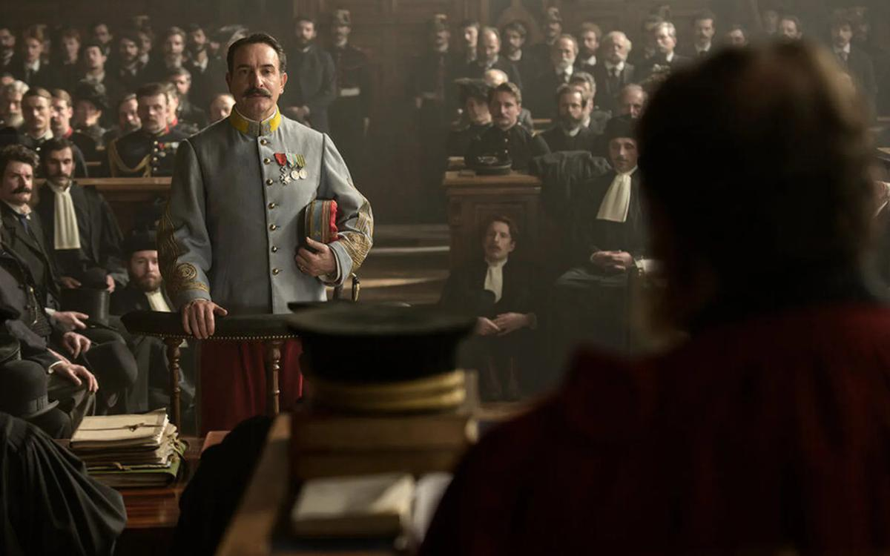

# Система острова Дьявола. Фильм Полански «Офицер и шпион»  — реконструкция дела Дрейфуса — о прогнившем государстве и истерике масс

- **URL:** https://novayagazeta.ru/articles/2019/08/30/81781-polanski
- **Дата:** 2019-08-30
- **Автор:** Лариса Малюкова

## Система острова Дьявола

## Фильм Полански «Офицер и шпион» — реконструкция дела Дрейфуса — о прогнившем государстве и истерике масс

Кадр из фильма «Офицер и шпион» / КинопоискМостру нещадно критикуют за включение в конкурсную программу исторического триллера Романа Полански о деле Дрейфуса «Офицер и шпион» («Я обвиняю»). В силу многих обстоятельств картина стала центром смотра, выявив важные приметы вовсе не вчерашнего времени.Кадр: КинопоискСкандал разгорелся с первой же пресс-конференции. Альберто Барбера — глава Венецианского фестиваля — не оправдывает режиссера, обвиненного 42 года назад в совращении 13-летней модели, но считает, что «история искусств знает много художников, совершивших то или иное преступление, а мы продолжаем восхищаться их работами».

Противоположное мнение у председателя жюри — аргентинского режиссера Лукреции Мартель: «Я не отделяю человека от искусства». Во всеуслышание она объявила, что откажется от визита на торжественный ужин в честь фильма Полански. Обычно председатели жюри не комментируют конкурс и его участников.

Высказыванием Мартель уже возмутились продюсеры фильма. Лука Барбарески пригрозил снять картину с показа и потребовал извинений от Мартель.

Сам режиссер именует все обвинения абсурдными, а себя — преследуемой жертвой «нео-феминистского маккартизма». Он вспоминает, как в60-ые, после убийства его беременной жены Шерон Тейт, его преследовали за сатанизм. «Пресса ухватилась за трагедию и, не зная, как с ней справиться, освещала ее самым отвратительным образом, подразумевая, среди прочего, что я был одним из людей, ответственных за ее убийство…»

И по поводу процесса против Полански в США: «Большинство людей, которые преследуют меня, не знают меня и ничего не знают о деле».

Похоже, кино сегодня снова больше, чем кино. В случае с «Я обвиняю» оно тоже стало площадкой для обвинений или реабилитации. И качество фильма тут имеет значение.

Роман Полански. Фото: ReutersПолански снимает добротное, доказательное, мотивированное, как в старые времена, кино. Следуя духу романа «Офицер и шпион» Роберта Харриса (тот стал автором сценария), Полански подробнейшим образом воспроизводит историю скандальных процессов над Дрейфусом. По сути, это реконструкция, но с важными для режиссера смысловыми акцентами, которые делают фильм «признанием от первого лица».

Ключ к фильму — первый титр: «В основе нашей картины реальные события с реальными участниками».

На плацу с выстроенными по периметру, словно игрушечными, солдатиками и офицерами — капитан Альфред Дрейфус (Луи Гаррель) с позором лишен звания. С него срывают эполеты, ломают шпагу. Он унижен за шпионаж в пользу Германии и приговорен к пожизненному заключению на острове Дьявола. Это январь 1895-го. Дальше разматывается весь клубок событий.

Главный герой фильма — Жорж Пикар (Жан Дюжарден), назначенный руководителем военной контрразведки, обнаружившей предательство Дрейфуса. Постепенно он выясняет, что утечка информации продолжается, что на письме, переданном немцам почерк не Дрейфуса, а майора Эстерхази. Но как только он указывает командованию на «судебную ошибку», и отказывается участвовать в операции по «нейтрализации» Дрейфуса, против него самого начинается охота. Его ссылают в Африку, а затем сажают в тюрьму.

Полански бережно реанимирует факты, они для него словно живые, события вчерашнего или даже сегодняшнего дня. Судебные процессы со скрипом пера и криком толпы.

Снова и снова военное лобби продавливает с помощью подлогов и фальшивок обвинение.

Кадр: КинопоискПоддержите нашу работу!

1000 500 300 Нажимая кнопку «Стать соучастником», я принимаю условия и подтверждаю свое гражданство РФ

Если у вас есть вопросы, пишите [email protected] или звоните:+7 (929) 612-03-68

Наблюдаем за хождением по мукам Пикара, который и сам за евреев — не очень-то… он просто за правду, без которой нет общества. А общество, между тем, разделяется на дрейфусаров и антидрейфусаров. И наконец, происходит знаменательная встреча, на которой Пикар в квартире своего друга рассказывает, как именно было сфабриковано дело — в присутствии брата гниющего на острове Дьявола Дрейфуса, Клемансо — будущего председателя совета министров, и Эмиля Золя. Собственно тогда и возникло знаменитое открытое письмо Золя «Я обвиняю», вызвавшее ажиотаж во Франции.

Золя не только обвинил генералов, назвав все их имена, указал на «бредовые домыслы и фантазии», ставшие основой обвинения, предвзятость военного суда и на отсутствие серьезных улик. Писатель обвинил французское правительство в антисемитизме, из-за которого Дрейфуса и заточили в тюрьму.

Полански показывает, как массовая истерия охватывает общество.

Как толпа требует расправы сначала над Дрейфусом, потом над Золя. Антисемитизм, разъедающий все институты государства. «Дали еврея христианам на растерзание», — ухмыляется один из высокопоставленных персонажей фильма.

Графолог (Матье Амальрик), солгавший, что письмо врагу писал Дрейфус, признается: «Как я мог не свидетельствовать против еврея, разумеется, он предатель». После публикации письма Золя (который будет вынужден бежать из страны) начнутся погромы. Пресса и общественное мнение подложили хворост, поднесли огонь — в дело вступают массы.

Полански хочет быть доказательным в подробностях — у него получается. В фильме возникают душные грязноватые кабинеты спецслужб, в которых с помощью пара открывают и читают личные письма французов, холодные гулкие апартаменты высоких военных чинов.

Здесь везде трудно дышать. Здесь везде запах только что начищенных сапог.

И лишь частное пространство небольших квартир кажется пригодным для жизни. В кульминационных моментах действие переносится в судебные залы, где есть места для военных вип-персон, рьяная галерка и «судебная сцена».

Кадр: Кинопоиск«Каждая сцена была тщательно продумана, — рассказывает Дюжарден, — И все равно на подготовку съемки уходили часы, чтобы каждая деталь была восстановлена».

Для Полански это кино, прежде всего, о чести, которую приходится защищать, несмотря на колоссальное давление, буквально, рискуя жизнью. О том, что на условном острове Дьявола может оказаться любой, кто не понравится системе. И что для массовой истерии неважно, доказаны ли факты нарушения закона или общественных устоев. А массовая истерия может обретать драматический или даже трагический характер.

И еще он размышляет о непримиримом столкновении неудобной правды с ложью в интересах государства. Раз армия стоит на защите государственных интересов, то суд призван защищать армию.

И, конечно же, Полански, потративший на создание фильма почти семь лет, снимал отчасти кино и про себя. «Мое кино — не терапия, — признается он, — Однако я должен признать, что знаком со многими принципами работы аппарата преследования, показанного в фильме, и это явно вдохновило меня».

Для России фильм Полански не менее актуален, чем для Франции или Америки. Ведь это кино рассказывает о судах — спектаклях по заранее написанной пьесе. Система сама фабрикует обвинение, сама назначает обвиняемого. Как тут не вспомнить Золя: «Они судили обвиняемого, не рассуждая, как солдаты идут в сражение». Они прикрываются интересами национальной безопасности, и поэтому закрывают допуск к документам всем, даже судьям.

«Мы созданы хоронить секреты», — говорит представитель правоохранительных органов.

Это кино и о тотальной подозрительности. Бывший начальник охранки говорит Пикару, что он насчитал 2500 потенциальных предателей, и уже составил список подозреваемых. К счастью, умер от сифилиса — не успел пустить дела в ход.

Судя по всему, 86-летний режиссер, скрывающийся от правосудия США, понимал, что не сможет появиться в Венеции. Но он все равно появился. В одном из эпизодов фильма Полански стоит среди публики слушающей классическую музыку. В эполетах и мундире.

Поддержите нашу работу!

1000 500 300 Нажимая кнопку «Стать соучастником», я принимаю условия и подтверждаю свое гражданство РФ

Если у вас есть вопросы, пишите [email protected] или звоните:+7 (929) 612-03-68
