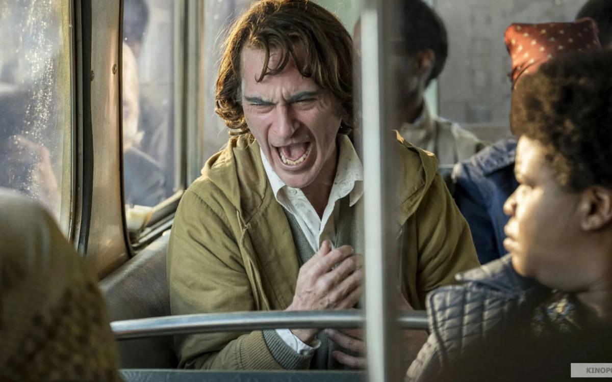

# «Джокер» и Полански делят львов. Парадоксы и сенсации Венецианского кинофестиваля

- **URL:** https://novayagazeta.ru/articles/2019/09/09/81902-dzhoker-i-polanskiy-delyat-lvov
- **Дата:** 2019-09-09
- **Автор:** Лариса Малюкова

## «Джокер» и Полански делят львов

## Парадоксы и сенсации Венецианского кинофестиваля

Кадр из фильма «Джокер». Kinopoisk.ruЧто бы ни говорили, но выбор аргентинской артхаусной режиссерки Лукреции Мартель оказался сколь неожиданным, столь же логичным финалом Мостры-2019.

Смотр был сложен как биеннале, пазл из современного киноискусства, провоцирующего, раздражающего, актуального, спорного. Но прежде всего — невиданно разнообразного. В прошлом году на фоне относительно ровной программы снежной вершиной царила «Рома» Альфонса Куарона. В нынешнем программа разбегалась во все стороны вместе с глазами экспертов. Переосмысленная классика («Мартин Иден») и комикс-гротеск («Джокер»), знаменитые политические скандалы ХХ века («Я обвиняю», «Осиная сеть») и семейные романы («Брачная история» и «Поместье»), язвительный документальный антропологический эксперимент «Мафия уже не та, что раньше» и анимационная визионерская поэзия («Дом №14 по Черри Лейн»), трансгрессивная хореография («Эма») и шокирующая издевательствами над ребенком, скитающимся по дорогам войны «Раскрашенная птица». Спектакль разоблачения финансовой коррупции («Прачечная») и экзистенциальный альманах о тщете сущего («О бесконечности»).

Выбор Мартель не столько определение лучшего, сколько попытка через призму кино рассмотреть ускользающую красоту и уродство реальности, завязать новые узлы между прошлым и настоящим, нащупать векторы современного кинематографа, для которого не существует разделения на высшие и низшие жанры.

Ну не дико ли — пришельцы из супергеройской вселенной DC Comics пришли на один из главных арт-фестивалей мира и похитили главную награду.

«Это только я или все вокруг становятся безумнее?» Вопрос Джокера в начале кинокошмара Тодда Филлипса, удостоенного «Золотого льва», — ключ к пониманию картины. Эта предыстория заклятого врага Бэтмена, клоуна-убийцы — пожалуй, самый яростный и дерзкий портрет чудовищного «короля комедии», который «ищет себя».

«Джокер» — не совсем произведение contemporary. Филлипс не совершает открытий, он пересоздает жанр. Пробивает нарисованные стены комикса, вышагивая в клоунских башмаках Джокера в психологическое травматическое кино, развивая традиции кино раннего Скорсезе (прежде всего «Таксиста», «Злых улиц») и кубриковского «Заводного апельсина». На протяжении всего вертящегося волчком действия наблюдаем за тем, как весело и страшно живое, человеческое морщится от боли и умирает внутри клоуна-неудачника Артура Флека. Происходит кафкианское превращение сына-переростка, ухаживающего за лежачей больной мамашей, в отвязного циника, безумца, лидера толпы. Но этот лидер толпы рожден не только тьмой разума, он — порождение «злой улицы», на которой насилие оказывается лучшим из способов выживания.

Некоторые критики и сам фильм комплиментарно назвали «безумным шедевром». В каком-то смысле кино Филлипса похоже на своего героя. Это черное зеркало свихнувшейся реальности.

Предусмотренные авторами сюжетные противоречия картины уже вызывают критику как справа (фильм провозгласили огненным социалистическим призывом к оружию), так и слева (у массового уличного протеста в «Джокере» страшный и отвратительный клоунский лик, а сами демонстрации похожи на галлюцинации сумасшедшего).

Кадр из фильма «Джокер». Kinopoisk.ruСенсационное решение Лукреции Мартель – еще одно свидетельство смены устоявшихся правил в современном мире, голосующем за отмену всяких правил.

Конечно, у этого вердикта много противников. Стоит ли фестивалю поддерживать блокбастер концерна Warner Brosers стоимостью $55 миллионов? А не, например, авангардную «Эму» с феминистским привкусом от Пабло Ларрена, или дымчатый шпионский триллер «Воскресный роман» китайского классика Лоу Е, или эксцентриаду «Прачечная» Содерберга о финансовой коррупции в мировых масштабах? Но буйное, с трагическим оттенком действо Тодда Филлипса раздвигает границы жанра, увлекая любителей комиксового треша в бездны подсознания, демонстрируя, как потребность быть любимым и прославленным сгущается в одержимость.

«Нет фильма без Хоакина Феникса, самого жестокого, храброго и самого непредубежденного льва, которого я знаю», — сказал режиссер, принимая награду.

В отличие от своих предшественников Джека Николсона, Хита Леджера, Джокер Феникса — изломанное, обреченное на внутреннюю муку существо с торчащими лопатками, впалым животом-ямой (актер похудел для роли на 30 килограммов). Размахивающий костистыми руками, он временами похож на насекомое.

Поддержите нашу работу!

1000 500 300 Нажимая кнопку «Стать соучастником», я принимаю условия и подтверждаю свое гражданство РФ

Если у вас есть вопросы, пишите [email protected] или звоните:+7 (929) 612-03-68

Кадр из фильма «Джокер». Kinopoisk.ruПараллельно с Мострой в венецианском Фонде Прадо идет выставка талантливого концептуалиста Янниса Кунеллиса, отстаивающего право художника творить новую реальность. А какие выразительные средства художник использует — краски, рюмки, старую обувь или уголь, — неважно. И почему бы комиксу не стать библией, сжатой до размеров гаджета Вселенной.

Впрочем, неизвестно, дала бы Мартель приз «Джокеру», если бы знала об авторитетном мнении российского министра культуры, в канун закрытия Мостры сравнившего комикс со жвачкой.

При столь особенном понимании культурной политики наших фильмов еще долго не будет в венецианском конкурсе.

Не менее удивительным было решение жюри отметить Гран-при Романа Полански за исторический триллер «Офицер и шпион» («Я обвиняю») — его лучшую за последние годы работу. Между общественным порицанием и профессией жюри выбрало профессию. В отсутствие режиссера, который не может покинуть границ Франции, награду получила его жена, актриса Эмманюэль Сенье, сыгравшая одну из ролей в фильме.

Не были проигнорированы судьями и художественные изыскания, на которых обычно сосредоточена Мостра. Приз за режиссуру получил Рой Андерссон, сочинивший серию философских небылиц «О бесконечности». В них абсурдистский юмор, меланхолическая отстраненность связывают сценки в притчу о невыносимости и прекрасности бытия. Очаровывавший живописной изобретательностью гонконговский мультфильм «Дом №7 по Черри Лейн» удостоен приза за сценарий. С помощью парафразов старых фильмов с Симоной Синьоре, цитат из прустовских романов и «Анны Карениной» дебютант в анимации, известный режиссер игрового кино Юньфань размышляет о странностях любви, зыбкости связей на фоне истекающего времени.

Не могло жюри не отметить отличную картину «Мартин Иден» Пьетро Марчелло. Неожиданная киногеничная экранизация хрестоматийного романа. История о безденежном искреннем юноше и его стремлении стать писателем перенесена в 70-е годы ХХ века в Италию со всеми деталями быта, но прежде всего – с атмосферой разорванного по живому общества, в котором не сбываются мечты. Приз получил исполнитель главной роли Лука Маринелли. Перед съемками режиссер — знаток русского кино — показывал ему работу Юрия Богатырева в российском телеспектакле, а музыка Олега Каравайчука взята из «Коротких встреч» Киры Муратовой.

Из списка актуального кино в наградной лист попало саркастическое мокьюментари «Мафия уже не та, что раньше» Франко Мареско. Автор фильма приехал в Палермо, чтобы отметить 25 лет со дня трагической гибели судей Джованни Фальконе и Паоло Борселлино, убитых мафией. С камерой наперевес он пытается добиться у горожан хотя бы каких-то добрых слов о пострадавших борцах с Cosa Nostra.

Но темпераментные сицилианцы… убегают от камеры, мафия — по-прежнему альтер эго Сицилии.

Событие для Украины — победа в конкурсе «Горизонты» «Атлантиды» Валентина Васяновича. 2025-й, год после войны. Бывшие солдаты пытаются найти способы жить без оружия. Герой начинает помогать волонтерам, занимающимся эксгумацией трупов солдат и опознанием. Фильм Васяновича – не антироссийский, не антиукраинский. «Атлантида» — мир, которого больше не будет, он смертельно отравлен войной. В этом мире невозможно дышать, какая бы корочка, паспорт, медалька ни лежали у тебя в кармане. Но как бы невыносимо ни было живым, мертвых надо предать земле. Сцены с эксгумацией и выяснением чудовищных обстоятельств смерти тянутся долго и действуют как электрошокер. В вещах погибших находят жетоны украинской и российской армий, донецких повстанцев. Вчерашние враги будут покоиться в братской могиле.

Дмитрий Мамулия: «Деморализованная личность не может ничего»

На Венецианском фестивале состоялась премьера российско-грузинского фильма «Преступный человек»

Церемония награждения прошла, как и весь фестиваль, в плотном соединении сверкающего киномифа со смутной реальностью. Режиссер Йонфон произнес спич в поддержку свободы в Гонконге. Названные лучшими актеры Ариан Аскарид и Лука Маринелли говорили об африканских беженцах. О новом правительстве в Судане и связанных с ним надеждах сказал Амджад Абу Алала (премия Луиджи Де Лаурентиса за дебютный фильм «Ты умрешь в 20»). Барбара Пас (премия за документальный фильм «Бабенко – скажи мне, когда я умру») страстно выступала против цензуры в Бразилии.

В преддверии праздника перед дворцом по красной дорожке прошли демонстранты, экологи и антиглобалисты. При виде Мика Джаггера и Дональда Сазерленда, приехавших поддержать фильм Джузеппе Капотонди «Желтовато-красная ересь», протестующие бросились брать автографы у звезд.

Поддержите нашу работу!

1000 500 300 Нажимая кнопку «Стать соучастником», я принимаю условия и подтверждаю свое гражданство РФ

Если у вас есть вопросы, пишите [email protected] или звоните:+7 (929) 612-03-68
