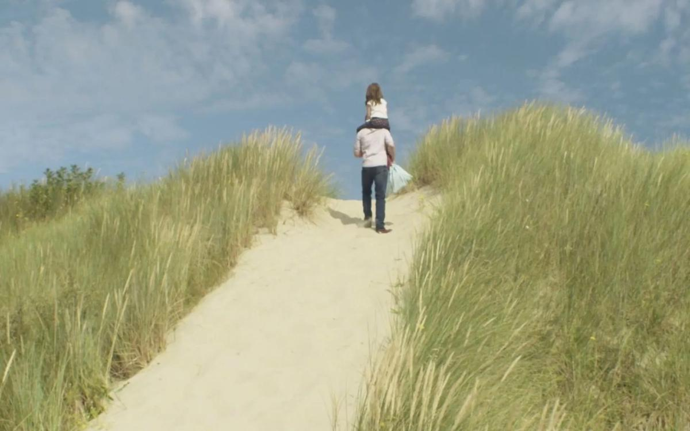

# «Щегол» и «Бабочка». На сентябрьском экране киноверсия бестселлера Донны Тартт и фильм, спродюсированный Скорсезе и братьями Дарденн

- **URL:** https://novayagazeta.ru/articles/2019/09/12/81942-schegol-i-babochka
- **Дата:** 2019-09-12
- **Автор:** Лариса Малюкова

## «Щегол» и «Бабочка»

## На сентябрьском экране киноверсия бестселлера Донны Тартт и фильм, спродюсированный Скорсезе и братьями Дарденн

Кадр из фильма «Слон и бабочка»Я это видел иначе

Экранизировать мировой бестселлер Донны Тартт, заслуживший Пулитцеровскую премию, — задача из трудно решаемых. Дело не в 800 страницах плотной и в то же время прозрачной трагической истории («Осторожно, смотрите, чтобы книга не упала вам на ногу», — предупреждали покупателей продавцы книжных магазинов). В симфоническом эпосе Тартт — и авантюрный роман, и роман воспитательный, и классический, и постмодернистский. Здесь диккенсовская обстоятельность растушевана литературным изяществом. А стройность композиции не исключает всплесков эмоции. И поэзии. И депрессии. И надежды.

Режиссер Джон Кроули («Бруклин») явно искал способ примагнитить зрителя. Он отказывается от хронологической последовательности в рассказе о трагедии тринадцатилетнего Тео, во время террористического акта в музее «Метрополитен» потерявшего маму. И исчезает та невидимая нить, которая связывает в романе едва ли не каждое событие, каждого персонажа с его прошлым.

Кадр из фильма «Щегол»Кроули старается не упустить из виду ключевые события романа: оглушенный взрывом Тео выбирается из-под развалин, по случайности прихватив с собой живописный шедевр — картину «Щегол» голландского художника Карела Фабрициуса, которая теперь для него — тайна, фетиш, икона. Вечный источник тревоги, страхов, боли и угрызений совести. А еще — связь с самой жизнью.

И вот Кроули вместе со сценаристом Питером Страуганом изобретательно крошат роман и собирают его заново. Мы не увидим самого взрыва в Музее искусств — только поседевшие от пепла и щебенки останки. А вся история прекрасной и опасной находки превращается в рваные, сбивчивые воспоминания героя.

Фильм «Щегол» — классический пример того, как при переносе на экран улетучивается воздух, пленительная, завораживающая жизнь, перемигивание слов и смыслов литературного произведения.

Хотя экран вроде бы старается воспроизвести основную интригу и даже уплотнить ее. Да и ловко придуманных сцен в фильме немало.

Психологический триллер, на который претендуют авторы, вязнет в разнообразных, порой эффектных подробностях. Читатели «Щегла» еще как-то сумеют за каждой из них увидеть шлейф магистральной истории. Зрители, не знакомые с романом, скорее всего, останутся в недоумении от скороговорки зигзагообразного сюжета, то несущегося во все тяжкие, то глубокомысленно зависающего.

Детские сцены Кроули удаются лучше всего. В самом Тео (Оакса Фигли) есть некий надлом и странность: за обликом вдумчивого очкастого ботаника прячется ребенок, травмированный взрывом всей жизни. Лучшие сцены разворачиваются на пустых пыльных окраинах Лас-Вегаса эпохи рецессии. Тихушник Тео находит брата по несчастью в товарище по диковатым играм — эксцентрике из Украины Борисе (Финн Вулфард), таком же избитом жизнью и ненормальным папашей подростке. Одна из ярких сцен: наглотавшиеся кислоты мальчишки болтаются на качелях на фоне темнеющего закатного неба. Бессмысленно хохочут и летят с обрыва детства, куда — неведомо.

Кадр из фильма «Щегол»Но нет, не удается режиссеру передать страстную привязанность Тео к антикварным предметам, хранящим тепло рук поколений, существующим «дольше нас», «даже когда нас не станет». Через эту привязанность Тео пытается восстановить связь с потерянной матерью. Через эту привязанность ищет возможность объяснить необъяснимое.

И все же главная неудача фильма — Энсел Элгорт в роли Теодора Деккера. Элгорт так и остался милым незамысловатым парнем из «Малыша на драйве». В нем нет тайны, неисцелимой травмы, магнетической связи с прошлым, превратившейся в маниакальную привязанность к исчезнувшему шедевру ХVII века.

Кадр из фильма «Щегол»Поддержите нашу работу!

1000 500 300 Нажимая кнопку «Стать соучастником», я принимаю условия и подтверждаю свое гражданство РФ

Если у вас есть вопросы, пишите [email protected] или звоните:+7 (929) 612-03-68

Николь Кидман, играющая аристократку миссис Барбур, давшую кров Тео и чувствующую в нем родственную душу, вынуждена существовать в каком-то искусственном пространстве. В ее характере мало объема, мало живого контекста, и поэтому актриса вынуждена изображать глубокомысленность и космическую эмпатию. В последней части режиссер включает экшн с бандитами и кражей картины. Скомканный криминальный сюжет выглядит бонусом к экзистенциальной драме.

А сам фильм напоминает мебель, которую в книге собирали антиквары, соединяя детали разных эпох, выставляя в магазине в качестве оригинала.

И все же читателям романа фильм смотреть рекомендуется: можно соотнести свои впечатления с экраном, возмутиться прочтению некоторых существенных моментов, порадоваться образному решению ряда ключевых и эпизодических сцен. Но главное, вспомнить удовольствие от прочтения книги и сказать себе: «Я это видел иначе».

Кадр из фильма «Щегол»А ты кто?

По идее, «Слон и бабочка» именно такое «доброе и светлое кино», о котором мечтают наши киноидеологи, но без привычного для подобного рода отечественных фильмов сиропа. Имя автора, бельгийского режиссера Амели ван Элбт вряд ли вам что-то скажет. Зато продюсерами ее скромного фильма стали Мартин Скорсезе и братья Дарденн. Скорсезе — страстный поклонник дебюта ван Элбт «Очертя голову». По его мнению, у нее редкий дар рассказать простую историю так, что сердце замирает.

Пятилетняя Эльза никак не доест, никак не выберется из почти игрушечного бассейна, няня не подходит к телефону — а дизайнеру Камилле срочно улетать на переговоры. Можно сойти с ума. Тут-то и является Антуан, ее бывший любовник … пропавший на пять лет: «Решил вот узнать, как ты». Единственно возможная реакция на подобный привет из прошлого — рассмеяться… Или попросить нежданного гостя посидеть с малышкой до прихода няни.

Кадр из фильма «Слон и бабочка»Кино, построенное исключительно на нюансах, — про узнавание, про важные, интимные моменты сближения малышки и ее заново обретенным отцом. Забежавший на пять минут человек обнаруживает не только дочь, но и начинает обнаруживать себя. «Я Эльза, а ты кто?» — спрашивает Эльза. Их первая встреча почти бессловесная, они присматриваются друг другу. Так животные, не теряя бдительности, друг друга обнюхивают, изучают. Как найти язык для общения этих людей с разных планет? Свистеть? Рисовать пальцами? Пробовать на вкус съедобные цветы? Гулять по песчаным дюнам? Читать сказку о дружбе Слона и Бабочки? Бабочка стучит крыльями в дом Слона, надо быть страшно чутким, чтобы расслышать этот звук.

Оригинальное название фильма «Смешной отец» («Drôle de père») В этой судьбоносной встрече взрослого и ребенка — именно взрослый выглядит смешным и инфантильным. Он учится быть взрослым.

Кадр из фильма «Слон и бабочка»В чем-то эта простая история близка стилю братьев Дарденн, которые участвовали в ее создании: «Большинство наших картин о том же: об интимных историях простых людей, исследующих жизнь и сталкивающихся с ситуациями, проверяющими их на прочность. В таких условиях наблюдение за человеком наиболее интересно — ведь от себя бежать некуда, и тут начинается самое главное».

«Джокер» и Полански делят львов

Парадоксы и сенсации Венецианского кинофестиваля

Бабочка обняла Слона: «Любишь ли ты меня хоть сколько-то?» В переводе на прозу жизни вопрос звучал примерно так: «Я Эльза. А ты кто?»

Поддержите нашу работу!

1000 500 300 Нажимая кнопку «Стать соучастником», я принимаю условия и подтверждаю свое гражданство РФ

Если у вас есть вопросы, пишите [email protected] или звоните:+7 (929) 612-03-68
