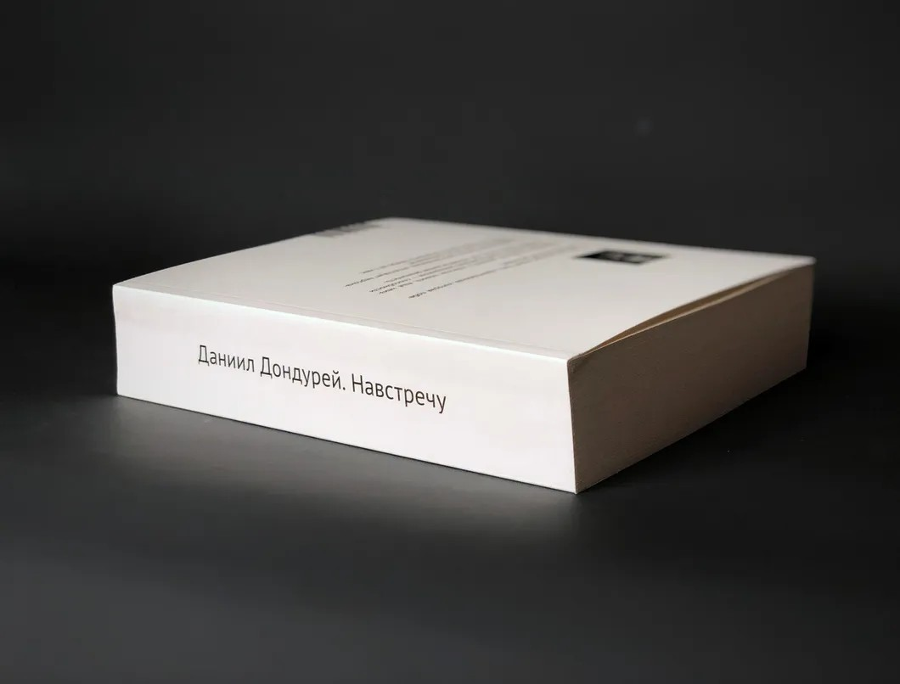

# «Создавайте собственные модели свободы». В издательстве «Подписные издания» вышла книга «Даниил Дондурей. Навстречу»

- **URL:** https://novayagazeta.ru/articles/2019/09/25/82104-sozdavayte-sobstvennye-modeli-svobody
- **Дата:** 2019-09-25
- **Автор:** Лариса Малюкова

## «Создавайте собственные модели свободы»

## В издательстве «Подписные издания» вышла книга «Даниил Дондурей. Навстречу»

Фото: philologist.livejournal.comЭто не мемуары. Не сборник статей — кинокритик Даниил Дондурей не слишком привечал сборники за безликость. Не скопище поминальных текстов. Скажем так, концептуальная книга как единый полифонический текст. В котором различимы голоса искусствоведов, философов, критиков, политологов, издателей, режиссеров, социологов, историков, архитекторов, филологов. Хор, составленный из солистов, не славословит, как принято в таких случаях. Напротив, во многих текстах сильный дискуссионный дух. Словно это продолжение разговора или даже спора с ДБ. Разговора темпераментного и вдумчивого, острого и уважительного, заставляющего сопереживать, заводиться с пол-оборота, возражать, расстраиваться, радоваться обретению новых смыслов. Сама книга и есть спор о насущном, сегодняшнем — какой не переставал вести с разными собеседниками Дондурей.

Александр и Андрей Архангельские, Дубинин, Кирилл Серебренников, Лев Рубинштейн, Виктор Мизиано, Виктор Ерофеев, Алексей Медведев, Ирина Чечел, Олег Зинцов, Георгий Никич, Антон Долин, Олег Березин, Никита Карцев…

А в центре — цитаты, короткие фрагменты из статей, высказывания Дондурея.

Своевременные. Емкие. Сверхактуальные. Об учащении скачков через «смутное время». О прошлом, которое у нас выполняет функцию «светлого будущего».

Об опасности решений большинства во всем мире. О голоде концептуальной рефлексии: «Нет понятий — и нет проблемной области, ими обозначаемой». О необходимости создать систему, которая бы противостояла рынку, хотя бы для того, чтобы развивать его. О скрытых возможностях, культурных кодах и оптическом устройст­ве культуры. Об изготовлении массовых представлений о происходящем: «Это самое мощное производство. Оно практически бесплатно для государства. Мы все оплачиваем эту работу собственным сознанием». О необходимости выйти за пределы опустошающего автоматизма, навязчивых правил и правильных действий.

Про Даниила Борисовича никак не получается думать в прошедшем времени. В журнале «Искусство кино», который он возглавлял почти четверть века, есть рубрика «Здесь и теперь». Он — здесь и теперь. По-прежнему призывает вызволить культуру из гетто отдельных спектаклей, книг, выставок — на простор ценностной всеобъемлющей системы, для проектирования жизни. Продолжает исследовать матрицу управления обществом, живучесть матричных культурных норм советской жизни. Объясняет, что, столкнувшись с гражданским обществом, российская власть предложила «собственный конструктор гибридной реальности, в которой внешние действия и высказывания человека находятся в отрыве от его главной — личной — жизни». Результат этой «строительной работы» — «абсолютное большинство граждан против гражданского общества».

Даниил Дондурей. Фото: РИА НовостиОн умел считывать скрытые значения политических жестов и раскрывал их опасность. Объяснял, например, что внедряемые новые законы или программа новейшей Культурной политики призваны «убить самостоятельность мышления», отбросить страну в дебри балалаечной архаики.

Одна из магистральных тем его размышлений — двоемыслие, двойная мораль, «которая регулирует через разрешения и запреты, что можно делать, а что нельзя». Лев Рубинштейн рассказывает, что именно о двоемыслии, проникшем нам в подкорку, Дондурей хотел написать книгу. Он имел на это право, потому что сам, обладая внутренней свободой, отстаивал свою отдельную от навязанной идеологии точку зрения. Сфера его интересов необозрима. От низовой культуры, которая деньгами пробивает себе дорогу до причин неактуальности лозунга «лишь бы не было войны». Как замечает Ирина Чечел: «Его заботы не знали границ, его звонки не прекращались».

В 80-е он был увлечен молодым искусством, которое стучалось в глухо-застегнутое пространство «советского искусства». Он один из инициаторов и главный устроитель революционной 17-й молодежной выставки — «объект желаний» огромного числа людей. Этот сногсшибательный «бардак с идеями» продемонстрировал невиданные горизонты молодежной художественной культуры. О том, как это было и какую роль сыграла эта выставка в становлении современного искусства, в книжке рассказывает Георгий Никич.

В 90-е, во времена обрушения прежних иерархий, он выдвигает и гипотезу о том, что прежняя идеологическая тотальность сменилась другой — медийной, и по силе воздействия они сопоставимы.

Сейчас это очевидно, а в те времена многие из нас питались иллюзиями на тему свободного от власти ТВ.

Поддержите нашу работу!

1000 500 300 Нажимая кнопку «Стать соучастником», я принимаю условия и подтверждаю свое гражданство РФ

Если у вас есть вопросы, пишите [email protected] или звоните:+7 (929) 612-03-68

В 2009-м они с Кириллом Серебренниковым в общем тексте предупреждают об опасности востребованности «человека суммы», потребляющего «культурку», и выдвигают необходимость «сложного человека». Он не называл «смысловиками» исключительно идеологов, внушающих нам правила действий и мыслей. Считал, что они повсюду. Мы сами незаметно для себя включаемся в их плодотворную работу. Вместо того чтобы делить мир на своих и чужих, надо этому противостоять. Как? «Создавать собственные модели свободы».

Он выстраивает альтернативную модель культуры. Об этой дондуреевской модели вспоминает Александр Архангельский. «В центре мировой цивилизации не личная воля политиков… не управленческие схемы и даже не деньги как таковые, сегодняшним миром правят смыслы и образы, именно они являются ключом к экономическим процессам, экологическим программам, даже к войнам, тем более к прогрессу».

При всей его скромности, демократизме мы ощущали масштаб личности. Юрий Норштейн сокрушается: «Вот кто должен был стать министром культуры! Представьте, как это было бы полезно и прекрасно для страны». Но, увы, управляемая политическая простота удобней сложности, а продвижение мифологического прошлого сегодня вытеснило осмысление потока времени.

«Щегол» и «Бабочка»

На сентябрьском экране киноверсия бестселлера Донны Тартт и фильм, спродюсированный Скорсезе и братьями Дарденн

Журнал «Искусство кино» эпохи Дондурея и есть река времени, летопись постсоветской России, но прежде всего свободный диалог разных культур. Самого ДБ трудно было «пришпилить» к одной профессии. Киновед, ратующий за выход творца за пределы «правильности, лояльности, предписаний? Политик? Философ? Социолог? Свободный человек с независимыми идеями.

Он формулировал сложные вещи простым ясным языком: «Архаика — самовоспроизводящаяся структура — достаточно ее завести, и затем она сама сделает всю работу». Провозгласив понятие «новая лояльность», замечает, как эта человеческая трансформация проникает во все сферы жизни, в частности, перебирается на экран.

Дондурей — из числа немногих интеллектуалов, которые пытались вести диалог с властью. Его не слышали. Он переживал, но продолжал разговаривать через СМИ с властью и обществом, порой игнорируя очевидное. Что идеи его не воспринимались, замалчивались, отвергались.

К чему «верхам» диалог? В какой-то момент он начал их раздражать. Его наказывали, журнал выбросили на улицу, его оскорбляли с высоких трибун, все реже приглашали выступать на различных «советах», форумах, коллегиях. Тогда он начал призывать единомышленников к интеллектуальному волонтерству, проектной работе, все еще надеясь что-то поменять в нашей жизни. Он сам был таким волонтером.

Среди его особенных качеств — способность к компромиссу и жесткая позиция.

Неслучайно из всех возможных жанров он отдавал предпочтение — круглому столу, полемике, мозговому штурму, когда мысль кристаллизуется на глазах, живет, развивается, изумляет.

«В его присутствии я чувствовал себя спокойнее, — говорил на презентации книги Лев Рубинштейн, — казалось, что все наладится, будет хорошо. Он создавал вокруг себя пространство мысли. А пространство строит человека». Казалось, он сам строил вокруг себя пространство нормальной достойной жизни. Не подавляя интеллектом, влиял на каждого, с кем встречался, мягко менял нас самим опытом общения. Не просто было соответствовать ему в беседах, которые мы вели. Это были разговоры «на вырост». Как точно заметил Олег Зинцов: «Он и сам так жил — в постоянном усилии». Чему бы хотелось научиться у Даниила Борисовича? Прежде всего — терпению и умению ждать. Его необъяснимой вере в несокрушимую силу мысли, которая рано или поздно будет услышана. Поэтому сближение его прогностических идей со временем уже происходит и будет происходить.

Книжка — острая, полемичная — в чем-то похожа на ДБ, обладающего парадоксальным мышлением, инструментарием познания происходящего. Книга, позволяющая приблизиться к горизонтам многомерной личности автора, философа, мыслителя. Понимающего свободу как поэзию, суждение — как свойство раздвигать рамки очевидного, дозволенного, отвергать отлитое в бронзе, изобретать смыслы. Книга, рожденная любовью, благодарностью, помогает расслышать голос Даниила Борисовича Дондурея в шуме сегодняшнего дня. Она — импульс для тех, кто готов продвинуться чуть дальше, осмотреться на местности, понять вектор общего движения. Книга — толчок для несуетных размышлений. Думаю, как бы она понравилась ДБ.

Скучаю.

Поддержите нашу работу!

1000 500 300 Нажимая кнопку «Стать соучастником», я принимаю условия и подтверждаю свое гражданство РФ

Если у вас есть вопросы, пишите [email protected] или звоните:+7 (929) 612-03-68
