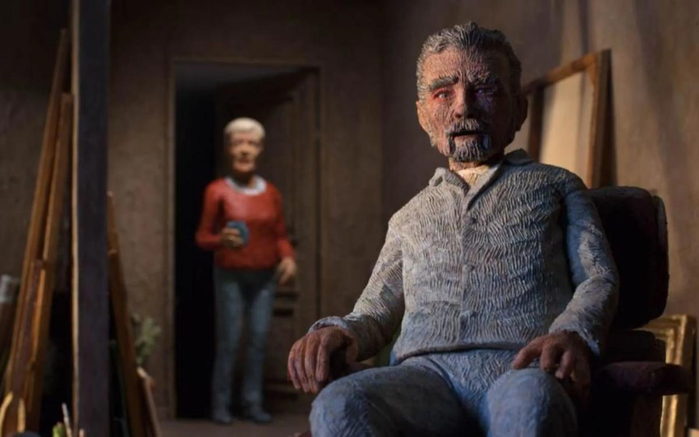

# «Отчего ты сделал меня злодеем?». КРОК-2019: от визуального анекдота — к философской трагедии

- **URL:** https://novayagazeta.ru/articles/2019/10/01/82188-otchego-ty-sdelal-menya-zlodeem
- **Дата:** 2019-10-01
- **Автор:** Лариса Малюкова

## «Отчего ты сделал меня злодеем?»

## КРОК-2019: от визуального анекдота — к философской трагедии

Кадр из фильма «Незабываемое»Если бы ученым будущего нужна была диаграмма самочувствия человечества на рубеже прошлого и нынешнего веков, я посоветовала бы им посмотреть лучшее анимационное кино, которое показывают на КРОКе, международном фестивале одушевленных фильмов. Тут тебе и диагноз, и страхи, и надежды, и травмы. И красота мира, и его уродство.

Как это получается? Порой кажется, что при всей самостоятельности, отдельности авторов, художников, проживающих на разных континентах, — некто сверху режиссирует, направляет, подбрасывает идеи, от которых зажигаются замыслы картин. В разные годы лейтмотивом конкурса были: тема суицида и одиночества, синдрома войны, проблемы взросления. Экран обживали попеременно странные клоуны, задумчивые вороны, навязчивые мухи, антропоморфные зайцы.

В этом году две линии неожиданно связались в узел, определив настроение смотра. Тема космоса и пуповины — психологической и совершенно натуральной, привязывающей вырастающих героев к матери, к дому.

В «Пуповине» Александра Бубнова лаконичный, почти воздушный дизайн. История слепой материнской любви, пришпиливающей сына пожизненно к юбке. Масса деталей: вот в сквере все с собачками, а юная мамаша — со своим малышом на коротком поводке. Подросток ревниво оттягивает маму от поклонника, вдвоем перед телевизором они вяжут, стареющая мамаша злобно оттягивает выросшего сына от девушки…

Пуповина превращается в удавку, и, когда мама умирает, постаревший сын страшно кричит: без разорванной удавки ему не выжить.

В фильме Константина Бронзита «Он не может жить без космоса» традиционная графика, выверенная до микрона. Мама приносит домой новорожденного космонавта — в латах, скафандре. Пятилетний малыш пытается задуть свечи на именинном пироге — от дыхания лишь запотеет стекло шлема, он парит ноги от простуды прямо в громоздких латах. Солнышко, которое он, к ужасу мамы, закручивает на качелях, — взрыв непреодолимой тайной страсти, тяготения ввысь. И сам дом с одиноким деревом и качелями у порога в какой-то момент превратится в межпланетный корабль, дрейфующий между звезд.

Кадр из фильма «Он не может жить без космоса»Динамическая кульминация — ссора с мамой: вырывая из ее рук фотографию исчезнувшего в космосе отца, герой натурально вырастает, едва помещаясь в кадре. Мама, напротив, становится маленькой, беспомощной.

При всем минимализме рисунка, это философское кино о предельной мечте, которая отрывает от земли и разрушает связи. О материнской любви, спасительной и убивающей.

Редкий в мире анимационного кинематографа жанр — философская трагедия. Вернувшийся из полета космонавт разоблачается. Ступает на траву, пальцами захватывая траву, замирая от тотального одиночества. Блудный сын возвращается домой: голый человек на полу в опустевшем доме с засохшими на подоконнике цветами в позе эмбриона. От фильма к фильму Константин Бронзит движется от визуального анекдота в сторону драмы, в тайну непостижимого.

Кадр из фильма «Он не может жить без космоса»«Смотрите, как он медленно меняет свой луч», — скажет Юрий Норштейн на традиционном «разборе полетов». Норштейн знает о чем говорит, его Акакий Акакиевич и есть космически одинокое существо, плывущее между землей и небом со звездными знаками-буквами. Кажется, режиссер исследует саму природу анимации, границы дозволенного. Ведь что такое изображение? «Пространство между космосом и небом».

В японском фильме «Mowb» Кадзуки Юхара само название символизирует «зеркальное отражение матери и дочери». Дочь связана с матерью пуповиной, через которую впитывает жизненную энергию. Одна жизнь поглощает, выпивает другую. По пуповине, как по тонкой нити, идет ребенок, взрослея, двигаясь между звезд. Пуповина связывает мать с предыдущими и еще не рожденными поколениями. Астронавт, потерявший работу, приходит в бюро трудоустройства в галстуке и скафандре. Что ему могут предложить? Жать кнопки и рычаги на детской карусели? Разносить попкорн в кинотеатре?

Кадр из фильма «Mowb»Французский фильм «Без гравитации» показывает, как тяжко в прозе земного притяжения отравленному «космосом как предчувствием».

Отношения родителей и детей, внутрисемейные проблемы на конкурсном экране — истории не столько про конфликты, сколько про способ осознания себя. Выросшая дочь (в фильме куклы как будто бы из папье-маше) в больничной палате умирающего отца вспоминает, каким порой жестким был он, и каким счастьем было маленькой птичкой замереть у него на груди («Дочь» Дарьи Кащеевой). И по-прежнему важно, что-то выяснить, убедить, договорить. От тревожного, непредсказуемого мира можно спастись в ностальгии по детству. Тайваньский малыш учится жить с мыслью, что любимый дедушка умер («Гонг»), страшная беда превращается для него в густой лес, сквозь который надо пробежать. В желтый цвет траура ворвется зеленый щенок — возможно, это душа дедушки явилась утешить ребенка. «Слушай, папа!» сестер Полиектовых по мотивам повести Ираклия Квирикадзе — внутренний монолог, решенный пластическими средствами. Продолжение разговора с отцом, который делает взрослее сына.

Поддержите нашу работу!

1000 500 300 Нажимая кнопку «Стать соучастником», я принимаю условия и подтверждаю свое гражданство РФ

Если у вас есть вопросы, пишите [email protected] или звоните:+7 (929) 612-03-68

Старушка — на стене «иконостас» из фотографий потомков, умершего мужа — нарезает колбаски, готовясь к празднику («Здравствуйте, родные» Александра Васильева). За ее окном творится что-то странное. Мужчине в военной форме вздумалось прилечь на лавочку. Мальчишка, гоняющий голубей, залезает на спинку скамейки. Невеста укладывается прямо на асфальте. Старушка со своей колбасой выползает из подъезда, и все странные персонажи, подозрительно похожие на ее родственников, превращаются в котов, которых она прикармливает.

«Незабываемое» Брюно Колле удостоено Гран-при. Куклы, словно вырезанные из дерева с исчерканными морщинами лицами. Муж, жена и Альцгеймер, вторгшийся третьим в отношения близких. Это он путает стареющего художника Луи, пряча от него перец со стола, подсовывая банан, о существовании которого Луи Дюрье забыл. Мистер Луис Дюрье полагает, что живет в 1965 году, хотя его пытаются в этом разубедить.

Колле удается невозможное: создать мир таким, каким его видит художник, пораженный деменцией. Мир, жирно написанный маслом, меняется, из него выпадают целые фрагменты, очевидное исчезает.

Доктор представляется длинноголовым кубическим зверьком. Предметы теряют материальность и свои имена. В зеркале вместо тебя кто-то чужой. Луи силится пробудить засыпающее сознание и сердце красками, заполняет ими исчезающее пространство. Он приглашает на танец то ли жену, то ли ее воздушное изображение, только что созданное. И этот чувственный танец, написанный пальцами вместо кистей, полон сочувствия.

Кадр из фильма «Незабываемое»Тема эмигрантов на анимационном экране преломляется в гротескные истории про своих и чужих. «Нидергария» — имя условной балканской страны, в которой пытается прижиться, понять правила существования витальная француженка. Иногородней никак не пробиться сквозь невидимые непроницаемые стены. Кино Капюсин Мюллер свободное, современное по дыханию, по киноязыку, по технике (микст компьютера с живописью на бумаге). Про трудности перевода иной культуры, которая в глазах иностранца сгущается в пространство дикого абсурда. На схожую тему фильм «Бумага или пластик». Эмигрант из последних сил приспосабливается к замысловатой реальности одной процветающей страны, но его закручивает, затягивает воронка латентной ксенофобии. Когда он вернется на родину, то и там окажется чужим.

Анимация — проверенный временем способ борьбы с агрессией. Очеловечивает, возвращает к себе. «Жук в муравейнике» Василия Ефремова — антиутопия. После уничтожения зоопарка звери выходят в уродский загаженный мир, где экскаваторы вгрызаются в мерзлую землю. Заводы закрыты, люди обнищали, смог не выветривается. История о дружбе бывшего сварщика с бывшим жителем зоопарка.

Человек дарит свою фотокарточку «на память» новому другу Слону и получает взамен его талисман — бирку с дверцы клетки с надписью «Слон».

«Отчего ты сделал меня злодеем?» — горестно кричит кукла режиссеру в фильме Корнелиуса Коха «Смерть режиссера». Но режиссер не ответит. Во время съемок фильма он умер. И значит, выбора нет. «Мы всего лишь куклы», — с горечью осознают свой приговор артисты-марионетки.

Об актуальных проблемах современная анимация говорит языком метафор. Пожар в картонном городе — сильный образ. Или плоть, которая начинает жить по своим абсурдистским законам. Из раненой ноги героя образуется кошмарная женщина Сюзанна, от которой никак не избавиться. Рифмой к экспрессионистскому пластилиновому эссе «Портрет Сюзанны» Изабеллы Плучиньска — графическая картина «Ее голова» Эммы Лоухивуори. Голова молодой женщины — кошка, гуляющая сама по себе. Острый рисунок цепляет и утаскивает на экран привычные выражения, превращая их в фантастические образы: «с головой не в ладу», «потерять голову», «поставить голову на место».

Среди отмеченных жюри фильмов — «Люби меня, бойся меня» Вероники Соломон. В роскошной пластилиновой хореографии открывается драма взаимоотношений артиста и зрителей. Желающий угодить толпе все время превращается в некое новое существо, постепенно теряя самого себя. В работе режиссеру помогали хореографы, которых она снимала на камеру.

Психология и политика, секс и тайные комплексы. Внятные истории и свободные визуальные фантазии, абсурд и анимадок. В темном зале теплохода «Константин Симонов», неторопливо идущего из Петербурга в Москву, вихрем неслась и замирала своя особая жизнь — концентрированный бульон, вобравший в себя тайну мира. Фильмы разного качества, таланта, собранные из сорока стран.

Игра в людей

О чем беспокоится современная анимация

Тридцать лет на плаву. Старейший в стране анимационный фестиваль — веселый, карнавальный, с одной стороны, с другой — сосредоточенный, размышляющий, — его президент Юрий Норштейн представляет как армаду кораблей.

Впрочем, сам по себе КРОК — произведение искусства, плывущее сквозь время. Из эпохи в эпоху. Это рукотворное произведение создавали все вместе: режиссеры и их фильмы, устроители фестиваля и участники.

Те, которых уже нет с нами, — Федор Хитрук или Фредерик Бак и дебютанты, которые наполняют ветром времени легкие паруса фестиваля и мировой анимации. Ковалев, Бронзит, Максимов, израильский режиссер Гиль Алькабец, автор китайской графической притчи «Шесть» Чэнь Си. И конечно, влюбленный в русскую анимацию меценат Франсуа Соломон, на протяжении десятилетий поддерживающий и фестиваль, и отдельные картины.

Плыви, КРОК!

Поддержите нашу работу!

1000 500 300 Нажимая кнопку «Стать соучастником», я принимаю условия и подтверждаю свое гражданство РФ

Если у вас есть вопросы, пишите [email protected] или звоните:+7 (929) 612-03-68
