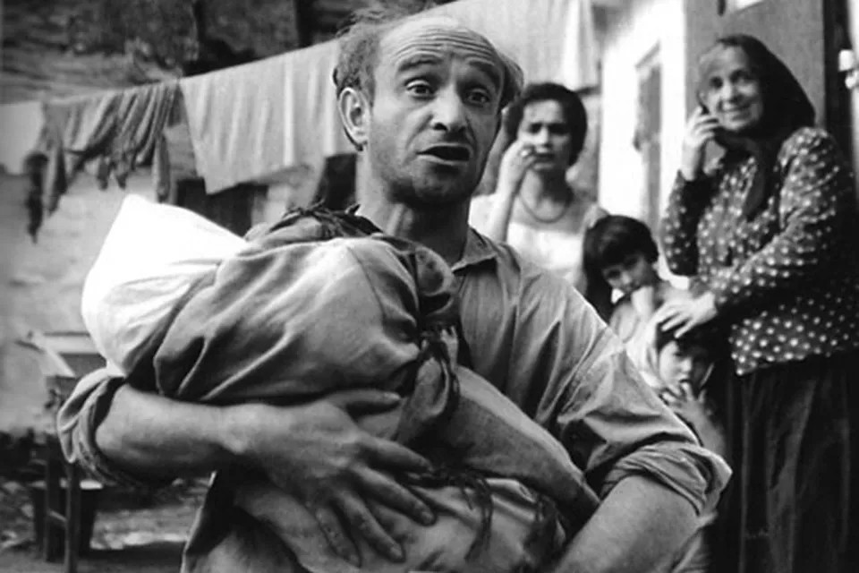

# Ролан Быков. 90. К юбилею актера и режиссера «Культура» показывает его незавершенный фильм «Портрет неизвестного солдата»

- **URL:** https://novayagazeta.ru/articles/2019/10/12/82326-rolan-bykov-90
- **Дата:** 2019-10-12
- **Автор:** Лариса Малюкова

## Ролан Быков. 90

## К юбилею актера и режиссера «Культура» показывает его незавершенный фильм «Портрет неизвестного солдата»

Ролан Быков в роли Ефима Магазанника. Кадр из фильма «Комиссар»Как им не тесно было в одном времени? Великим.

Режиссерам, даже выдающимся, с Быковым работалось неудобно. Он был избыточен, предлагал столько вариантов, придумывал, дописывал. Выплескивался из роли. Сказать: «Горшочек не вари!» — бесперспективно. Потому что он не играл. Превращался неостановимо, до последнего дубля.

Алексей Герман любил байку про то, как Быков предлагал посадить его командира партизанского отряда Локоткова на коня в болоте. Тарковский говорил, что после «Рублева», наверное, не будет его снимать. Ведь лихой с подползающим к горлу страхом танец и куплеты Скомороха:

«Как у барина-боярина, Все изжарено да сварено!» —

Поддержите нашу работу!

1000 500 300 Нажимая кнопку «Стать соучастником», я принимаю условия и подтверждаю свое гражданство РФ

Если у вас есть вопросы, пишите [email protected] или звоните:+7 (929) 612-03-68

сочинил сам. Или выход многодетного еврея Ефима Магазанника во двор. Как он ласково щурится на солнышке — чистая музыка. В этой роли — космический человеческий объем, вся многоцветная интонация «Комиссара».

Современник Гоголя — Быков

Карта памяти: ведущий рубрики Юрий Рост

Потому его и запрещали, «выравнивали», наказывали, отлучали. А он, как вода: нельзя в театре — в кино, нельзя в кино — в цирк, нельзя в режиссуре — снова играть.

Только инфаркты. И смерть. Сколько о нем написано, И как мало в сущности сказано.

К юбилею актера и режиссера канал «Культура» показывает последний незавершенный фильм Ролана Антоновича «Портрет неизвестного солдата».

Поддержите нашу работу!

1000 500 300 Нажимая кнопку «Стать соучастником», я принимаю условия и подтверждаю свое гражданство РФ

Если у вас есть вопросы, пишите [email protected] или звоните:+7 (929) 612-03-68
