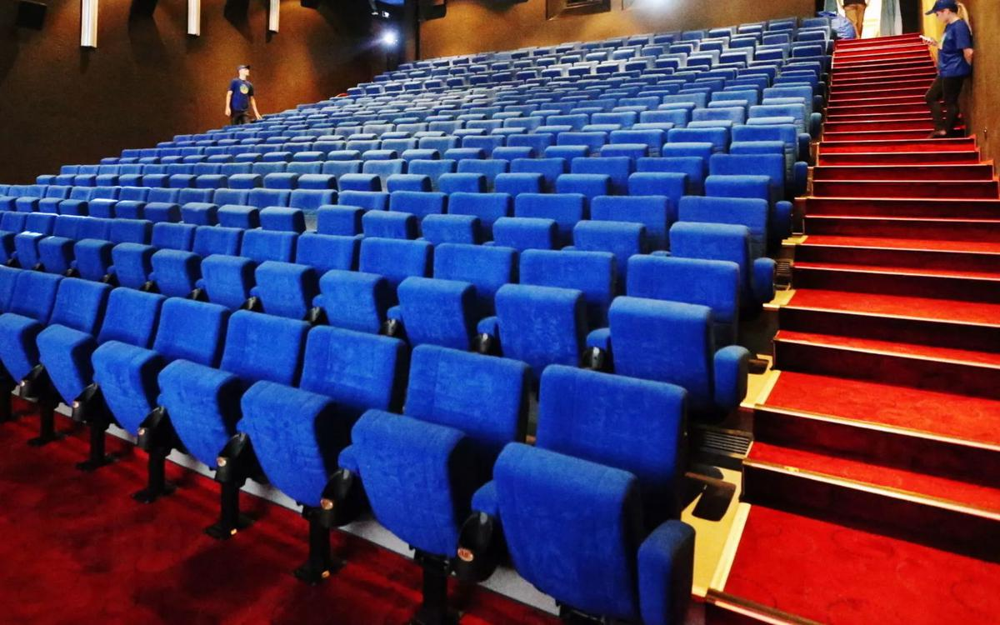

# Кино под присмотром. Минкульт впервые раскрыл траты государственных миллиардов на кино: главное

- **URL:** https://novayagazeta.ru/articles/2019/10/22/82456-kino-pod-prismotrom
- **Дата:** 2019-10-22
- **Автор:** Лариса Малюкова

## Кино под присмотром

## Минкульт впервые раскрыл траты государственных миллиардов на кино: главное

Фото: Дмитрий Серебряков/ТАССВ российской киноиндустрии произошло знаковое, если не сказать революционное событие. Обнародована информация о госфинансировании, сборах, долгах и убытках кинопроизводства и проката.Петр Саруханов / «Новая»Состоялась презентация открытой базы данных о государственной поддержке кинематографа по линии Минкультуры России и Фонда кино с 2015 года. Теперь любой человек может найти подробную информацию о кинопроектах, запущенных в производство в разные годы, о продюсере, режиссере, кинокомпании, бюджете, кассовых сборах, расходах на производство. И даже выяснить, сколько раз фильм был показан на экранах. Правда, пока система не учитывает траты на маркетинг, которые могут составлять львиную долю бюджета. И поэтому результаты окупаемости примерные. Известно, что цифры, потраченные на маркетинг, подчас скрываются. Ну как просчитать время рекламы на Первом, посвященное фильму компании «Дирекция кино» (продюсеры Эрнст и Максимов)?

Возможно, это дело будущего. Систему, которая начала работать с 21 октября на базе ЕАИС (Единая автоматизированная информационная система сведений о показах фильмов в кинозалах), с гордостью представил министр культуры Владимир Мединский. В базе уже содержится информация о 520 кинопроектах 255 компаний. Министр пообещал, что к 1 января в нее будут внесены практически все фильмы, получившие поддержку министерства культуры с 2008 года. И Фонда кино с 2010-го года. И это, безусловно, шаг к прозрачности отрасли, питающейся мифами.

Ежегодно государство выделяет на производство российских фильмов более 5 миллиардов рублей.

- Чемпионом по объему господдержки с 2015 года оказалась компания СТВ Сергея Сельянова. С 2015 года в прокат вышло 17 фильмов, на производство которых было выделено 165 млн рублей возвратных и 921,3 млн руб. безвозвратных средств. Общие сборы этих фильмов в прокате составили 5,84 млрд руб.
- На втором месте — студия «Тритэ» Никиты Михалкова, сосредоточившаяся на спортивных драмах и экшенах («Движение вверх», «Экипаж», «Тренер», в производстве «Чемпион мира») — получено 50 млн руб. возвратных и 992 млн руб. безвозвратных средств; 5,17 млрд руб. сборов).
- Тройку завершает Bazelevs Тимура Бекмамбетова (на десять фильмов было выделено 299 млн руб. возвратных и 740 млн руб. безвозвратных средств; 3,81 млрд руб. сборов).

Самым дорогим для налогоплательщиков в истории отечественного кино стал «Викинг» Андрея Кравчука о князе Владимире. С 2010–2015 гг. государством выделено на производство и прокат фильма 728 млн руб. Средства были получены и освоены «Дирекцией кино» и «Первым каналом».

Несмотря на движение к гласности, остается еще много темных пятен. Эксперты после презентации говорили, что надеются в перспективе узнать истинные цифры бюджетов картин, понять соотношение государственных инвестиций и частных средств, доли российского участия в проекте и зарубежного — хотя все они и сомневаются в возможности полной прозрачности киноиндустрии.

Обнародованы и фильмы, провалившиеся в прокате. Из 38 проектов, с 2015 года получивших по 100 миллионов рублей и более, — сборы четырнадцати ниже вложенных в них госсредств.

Среди не окупивших себя фильмов «Крымский мост. Сделано с любовью» от Тиграна Кеосаяна и Маргариты Симоньян. Получив 100 миллионов безвозвратных рублей, создатели патриотической комедии собрали в прокате чуть более 70 миллионов.

Мост наш и Берлускони — нам не чужой

«Крымский мост. Сделано с любовью» и «Лоро»: розовый ромком о героической стройке и беспросветная сатира на руководителя страны

Низкие сборы оказались у фильмов самых разных жанров, разного качества, уровня режиссуры. Среди них «Дуэлянт» Алексея Мизгирева и «Ледокол» Николая Хомерики. А еще приключенческий экшн «Семь пар нечистых» Кирилла Белевича, получивший 119 миллионов рублей, собрав кассу меньше 1 миллиона рублей (на «Кинопоиске» значатся 4.3 тысячи зрителей, пришедших на картину).

Интерес вызвала информация о проектах, на которые были выделены госсредства, но зрители фильмы так не увидели.

Кадр из фильма «Герой». Kinopoisk.ruЕсть список организаций, получивших господдержку, но не исполнивших перед государством своих обязательств. В нем 18 кинокомпаний, среди которых, к примеру, «Медиа Арт Студио», получившая 110 млн руб. возвратных и 30 млн руб. безвозвратных на создание фильма «Герой» с Дмитрием Биланом в главной роли (2016).

Общая сумма, не возвращенная должниками: 312 346 881 руб возвратных средств и 514 048 350 руб — невозвратных.

Недавно Владимир Мединский рассказал о 20 судебных разбирательствах Минкультуры с кинопроизводителями, которые не выполнили условия господдержки. По мнению министра, их присутствие в открытых черных списках мотивирует должников вернуть деньги в казну. И пока должники будут значиться в специальном реестре, их заявки на получение государственной поддержки не будут рассматривать.

Поддержите нашу работу!

1000 500 300 Нажимая кнопку «Стать соучастником», я принимаю условия и подтверждаю свое гражданство РФ

Если у вас есть вопросы, пишите [email protected] или звоните:+7 (929) 612-03-68

Кадр из фильма «Тайны Снежной королевы». Kinopoisk.ru Среди должников создатели «Тайны Снежной королевы» Натальи Бондарчук про ледяную красавицу, не способную чувствовать (возвратных средств — 20 000 руб. безвозвратных — 5 300 000 руб.) Фильм вышел с крайне низким рейтингом, на втором уик-энде заработав 169 270 руб. При бюджете 215 860 000 рублей! Пропал бесследно фильм «Тоска» по произведениям Чехова. ГУП «КИНОСТУДИЯ «ЧЕЧЕНФИЛЬМ» за — 21 850 000 безвозвратных руб., видимо, не отчиталась. Полиция возбудила уголовное дело о мошенничестве в отношении руководства и сотрудников киностудии. Но студия, не расплатившаяся с ведомством, была ликвидирована. Не отчитались и продюсеры долгомученического проекта «Елизавета и Клодиль» Сергея Соловьева, получившие 25 555 000 руб. безвозвратных средств. Эта воздушная история из Серебряного века еще в производстве. Картина «Лавстори» («Сны Севы Горелова») вроде бы и вышла прокат в 2017-ом, да еще с Александром Петровым в главной роли, но прошла бледной тенью, и за долг в общей сложности — 25 миллионов кинокомпания «25 этаж» не отчиталась. Много шумели в СМИ о блокбастере «Вещий Олег» компании ООО «НЕЙРОН». В прессе изначально заявляли недетский бюджет — 308 млн рублей, обещая насыщенный батальными сценами пеплум о князе руссов Олеге, который «может объединить разрозненные племена, создать мощное государство, способное дать отпор захватчикам всех мастей». Компания Нейрон осталась должна бюджету 20 миллионов. Причем на сайте Кинотеатр.ру бюджет — 9 000 000 руб. Премьера фильма «Вещий Олег» Клима Шипенко, который за это время снял «Текст» по Глуховскому, пока откладывается.

«Текст» под редакцией времени

На экранах — долгожданная экранизация бестселлера Дмитрия Глуховского

Судя по всему, представленная система будет дополняться и обновляться в ежедневном режиме. Она лишь набор данных: у любого зрителя, пользователя есть возможность создать свой рейтинг, свое видение российского кино. Тем более, что уже работает отдельное приложение, посвященное зрителю — его портрету в интерьере отечественного кинематографа. Со временем можно будет обнаружить, сколько именно зрителей пришли на один сеанс, как работает на успех или провал картины информация в СМИ, сарафанное радио, блоги.

По мнению экспертов, «открытая система» в какой-то степени поможет бороться с коррупцией. Это мнение поддерживает и министр культуры: «Новый сервис дисциплинирует и чиновников, и продюсеров, и членов экспертных советов». Он же признался, что сервис не вызвал энтузиазма на рынке.

Продюсеры не слишком довольны: «Ну не получил фильм фестивального успеха, не заработал денег. Будем считать, что это творческая неудача».

Наложение кадров

Почему кинодебют — горячая точка российского кинематографа

Слишком успешные продюсеры также опасаются, что в их кармане будет считать средства. Мединский сказал, что среди целей новой базы нет задачи «залезть в бизнес организаций». Там, к примеру, нет данных о гонорарах. Сервис создан в интересах налогоплательщиков. И он не только про деньги: «Важно, как было кино воспринято профессиональным сообществом, фестивалями. Как каталось в прокате. Будем учитывать данные просмотров на интернет-площадках». В любом случае, открытие нового сервиса — «движение вверх».

По словам Вячеслава Тельнова, исполнительного директора Фонда кино, инвестиции в проект составили около 3 млн руб. Как он отзовется на работе нашего кинорынка, покажет время.

Олег Березин,

генеральный директор студии «Невафильм»

Конечно, публикация данных о государственной финансовой поддержке кинопроектов — большой шаг вперед в обеспечении прозрачности использования средств налогоплательщиков, но даже беглый анализ этих данных порождает новые вопросы к механизмам выделения этих средств. С одной стороны, глядя на результаты лидеров рейтинга, задаюсь вопросом: почему система выделения безвозвратных средств не предусматривает возврата этих «безвозвратных» средств при получении проектом значительного результата?

Вот простая математика: лидер рейтинга проект «Движение вверх». 400 миллионов безвозвратного государственного финансирования, плюс 190,2 млн привлеченных средств. Результаты в кинопрокате — 2 943,5 млн рублей. От кассовых сборов примерно 40% возвращается продюсеру (50% забирают кинотеатры и 10% — дистрибьютор). Давайте добавим еще 10% расходов на выпуск фильма, рекламу и продвижение). Получаем чистый финансовый результат продюсера — 880 млн, из которых надо вернуть 190 млн привлеченных средств. Чистый доход продюсера — 690 миллионов рублей… живыми деньгами за два месяца проката. И теперь становится очевидным резон «больших госпродюсеров» зачищать рынок кинопоказа перед большим российским релизом — экономический интерес и никакой политики.

Если мы посмотрим в нижнюю часть списка, то возникнет вопрос — а как вообще эти проекты получили государственную поддержку, какая была экспертиза этих, в большинстве своем, беспомощных проектов? И тут на поверхность выходит еще одна, чудовищная проблема всей системы бюджетного финансирования в нашей стране.

Система не позволяет распределять средства разумным образом.

Не важно на что: на поддержку производства, на субсидирование кинотеатров в малых городах, на строительство дорог и на закупку томографов. Нельзя распределить деньги только достойным проектам, безусловно удовлетворяющим определенным критериям, при любом результате необходимо распределить всю сумму выделенную бюджетом (!) — вне зависимости от того, какого качества проекты в нижней части любого рейтинга. Отсюда и неэффективное расходование бюджетных средств, и порождение негатива в обществе к любым схемам распределения государственных средств, в первую очередь оцениваемым именно по такой нижней части рейтингов — там самые вопиющие примеры неэффективности господдержки.

Понятно, что решение о публикации возникло не от «хорошей жизни» — все чаще и чаще в обществе поднимается вопрос о прозрачности и эффективности финансовой государственной поддержки, и от активности общества в дальнейшем будет зависеть, сможем ли мы получить в конечном итоге более-менее эффективную систему государственной финансовой поддержки киноотрасли.

Поддержите нашу работу!

1000 500 300 Нажимая кнопку «Стать соучастником», я принимаю условия и подтверждаю свое гражданство РФ

Если у вас есть вопросы, пишите [email protected] или звоните:+7 (929) 612-03-68
