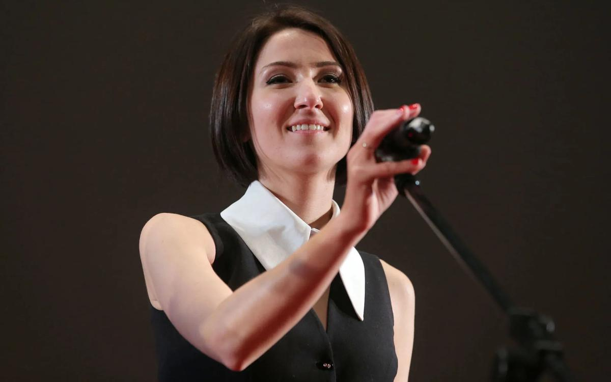

# Нигина Сайфуллаева: «Важно убрать ноту стыда, с которой мы живем». Почему режиссер решилась на сексуальную революцию в нашем бестелесном кино?

- **URL:** https://novayagazeta.ru/articles/2019/10/23/82464-nigina-sayfullaeva-vazhno-ubrat-notu-styda-s-kotoroy-my-zhivem
- **Дата:** 2019-10-23
- **Автор:** Лариса Малюкова

## Нигина Сайфуллаева: «Важно убрать ноту стыда, с которой мы живем»

## Почему режиссер решилась на сексуальную революцию в нашем бестелесном кино?

РИА НовостиФильм «Верность» талантливого режиссера Нигины Сайфуллаевой — размышления о чувственности, сфере скрытого, голосе тела. О том, насколько кризис человеческих отношений связан с сексом. О разрушении автоматизма семейной связи. Случайно увидев откровенные СМС в телефоне мужа-актера (Александр Паль), Лена (Евгения Громова) «прозревает»: муж — изменник. Мир начинает рушиться. Решив изменой наказать измену, героиня отправляется в путешествие в иррациональное, постепенно перетапливая ревность в травматичное чувство внутренней свободы. Начав с банальной завязки, режиссер и ее соавтор Любовь Мульменко ныряют в перепутанные переулки подсознания, сплавляя эротику с психодрамой.— Как же вы осмелились снять столь откровенное кино, когда опять табуированы многие темы, в том числе тема секса?

— Когда мы задумывали фильм, не думали ни о каких ограничениях. Хотелось поговорить на волнующие темы без оглядки на госполитику, на социальные обстоятельства, желание кому-то что-то доказать.

— Вы так пренебрежительны к государственной политике?

— Мне казалось, мы не нарушаем никаких правил. И я оказалась права, фильм выходит без каких-либо ограничений. Это означает, что не все еще запрещено.

Самое главное, не допустить цензуру снизу.

Возможно, мы пролезли через какой-то зазор, но все складывалось безболезненно. Да, 18+, но у него есть прокатное удостоверение.

— Не было со стороны продюсеров, чиновников никаких требований вырезать ту или иную сцену?

— Монтаж остался таким, каким я его задумала. На этапе сценария меня предупреждали о том, что вряд ли «это» выпустят на экран, тем более широкий. Я была морально готова: значит, фильм увидит лишь фестивальная аудитория. Нам повезло. Далеко не всем так везет.

— В той легендарной фразе про отсутствие секса в СССР было еще и заявление, что «мы категорически против этого!», но согласитесь, в нашем обществе не только у начальства существуют темы, которые обсуждать не принято.

— Это начинается с семьи, с культурного бэкграунда наших родителей, для которых телесность связана с чем-то запретным, грязным. О чем не стоит говорить вслух. Но тело есть у каждого, и с ним приходится как-то справляться.

Надеюсь, фильм (даже если и вызовет негативную реакцию) тем не менее поднимет вопросы задавленной чувственности, осознанности в отношениях, принятия тела.

Ведь открывается перспектива для обсуждений. Как с#MeToo, кстати. Жертвы насилия, узнав об опыте других людей, осознали, что с ними происходило. Пусть ругают. Но чтобы закидывать камнями фильм, придется подбирать какие-то слова, формулировать мысли. И это, мне кажется, движение к легализации «запретной зоны». В глубине души надеюсь, что зритель окажется гораздо свободнее, чем мы его привыкли воспринимать.

— У нас даже вокабуляра не хватает говорить про «это». В этом смысле фильм в какой-то мере просветительский.

— Не являясь исследованием, он провоцирует на диалог зрителей между собой. В этом его главная ценность. То есть будет работать не фильм, а сами зрители.

— Помню показ фильма на «Кинотавре». Помню растерянность ваших коллег: «Ну ладно, мы, люди просвещенные, можем обсуждать рискованные темы в спальне. Но не на публичном же показе?» Встречали такую реакцию?

— Мы ее уже встретили. Здесь двойственный момент: творческим людям неловко признаться в какой-то косности. Поэтому они не всегда признаются открыто. Остальным проще и себе, и другим «закрыть тему», у них однозначное негативное мнение.

— Увы, мы живем в эпоху «однозначных мнений» по любому поводу.

— Вместо того чтобы объяснять, доказывать, докапываться до смыслов — проще обругать. Все. Разговор закончен.

Особенно это присуще интернет-среде. Там реакция на трейлер на 99% негативная, и лишь 1% тех, кто готов хотя бы рассуждать или предположить, что не все так просто.

— В чем претензия?

— В пропаганде разврата… Зачем нам проститутки…

— В фильме предчувствие измены раскрепощает чувственность героини, взрывает изнутри ее мир. Но ведь не всегда можно выжить после подобного землетрясения?

— Мне было интересно не уничтожить ее или наказать, а вернуть к нормальной жизни. Показать, что кризис часто необходим для возвращения гармонии. Она выходит из своего приключения, безусловно, с потерями. Нельзя отменить содеянного: аморальное поведение нарушает границы другого человека. Но с моей точки зрения, ей был необходим этот этап. Она бы не смогла выбраться из затяжного тупика в отношениях с мужем без осознания себя.

— Разумеется, фильм шокирует зрителя. Но в нем есть свой подход к измене, ее истоков, последствий.

— Тут мы не просто фантазировали, но изучали вопрос с психологами, сексологами. При этом совершенно не хочется, чтобы это высказывание было воспринято как руководство к действию. У кино другой принцип воздействия. Каждый сам оценивает свои риски в отношениях с партнером. Далеко не все могут простить измену, и первый же опыт рушит отношения. Но есть пары, для которых измена — двигатель в пути друг к другу. Психотерапевты советуют: чтобы пережить измену, развить отношения, необходимо проговорить причины неверности. В нашем фильме герой Александра Паля действует по неправильной схеме: выпытывает подробности, «как именно все было». И выяснилось — это классическое поведение отчаявшегося партнера. Он не спрашивает: «Почему?» Но мы же и не сочиняли инструкцию, «как надо» или «как улучшить отношения». Хотелось обратить внимание зрителя на проблемные точки в браке, в себе, чтобы он в той или иной степени узнал себя, даже если совсем не похож на героев. И когда нас обвиняют в пропаганде и оправдании измены … Эта задача перед нами не стояла.

Кадр из фильма— У актеров были к вам в этом смысле вопросы?

— Мы подробно разбирали всю историю, спорили и находили вместе решения. Актеру необходимо полностью понимать, почему его персонаж именно так поступает, даже если в жизни действовал бы совершенно иначе. Поиск мотивации был самым интересным, эмоциональным этапом создания фильма.

Поддержите нашу работу!

1000 500 300 Нажимая кнопку «Стать соучастником», я принимаю условия и подтверждаю свое гражданство РФ

Если у вас есть вопросы, пишите [email protected] или звоните:+7 (929) 612-03-68

— А что привнесли в свои характеры Евгения Громова и Александр Паль, сыгравшие, на мой взгляд, замечательно.

— Существенных изменений не было, Саша и Женя гармонично вписались в материал. Мне не близок способ «роль как преодоление», требующая от актера ломки. Здесь подобраны актеры, близкие своим персонажам. Не биографически, а по психотипу. Хотелось показать противоречивую, часто иррациональную территорию отношений. И в жизни часто думаешь одно, делаешь другое. Полагаешь, что по одной причине — в итоге выясняется, что тобой двигали бессознательные механизмы. Вот эта вулканическая зона — самая интересная. Актерам такой сложный рисунок роли доставляет удовольствие, так как им приходится работать не только с первым и вторым планом эмоций, но и с третьим. С Женей мы иногда хохотали — насколько многоуровневая у нее задача в действии: «взяла стакан воды и посмотрела ему вслед».

— Вы затронули в фильме еще одну тему. Если мы себя не очень хорошо знаем, как же ничтожно мало знаем друг о друге, даже если спим в одной постели.

— Жизнь учит, что прежде чем разбираться «в отношениях», нам придется разобраться в себе. Проблема непроговоренности стоит не только между партнерами.

Отношения разрушаются во взаимных претензиях, потому что ты и сам не можешь объяснить себе, чего хочешь. А в таком запутанном состоянии только и остается, что обвинять.

— Мне кажется, это отчасти связано с нашим менталитетом. Мы же знаем по кино, как американцы в ситуации конфликта предлагают: «Давай поговорим об этом». У нас же можно взять стул… напиться… перестать разговаривать… повеситься, в конце концов.

— Согласна, но и до нас докатилась психотерапевтическая волна. Уверена, что психотерапия поможет в какой-то мере людям стать адекватнее, научит формулировать чувства и работать с ними.

— Вроде бы и вы с помощью специалиста изживали в себе ревность. Кино — своего рода психотерапия. Работу над фильмом можно рассматривать как способ не только обнародовать проблемы, но подступиться к их решениям?

— Вы правы, кино — действительно психотерапия. Мне, например, не подходит психотерапевт, с которым нужно работать долго, когда ты пассивный участник. Не моя динамика. В кино ты деятельно формулируешь задачи, ищешь их решение.

Слушайте, сейчас все звучит так, будто я снимаю кино, копируя свою жизнь. Это не так. Драматургия жизни устроена не киношно. Да и сценарист тогда зачем? Садись и записывай, как было. Вступая в зону фантазий, получаешь возможность прожить альтернативную жизнь как свою. Кино занимает в моей жизни колоссальное время, и надо найти железную мотивацию, чтобы не остыть, двигать эту историю несколько лет.

С этим фильмом все началось с «ревности» (таким было и рабочее название). С чувства, а не с конкретного эпизода моей биографии. По ходу работы над сценарием, замысел начал серьезно трансформироваться. Ревность перестала удерживать мое внимание, и мы с Любой Мульменко стали развивать придаточную линию с сексуальной самоидентификацией, которая уже равно волновала нас обеих.

— Вы выкладывались, делясь своими страхами, проблемами, и это дало фильму ощущение нежности. Вы рассказывали, как рос фильм вместе с вашим ребенком. Когда вы его ждали — кино сочинялось. Потом он родился, начались съемки. Сейчас он пошел — и фильм выходит на экраны.

— Иронично запараллелились долгожданные линии жизни. Появление ребенка захватывает маму целиком. Поэтому фильм подвинулся, уступив место мальчику. Но пришли госденьги, и мы с младенцем договорились делить время.

Уверена, нежность, про которую вы говорите, и осознание какой-то божественной красоты человека, он, безусловно, мне передал. Вот вам и ответ на вопрос: чем отличается женская режиссура от мужской.

— Если разница вообще существует, то в чем она?

— Думаю, это связано с более глубоким погружением в женский характер. Впрочем, эта формула разваливается, как только вспоминаем прекрасные фильмы авторов-мужчин, где глубокие, интересные героини. И все же именно женщинам чаще удается сделать женский персонаж живым, объемным, тонким, противоречивым.

— Интимные сцены в фильме сняты с тактом. Снимать секс без вульгарности невероятно сложно. С какими трудностями вы столкнулись на площадке? Говорят, чтобы снять подобное органично, вся съемочная группа должна раздеться. Необходима какая-то особая степень доверия?

— Я старалась изначально не подавать это как проблему. У меня нет стресса от мысли: «как мне сейчас всех уговорить». И мое естественное расположение заряжает и группу, и актеров: мы не говорим о чем-то постыдном, жутком. И нам не предстоит испытание. Важно убрать эту интонацию «неприличного», «кошмара», ноту стыда, с которой мы живем. Мы провели с актерами много времени, прежде чем начать снимать. Поэтому к моменту съемок сцены секса перестали отличаться от других сцен. Не пришлось прибегать к уловкам: поить актеров или обманывать, манипулировать ими или раздевать группу… В общем, нормальный кинопроцесс. Я вижу нервозность актеров тогда, когда они не понимают, зачем они это делают. Это касается не только эротических сцен, но и драматических.

Кадр из фильма— Еще интересная тема — секс и политика. Наша власть играет в мачизм. Киссинджер говорил, что женщину более всего возбуждает наличие у мужчины власти.

— Не стану спорить: привлекательность мужчины, облаченного властью, увеличивает его сексуальность. Объясняю это не алчностью женщин, а базовой установкой на безопасность. Достаточно ли самец силен, чтобы заботиться обо мне и ребенке во время беременности и недееспособном периоде? Это отнюдь не бессознательный механизм. При этом далеко не всегда мужчины тянутся к властным и успешным руководительницам. Это скорее пугает. В политике у нас мало женщин, их не допускают, хотя по статистике огромное количество руководящих постов занимают женщины. Значит, они прекрасно справляются с этими задачами.

— Ваш фильм в какой-то степени идет против волны#MeToo. Женя — не только не жертва, она сама готова рассматривать мужчин в качестве сексуальных партнеров.

—#MeToo — другая тема.

Она связана с насилием одного человека над другим. В фильме герои насилуют себя сами — и только психологически.

Я бы не хотела такого подтекста, так как сочувствую жертвам насилия и хотела бы поддерживать их, а не обличать. Также ощущаю несправедливым обвинять фильм в объективации женщины. Как вы правильно заметили, она сама принимает все решения, а не является объектом желания. Так что вполне себе стройная феминистская логика. И в этом контексте фильм дискомфортен для мужчины.

— Я это заметила на «Кинотавре».

— При этом парадоксальным образом фильм поддержали прежде всего мужчины. Возможно потому, что на руководящих постах у нас мужчины. Продюсеры, прокатчики, «Газпроммедиа», главы студий…

— Почему вы, успешный режиссер, мать прекрасного Ивана, рискуя карьерой, выходите к администрации президента с плакатом в защиту фигурантов «московского дела»?

— Когда мы не знаем о том, что происходит, оставаться в стороне и ничего не предпринимать просто… Но сегодня невозможно сидеть с закрытыми глазами. Мы увидели такое количество несправедливых приговоров, нечестных арестов, что ноги сами пошли. Когда я примеряю это на себя, на своего мужа, на своего ребенка, то меня охватывает ужас. Не знаю, что такое осознанный протест. Мне просто страшно, что такое может произойти с любым, в том числе с моими близкими. Мама, свекровь волнуются, звонят: «Сердце кровью обливается, когда мы тебя там видим». Я их понимаю. Но точно знаю: «Промолчу сейчас, и если произойдет нечто подобное со мной, с моим мужем, ребенком, с вами — другие тоже промолчат». В одиночку ничего не решить. Я хочу, чтобы мы друг друга защищали: только в этом объединении — рука к руке, голос к голосу — нас можно хоть как-то услышать.

Поддержите нашу работу!

1000 500 300 Нажимая кнопку «Стать соучастником», я принимаю условия и подтверждаю свое гражданство РФ

Если у вас есть вопросы, пишите [email protected] или звоните:+7 (929) 612-03-68
