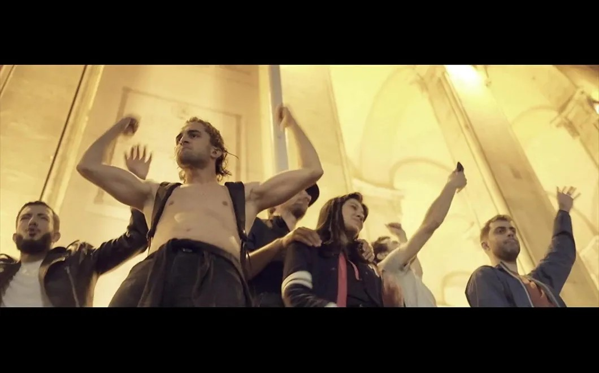

# Танцуй революцию! На российские экраны выходит кино о молодежных демонстрациях в Грузии «Рейв у парламента»

- **URL:** https://novayagazeta.ru/articles/2019/10/28/82532-tantsuy-revolyutsiyu
- **Дата:** 2019-10-28
- **Автор:** Лариса Малюкова

## Танцуй революцию!

## На российские экраны выходит кино о молодежных демонстрациях в Грузии «Рейв у парламента»

Кадр из фильма «Рейв у парламента»Все началось 12 мая 2018 года. Полиция организовала рейды в двух тбилисских клубах, хватали и увозили всех подряд, в том числе и из клуба «Бассиани», который сравнивают с культовым берлинским Berghain. В техно-клубе «Бассиани» формировалась новая генерация. Вторжение силовиков превратило клуб в символ неповиновения перед лицом государства. И люди со всего города потекли на площадь к парламенту на улице Руставели.

Авторы фильма Raving Riotвнимательно рассматривают новое поколение, для которого электронная музыка и свобода оказались тождественными понятиями. В фильме много героев. Среди них музыкант, сочинитель техно-музыки, осужден на девять лет за наркотики, отсидел пять. Ему разрешили на компьютере писать свою музыку за решеткой. Но даже музыка не заменит ему возможности видеть, как растет его дочь, слушать, как шумят деревья, разговаривать с друзьями о самом важном.

И вот толпа в свете вечерних фонарей. Волнующееся, непредсказуемое море людей, возмущенных арестами без причины. Они требуют отставки министра внутренних дел и премьер-министра: «Если уйдем домой, они поймут собственную безнаказанность!» И кому-то приходит простая до гениальности идея — врубить техно.

Начинается рейв и самый необычный митинг в истории. Парламент замер. А молодые люди не расходятся, они танцуют революцию: «Мы танцуем вместе. Мы боремся вместе!»

Площадь танцевала, а параллельно шли переговоры с правительственными чинами.

Кадр из фильма «Рейв у парламента»Они родились в начале 90-х, когда в Грузии провозгласили независимость. Они росли в отсутствие электричества, гуляли по гулким пустым улицам (с общественным транспортом были проблемы). Они слушали техно, рассуждали о происходящем в стране, мечтали под психоделику о будущем, танцевали в скверах и клубах. Они выросли с войной, поэтому каждый свой день танцевали как последний. Они похожи на поколение цветов. Многие курят траву. И ищут свой способ быть счастливыми.

Официальные источники назвали майские события революцией наркоманов и секс-меньшинств. Тут же подхватились националисты, вышли на площадь, окружили демонстрантов. Если бы не полиция…

Но площадь не расходилась. Тогда к демонстрантам вышел глава МВД, призвал к мирному разрешению конфликта и сказал невозможные для российских чиновников слова: «Вы знаете, что каждый сотрудник полиции заботился о вас на протяжении этого времени. И если мы не выполним свои обещания, данные вашим представителям, снова можете собраться в свободном городе свободной страны, чтобы танцевать и слушать музыку. Вы — будущее нации этой страны. И каждый, кто вышел на улицы в эти дни, важен для будущего нашей страны!»

На первый взгляд, вроде бы все здорово — арестованных отпустили. «Через две недели открылись все клубы. Мы испытали чувство общности, единства». Употребление и хранение марихуаны декриминализовали. Но у многих осталось чувство разочарования.

«Наш протест превратили в спектакль, а нас отправили домой». «Нас все стали критиковать, за то, что мы испугались, что аплодировали министру».

«Мы выиграли или проиграли?» «Что такое Грузия? Борьба, танцы, еда». «Все было круто. Классный рейв, теперь даже «Би-Би-Си» знает, что Грузия существует».

Кадр из фильма «Рейв у парламента»Майский рейв — всего лишь частный случай в серии важных протестов. Массовый протест перед парламентом Грузии в 2011-м, митинги против правительства Саакашвили, и наконец, протесты 1989-го за независимость Грузии, определившие судьбу страны.

Raving Riot — портрет молодежной среды в политическом контексте, история взросления и осознания себя как поколения. Да, Грузия — это они. Если понадобится, они снова выйдут и будут требовать от политиков решения самых важных вопросов, в том числе о целостности страны — сегодня разорванной.

Фильм Степана Поливанова пытается размышлять о двух странах, двух разорванных культурах в контексте сегодняшней Грузии. Не всегда убедительно и последовательно, не разбирая причин разрыва между консервативными и прогрессивными силами. Но не политика интересует авторов. Им интересно, отчего большинство населения по-прежнему думает, что настоящий грузин должен петь народные песни и танцевать лезгинку, а курящая девушка в короткой юбке, танцующая до утра в ночном клубе, — проститутка. В третьей части фильма сталкиваемся с людьми из глубинки, где традиции отзываются многовековым эхом.

Деревенская бабуля говорит, что у нынешней молодежи вообще нет совести. Как они живут? Они умеют работать? На что они надеются?

Режиссерский дебют Степана Поливанова, снятый вместе со студией Stereotactic, — не столько расследование, сколько портрет времени, атмосферы, настроений. Это импрессионистский пейзаж, выхваченный из плоти реальности. В нем возбуждение разгоряченной толпы, геометрия телодвижений, поз, странных послеполуночных настроений. Медитативные воспоминания, философский треп, размышления участников рейва — лихорадочная радость свежего восприятия действительности. По настроению фильм напоминает картину Михала Марчака о варшавской молодежи «Все эти бессонные ночи».

Поддержите нашу работу!

1000 500 300 Нажимая кнопку «Стать соучастником», я принимаю условия и подтверждаю свое гражданство РФ

Если у вас есть вопросы, пишите [email protected] или звоните:+7 (929) 612-03-68

И вот один из многочисленных героев фильма с горечью признается: по существу, их протест ни к чему не привел. Но он вновь и вновь возвращается мысленно к тем двум дням — самым ярким в его жизни. Вспоминает, как поливал водой танцующих, пылающих гневом и надеждами. Вновь и вновь переживает освещенный желтыми фонарями миг радостной свободы, который так быстро погас. Мечтает о вселенском рейве.

Кстати, схожий случай с «Бассиани» произошел в Москве — в августе 2017-го в клубе Rabitza. Полиция внезапно захватила клуб, так же грубо и жестоко хватали всех подряд. Никакой реакции — без всякого сопротивления Rabitza закрылась.

Все «рейверы» стояли у парламента

Анна Саруханова

Продюсер фильма

— В начале не было ни поддержки студии Stereotactic, ни определенного плана, были ребята — Степа Поливанов, Арина Носкова и Ида Иванова, которые хотели снимать док в Тбилиси. Потом внезапно случился этот протест, и начала определяться тема. А потом, когда нужно было брать интервью у одного из активистов, первое интервью для фильма, я поняла, что хочу помочь в его создании. Чтобы в нем был взгляд изнутри, были люди, которые действительно представляют сейчас страну.

Умные, вдохновенные, противоречивые, с разными точками зрения, пережившие опыт 90-х, видевшие войну в Абхазии, и совсем юные, те, которым невозможно сказать: «Не высовывайся, а то может быть хуже; вспомни, как было тогда». Не может — они знают, как есть в Америке, в Европе, их не запугать воспоминаниями о темном времени развала СССР, доставшимся нам всем в наследство. Этот протест при всей противоречивости показал, что молодежь готова отстаивать свои права.

Кадр из фильма «Рейв у парламента»Эта молодежь и есть главный герой фильма, и я рада, что Степан, режиссер фильма, так хорошо почувствовал эти противоречия, метания. Когда ты хочешь совершить революцию, но не очень знаешь, как это делать. Конечно, этот фильм не про то, что рейверы вышли протестовать за право танцевать в клубах.

Этот случай — просто маленькая точка, как говорит герой фильма Гоги Хоштария, характеризующий состояние умов, готовых противостоять несправедливости.

Показательно, как по-разному фильм воспринимается в двух странах — я была на премьере в Москве, и там все были так воодушевлены: «О, перед ними извинился министр внутренних дел! О, их охраняла полиция!» И это несмотря на то, что в конце показано: ребята отнюдь не довольны поведением власти, они чувствуют какой-то спектакль с ее стороны, чувствуют, что их просто обманули, использовали, что сами фашисты и националисты могли быть куплены правительством.

Неужели российским протестующим только и нужно, чтобы перед ними извинился какой-то министр и отвез на автобусах спать домой?

В Грузии фильм пока нигде не был показан публично. Несколько раз в неделю я встречаю людей, которые спрашивают о нем, приходится объяснять, что компания российская, и национальная премьера в Москве не противоречит участию в крупных фестивалях, участию, которого мы все ждем. Но при этом, конечно, хочется показать его в Грузии. В Тбилиси я показала его только нескольким участникам — главным героям. И надо сказать, что реакция была совсем другая.

Кадр из фильма «Рейв у парламента»Российскому зрителю не хватает контекста — этот самый министр внутренних дел (Гиорги Гахария), развозивший всех на автобусах, год спустя натворил таких дел, после которых обычно подают в отставку или, возможно, идут под суд. Разгон митинга 20 июня, с выбиванием глаз резиновыми пулями с близкого расстояния, со слезоточивым газом, — митинга, спровоцировавшего двухмесячный протест у здания парламента в Тбилиси, — это фактически ответственность того самого извинившегося министра. Еще и поэтому, грузинские зрители говорят, как хорошо он показан, этот чертик из табакерки, якобы спасший молодежь от «кровавых» националистов.

«Они задели наше гражданское самолюбие»

Почему тысячи грузин вышли к парламенту и почему жесткий разгон не остановит их. Репортаж из Тбилиси

На протестах 20 июня были все герои фильма, опять вместе. Этот факт еще раз показывает, что фильм не про клубы, а про людей, готовых протестовать и бороться за будущее. После кровавого разгона задержали десятки человек. На следующий день на площадь пришло чуть ли не вдвое больше, кто-то уже с противогазами, кто-то с защитными масками. Все «рейверы», что были в фильме, стояли у парламента, а многие принимали активное участие в организации митинга. Вы приходите на протест каждый день после работы и стоите там до полдвенадцатого ночи не потому, что вам не дают танцевать в клубах или вы хотите освободить тех, кого в них задержали.

Приходите потому, что каждый день граница вашего государства передвигается враждующим государством, а правительство не предпринимает никаких мер по решению этого вопроса.

«Ну что, мы вас всех уже избили?»

Что на самом деле происходит в Грузии и как изменилось отношение к туристам из России

Мне писали из Москвы: «Неужели это все потому, что кто-то из политиков сел не в то кресло?» Нет, все потому, что у героев фильма есть определенная позиция: Южная Осетия и Абхазия — это Грузия, никто не имеет права претендовать на территориальную целостность, и если правительство не выражает мнение народа, против такого правительства нужно бороться. Это четкая позиция. Та самая молодежь, стремящаяся к эпикурейству, возлежащая на траве в парке, в один момент оказывается на площади перед парламентом. Где стар и млад, все слои общества, вне зависимости от экономического, общественного или политического положения. И так два месяца. После них люди потеряли веру в то, что мирный протест на площади может что-то поменять. Но через год выборы, и никто не собирается забывать того, что случилось. Министр, кстати, стал премьер-министром. Как будто назло протестующим. Протест пока заморожен. Нужно пережить эту зиму. Но как говорится, еще не вечер.

Поддержите нашу работу!

1000 500 300 Нажимая кнопку «Стать соучастником», я принимаю условия и подтверждаю свое гражданство РФ

Если у вас есть вопросы, пишите [email protected] или звоните:+7 (929) 612-03-68
