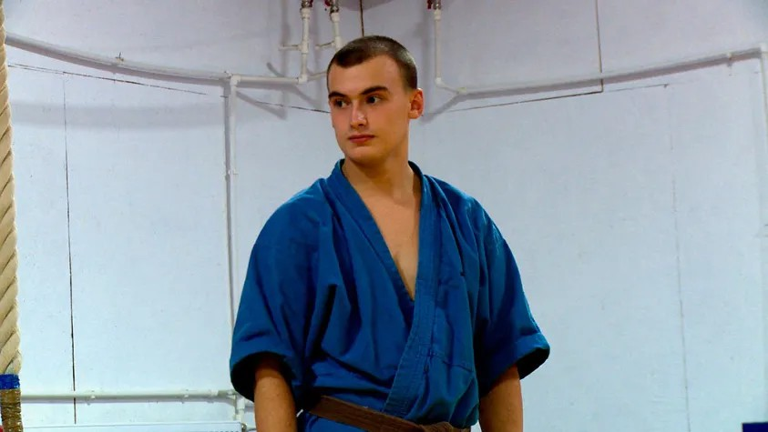

# Стриптиз, война и кино. Гид «Новой» по «Артдокфесту», который открывается 5 декабря в Москве и Петербурге

- **URL:** https://novayagazeta.ru/articles/2019/11/22/82820-striptiz-voyna-i-kino
- **Дата:** 2019-11-22
- **Автор:** Лариса Малюкова

## Стриптиз, война и кино

## Гид «Новой» по «Артдокфесту», который открывается 5 декабря в Москве и Петербурге

## «Государственные похороны»

Как похороны тирана были превращены в циклопическое шоу. Жанр — неожиданный. Колыбельная. Под музыку Блантера и стихи Исаковского страна баюкает свой уснувший народ и его отца-кровопийцу. О смерти неумирающей эпохи. О траурной черте, которую переступают сотни тысяч горюющих в Колонном зале, миллионы, заколдованные и накачанные пропагандой, со страхом сквозь слезы всматривающиеся в будущее. «Государственные похороны» — исследование феномена взаимосвязи террора и иллюзии; непостижимой, исступленной, романтизированной привязанности к тирану; механизма мифотворчества. Готовности коллективного подсознания включиться в идеологический заказ.

Фильм основан на уникальных архивных материалах, снятых в СССР 5–9 марта 1953 года. Мировая премьера состоялась в Венеции.

## «Космические собаки»

Лайка была первым живым существом, отправившимся в космос. Авторы обращаются к легенде, рассказывающей о бродящем по Москве призраке погибшей в воздухе собаки. Бегут по ночному городу две обшарпанные умные дворняги — потомки звездной лайки. Живут своей непростой жизнью на окраине большого города рядом с забегаловкой. А хроника переносит нас в пятидесятые: из предков бездомных псов выбирают «космонавтов». Бесстрашных и безропотных бродячих псов готовят к подвигу во благо старшего брата. Проводят над ними жестокие эксперименты, забрасывают в космос. Долетят единицы. Выживших будут демонстрировать прессе. В фильме потрясающие по эмоциональности съемки: монтаж нынешних «собачьих дней» и «космической эры». А закончится все в раю с напрасной песней соловья, потому что люди давно перепутали рай с адом.

## «Бессмертный»

Один из лучших фильмов последнего времени. Портрет страны, вмерзшей в прошлое. Мы — в заполярном городе Апатиты, выстроенном для нужд ГУЛАГа. Здесь добывали руду. Здесь жили и живут в адских бараках и обветшалых блочных постройках с черными тюремными коридорами, завешанными проводами. Зато с большой мечтой о великом… прошлом. Мальчики из патриотического движения «Юнармия» собирают и разбирают автоматы, чеканят шаг. Участвуют в военных учениях («Убитые возвращаются на базу!») под управлением мужланов-вояк, жаждут подвигов в духе Гастелло: чтобы с горящим баком на таран. С первых шагов здесь готовят к героизму и жертвенности, обещая бессмертие.

Девиз жизни: «Хорошая война лучше худого мира». СССР умер, но здесь он по-прежнему живее всех живых. Документально-поэтическая сюита. Черно-белая и цветная. Огонь прожигает снег на крыше. Издали город напоминает мерцающее ожерелье на снегу. Девочки танцуют на фоне нарисованного солнца. Но подлинный свет исходит от золотого бюста Путина. В честь «Праздника героев» будет стрельба из оружия и концерт художественной самодеятельности.

Фильм — обладатель Гран-при за лучший документальный фильм на кинофестивале в Карловых Варах. Выдвинут от Эстонии на премию «Оскар»

## «Стриптиз и война»

Семейная драма на фоне противоречивых белорусских реалий постсоветской эпохи. Дедушка и внук живут в малогабаритной квартире. Дед — отставной военный, председатель ветеранов района. Ходит по школам, учит детей маршировать и любить Родину, окруженную западными хищными врагами. Внук-стриптизер, для которого стриптиз — не ремесло, но искусство. Дед, ясное дело, недоволен внуком. Их споры, ссоры, признания, непонимание. Забавная и грустная трагикомедия о войне поколений и о нерасторжимом чувстве близости.

## «Секретарь по идеологии»

Документальная комедия с очень серьезным лицом. Это лицо Ивана Комендантова. Ему 16 лет. А он уже секретарь по идеологии Сталинградского районного комитета комсомола Москвы. Нет, говорите, такого района? Для российских комсомольцев — есть. Это образование из окраинных Выхино, Люблино, Новогиреево. Ваню распирает от чувства собственной значимости, он горит энтузиазмом. Готов хоронить самого Лукьянова, строить светлое будущее, укреплять дружбу с китайскими товарищами. А если надо — помочь донбасским комсомольцам поднимать экономику. Он артистичный косплеер — носит офицерский тулуп, сапоги, ушанку/буденовку и портупею. Серьезен, ответственен, хотя может и пошутить. Возлагает цветы к могиле Сталина. Верит в коммунистические лозунги. Мечтает поздороваться за руку с товарищем Зюгановым и чтобы автор фильма Юра его в этот счастливый момент сфотографировал.

## «Мама для Юлии»

Поддержите нашу работу!

1000 500 300 Нажимая кнопку «Стать соучастником», я принимаю условия и подтверждаю свое гражданство РФ

Если у вас есть вопросы, пишите [email protected] или звоните:+7 (929) 612-03-68

Семейный роман. Юля родилась в тюрьме. Когда ей исполнилось три года, ее забрали у мамы. Дальше для маленькой Юли началась карусель: три женщины делили одного ребенка. Благополучная опекунша Наташа из Москвы, неблагополучная мама Аня, которая вышла из тюрьмы аккурат к Юлиному шестилетию. Жесткая мамина сестра Лена, которая «спасает ребенка из неблагополучной семьи». Все хотят — как лучше. Одной Юле только не понять — кто же настоящая мама. В этом фильме — мир без мужчин. Есть, правда, одна двухметровая тень по имени Дима, но тень видно лишь по синякам, которые он оставляет на глазах мамы Ани.

## «Поколение миллениум»

«Russlands Millenniumskinder»1999-й. 31 декабря. Первое выступление Владимира Путина: начало новой эры. Обещания счастья и свободы. Авторы всматриваются в лица рожденных в тот самый многообещающий день на рубеже тысячелетий, ныне достигших совершеннолетия. Единственный правитель, которого они в своей жизни знали, — Владимир Путин. Несколько героев. Поколение крупным планом. Москва, Питер, Сибирь, Урал. Одни не только мечтают, но готовы бороться за перемены, чего бы это ни стоило. Как другие, Андрей Назыров благодарит президента, избавившего страну от совка, давшего ему, Андрею, почувствовать себя наследником русского духа. Андрей хочет заняться политикой, Чтобы, как ВВ, искоренять и давить зло, доказывать сверстникам правоту власти. Каждый год Путин поздравляет их с Новым годом, обещая счастья и справедливости. Полина из сибирского Железногорска, огороженного колючей проволокой, уверена, что он будет всегда. Камилла из Москвы ходит на акции, называет верхи преступной группировкой. Питерские двойняшки Тая и Егор никак не выберут вариант между: протестовать — или в другую страну. Зрителю решать — больше ли в них свободы, чем в их родителях.

## «Черная книга»

Захватывающее исследование. На протяжении многих лет автор собирал информацию о Холокосте на территории бывшего СССР. Выяснилось, что такая информация была накоплена до него. Сразу после войны в свет должна была выйти «Черная книга» о советских евреях, погибших в Холокосте. По указанию властей книгу запретили, засекретили. Главный вопрос фильма —

как этот заговор молчания сказался на национальном самосознании евреев, на росте государственного и бытового антисемитизма в стране победившего интернационализма.

Когда умолчание превратилось в преступление против целого народа. Фильм фантастический не только по объему информации. Но как же она правильно подобрана, смонтирована. Драматическое эмоциональное погружение в очень сложную тему. Среди героев Эренбург, Гроссман, Сталин, Михоэлс. Изумляет, к примеру, история того, как идея переселения евреев в Крым превращалась в программу геноцида.

Понятно, почему так прятали свидетельства «Черной книги». Факты участия в Холокосте белорусов, литовцев, русских, украинцев тщательно замалчивались. «Черная книга» — заноза в истории, которую мы старательно редактируем.

## «Поет Ивано-Франковск-теплокоммунэнерго»

«Співає Івано-Франківськтеплокомуненерго»Один из немногих украинских фильмов (многие режиссеры из Украины отказываются показывать свое кино в России, даже на Артдокфесте). Хор коммунальщиков из Ивано-Франковской области исполняет украинские народные песни. Среди вокалистов — диспетчеры, сантехники, ремонтники, слесари, бухгалтеры. Председатель профкома Иван Гаврилишин — 20 лет на предприятии, хор — его детище, его забота. В свободное от пения время коммунальщики чинят, латают старые трубы, вентили, котлы. Несутся ночью и днем на аварийные вызовы. Останавливают потопы воды. Дают в квартиры тепло. После выступления хмурых глав районных Рад, благословения депутата и провозглашения «Слава Иисусу Христу!» начинается соревнование народных хоров и перетягивание канатов. Наши сантехники — лучше всех. Поют с душой про землю святую, помнящую кровавые битвы, про побратимов, борьбу с врагами. А Ивану Гаврилишину все труднее собирать очень занятых людей на репетицию.

## Другие программы

Среди программ форума предлагаю обратить внимание на секцию «После Союза». Здесь фильмы из бывших союзных республик — России, Беларуси, Эстонии, Армении, Молдовы, Казахстана, Азербайджана, Узбекистана, Таджикистана и Украины. Благодаря кино можем узнать, почувствовать, чем живут наши ближайшие соседи после распада Союзного государства, что их волнует.

В духе времени и программа «#MeToo?» — «Артдокфест» вносит свой посильный вклад в движение против гендерного неравенства. Авторы фильмов исследуют вопрос: по пути ли россиянке с общемировой тенденцией, или у нее, как у всей страны, свой «особый путь»? В этой программе кино Инны Денисовой («Порочное незачатие») о драме позднего материнства есть история молодой примерной мусульманки, которая, волнуясь, собирается на встречу с мужем, пожизненно заключенным («Жена» Кирстен Гайнет), есть проблемная картина «Перерождение» Вероники Кузнецовой о шрамах насилия на лицах и телах женщин. Хотят ли они превращать свои шрамы в модные татуировки?

Для анонса мы выбрали камерную, выразительную историю:

## «Переходный возраст»

«Переходный возраст»Инне под 50. Хороша собой. Слушает IOWA. Образованна. Модный акушер, специалист по мягким родам. Разведенка, среди ее четверых детей есть солнечный Платон, ребенок с синдромом Дауна. Трудный развод за плечами. Трудный период. И как же хочется вырваться и улететь с шикарным любовником хотя бы на неделю в бездумное, беспроблемное путешествие. Но жизнь готовит для нас сюрпризы. Главное достоинство фильма — героиня, с которой интересно. Которая говорит о своих проблемах предельно честно. Например, о тоске по сексу. Или о том, что желание быть счастливым порой сильнее всех земных проблем и обязательств.

## «Школа соблазнения» Алины Рудницкой

Откроется фестиваль фильмом Алины Рудницкой «Школа соблазнения», снятым в Дании. Героини, которым около тридцати, также желают счастья и готовы приложить к этому максимум усилий. Потому что счастье для них — это не только полнота жизни, но еще и социальный статус. Значит что? Надо изменить себя, чтобы заманить завидного мужа. Более семи лет наблюдения за слушательницами курсов соблазнения завидных мужчин превратились в парадоксальную трагикомедию, которая заслуживает отдельного текста.

Поддержите нашу работу!

1000 500 300 Нажимая кнопку «Стать соучастником», я принимаю условия и подтверждаю свое гражданство РФ

Если у вас есть вопросы, пишите [email protected] или звоните:+7 (929) 612-03-68
