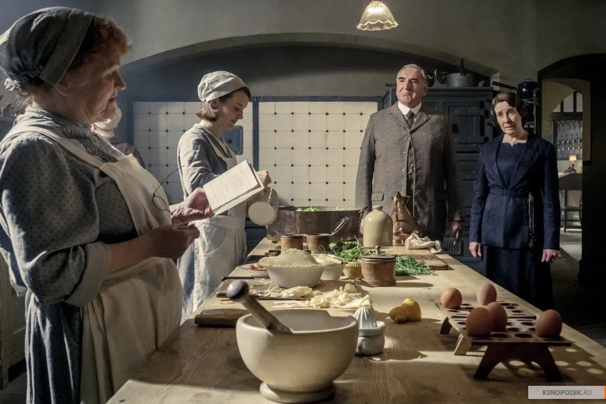

# «Титаник» Даунтон. На экранах — «Аббатство Даунтон», киноверсия легендарного британского сериала о крепком союзе аристократов и их прислуги

- **URL:** https://novayagazeta.ru/articles/2019/11/25/82865-titanik-dauntaun
- **Дата:** 2019-11-25
- **Автор:** Лариса Малюкова

## «Титаник» Даунтон

## На экранах — «Аббатство Даунтон», киноверсия легендарного британского сериала о крепком союзе аристократов и их прислуги

Фильм снял Майкл Энглер, один из режиссеров телепроекта. Джулиан Феллоуз – аристократ, писатель, создатель сериала — стал продюсером и сценаристом игровой картины, не повторяющей, а продолжающей действие на большом экране.

Зрителям, оказавшимся впервые в густонаселенном поместье Даунтон, будет не по себе. До головокружения много персонажей, связей, событий. Но это поначалу. Фильм Феллоуза/Энглера — всего лишь игра в старую добрую Англию. Открыточно-красочную, притягательную, почти сказочную. И поэтому полностью безопасную, несмотря на кипящий водоворот событий.

Кадр из фильма «Аббатство Даунтон» / Кинопоиск1927 год. Мы снова в загородном родовом имении посреди йоркширских полей и рощ. На газоне щебечут ангельские дети с воспитательницами. Наверху — все старые знакомцы: лорд Роберт Кроули (Хью Бонневилль), его жена Кора (Элизабет Макговерн), леди Эдит (Лора Кармайкл) и леди Мэри (Мишель Докери), управляющая большим поместьем. Здесь же вдовствующая графиня Грэнтэм — сердце сериала — в блестящем воплощении Мэгги Смит. Ее едкие замечания вроде «ненавижу получать новости из вторых рук» давно растиражированы интернетом. Все это верхний, сверкающий диадемами и ожерельями нарядный мир. Внизу — вышколенные слуги: дворецкие, повар и ее помощники, водопроводчик, экономка, садовники. Жизнь слуг не менее насыщенна и значительна, она общей кровеносной системой связана с жизнью господ. Главное событие — визит короля Георга V (Саймон Джонс) и королевы Марии (Джеральдин Джеймс), вздумавших остановиться в роскошном особняке лорда Кроули во время своего вояжа.

Значит, неизбежны обед и парад.

Для обитателей резиденции это известие равно объявлению войны. Но в Даунтане готовы с честью принять столь взволновавший их вызов судьбы. Боевой дух не смущает даже трагическое известие о том, что монархи планируют взять из Букингемского дворца своих собственных слуг, поваров, официантов, конюшенного и смотрительницу гардероба. Что ж, значит, вызов судьбы еще более грозен, однако трудностей в этом запутанном дворцовом мире не боятся.

Кадр из фильма «Аббатство Даунтон» / КинопоискАвторы фильма сочинили сценарий-ребус, который соединяет несколько десятков персонажей, заплетает в нарядную косичку многоярусный конфликт из дворцовых интриг, политических разногласий, семейных споров, романов, мошенничества, флирта и британского юмора. Чтобы взбодрить зрителя, сценаристы насытили действие покушением на убийство высокопоставленной особы, борьбой за наследство, а также подлинной катастрофой — внезапной поломкой бойлера. И наконец, вопиюще свободной для местных консервативных нравов сценой в гей-клубе.

По сути, это новый, седьмой сезон сериала, уложенный в два часа экранного времени. Отсюда суета персонажей — каждому мало времени на крошечный бенефис, надо уложиться.

Самое главное в «Абатстве Даунтон» (сериале и фильме) — плотный дух времени, до которого, кажется, можно дотронуться:

Поддержите нашу работу!

1000 500 300 Нажимая кнопку «Стать соучастником», я принимаю условия и подтверждаю свое гражданство РФ

Если у вас есть вопросы, пишите [email protected] или звоните:+7 (929) 612-03-68

благотворительные обеды с начищенным серебром и старорежимной подачей блюд, изысканные платья от модных домов (костюмы Анны Роббинс — по-прежнему совершенство), правильный пудинг, стулья для парада, спасенные от дождя мужественными хозяевами поместья, и прочие важные атрибуты дворянской жизни, исчезновение которых может подорвать основы британского общества.

Кадр из фильма «Аббатство Даунтон» / КинопоискВнешний мир в фильме (в отличие от сериала) — дальнее эхо с «Большой земли». Долетает слух о Всеобщей забастовке 1926 года, упоминается конфликт между имперской Англией и северными ирландцами и технических новшеств с многовековыми традициями.

При всем обаянии персонажей, отточенных диалогах, бисерной прописи сюжета,

фильм напоминает оперетту, авторы которой должны ближе к финалу развязать все узелки,

помирить поссорившихся, мягко наказать зарвавшихся фатов, соединить всех влюбленных в общем вальсе. И затем эту кремовую красоту густо полить сиропом и украсить цукатами.

Когда королевская портниха должна — кровь из носу — за ночь ушить слишком просторное золотое платье обворожительной леди Эдит (о боже, это невозможно!), кажется, что авторы иронично намекают на собственную непосильную задачу: «ушить» сериал до двух часов сложно даже его создателям.

Мировая премьера фильма пришлась на пик британского политического хаоса. Поэтому кинокартина Энглера — успокоительная пилюля для нервничающих по поводу затянувшихся проблем с брекситом. Еще одна сладостная реконструкция мира, в котором героические слуги рады не только служить, но и прислуживать, готовы на любые уловки, лишь бы сохранить привычный статус-кво. Эксперты давно заметили, что консервативная идеология сериала (и фильма) обладает терапевтическим эффектом.

Кадр из фильма «Аббатство Даунтон» / КинопоискНа длинных титрах подумалось: только что мы наблюдали за жизнью пассажиров величественного «Титаника»

(его трагедия рассказана в одном из сезонов) — Даунтона, горделиво плывущего мимо множества айсбергов: социальных бурь, внеочередных выборов, брексита, классовых проблем и прочих невзгод.

Рассказывают, что на торжественном показе фильма в лондонском Studio Movie Grill большинство зрителей составляли дамы преклонного возраста. Хлопали долго. И в образовавшей после овации тишине одна из зрительниц громко спросила своего спутника: «Когда же я смогу посмотреть следующую серию?»

Поддержите нашу работу!

1000 500 300 Нажимая кнопку «Стать соучастником», я принимаю условия и подтверждаю свое гражданство РФ

Если у вас есть вопросы, пишите [email protected] или звоните:+7 (929) 612-03-68
