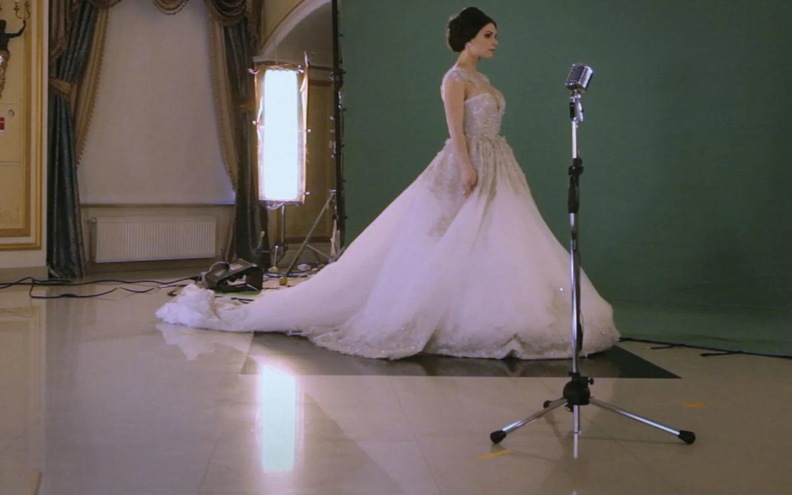

# Гендер с точки зрения стервы. «Артдокфест» открылся фильмом «Школа соблазнения», скандалом и бурной дискуссией

- **URL:** https://novayagazeta.ru/articles/2019/12/06/83039-gender-s-tochki-zreniya-stervy
- **Дата:** 2019-12-06
- **Автор:** Лариса Малюкова

## Гендер с точки зрения стервы

## «Артдокфест» открылся фильмом «Школа соблазнения», скандалом и бурной дискуссией

Кадр из фильма «Школа соблазнения». Kinopoisk.ruКаждый раз до последнего неизвестно — откроется ли фестиваль. Не откажется ли под прессом разнообразных органов кинотеатр от показов? Не придут ли активисты SERBа или участники правонационалистических организаций, гнобящих Театр.doc? Не возмутятся ли депутаты в поисках популярности? На этот раз обошлось, и более 1000 зрителей собралось приветствовать смотр, который министр культуры назвал «антигосударственным». Хотя никакого диссидентства в программе нет. Всего лишь авторское кино про Россию и для России. Просто истинный автор неигрового кино не носит «изумрудных очков», рассказывает чистосердечно о болевых моментах реальности и реальных людях. Поэтому и возникают проблемы бесправия, экологии, судебной системы, эмиграции, нищеты. Что перечислять, вы сами все знаете.Можем повторить?На Открытии президент фестиваля Виталий Манский размышлял над девизом-угрозе последнего времени «Можем повторить!». «А нужно ли все повторять?» — ​изумляется Манский, вспоминая многомиллионные жертвы, террор, диктатуру. «Артдофест» упрекают в излишней политизированности? Конечно, проще прятать голову в песок и рассказывать с экрана исключительно о прекрасном. Закрыть глаза на реальные обстоятельства места и времени. Но тогда действительно все может повториться, причем без нашего ведома и спроса.

160 картин в разных конкурсах, 160 историй, взглядов, точек зрения авторов. Почти за каждой историей образ современной страны, плывущей своим особенным маршрутом.

## «Школа соблазнения»

И в духе фестиваля фильм Открытия, фестивальный хит Алины Рудницкой «Школа соблазнения» уже вызывал жесткую дискуссию.

Кинороман с тремя героинями, которые окончили в Петербурге курсы соблазнения мужчин под саркастичным названием «Школа стерв». Здесь женщин обучают стриптизу, сексуальным позам и другим секретам обольщения. Первая девушка, Алена, пытается перевести хронический роман с женатым мужчиной в семейное русло. Она точно выполняет советы преподавателя стервологии Владимира Раковского: каблуки, гольфы, эротика, беззащитность, слезы — образ «маленькая девочка». Надо стараться, учит их пошловатый гуру, ведь хороших мужчин мало, и чтобы из «гусениц — в нарядные бабочки», а рядом мужчина со статусом и деньгами — умей манипулировать сильным полом, вытягивать из него деньги: «Что нищету-то плодить?» Алена добивается своего лысого принца, свадьбы, даже рожает ему ребенка.

Стриптиз, война и кино

Гид «Новой» по «Артдокфесту», который открывается 5 декабря в Москве и Петербурге

Кадр из фильма «Школа соблазнения». Kinopoisk.ruВторая девушка — ​Вика. У нее с мужем маленький бизнес: магазин женского белья «Парижанка» в торговом центре. И вроде бы все есть у Вики, а вот счастья нет. И домой идти не хочется. А все потому, что Вика разлюбила мужа. Она ходит к психологу, она учится обольщению. Пытается понять, услышать себя. В результате уезжает из дома и снимает квартиру.

И, наконец, третья — ​Диана, чистая Барби. Одевается так, как девушки в амстердамских окнах в районе Красных фонарей. Вырезы, каблуки, детские хвостики с бантиками, рюши. Мама пьет, бабушка не в себе, сын Саша впрочем, на пианино играет. Надо все менять. Вот у нее свидание с обаятельным молодым человеком, который нежно спрашивает:

«Без чего ты не можешь жить?» Потупясь, она отвечает с обезоруживающей искренностью: «Квартира». Пауза. «Деньги».

«А отношения? — ​обреченно уточняет Ромео. «И отношения, — ​сразу соглашается Джульетта, — ​но нигде и без денег не будет и отношений». После нескольких неудач она встретит своего итальянца Стефано, средних лет, профессора в петербургском университете, изучающего с помощью перцептивного анализа Достоевского. Шесть лет спустя, она вся в стразах и разрезах идет с мужем на прием, после чего устраивает ему жуткий разнос: на празднике ее платье было не самым красивым. Он виноват кругом: бежать за нарядом Max Mara? Простит ли его Диана, которая снова ходит на курсы: учится правильно есть лобстеры, скакать на лошади и изображать Грейс Келли на фоне зеленого экрана.

Кадр из фильма «Школа соблазнения». Kinopoisk.ruВ этой меланхоличной трагикомедии ставится столько вопросов и проблем, что каждый зритель волен вынести то, что у него наболело.

Например, гендерный перекос нашего на редкость консервативного общества, поющего мантру деньгам и успеху. При этом идеальный образ женщины — ​это сексуальная домохозяйка с тремя детьми. На протяжении всего фильма в действие включается президент. Из телевизора он воспевает архаичные ценности, произносит тосты за здоровье многодетной матери, которая является «украшением нашей жизни», особенно 8 Марта. Ведь и в обществе на всех уровнях точно так же, как в «школе стерв» учат женщину ублажать мужчину — ​брутального хозяина, лучше — ​военного. И режиссер обрамляет фильм военно-морским праздником в Питере: военные корабли выходят в гавань, моряки и девушки в фривольном прикиде машут андреевским флагом.

Кадр из фильма «Школа соблазнения». Kinopoisk.ruЭта домостроевская модель взаимоотношения полов в Европе не просто устарела, европейцам вообще не очень понятна подобная линия поведения.

Поддержите нашу работу!

1000 500 300 Нажимая кнопку «Стать соучастником», я принимаю условия и подтверждаю свое гражданство РФ

Если у вас есть вопросы, пишите [email protected] или звоните:+7 (929) 612-03-68

Фильм лишен публицистического пафоса, в нем есть объем самых типичных историй и глубина характеров. Ведь в итоге выходит, что все три девушки не слишком счастливы. Алена солит огурцы, варит варенье, слушает телик про то, что американцы хотят бомбить Россию, и ждет с работы припозднившегося «папусика». Вика зависла в неизвестности. Диана в Монте-Карло, вся нарядная, пытается привлечь внимание очередных богатых «папусиков». На протяжении фильма все героини пытаются измениться. Но, по сути, ни одна из них не меняется. Точно так же, как мир вокруг них.

Кадр из фильма «Школа соблазнения». Kinopoisk.ruСкандал и окрестности

После выхода фильма Диана Белова, одна из героинь, вместе с мужем Стефано Капилупи начали рассылать письма в СМИ и инстанции, требуя запретить показ ленты в России.

По их словам, у Алины Рудницкой нет согласия на использование аудиовизуальных образов самой Дианы, ее мужа и несовершеннолетнего сына. В письме в «Новую» авторы говорят, что не следует показывать «фильм, являющийся ужасным примером манипулирования, провокаций, обмана и присваивания интеллектуальной собственности. Автор таких нарушений, манипуляций и насилия — ​режиссер Алина Рудницкая. Для будущего России весьма важно препятствовать людям, которые притворяются диссидентами, а на самом деле используют те же методы манипуляции слабых и то же насилие, за которые якобы критикуют власть».

Случай с фильмом Алины Рудницкой, несомненно, затрагивает важную проблему взаимоотношений автора документального кино и его героя. Мы спросили мнения у людей, связанных с актуальной документалистикой.

Марина Разбежкина

Документалист

— Вопрос нелегкий. На Западе ты должен взять разрешение героев, причем и второго, и третьего плана. Эти законы уничтожают свободное доккино. Мы пока еще в эту «лигу» не вступили. Но по телевизору уже нельзя показать фильм, если нет разрешения участников. Фестивали этого пока, к счастью, не требуют.

Михаил Дегтярь

Режиссер

—У нас была недавно такая история с фильмом о фехтовании. Там повторяется история известных спортсменов, но у героев другие фамилии, и история несколько отличается. От реальной. Мы встретились со спортсменами, уладили конфликт, подписав бумагу, что они не будут возражать. Против показа. Но в данном случае герои фильма Алины знали, что их снимают.

Виталий Манский

Продюсер

— Моя точка зрения: отношения между автором и героем должны решаться не в юридической плоскости. А если они дошли до юридического разрешения, значит, должно прозвучать слово закона. А не какие-то угрозы, запрет фильма, расстроившего героев.

Люди, осознанно принимавшие участие в съемках, вдруг сочли, что достаточно их мнения запретить картину, создававшуюся годами.

Есть юридическое право: если режиссер искажает действительность, дает недостоверную информацию, называя героя вором, преступником, то он несет за это ответственность. Если режиссер предъявляет реальную жизнь, то в этой жизни ты можешь быть и неприглядным, но это жизнь. И тут, извини, ты должен был думать раньше, когда соглашался на съемки.

Виктория Белопольская

Программный директор «Артдокфеста»

—За рубежом такая регуляция: либо ты берешь разрешение перед началом съемок, либо в конце, либо подписываешь документ, что обязан показать человеку окончательный монтаж. Но с такими героями, как правило, авторы дело не имеют. Есть миллион тонкостей, общего правила не существует. Чаще всего берется разрешение в принципе снимать человека. Герои фильма Рудницкой чрезвычайно активные. Думаю, они хотели использовать Алину в каких-то своих целях. Но недооценили ее как режиссера. К тому же, видимо, подписали соглашения, позволяющие юридически разрешать ситуацию в пользу фильма. Именно поэтому столь активна их эпистолярная деятельность.

Алина Рудницкая

Режиссерфильма «Школа соблазнения»

—В документальном кино невозможна абсолютная беспристрастность. Не бывает по-настоящему документального изображения. Объективно и безучастно снимают только камеры наблюдения, да и то в выбранном кем-то направлении и крупности.

Я по-своему интерпретировала образ героев. Это моя картина мира. Не всегда она совпадает с видением критиков и героев. «Мне не понравился мой портрет», — ​скажет Пикассо модель, увидев портрет из кубиков. И что должен сделать художник? Сжечь картину?.

Поддержите нашу работу!

1000 500 300 Нажимая кнопку «Стать соучастником», я принимаю условия и подтверждаю свое гражданство РФ

Если у вас есть вопросы, пишите [email protected] или звоните:+7 (929) 612-03-68
