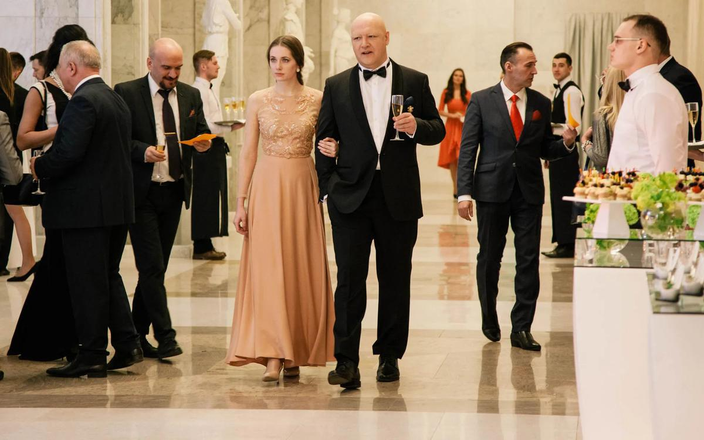

# Максим Суханов: «Да не раскачается эта лодка». Знаменитый актер — о своих ролях и регалиях, о радиоактивности власти и о нашем вечном бумеранге: коммуно-имперской ностальгии по Сталину

- **URL:** https://novayagazeta.ru/articles/2019/12/20/83229-maksim-suhanov-da-ne-raskachaetsya-eta-lodka
- **Дата:** 2019-12-20
- **Автор:** Лариса Малюкова

## Максим Суханов: «Да не раскачается эта лодка»

## Знаменитый актер — о своих ролях и регалиях, о радиоактивности власти и о нашем вечном бумеранге: коммуно-имперской ностальгии по Сталину

Кадр из фильма «Сквозь черное стекло»Недавно вышедший в прокат фильм «Сквозь черное стекло» Константина Лопушанского — мистическая история о мезальянсе олигарха и незрячей девушки из монастыря — вызвал полярные отклики: от превосходных до убийственных. Дмитрий Быков, к примеру, хвалит картину за точное попадание в дух времени и его эмоцию. Можно спорить и о жанрах — притча это или жестокий романс, роман об эпохе или сатирический плакат. На фестивале «Сталкер» фильм получил приз имени Марлена Хуциева. Герой Максима Суханова — богач, хозяин жизни, раньше бы сказали «новый русский», теперь уже «поживший русский»…— Ваш персонаж сделан жирными масляными красками. Так была поставлена режиссером задача или таким вы его придумали?

— Перед съемками мы с Константином Сергеевичем долго — наверное, в течение года — встречались, дискутировали, улаживали антагонизмы…

— Уладили?

— Что значит «уладили»? Есть режиссерское видение… У меня остались какие-то нереализованные идеи, желания. Но дело же не в моих конкретных предложениях. Вроде бы мы говорили об одном, но каждый в тексте видел свое, непросто было соединить это воедино. На кинопробах я попытался выполнить то, что вычитал в сценарии Лопушанского, без своих собственных добавлений. И это подошло Константину Сергеевичу. Работать было непросто, но интересно. Что касается жирных красок, для меня они — выражение сути живого человека. Не просто пластика физического субъекта. Нет. Во всем том, что он делает, — как говорит, как жует — портфолио из его поступков, жизни, мировосприятия. Вот и получается колоритный характер.

— Жирные краски не умаляют человеческого объема персонажа, который превращается в воплощение зла?

— Мне так не кажется. При всем темном начале я (насколько это было можно) привносил в характер рефлексию, сомнение.

— То есть по Станиславскому: в злом ищи, где он хороший.

— Дело не в Станиславском, это всегда интереснее. Чувствовать своего героя не в стагнации, а в постоянном смутном поиске. Не вполне осознавая это, он все же ищет какой-то выход для себя…

— В том числе через юную слепую монашенку, которой с барского плеча он дарит зрение, к тому же предлагает руку, сердце и зажиточное существование.

— Безусловно, прежде всего — через нее. После показа я слышал мнение, что все это в какой-то степени его оправдывает… Но стремления подобного рода дают надежду на спасение, может быть, даже большую, чем у его избранницы. Мнений действительно много. Один из зрителей предложил неожиданную трактовку: «Фильм о нашем менталитете. Если мы хотим чуда, то едем в Германию, в Европу, а если катарсиса, возвращаемся в Россию и выкалываем себе глаза».

— Вы же хорошо знаете людей бизнеса, ориентировались внутренне на кого-то конкретного?

— Я никогда ни на кого не ориентируюсь. Мне важна информация, окружающая меня сегодня, вчера, если она еще не стала архаичной. Пытаюсь делать какой-то смысловой сгусток. Я не отворачиваюсь от ярких персонажей специально. Так происходит само собой. Мне интересна концентрация смыслов на тему, избранную автором и режиссером.

Константин Лопушанский. Фото со съемок фильма «Сквозь черное стекло»— Тогда я бы вспомнила фильм Лопушанского «Роль» с вашей, на мой взгляд, выдающейся работой. Там люди меняют роли, маски. И когда ваш белый эмигрант, актер Евлахов, словно бы раздваивается, мы уже не знаем точно, кто перед нами: он или красный командир Плотников, который ставит к стенке Евлахова. Скажите, а вас не окутывают призраки ваших ролей? Не угадываете в себе черты Хлестакова, Альмавивы или Лира?

— Наверное, такое случается с актерами, но меня нет, не преследуют тени ролей, хотя их было достаточно. Я, в общем, хорошо ощущаю дистанцию по отношению к роли. Стремлюсь, чтобы территория работы, сцены абстрагировалась от территории дома, улицы или какой-то компании. Для меня это все разные пространства, их ни в коем случае не надо смешивать, хотя бы для собственного психического здоровья.

— То есть роль не может стать пленом даже на какое-то время, пока идут репетиции, съемки?

— Если роль превращается в плен, если возобладала над актером — это диагноз. Такого быть не должно. Конечно, актер насыщает роль всем своим существом, чувственным опытом, комплексами, страхами. Но он ни в коем случае не должен позволять роли сжирать свою жизнь.

— Признаюсь, для меня в целом ряде ваших характеров угадывается шлейф вашего Лира в спектакле Мирзоева. Там было такое медленное мучительное высвобождение из-под коросты жутковатой маски, болезненное обнаружение собственного лица, иной сущности.

— Во всяком случае, я к этому стремлюсь. Мне интересны превращения, парадоксы, которые приключаются с моим героем. Линейное развитие малолюбопытно, люблю контрапункты, неожиданные перевертыши. Когда репетирую, меня несет в эту сторону. Мне хочется, чтобы не удавалось моего персонажа поместить в какую-то рамку, дать жесткое определение его характеру. Хочется, чтобы там присутствовало многоточие.

— Ваши дедушка и бабушка играли в театре Мейерхольда. И, кажется, вы один из немногих актеров, которые линию театральной мистерии, гротеска продолжают развивать сегодня. Не только в «Театральном романе» — во многих ваших работах есть карнавальность, комическое сплавляется с трагедией.

— В какой-то степени соглашусь, но все-таки это ваше прочтение. Я не могу на этом сосредоточиваться, нести, так сказать, знамя мейерхольдовского или вахтанговского театра. Стараюсь постоянно находиться в сиюминутном моменте, в поиске. То, что мне сейчас интересно, то и делаю. А уже критики сформулируют и определят принадлежность моей работы той или иной театральной школы. Возражать не буду.

— Кстати, еще один ключевой момент экспериментального мейерхольдовского театра — парадокс. Владимир Мирзоев отдает вам роль Хлестакова. И фитюлька превращается в громоздкого медведя в посуд­ной чиновничьей лавке — по сути, в кошмар чиновника.

— В этом смысле я с Володей солидарен: чувствуя друг друга, мы нащупываем либо контрапункт, либо мгновенную полярность по отношению к привычному. Это пробуждает фантазию и всех, кто занят в спектакле, и зрителей.

— Наверное, актеру с таким темпераментом и стилем игры трудно сего­дня, когда экраном востребован шепот, скромное телевизионное актерское существование.

— Думаю, что мои превращения, мой способ игры востребованы и сегодня. Просто мне нужен режиссер. Один я ничего не смогу сделать. Если повезет с режиссером, можно предлагать, пробовать все возможные варианты. Ни в коем случае не буду демонстрировать то, что я делал раньше. Это скучно. Мне кажется, я достаточно подвижен.

— Не было такого, что режиссер вас пугался? Вы приходили на пробы, и…

— Ну нет, такого не было. У меня были пробы, после которых меня не утверждали. Но это же процесс живой: актер тоже смотрит, стоит ли с этим режиссером иметь дело… Чтобы работа не превратилась в битву, в муку.

— Вы отказывались после утверждения на пробах от работы?

— Конечно, и от театральных, и от киноработ. Когда чувствовал, что при всей прелести и талантливости режиссера мы слишком разные. Хуже, когда на этапе репетиций и проб все прекрасно, но потом сели в лодку, а гребем в разные стороны. Вот это ловушка.

Кадр из фильма «Сквозь черное стекло». Фото предоставлено кинокомпанией PROLINE— В этом смысле уникален, на мой взгляд, ваш союз с Мирзоевым. Кажется, это союз равных художников, когда каждая работа — совместный поиск.

— Вы совершенно правы. Точка отсчета — всегда режиссер: его идея. Володя попадал в этом смысле в десятку, я тут же откликался на его предложения. Когда мы работаем, это действительно сотрудничество. Он демократичный режиссер, у него нет амбиций надстоять над актерами, он расположен к диалогу, к полемике. Готов не только аргументировать свою концепцию, но и слышать тебя. На прогонах его энергия вносит коррективы в ход спектакля, в рисунок роли. Встретить такого режиссера — счастье для актера.

— Его недавние «Этюды о свободе» — актуальная история с внятными политическими аллюзиями. К тому же это веб-сериал. Меняется существование актера, осознающего, что его смотрят на мониторе компьютера?

— Наверное. Но дирижером должен быть режиссер, он помогает микшировать краски, подчеркивать какие-то нюансы.

— Вы там сыграли наставника, который курирует интимную жизнь молодой семьи. Как вам кажется, насколько идея проникновения власти в личную жизнь граждан актуальна?

Поддержите нашу работу!

1000 500 300 Нажимая кнопку «Стать соучастником», я принимаю условия и подтверждаю свое гражданство РФ

Если у вас есть вопросы, пишите [email protected] или звоните:+7 (929) 612-03-68

— Думаю, что предела абсурду не существует, вопрос только в сдерживающих факторах. Если они будут работать, то сюра в жизни будет меньше.

— А что такое сдерживающие факторы?

— Это работа институтов власти. Это выполнение законов…

— Как раз институты власти работают на полную катушку. И остановиться этот каток власти не может.

— Не думаю, что они работают в демократичном режиме. Как человек, занимающийся профессией, связанной с интуицией, я этого не чувствую. Мы дошли до многих абсурдных законов и приговоров не только из-за диктата власти, но и из-за соглашательства общества, которое должно себя защищать. В личной жизни мы не позволяем так себя вести с собой. Пока не позволяем. Если позволим — значит, контроль, как в нашем кино, установят и в квартире каждого из нас. Не надо даже наставников. Будут какие-то специальные электронные центры, камеры.

— «Большой брат» подробно описан как возможный сценарий событий.

— Чем инертнее население, тем больше угроза. Стругацкие уже все написали.

— И Стругацкие, и Сорокин. Вы знаете, что есть идея выпустить в 2020 году в повторный прокат «Мишень» Александра Зельдовича по книжке Сорокина с вашим участием?

— Нет, не слышал. Это было бы замечательно, у фильма был ограниченный прокат, мало кто его видел.

— Тогда в десятые нам казалось, что это чистая антиутопия про далекий 2020-й. И вот он — 2020-й! А сама фантастическая история становится практически документальной: все учат китайский язык, поголовно занимаются омоложением, а сталинские методики опрокинуты в будущее. Почему этот бумеранг все время нас настигает: антиутопия становится реальностью, реальность — антиутопией?

— Переходный период из одной формации в другую проходит медленно и мучительно. Для нас с вами, живущими короткий отрезок времени, ассоциация с медленностью одна, для Вселенной — другая. Переходный период и не может идти по-другому, тем более в такой гигантской стране. Конечно, травма была нанесена колоссальная сталинской эпохой. Масштаб этой травмы постоянно тянет нас в прошлое.

— Молодых ребят сажают в тюрьму, от ощущения беспомощности и беспредела они режут себе вены… Можно же просто успокоить себя: ну да, все это закономерно для переходного периода, медленного движения телеги истории…

— Когда мы находимся рядом со всем этим, в одном городе, щека к щеке, мы не можем не думать об абсурде, ужасе, вопиющей несправедливости. И все-таки у нас есть возможность говорить об этом, писать, заявлять. В 1935–1938 годах мы бы не сказали ни одного слова вслух.

— Значит, у нас есть куда стремиться.

— Если быть пессимистом, можно этот процесс описать в довольно черных красках, чего бы не хотелось. Человеку свойственно желание видеть свет в конце тоннеля.

Кадр из фильма «Сквозь черное стекло». Фото предоставлено кинокомпанией PROLINE— Но вы же сами сказали об ответственности общества. И как представитель этого общества вы подписываете письма против войны в Украине, в защиту Бахминой, читаете на нашем сайте рассказ Сенцова.

— Ну да, когда есть возможность выразить свою позицию, я это делаю. И может быть, кто-то тоже задумается, увидит, что есть и альтернативное мнение. Мнение, которое призвано не разрушить что-то, а помочь стране стать лучше, интереснее. Стать страной, в которой на равных могут сосуществовать разные точки зрения. Чем более открытой будет полемика с властью, тем продуктивнее окажется работа самой власти. Она будет вынуждена думать о том, что происходит здесь, внутри, и меньше будет озабочена Африкой или Сирией.

Конечно, я не политик, мы не знаем, какие подводные камни, течения и амбиции существуют в большой политике. Но замалчивание тем, которые касаются всех, вредно и опасно. Это вообще касается любых цивилизованных межличностных отношений: в семье, в дружбе. Можно затолкать проблему в темный угол, и она там будет гнить. Но можно проблему обнаружить, постараться пережить ее вместе или мирно разойтись.

— Вопрос: почему вы отказались от звания народного артиста?

— Я сначала отказался от заслуженного, а потом от народного.

Мне кажется, все это какая-то большая глупость, причем идущая из военного времени воюющей страны, в которой была выстроена иерархия во всех сферах, с подчинением младших по званию — старшим по званию.

— Рядовой, майор, генерал…

— Конечно. Заслуженный РСФСР, народный РСФСР, народный СССР… С этим титулом человек приходит в театр, о нем почтительно говорят: «Он со званием». Он репетирует, подчас вместе с недавними выпускниками театрального училища. На сцене же все равны, но априори ты уже на пьедестале. Не нужно лезть с иерархией на территорию искусства. Мне кажется, просто люди заигрались. Если вы хотите отблагодарить артиста за его вклад, заплатите ему денег, отметьте конкретную театральную или киноработу. Или играйте в эту игру до конца: вы дали звание, а актер не справился с ролью. Ну тогда лишите его звания! А тут пожизненные привилегии: человек уже не только не народный, но уже и не артист вовсе, только мундир. Отказываясь от регалий, надеюсь, что когда-нибудь эту глупость отменят. Традиции — это не обязательно здорово. Плохие традиции надо отменять. Объясните, почему Ленин лежит в Мавзолее? В XXI веке!

— Чтобы не раскачивать лодку.

— Да не раскачается эта лодка, вот в чем дело. Обидно за этого человека, как к нему ни относись. Насилуют его и после смерти, напичкали формальдегидом, превратили в идола для обрядов и поклонений. И это в стране, в которой более 70 процентов населения исповедует православие. А церковь молчит…

— Ну мы же и говорим с вами про привычный абсурд жизни.

— Вот он и кипит всеми пузырями. Надо как-то по-человечески…

— Есть еще одна сквозная тема, объединяющая многие характеры, вами сыгранные, — тема выбора. Ваш Борис Годунов в фильме Мирзоева, как Гамлет, на протяжении всей картины, в которой пушкинская трагедия перенесена в наши дни, мучительно выбирает свой путь, и его выбор становится выбором истории. А вам легко дается выбор?

— Смотря чего он касается. Выбор фильтруется прежде всего через нежелание идти на компромисс. Если чувствуешь, что поступок, предложение, компания, режиссер — чужой «группы крови», надо отказываться, иначе соглашательство способно тебя разрушить. Не всегда это удается. Но если есть рефлексия, то и надежда есть, что компромиссов будет все меньше.

«Люблю сидеть между стульями»

Интервью с режиссером клипов «Ленинграда» Анной Пармас к выходу комедии «Давай разведемся!»

— В «Борисе Годунове» не менее важной была история про то, как власть выжигает человека изнутри. Кстати, тема тоже для вас не новая. Вы же дважды играли Сталина. Помню, как ваш Сталин в «Цитадели» Михалкова сидит у рояля, говорит глухим, почти ласковым голосом, движется бесшумно. Как змея ползет. Не знаешь, откусит он голову герою Меньшикова или отпустит его. Сегодня вновь востребован образ «мудрого отца». Я даже не про памятники — про запрос снизу, про ментальность.

— Мне кажется, это подсознательное выражение слабости, наивности, ощущения незащищенности в жизни. Эта психопатия возникает как защитная реакция на ложь, цинизм власти. Страх будущего гонит в архаику. Ведь понаписано о нем разное. И при желании можно ухватиться за восхваление. Опереться на мнение, что его политика сделала нашу страну мощной, с которой все считались. Что при таком вожде мы можем противостоять самому черту. Из нежелания анализировать, затрачиваться на внимательное изучение истории возникают такие тенденции. Потому что выполнять приказ легче, чем самому определяться со своей жизнью. Кого-то лечить легче, чем самому лечиться, заниматься решением собственных проблем, признаваться в комплексах. Все это требует сил, работы над собой. Поэтому многим и кажется: верни нам коммуно-имперский строй — получим иммунитет от всех врагов на свете. В том числе и от себя самих.

— Снова будем строить великое будущее?

— Конечно. Почему территория власти (неважно, в каком веке) должна иметь временной порог? Потому что эта территория радиоактивна. Была и будет. Когда люди выбирают человека властвовать над собой, они испытывают к нему симпатию, надеются на него. Но они обязаны заботиться и о том, чтобы избранный как можно меньше находился у кормушки этой власти, чтобы не погиб в этом «реакторе». И мне кажется, что ротация в этом смысле прекрасна и спасительна, дабы властителю не получить такую дозу радиации, когда история всей страны может стать необратимой.

Семен Слепаков: «Сегодня стадионы — это интернет»

«Голос поколения» — о свободе, цензуре и самоцензуре

Поддержите нашу работу!

1000 500 300 Нажимая кнопку «Стать соучастником», я принимаю условия и подтверждаю свое гражданство РФ

Если у вас есть вопросы, пишите [email protected] или звоните:+7 (929) 612-03-68
