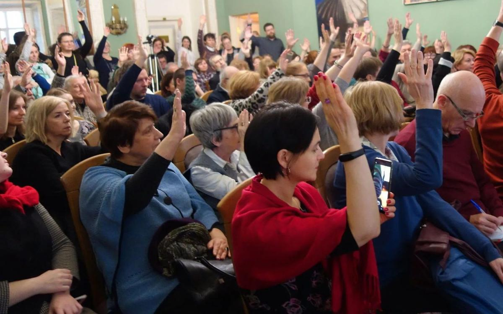

# «Мы ученые, а не сезонные рабочие, которых хозяин отчитывает». Тревожная и мутная ситуация сложилась вокруг Государственного института искусствознания и его особняка

- **URL:** https://novayagazeta.ru/articles/2019/12/28/83333-my-uchenye-a-ne-sezonnye-rabochie-kotoryh-hozyain-otchityvaet
- **Дата:** 2019-12-28
- **Автор:** Лариса Малюкова

## «Мы ученые, а не сезонные рабочие, которых хозяин отчитывает»

## Тревожная и мутная ситуация сложилась вокруг Государственного института искусствознания и его особняка

Экстренное собрание коллектива ГИИреакция! Минкульт отреагировал на нашу публикацию и пообещал, что директор Государственного института искусствознания Наталья Сиповская сохранит свой постРуководителю Государственного института искусствознания Наталье Сиповской в Минкульте пригрозили отставкой, но публично это опровергли. Фото: РИА НовостиКонфликт между чиновниками и искусствоведами то затухает, то разгорается вновь не первый год. Наталья Сиповская возглавила институт на волне скандала 2013-го, когда ГИИ собирались слить с другой организацией. Институт отбивали всем миром. Возглавил тогда битву за науку тогдашний директор института Дмитрий Трубочкин, постоянный оппонент Владимира Мединского во взглядах на реформирование культуры. Когда он ушел, коллективу позволили выбрать себе руководителя.

Экспозиция в помещении ГИИ. Фото: FacebookЗа годы руководства Сиповской институт укрепил положение одного из ведущих в мире гуманитарных исследовательских центров. Здесь насыщенная научная жизнь. Ежегодно проводится единственное в своём роде научное мероприятие для молодых исследователей — форум «Научная весна» для участников со всей страны и из-за рубежа. На недавний международный конгресс приехали ученые с мировыми именами. Проводятся конференции, симпозиумы, выставки. В институте уникальное собрание специалистов по всем видам искусства: изо, театр, музыка, кино.

Но у министерства свой взгляд на происходящее. Внеплановая проверка выявила ряд нарушений, в частности — выплату «неправомерных» премий на сумму 95 млн рублей.

Значит, последуют санкции.

На официальном сайте ГИИ появилось сообщение, что Министерство культуры «предложило директору Н. В. Сиповской покинуть свой пост по собственному желанию», оставив за собой научное руководство, иначе она будет уволена “по результатам проверки деятельности института”».

Но в Минкульте эту информацию немедленно опровергли.

## SOS

Встревоженные сотрудники института собрались на экстренное собрание. В зеленом зале — не продохнуть. Пришли все: от светил с регалиями до молодых ученых.

Александр Яковлевич Рубинштейн, доктор философских наук, лауреат многочисленных премий говорил, волнуясь. О том, что не спал всю ночь — звонил телефон: «Сколько же людей переживают за судьбу института! Я абсолютно не верю действиям и словам начальника департамента науки и культуры Минкульта, который сначала пугал, потом отмежевался от своих слов. Я никак не могу понять, почему все это происходит, почему подвергают нападкам один из самых значительных институтов в стране, который приносит славу науке, России? Увы, по всей видимости, эта кампания носит корыстный характер: лакомый кусок земли в центре Москвы с роскошным особняком. Вот и все. Других ответов нет. Нам нужно бороться».

Александр Яковлевич предложил направить в адрес Министра культуры письмо с просьбой вмешаться в эту неприглядную ситуацию, прекратить гонения и сохранить институт. Собрание его поддержало единогласно.

Екатерина Сальникова, доктор культурологии продолжила: «У меня ощущение, что живем в параллельных реальностях. Одной рукой нам пишут благодарности, поздравляют с юбилеем, признают выдающиеся заслуги института перед мировой гуманитарной наукой. И в это же время — сомневаются в нашей дееспособности и честности. Этот абсурд вызван абсолютным непониманием роли гуманитарной науки в обществе. От нашей деятельности хотят получать дивиденды. Но наука существует не для этого! Весь мир согласился с тем, что академическая гуманитарная наука необходима обществу. Это аксиома. И не надо нам оправдываться. Наша деятельность свидетельствует сама за себя.

Но если говорить о менеджменте, Наталья Владимировна проявила себя не только как ученый, приличный человек, но и прекрасный менеджер. В довольно сложных обстоятельствах в разы увеличилось количество конференций, научных семинаров, симпозиумов. Наладилась связь с современным искусством. Есть интеграция с мировой наукой, международные проекты. Мы развиваемся. На работу приходят молодые сотрудники. Мы не просто сработались, мы ей доверяем. Нельзя ворваться в жизнь ученых и давать им инструкции, не слишком разбираясь в сфере научной деятельности».

Лев Лившиц, доктор искусствоведения. «Мы не сезонные рабочие, которых пригласил хозяин, и теперь нас нерадивых, отчитывает. Мы — сообщество ученых, осознающих свои права. Результаты проверок должны здесь представить не кулуарно, а открыто сформулировав претензии. И дать возможность объясниться. Мы поставлены в унизительное положение. Это обвинение — пощечина всему коллективу. Кажется, министерство не совсем точно понимает свои обязанности по отношению к институту с такой славной долгой историей. Институт создан приказом Совмина. А Минкульт — исполнитель, помощник и организатор нашей деятельности».

Молодые ученые говорили на встрече, что в институте создано пространство для творчества, здесь — жизнь, и даже интереснейшие выставочные экспозиции постоянно меняются.

## Мнения

Ольга Пашина,Ученый секретарь института, доктор наук искусствоведения, считает, что подобные тряски губительны для творческого коллектива. Вот что она сказала «Новой»:

«Во главе научного института должен стоять авторитетный ученый с пониманием задач, со связями в научном мире. Увы, нам уже спускали эффективного «парашютиста» — заместителя директора Арсения Миронова, который должен был изнутри реформировать систему. Ничего он не реформировал, не предлагал, продержался месяца три. Ушел в Институт культурного и природного наследия, который почти развалил. И его назначили ректором Московского института культуры. А в «культуро-природное наследие» пришел бывший замминистра культуры Владимир Аристархов. Вот такая катавасия.

Нам говорят, слишком дорого содержать «дармоедов» — научных работников.

Институт реставрации поклацали, и в конце концов слили с реставрационными мастерскими Грабаря.

Но беда многих научных заведений еще и в месте их прописки. Не по чину им такие особняки. Вот и выгнали киноведов из особняка в Дегтярном переулке. Квартирный вопрос продолжает портить людей. Военно-историческое общество прибирает московские здания. На наше здание в разные годы неоднократно посягали».

Спрашиваю Ольгу Алексеевну о событиях последнего времени.

«Министерство культуры провело неплановую проверку. Три месяца работали 12 человек, изучали научную, финансовую деятельность. В итоговом акте было несколько претензий, легко разрешимых. Но на коллегии нашего директора Наталью Владимировну нещадно ругали. Тут же ТАСС опубликовало информацию о незаконных премиях сотрудникам в размере 95 млн рублей. При этом не сообщили, что премии выплачивались 200 сотрудникам в течение 3-х лет. Еще одно нарушение — не обеспечение зарплаты сотрудникам. Оказывается, зарплата должна была быть 187 тысяч рублей! Хотя у самого директора по контракту установлена зарплата 80 тысяч рублей.

Абсурд? Знал бы президент, каким образом выполняются его поручения о повышении зарплат».

«Вся экспертиза проводилась с намерением признать работу института неудовлетворительной, чтобы осуществить публичную порку его руководителя».

Наталья Сиповская в ГИИ. Фото: FacebookТатьяна Гнедовская,доктор искусствоведения. «Острота проблемы в том, что мы не знаем что происходит, что является целью этой операции. Ты не видишь противника, а то, что он — противник, мы отчетливо понимаем. Только что Минкульт награждал Наталью Владимировну и пел хвалу институту. И ровно в том же октябре организовал внеочередную проверку по всем статьям. Так доброжелательные люди не поступают.

Представьте, со всего мира приехали к нам директора крупнейших гуманитарных институтов, было торжественное заседание общества искусствоведов с мировыми именами, несколько конференций. И тут же снуют суровые тети, считая всех по головам, сличая справку со справкой. Это некрасиво, похоже на внезапное вторжение. Ситуация тревожная, потому что ровно та же аргументация — неэффективность, нарушения — звучали семь лет назад, когда институт хотели слить с другим. И ГИИ — едва ли не единственный, который устоял.

Все другие институции, куда верхам удалось поставить эффективных менеджеров были либо уничтожены, либо превращено в руины.

Поддержите нашу работу!

1000 500 300 Нажимая кнопку «Стать соучастником», я принимаю условия и подтверждаю свое гражданство РФ

Если у вас есть вопросы, пишите [email protected] или звоните:+7 (929) 612-03-68

Чиновников не интересует научная деятельность. Поэтому да, мы склонны подозревать худшее и доведены до состояния, когда вслух надо говорить то, что думаешь. Заметьте, нашего директора решили уволить в канун Нового года, когда сообщество трудно собрать. Дальше ночью пишется опровержение в ТАСС, что ей ничего такого не говорили. Мы склонны им не верить».

Ученые на собрании говорили, что опровержение министерства сделано, чтобы погасить накал страстей, но вряд ли изменится общий настрой. Едва ли не каждый выступающий выражал опасение за судьбу института, которому трудно будет устоять после прихода эффективных менеджеров.

Сама идея ставить во главе научных и творческих институций хозяйственников — порочна. Искусство хозяйственнику кажется ненужной роскошью, излишеством — но в итоге выясняется, что без искусства ты ничего существенного не создашь и в других областях тоже.

## Особняк

Фото: Государственный институт искусствознания / FacebookЗдание XVIII века архитектора Матвея Казакова в Козицком переулке. Памятник культуры, один из немногих переживших пожар 1812 года. Здесь сохранилась изысканная атмосфера дворянской усадьбы ранней Александровской эпохи, многие интерьеры отреставрированы.

Идет ремонт на первом этаже. Деньги на реставрацию и ремонт уже выделены (что тоже весьма заманчиво). Дом построен по приказу генерал-поручика Федора Шестакова.

## Институт

Конференция в Государственном институте искусствознания. Фото: FacebookИсследовать тайны искусства решили в 1944-ом, еще война не закончилась. Инициатором был выдающийся художник и исследователь Игорь Грабарь. Многие ученые стали академиками, как, например, знаменитый Борис Асафьев, один из основоположников советского музыковедения. При первом директоре — Грабаре — работали Алексей Дживилегов, Сергей Эйзенштейн. Ни в одном другим институте не отыскать такого числа лауреатов госпремиий и премий правительства. Причем властные структуры от администрации президента до Госдумы периодически призывают ученых для консультаций и помощи в создании программных документов.

В институте занимаются изучением всех видов русского и зарубежного искусства: театра, музыки, архитектуры, декоративно-прикладного и изобразительного искусства, а также культурологией, эстетикой, социологией и экономикой культуры. В нем работает четыре диссертационных совета, здесь выпускают пять научных журналов.

## Серые перемены

Мне кажется, «формула эффективности» для культуры — вредная и губительная. Западное гуманитарное сообщество давно пришло к более эффективным критериям оценки, опираясь, прежде всего, на рецензирование научных работ внутри международного научного сообщества.

Сегодня под лозунгами оптимизации потихоньку сворачивают деятельность «храмов» культуры, здоровья, чтения. Назначают новых куропеевых / муровеевых (их теперь называют «серыми директорами») или сливают в один «стакан» институты, клиники, библиотеки.

Идеи сливания оказались живучими. Почему?

С 2000-го идет реформа бюджетного сектора под флагами сокращения, оптимизации. Инициатор этих новаций, от которых уже пострадали медицина, образование, наука, искусство не Минкульт, а Минфин.

Сегодня все организации должны показать если не прибыль, то эффективный результат. Но что такое результат в культуре?

Исключительно цифры и доли?

Минфин пытает каленым железом бюджетную сферу за низкую производительность. В сфере науки подсчитает долю публикаций, в культуре — «количество обслуживаемых потребителей» на одного работника.

Ощущение, что объявлена война всей гуманитарной науке.

## Итоги оптимизации

В ведении Минкульта было пять научных институтов.

Их возмечаталось реорганизатором слить в одну банку, сократив число всех ученых до 100 человек. Но возможно ли все это при столь разных направлениях? К примеру в Научном институте реставрации работают еще и химики, технологи.

НИИ киноискусства расформировали. В 2012-ом тех кого не уволили, передали, словно крепостных, ВГИКу, превратив институт в научный отдел. ВГИКу он тоже не понадобился, еще более «секвестированный» остаток ученых «передарили» Музею кино. Музею кино ученые зачем? Научный отдел, как рассказали мне сотрудники музея, сейчас там практически ликвидирован. Были вынуждены уволиться доктор наук, исследователь французского кино Наталья Нусинова, известный в мире историк кино Николай Изволов, занимающийся компьютерной реставрацией погибших фильмов, и другие…

Институт культурологии под руководством Кирилла Разлогова съеден. Остальные институты тоже подверглись нещадной «реставрации».

Любопытный сюжет произошёл с Российским институтом истории искусств в Петербурге. Его основал граф Зубов по примеру флорентийского института истории искусств. В 1918-ом дворец с библиотекой, коллекциями он подарил Советскому государству, дабы все имущество не было разграблено, сожжено. Институт продолжил работу. Несколько лет назад пришли люди в костюмах, посмотрели — промерили все помещения… Годится. В отчаяньи ученые отправили письмо потомку Зубова, живущему за границей.

И тот написал Владимиру Путину: «Как же так, подарили государству особняк для нужд науки, а теперь хотят его отобрать?» Вопрос был решен немедленно.

Но вопрос судьбы отдельного ученого и всей науки решить намного сложнее.

### P.S.

Поддержите нашу работу!

1000 500 300 Нажимая кнопку «Стать соучастником», я принимаю условия и подтверждаю свое гражданство РФ

Если у вас есть вопросы, пишите [email protected] или звоните:+7 (929) 612-03-68
