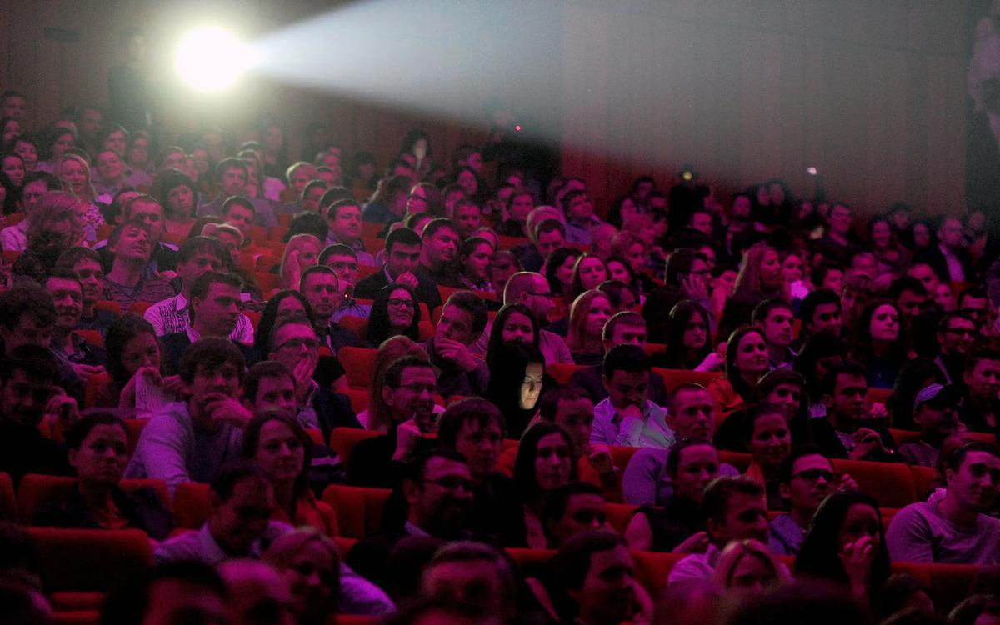

# VIII докфест от «Новой» и Артдокфеста завершен. Спасибо, что были с нами! Мы зафиксировали почти 80 тысяч зрителей

- **URL:** https://novayagazeta.ru/articles/2019/12/31/83285-zima-uhodi
- **Дата:** 2019-12-31
- **Автор:** Лариса Малюкова

## VIII докфест от «Новой» и Артдокфеста завершен. Спасибо, что были с нами!

## Мы зафиксировали почти 80 тысяч зрителей

Фото: Сергей Фадеичев / ТАССВ дни зимних каникул на нашем уже традиционном фестивале приглашаем вас посмотреть фильмы, отобранные из большого списка. Документальный пейзаж действительности получился нетривиальным и разнообразным. Здесь ток прошлого заряжает и разряжает настоящее, поэзия без спроса вторгается в унылую прозу. Но главное, здесь живое дыхание и пульс большой страны, зафиксированные камерой талантливых авторов. Кино без прикрас и патетики. У каждого времени свои трудные вопросы. Фильмы, которые не любит наше телевидение, такие вопросы задавать не боятся. Вместе со зрителем ищем ответы на них. Документальный фестиваль завершен Фестиваль пройдет с 3 по 12 января 202о года в формате: один день — один фильм.Каждая картина будет доступна только в свой день с 00.00 до 23.59 (время московское). Обсудить картины вместе с авторами читатели могли в комментариях.Иллюстрация: Петр Саруханов / «Новая»3 январяФильм Открытия — «Новая» Аскольда Курова Продюсер, режиссер, сценарист, оператор:Аскольд Куров. Композитор:Сорин Апостол. «Новая газета» основана в 1993-м. Одно из первых независимых изданий в постсоветской России. И одно из последних. Громкие расследования, немедленный анализ резонансных событий.Всего лишь один тревожный год жизни независимого издания. Целый год нашей жизни.

### «Акция» Алексея Суховея

Точная метафора страны, несущейся под пропагандистские марши со всеми остановками… Куда?

### «Загадка Черной Книги» Бориса Мафцира

У мощной картины Бориса Мафцира одна цель — рассказать, как это было. Если, конечно, мы готовы услышать правду.

### «Вертолеты» Дмитрия Кубасова

Очень рекомендую посмотреть этот фильм до последних титров, после которых вся история увидится в ином свете.

Но я знаю совсем немного примеров, когда в длительном наблюдении участвуют богатые люди.

Поддержите нашу работу!

1000 500 300 Нажимая кнопку «Стать соучастником», я принимаю условия и подтверждаю свое гражданство РФ

Если у вас есть вопросы, пишите [email protected] или звоните:+7 (929) 612-03-68

### «В поисках Валентины Абрамовой» Валерия Отставных

В одной из квартир одного обычного густонаселенного дома города Щекино Тульской области обнаружат мумию, которая пролежала здесь 13 лет.

### «Эффект Боровска» Бориса Минаева

И вообще, зачем нам помнить страдания предков?

### «Россия по-екатеринински» Филиппа Мак Гау

Редкий жанр в документальном кино. Любовный роман… но с поправкой на местность.

### «Каляевская, 5» Марии Сорокиной

Задумывались ли вы когда-нибудь о людях живших до вас в вашей квартире? Кем они были?

### «Искусственное дыхание» Галины Леонтьевой

О нашей медицине нелицеприятно.

### «О Кире украдкой» Ирины Васильевой

Поддержите нашу работу!

1000 500 300 Нажимая кнопку «Стать соучастником», я принимаю условия и подтверждаю свое гражданство РФ

Если у вас есть вопросы, пишите [email protected] или звоните:+7 (929) 612-03-68
