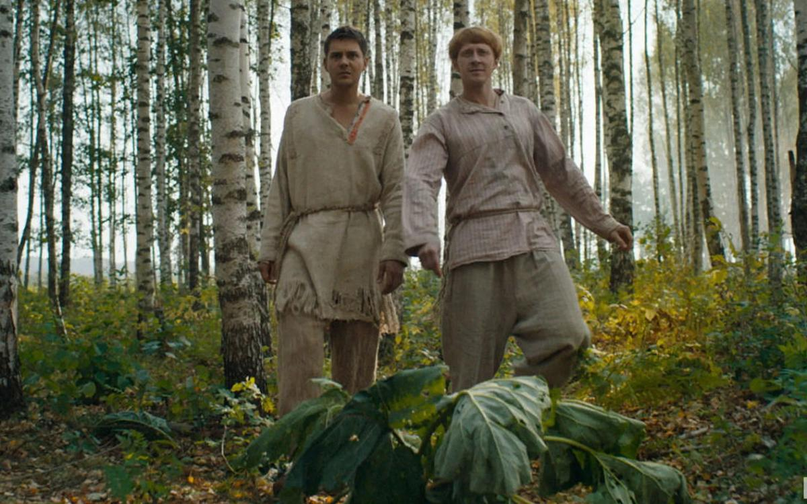

# «Холоп» подобрался к двум миллиардам. Почему главным фильмом Нового года стала комедия Клима Шипенко

- **URL:** https://novayagazeta.ru/articles/2020/01/09/83389-holop-podobralsya-k-dvum-milliardam
- **Дата:** 2020-01-09
- **Автор:** Лариса Малюкова

## «Холоп» подобрался к двум миллиардам

## Почему главным фильмом Нового года стала комедия Клима Шипенко

Кадр из фильма «Холоп». Kinopoisk.ruВышедшая в прокат 26 декабря приключенческая лента «Холоп» стала лидером уже в первый уик-энд и к сегодняшнему дню преодолела рубеж в 2 млрд рублей (при бюджете в 160 миллионов). Очередное «шоу Трумэна» в сарафанах и кокошниках для воспитания очередного Митрофанушки пришлось по душе разновозрастной аудитории. То, что не удалось декабристам, осуществил конюх-мажор Гриша, выскочив на коне из рабства в светлое будущее, да и «новогодний пирог» изрядно надкусил. Разбираемся в причинах успеха фильма вместе с режиссером Климом Шипенко.Это история мажора Гриши, попадающего в XIX век в качестве простого конюха. Таков психологический эксперимент по перевоспитанию зарвавшегося наглеца, гоняющего без правил на кабриолете и жонглирующего кредитками.

Во главе этой масштабной реконструкции – Демиург, режиссер в исполнении отвязного Ивана Охлобыстина. Рядом с ним переживающий за сына крупный бизнесмен (Александр Самойленко) и его решительная подруга телепродюсер (Мария Миронова)

Они и создают искусственное пространство, очередное «шоу Трумэна» в сарафанах и кокошниках для воспитания очередного Митрофанушки. И с дальней мельницы, маскирующей киностудию, шоураннеры наблюдают за происходящим в позапрошлом веке, делая поправки, корректируя онлайн-шоу по ходу развития событий.

Причины успеха

Их множество.

- Нестыдная комедия Клима Шипенко адресована самой широкой аудитории. Среди главных конкурентов в новогодней битве ( «Союз спасения», «Вторжение», «Фиксики против кработов») именно «Холоп» оказался самым универсальным предложением.
- Авторам и продюсерам удалось заинтересовать молодую аудиторию и возрастного зрителя, знающего назубок гайдаевский шлягер «Иван Васильевич меняет профессию».
- Сценаристы сшили востребованные жанры в одном предложении: мелодраму, приключения, костюмную комедию положений. Помимо экшена с авторским приветом Серджио Леоне доминирует романтическая линия: «рекою разноцветной любовь спасет мир». В том числе, от рабства (события в потешной деревне происходят в 1861 году в канун отмены крепостничества).

То, что не удалось декабристам, осуществил конюх-мажор Гриша, выскочив на коне из рабства в светлое будущее.

- При всей внешней архаике юмор в фильме злободневный, а фонвизинская назидательность проносится ближе к финалу легким облаком.
- В фильме много пародийного (пародия – самый популярный жанр в телеке), в том числе есть сатира на современное российское историческое кино и его достоверность. Герой — жертва ЕГЭ — сам ходячая пародия на «образованность» нового поколения, готового смириться с татаро-монгольским игом в XIX веке.
- В роли бэд-боя красавчик Милош Бикович («Лед», «Балканский рубеж», сериалы «Отель "Элеон"» (канал СТС), «Гранд» (канал «Супер») — новый кумир российских девушек.
- Каникулярный релиз вновь очистили от Голливуда: в расписании кинотеатров большинство сеансов отдано отечественным фильмам. Поэтому новогодняя битва разгорелась между ними.
- У фильма отличный сарафан.
- Но главная причина успеха — режиссер.

Клим Шипенкостановится одним из самых влиятельных российских режиссеров. Перед «Холопом» вышла его же криминальная драма «Текст», собрав неплохую кассу (379 833 609 руб.).До этого был приличный блокбастер «Салют-7» (сборы 783 169 039 руб.) И вот новая качественная комедия.

Мы поговорили с режиссером Климом Шипенко.

Клим Шипенко. Фото: Сергей Карпухин / ТАСС— «Холоп» вышел сразу за «Текстом». Вы снимали параллельно две картины?

— Нет. «Холопа» я снял раньше, летом. Смонтировал сразу же и начал готовить «Текст», который снимали зимой.

— Продюсеры ждали новогоднего слота для комедии?

— Да, время релиза «Холопа» было известно заранее.

— Идеи обоих фильмов исходили от продюсеров?

— Да, оба проекта предложил мой продюсер Эдуард Илоян. Книга и сценарий «Текста» ходили по рынку. Эдуард звонит: «Слушай, предлагают купить права, если ты будешь это делать, я — за». Я быстро прочитал книгу и сразу согласился. Это было просто предназначено для кино. А сценарий «Холопа» был у ребят Comedy Club Production. Эдуард сказал, что они хотят делать большой фильм. Я прочитал сценарий, поговорил с авторами, мы нашли общий язык. Показалось, что смогу с ними доработать сценарий.

Практически на обоих фильмах у меня был Final cut (окончательный монтаж), то есть все финальные творческие решения оставались за мной. Хотя спорили, обсуждали. Однако в «Тексте» ни одной правки по монтажу мне не дали. Им правда, показалось, что длинновато. Я объясняю: «Да, но так и должно быть». И они согласились. В «Холопе» примерно было так же: я показал монтаж. Мы его обсудили, что-то доделали… Но ничего принципиального. Поэтому мне действительно комфортно работать с Илояном.

Кадр из фильма «Холоп». Kinopoisk.ru— А насколько эта работа отличалось от создания «Салюта», где среди продюсеров были такие киногенералы, как Сельянов, Златопольский?

— Сильно отличалось. Все-таки «Салют» — командный фильм. Сельянов все контролировал. Вы же понимаете, это была моя первая крупная картина с большим бюджетом.

Я для них был темной лошадкой. Не могли же они просто так дать 400 млн: «Да делай, что хочешь!»

Смотрели внимательно, контролировали. Но мы обсуждали все идеи и с Бакуром Бакурадзе, он по-настоящему творческий человек.

— Сложнее участвовать в продюсерском кино?

— Вы знаете, по-разному. Другие игры. Надо просто на берегу договориться. Когда все творческие решения за мной, с одной стороны, мне это удобнее — меньше надо спорить, кого-то убеждать, энергии тратить… С другой — полностью моя ответственность. В продюсерском кино ты делишь ответственность с людьми, которые отвечают за проект, дальше будут им заниматься, продвигать, продавать.

Перед съемками «Холопа» мы договорились, что это фильм для массового зрителя, широкого проката, мы рассчитываем на кассу. С «Текстом» не было завышенных ожиданий от бокс-офиса. Не ставили такой задачи. А он собрал неплохую кассу. Наверное, стечение обстоятельств. Я сразу сказал продюсерам, что это будет честно. Они ответили: «Да, нас это устраивает».

«Текст» под редакцией времени

На экранах — долгожданная экранизация бестселлера Дмитрия Глуховского

— Получается, честно в «Тексте» и не очень честно в «Холопе»?

— Нет, просто разные жанры. Было ясно, что именно зритель ждет от такой комедии.

Если «Текст» — это кусок жизни, то «Холоп» — кусок вкусного сладкого пирога, который хочется попробовать в праздники.

— Просчитывая успех фильма, автор должен идти на какие-то уступки, чтобы зрителю было бы интересней, легче? Меняется творческая задача?

— Не совсем. Просто в массовом кино ты как автор постоянно не забываешь о зрителе, пытаешься ему понравиться. А «Текст»? Я не знал, понравится ли он, выйдет ли вообще в прокат. Просто делали как чувствовали. В «Салюте 7» мы про зрителя постоянно думали. Это не значит, что наступаешь на горло какой-то своей песне. То, что в «Холопе» или в «Салюте 7» мы снимали, мне самому было интересно. Но если даже сравнивать фильмы про космос. Есть «Солярис», а есть «Гравитация», у каждого своя аудитория.

— Мне кажется, что ваш путь, все-таки не чисто массовое кино, скорее стремление к арт-мейнстриму со зрительским потенциалом.

— Ну, конечно. И все же я больше не для себя, на зрителя работаю. При этом да, в каждой картине, в каждом жанре пытаюсь что-то добавить уникальное, свое.

Поддержите нашу работу!

1000 500 300 Нажимая кнопку «Стать соучастником», я принимаю условия и подтверждаю свое гражданство РФ

Если у вас есть вопросы, пишите [email protected] или звоните:+7 (929) 612-03-68

Кино под присмотром

Минкульт впервые раскрыл траты государственных миллиардов на кино: главное

— Ваш фильм сравнивают со многими картинами: от «Ивана Васильевича…» до «Мы из будущего». Что ваше «особенное», шипенковское в «Холопе»?

— Я хотел снять комедию как визуальный аттракцион. А не так, чтобы зритель сказал: «Ну ладно, эти шуточки посмотрим дома». Поэтому решил ее снимать, как вестерн Серджио Леоно. И сама эта деревня, и музыка, и зумы… И надеялся не только на юмор. Как сделать так, чтобы даже людям, которым не смешно, было интересно это смотреть. Много сцен сняты одними длинными планами, что нехарактерно для комедии.

— Да с долгими проездами камеры, заходами в барский дом, в «режиссерскую кабину».

— На это обращают внимание. К тому же, когда я работал со сценаристами, говорил о том, что

в хорошей комедии можно и всплакнуть в какой-то момент.

Мы не боялись затронуть серьезные проблемы. И ведь главный герой так или иначе, к Богу обращается в финале.

— Актеров выбирали вы?

— Да, я давно хотел с Милошем поработать, очень его люблю. Он же и умный, и красивый, и смешной… А все остальные приходили на пробы.

Кадр из фильма «Холоп». Kinopoisk.ru— Действие происходит в 1860-ом году, то есть за год до реформы. При этом ощущение, что с крепостным правом можно ужиться.

— Ну, вы понимаете, это комедия. Естественно, мы хотели мучить нашего барчука по полной программе, то есть без романтизации. Но интонация комедийная, может, создает такое ощущение.

— Да, интонация сказки, как в музыкальном фильме «Крепостная актриса» Тихомирова. Все-таки, к мажорам у нас отношение в стране специфическое, а ваш Григорий ближе к финалу вызывает сочувствие.

— Ну да, он же перестроился, переоценка произошла. А вначале должно быть отталкивающее ощущение.

Кадр из фильма «Холоп». Kinopoisk.ru— Многие хотят сделать кассовую комедию, это второй по главности после патриотизма тренд в кино — получается у немногих. Как вам кажется, чем «Холоп» привлек аудиторию?

— Мне кажется, прежде всего, разноплановостью. Это не просто такая себе комедия — поржать. Разные люди для себя могут какие-то разные вещи найти. И, безусловно, мы же понимаем, что если бы фильм вышел не в новогодние праздники, наверное, собрал бы какую-то кассу, но не рекордную. Каникулярный фактор сильно влияет на посещаемость. Но, с другой стороны, мы же знаем фильмы из новогоднего релиза, на которые не слишком охотно идут зрители, несмотря на праздники.

Руки прочь от Жириновского!

Раз ему не съездили по физиономии, может, он и прав

— И несмотря на артиллерийский обстрел зрителя на главных федеральных каналах.

— Да, изо всех утюгов с утра до вечера бомбят. Что касается «Холопа», думаю, что зрителю в нужное время дали нужный состав ингредиентов в одном фильме, и это пришлось, как говорится, к столу. Может быть, зимой публика нуждается в солнечной комедии про любовь, с музыкой…

— Как вам кажется, смех объединяет или разъединяет?

— Конечно, объединяет. Люди вместе смеются в зале, чувствуют, что поучаствовали в каком-то общем радостном событии.

Кадр из фильма «Холоп». Kinopoisk.ru— Просто смеются над разным: одни над Петросяном, другие над Comedy Club, третьи над английской комедией.

— Ну, хорошо. Главное, чтобы смеялись, а не конфликтовали непримиримо.

— Вы учились в Калифорнии кинопроизодству, операторскому мастерству, потом актерству. Американское образование помогает или мешает в реалиях российского кино?

— Мне кажется, универсальность моего образования очень поддерживает: когда не все тебе дается, многое приходится перепридумывать, делать самому.

Думаю, режиссерам полезно поучиться и на операторов, и освоить монтаж, и актерами побыть. Чтобы знать, что сказать актеру, когда тикает время, и заходит солнце.

— Но американская система кинопроизодства все-таки существенно отличается от нашей.

— Там больше конкуренция на всех должностях. Поэтому режиссеру не обязательно быть универсалом. Оператор столь высокого уровня, что не требуется помощи режиссера. Или реквизитор, художник-постановщик. А у нас бывает по-разному. И часто уволить человека не можешь, потому что нет никого взамен, и поэтому вынужден все сам делать. В Америке все бегают, прыгают, на каждую позицию стоит длинная очередь из профи.

— И последнее, ваше имя Клим… Неужели это в честь Ворошилова?

— Ну, в семье разные версии. Последнее, что я слышал, меня назвали в честь Элема Климова.

— «Иди и смотри» ваш любимый фильм?

— Нет, это слишком тяжелый фильм, чтобы быть любимым.

— Ну, значит, комедия «Добро пожаловать, или Посторонним вход воспрещен»?

— Безусловно, я с большой любовью отношусь ко всему его творчеству и высочайшей степени профессионализма.

Поддержите нашу работу!

1000 500 300 Нажимая кнопку «Стать соучастником», я принимаю условия и подтверждаю свое гражданство РФ

Если у вас есть вопросы, пишите [email protected] или звоните:+7 (929) 612-03-68
