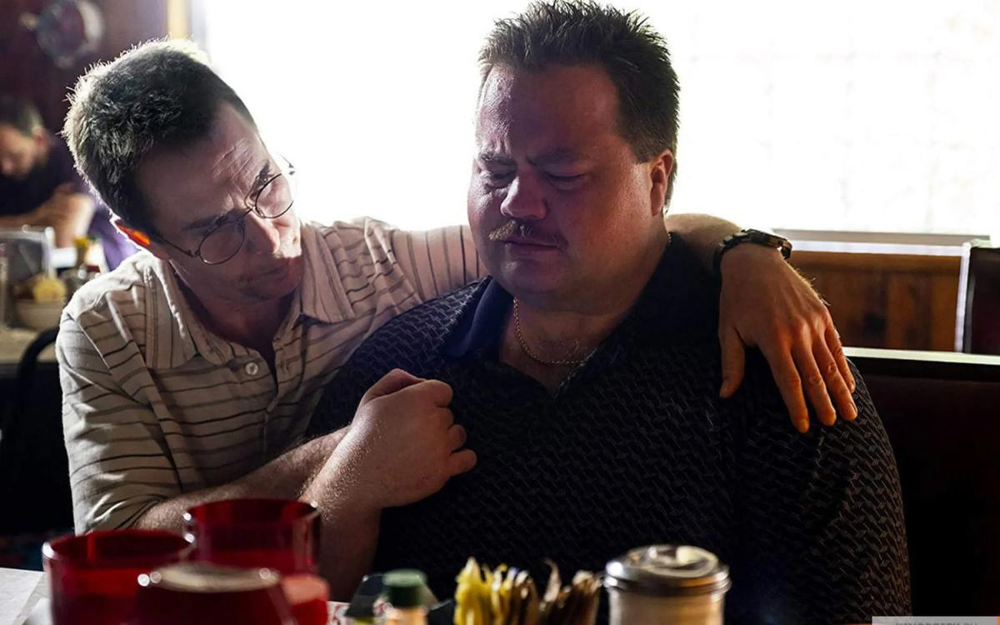

# Обвинен? Значит, не виноват! Драма Клинта Иствуда «Дело Ричарда Джуэлла» — о том, что может сделать с человеком система

- **URL:** https://novayagazeta.ru/articles/2020/01/13/83428-obvinen-znachit-ne-vinovat
- **Дата:** 2020-01-13
- **Автор:** Лариса Малюкова

## Обвинен? Значит, не виноват!

## Драма Клинта Иствуда «Дело Ричарда Джуэлла» — о том, что может сделать с человеком система

Кадр из фильма «Дело Ричарда Джуэлла». Kinopoisk.ruЕго прошлогодний «Наркокурьер» некоторые критики именовали последним фильмом 89-летнего классика. А неубиваемый ковбой снимает. Снимается. Продюсирует. И вместо того, чтобы отбыть в горние выси отвлеченных философствований, сочиняет кино высокого напряжения, подключенного к току современности. «Дело Ричарда Джуэлла» — повествование про национального героя, объявленного террористом. Реальная история, прогремевшая на весь мир, вначале превратилась в книгу Кента Александра и Кевина Салвена «Подозреваемый», по мотивам которой и сделана картина.Лето 1996-го. Олимпийские игры в Атланте в разгаре. Смешной увалень охранник Ричард Джуэлл (Пол Уолтер Хаузер) дежурит в Парке Столетия на поп-концерте своей любимой группы «Jack Mack and the Heart Attack». Ночное дежурство не заладилось: у него болит живот, его дразнят отвязные подростки, размахивающие недопитыми бутылками. Но по обыкновению, он сдержан и бдителен. И обнаружив под скамейкой подозрительный рюкзак, следует инструкции: вызывает саперов и поднимает тревогу. Тем самым спасает тысячи жизней, спасает Олимпиаду. Бомба все равно взорвется, будут раненые и даже два убитых — но трагедия могла быть страшнее. На три дня Ричард превращается в национального героя. Его снимают главные новостные компании, ему даже предлагают написать книгу. Им так гордится мама (незабываемая Кёти Бейтс), с которой он душа в душу обитает в крошечной квартирке. Дальше начинается ад.

Спецслужбы, ищущие «взрывника», в череде других подозреваемых составляют и на Ричарда профайл, доказывающий, что он и есть террорист-одиночка. И не совсем на пустом месте. Посудите сами. 33-х летний белый, разочарованный в жизни толстяк неопределенной ориентации живет с мамой. Мечтает стать героем. Собрал гору оружия (дело происходит в штате Джоржиа, здесь разрешено приносить оружие даже в церкви и школы). С мутным прошлым. А тут еще на беду Ричарда к расследованию подключается пронырливая, амбициозная, циничная журналистка Кэти Скраггс (Оливия Уайлд), для которой эта история – тема первополосного скандала… Песенка безобидного рохли спета, и большой вопрос — поможет ли ему опекающий его адвокат Брайант (Сэм Рокуэлл).

В фильме два героя – маленький человек и государство. Над охранником, с маниакальным усердием, следующим инструкции, посмеиваются настоящие полицейские («Что ты прицепился к этому рюкзаку, там наверняка пиво!», его недолюбливают студенты (в Колледже Пьемонта не забудут ярого блюстителя нравственности, порядка и трезвого образа жизни).

Маленький человек мечтает верой и правдой служить государству, за что безжалостно наказан.

Государство олицетворяют агенты ФБР, масс-медиа и собственно народ, мнение которого формируют государство и масс-медиа. Спецслужбы влезают в частную жизнь Ричарда, грязными ногами топают по их комнатам («Они даже обувь не снимут?», — восклицает обескураженная миссис Бейтс), выносят все, включая дорогие сердцу мамаши Бейтс пластмассовые кухонные контейнеры… Потом их вернут, и на каждом будет номер — клеймо несмываемого позора. Джуеллов преследуют «органы» и толпы журналистов.

Избегая клише и однозначности, режиссер размышляет над непростой вечной проблемой взаимоотношений человека и власти. Возможно ли вообще сохранить себя и самоуважение в этих отношениях? Иствуд делает героем обжору, лузера, почти фрика, мечтающего, как о манне небесной, о службе в полиции. Верующего, как в Иисуса Христа, в справедливость закона и правоохранителей… Его доверчивость, похожая на стокгольмский синдром, на руку фэбээровцам.

Пользуясь его доверием, правоохранители устраивают театрализованные следственные эксперименты. Прослушивают. Обыскивают. Допрашивают. Записывают. Выжимают признательные показания… Ричард и его мать месяцами скрываются дома — осаду держат камеры и папарацци.

Поддержите нашу работу!

1000 500 300 Нажимая кнопку «Стать соучастником», я принимаю условия и подтверждаю свое гражданство РФ

Если у вас есть вопросы, пишите [email protected] или звоните:+7 (929) 612-03-68

Кадр из фильма «Дело Ричарда Джуэлла». Kinopoisk.ruДля Иствуда Ричард — герой, который не совершает подвига. Всего лишь делает то, что должен. И за это его превращают в участника популярного в нынешней Америке (да и не только Америке) шоу «сотвори себе террориста». Три дня славы и 88 дней расследования, которое разрушает его жизнь.

Из фильма в фильм режиссер рассказывают об обычных людях. О том, том, что они и есть настоящая Америка, а не фейковая страна, про которую вещают СМИ.

Это пилот, посадивший неисправный самолет («Чудо на Гудзоне)», десятилетний мальчик, потерявший в автокатастрофе брата-близнеца («Потустороннее»), туристы, предотвратившие атаку в поезде («Поезд на Париж»), «морской котик» Крис Кайл («Снайпер»), так и не выползший из войны, одинокий старик, вознамерившийся выползти из нужды с помощью кокаина («Наркокурьер»).

Серые кардиналы и консервативные наркокурьеры

Почему фильмы «Власть» Адама Маккея и «Наркокурьер» Клинта Иствуда надо смотреть?

Кино «Дело Ричарда Джуэлла» об уязвимости каждого, кому не повезло оказаться на пути государственного танка. Об унижении и бесправии в свободном мире. И какие же нужны внутренние силы это колоссальное унижение пережить.

В роли Ричарда фантастически достоверный Пол Уолтер Хаузер. Известный больше по ролям негодяев актер создает трехмерный характер, в котором честность, простодушие доведены почти до абсолюта, до глупости. При этом герой вызывает сострадание и не выглядит идиотом. Во всяком случае, в бытовом значении слова.

Фильм, как случается с картинами Иствуда последних лет, обвиняют левые и правые. Правые за антиправительственный пафос. Левые — за пропаганду милитаризма. Кроме того, после премьеры вокруг картины разгорелся скандал, связанный с одной из его линий. По сюжету журналистка из The Atlanta Journal-Constitution Кэти Скраггс (Оливия Уайлд) соблазняет агента ФБР (Джон Хэмм, «Безумцы»), чтобы первой получить эксклюзивную информацию о подозреваемом террористе. Реальная Кэти Скраггс умерла в 2001-ом, и теперь ее работодатель и издатель утверждает, что имя честного корреспондента опорочено, требуя опровержений от режиссера и киностудии Warner Bros. В официальном ответе студии говорится:

«Печальная ирония состоит в том, что именно та газета, которая первой поспешила назначить Ричарда Джуэлла виновным, теперь пытается очернить нашу команду кинематографистов и актеров».

Иствуда не первый раз обвиняют в сексизме, крайнем консерватизме. Режиссер с пятидесятилетним стажем и безупречной репутацией в Голливуде не скрывает своих патриотических республиканских взглядов. Но сам не прочь посмеяться над расизмом, сексизмом и собственными твердокаменными взглядами. В «Наркокурьере» герой Иствуда, опрометчиво обзывает чернокожую семью «неграми» и немедленно исправляется, видя их обиду. Режиссер не боится откровенной сентиментальности, морализаторства. Не избегает показательной демонстрации унижения Молохом маленького человека. И все это складывается в пейзаж его любимой Америки. Впрочем, есть такая сцена в фильме. Русская секретарша адвоката Брайтона Надя заявляет: «У меня на родине если кого-то обвиняют, значит он невиновен». Откуда Иствуд все про нас знает?

Поддержите нашу работу!

1000 500 300 Нажимая кнопку «Стать соучастником», я принимаю условия и подтверждаю свое гражданство РФ

Если у вас есть вопросы, пишите [email protected] или звоните:+7 (929) 612-03-68
