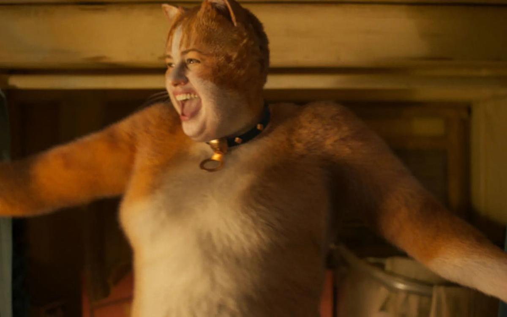

# Трампова «Малина». Названы претенденты на «анти-Оскар» — премию «Золотая малина»

- **URL:** https://novayagazeta.ru/articles/2020/01/13/83433-trampova-malina
- **Дата:** 2020-01-13
- **Автор:** Лариса Малюкова

## Трампова «Малина»

## Названы претенденты на «анти-Оскар» — премию «Золотая малина»

Кадр из фильма «Кошки». Kinopoisk.ruСороковое вручение «Золотой малины» состоится за день до «Оскара» 8 февраля.

В 1980 году синефил Джон Уилсон, написавший книгу «Все, что я знаю, я узнал из кино», учредил антипремию для самых сомнительных достижений в кино. Премия получила название «Золотая малина» (иногда ее называют «Золотой клюквой»). Антипремия вручается в 11 номинациях, которые незначительно варьируются.

В главной номинации «Худший фильм»представлены «Годзилла 2: Король монстров», «Зеровилль», «Море соблазна», «Похороны Мэдэи», «Призраки Шэрон Тейт», «Репродукция», «Рэмбо: Последняя кровь», «Стекло», «Фанатик», «Хеллбой» и «Кошки».

Вероятный победитель — «Кошки».

### «Кошки»

«Это буквально невероятно. Я надеюсь, что никогда не увижу его снова», — ужасается эксперт издания Vox.

Сильный конкурент «Кошек» — «Фанатик». Неудачная психодрама Фреда Дёрста о маниакальном преследовании известного артиста с Джоном Траволтой, который регулярно оказывается среди претендентов на «Золотую малину», а в 2001 году стал победителем сразу в трех номинациях. По мнению букмекеров, именно этот фильм победит в гонке за звание худшей картины года.

Поддержите нашу работу!

1000 500 300 Нажимая кнопку «Стать соучастником», я принимаю условия и подтверждаю свое гражданство РФ

Если у вас есть вопросы, пишите [email protected] или звоните:+7 (929) 612-03-68

Есть шанс и у «Хеллбоя». Продолжение известной франшизы, вышедшее, увы, без режиссера первых двух частей, Гильермо дель Торо, разочаровало фанатов. Фильм Нила Маршалла критикуют за отсутствие атмосферы, скачкообразность и нелогичность сюжета.

Впрочем, на нынешней премии у него много конкурентов.

На звание «Худшего режиссера»поборются Андреа Берлофф («Адская кухня»), Эдриан Грюнберг («Рэмбо: Последняя кровь»), Майкл Доэрти («Годзилла: Король монстров»), Фред Дёрст («Фанатик»), Нил Маршалл («Хеллбой»), Дэниэл Фэррандс («Призраки Шэрон Тэйт»), Джеймс Франко («Зеровилль»), Ной Хоули («Люси в небесах») и М. Найт Шьямалан («Стекло»).

В прошлом году на награду в категории «Худший актер» претендовал Джонни Депп за озвучивание мультфильма «Шерлок Гномс», его конкурентами были Брюс Уиллис и Джон Траволта.

Но обошел всех Дональд Трамп, явивший себя в консервативных документальных фильмах «Смерть нации» и «Фаренгейт 11/9». Он и победил в номинации «Худший актер».

В номинации «Худший актерский дуэт» партнером президента стала его «Бессменная мелочность» — так заявили организаторы премии в пресс-релизе.

«Оскар» объявил номинантов

Лариса Малюкова — о потенциальных лауреатах одной из главных кинопремий мира

О пластмассовой ягоде-«Малине» забывают очень быстро. Практически на следующий день, когда звучат фанфары «Оскара» и золотые статуэтки начинают монетизироваться в цифрах бокс-офиса.

Поддержите нашу работу!

1000 500 300 Нажимая кнопку «Стать соучастником», я принимаю условия и подтверждаю свое гражданство РФ

Если у вас есть вопросы, пишите [email protected] или звоните:+7 (929) 612-03-68
