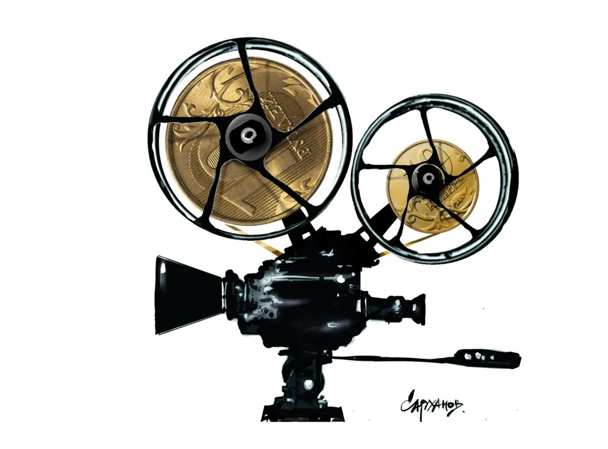

# Долговая яма кинематографа.  Продолжается скандал вокруг штрафных санкций в кино

- **URL:** https://novayagazeta.ru/articles/2020/01/31/83708-dolgovaya-yama-kinematografa
- **Дата:** 2020-01-31
- **Автор:** Лариса Малюкова

## Долговая яма кинематографа

## Продолжается скандал вокруг штрафных санкций в кино

Иллюстрация: Петр Саруханов / «Новая газета»Поговорку о том, что «мыло–мочало, начинай сначала», можно повторять бесконечно. СМИ снова дружно пишут о задолженности режиссера Сергея Соловьева, связанной с проектом «Елизавета и Клодиль», романтической историей о двух барышнях — русской и француженке, в начале ХХ века сбежавших из дома. Но исторические катаклизмы не миновали их и на нормандском взморье. По сведениям Минкульта, на производство фильма, который был начат, но не завершен, в 2009 году было выделено 25,5 млн руб. В общей сумме долг со штрафными санкциями на сегодня составляет 34,6 миллиона.

После заключения контракта с государством съемки откладывались по разным причинам: в частности, болел один из исполнителей главных ролей (Пьер Ришар), а в жизни Сергея Александровича произошла трагедия — умер его сын.

По сообщениям медиа, приставы арестовали счета Соловьева и его компании «Линия кино», после чего режиссер был госпитализирован. Однако близкие Сергея Соловьева пояснили, что госпитализировали его раньше: из-за сахарного диабета у него образовалась трофическая язва на ноге, возникла угроза сепсиса.

Сергей Соловьев. Фото: Владимир Трефилов / РИА НовостиСудя по всему, история с долгами Минкульту вовсе не частная проблема режиссера, но касается всей киноотрасли.

Напомним, буквально неделю назад подобный скандал шумел вокруг имени Сергея Дворцевого, рассказавшего, что Министерство культуры требует от него выплаты штрафа в размере 7 млн рублей за завершение фильма «Айка» позже установленного срока сдачи (два года). При этом фильм «Айка» (совместное производство Казахстана и России) не только участвовал в Каннском кинофестивале, но и получил там награды.

Думаю, эта история не последняя. Волны скандалов связаны во многом с публикацией открытой базы данных о государственной поддержке кинопроизводства по линии Минкультуры и Фонда кино. Новый раздел сайта ЕАИС (Единая автоматизированная информационная система сведений) начал работать с 21 октября прошлого 2019-го. Безусловно, это был шаг к прозрачности индустрии. Но публикация черного списка должников оказалась бомбой замедленного действия. Теперь то и дело (дальше — больше) муссируются имена авторов, обремененных долговыми обязательствами.

Ежегодно государство выделяет на производство российских фильмов более 5 миллиардов рублей.

Размер основного долга на 24 января 2020 г. — 447 497 830 руб.

Не так давно Владимир Мединский рассказал о почти 20 судебных разбирательствах Минкульта с кинопроизводителями, не выполнившими условия господдержки. По мнению экс-министра, их присутствие в открытых черных списках должно мотивировать должников вернуть деньги в казну. Тем более пока должники значатся в специальном реестре, их заявки на получение государственной поддержки не будут рассматривать.

Кадр из фильма «Тайны Снежной королевы». Фото: kinopoisk.ruСреди должников числились создатели «Тайны Снежной королевы» Натальи Бондарчук (возвратных средств — 20 000 000 руб., безвозвратных — 5 300 000 руб.). Фильм провалился в прокате. Уже не вернет деньги «Киностудия «Чеченфильм», создатель «Тоски» по произведениям Чехова. Не отчитавшись за 21 850 000 безвозвратных руб., студия была ликвидирована. Один из крупнейших должников — компания «Энджой Мувиз» (Enjoy Movies) за фильм «Аладдин». Фонд кино подал в Арбитражный суд Москвы иск к этой кинокомпании, потребовав почти 113 миллионов рублей. Кстати, следы этого фильма о Ходже Насреддине отыскать не удалось, зато продюсеры начали возвращать долг. В черном списке и «Блюз для саксофона» «МВ Синема» (режиссер Максим Воронков, продюсер Игорь Бутман). Компания «Медиа Арт Студио», снявшая фильм «Герой» (режиссер Юрий Васильев) с Дмитрием Биланом должна 59 187 345.24 руб. За фильм «Дед Мороз. Битва магов» 46 878 960 руб. обязана рассчитаться студия «Ангел».

В результате судебных разбирательств за 2019 год Минкультуры России и Фонд кино вернули в бюджет около 700 миллионов рублей; у Фонда кино есть возможность реинвестировать возвращенные деньги в производство новых фильмов.

Хронический должник — киностудия «Ленфильм» (у студии также и кредитная задолженность, и налоговая).

Жертвой непродуманного менеджмента стал талантливый ленфильмовский дебют «Мальчик русский» Александра Золотухина, ученика Александра Сокурова.

Поддержите нашу работу!

1000 500 300 Нажимая кнопку «Стать соучастником», я принимаю условия и подтверждаю свое гражданство РФ

Если у вас есть вопросы, пишите [email protected] или звоните:+7 (929) 612-03-68

Этот фильм собрал целый букет наград, среди недавних — «Лучший дебют года» на премии критиков «Белый Слон».

Сколько еще фильмов и авторов (как, например, Сергей Соловьев) окажутся под прицелом судебных разбирательств?

Может быть, сама система финансирования кино нуждается в проработке и уточнении?

Существует российское законодательство, есть предписание Счетной палаты, которое запрещает отменять штрафы. Более того, Счетная палата рассчитывала формулу, по которой определяется сумма штрафных санкций, а контролирующие органы регулярно проводят проверки финансовой деятельности министерства и Фонда кино. Так что инициатор истребования долгов с кинокомпаний и продюсеров — не Министерство культуры, как можно заключить из медийных сообщений. Другое дело, что продюсеры подписывают договор с учетом календарного плана съемок именно с Минкультом или Фондом кино. Существуют условия двух- и трехлетнего финансирования, возможность получить возвратные и невозвратные средства. Подписывая договор, который невозможно исполнить, продюсер сам загоняет себя в угол, если не учитывает все риски. Но продюсер вам объяснит, что судьбу фильма в прокате трудно предсказать: кино — рискованный бизнес, особенно в России. Нельзя сбрасывать со счетов и то, что целый ряд достойных картин разных жанров имели низкие сборы, то есть, по сути, были убиты в прокате из-за плохого продвижения продюсерами и дистрибуторами.

Кадр из фильма «Мальчик русский». Фото: kinopoisk.ruМногие кинематографисты возвращают долг, исполняя обязательства (ради этого влезают в новые долги, собирают деньги с помощью краудфандинга, закладывают квартиры).

- Режиссер Гарри Бардин выплатил штраф за то, что не успел вовремя завершить фильм «Три мелодии».
- Вернул полученные средства продюсер Артем Васильев, на раннем этапе участвовавший в долгострое «Дау» Ильи Хржановского.
- Компания «Нейрон» из 20 миллионов рублей долга за фильм «Вещий Олег» вернула 10 млн.

Но практика показывает, что не все способны выполнить свои обязательства.

Продюсеров-мошенников, которые громко заявляют о начале съемок картины, берут средства, а потом исчезают, — единицы. А как быть с авторами, стремящимися к созданию произведения искусства? Как учесть все обстоятельства, порой драматические, возникающие в процессе творчества? Одни эксперты советуют ввести премиальную систему. И картины, отмеченные на крупных фестивалях наградами, поощрять финансово, чтобы их создатели могли расплатиться с долгами за превышение сроков производства. Другие предлагают расширить список форс-мажорных обстоятельств (сегодня это в основном больничные листы и справки о смерти) и учитывать их при расчете долга (например, у Дворцевого, с которого потребовали 7 млн руб. долга, в процессе съемок умер зарубежный продюсер, что привело к нарушению сроков сдачи картины).

Министр культуры РФ Ольга Любимова. Фото: Михаил Климентьев / РИА НовостиЧиновники считают, что у всех кинематографистов должны быть равные права и обязательства. «Я не могу перенести сроки, — объясняла министр культуры Ольга Любимова, до недавнего времени возглавлявшая департамент кино, — потому что в тот момент, когда я одним сроки переношу, а другим не переношу, возникает конфликт интересов — предполагается, что в этом может быть моя заинтересованность».

Руководитель кинокомпании СТВ, сопредседатель правления Ассоциации продюсеров кино и телевидения Сергей Сельянов неоднократно призывал правительство смягчить возвратную схему финансирования проектов через Фонд кино и Минкульт.

Разумеется, нет резона призывать министерство к нарушению закона, но, возможно, в связи с участившимися скандалами пришло время обсудить проблему всем экспертным сообществом: как сделать систему госфинансирования не только прозрачной, но и более пластичной, гуманитарной.

Изменить финал или изменить себе?

Почему продюсеры отказываются от сотрудничества с Андреем Звягинцевым

Например, учитывать не только финансовые показатели, но и вклад авторов фильма в развитие кинематографа, различать возможности блокбастеров и авторского кино, устанавливать разные сроки для съемок в зависимости от сложности проекта (вспомним такие фильмы-долгострои, оставшиеся в истории мирового кино, как «С широко закрытыми глазами» Кубрика, «Трудно быть богом» Германа, «Дурная кровь» Слейзера). Здесь требуется внимание и компетентность экспертных жюри, к которым сегодня много претензий. Кстати, в этом смысле уже сделаны первые шаги. У продюсеров и авторов полнометражной арт-анимации есть возможность продлить время создания фильма до пяти лет. Пять лет для создания шедевра — срок не такой уж большой. И трудно не согласиться с продюсером Сергеем Сельяновым (в прошлом режиссером авторского кино), предостерегающим Минкульт и Фонд кино от полной трансформации в «кредитно-финансовые организации», которые руководствуются в распределении средств исключительно прокатными перспективами. «Общие фильмы и мультфильмы, — говорит он, — объединяют нас в нацию. Есть проекты, на которых необязательно нужно зарабатывать».

Поддержите нашу работу!

1000 500 300 Нажимая кнопку «Стать соучастником», я принимаю условия и подтверждаю свое гражданство РФ

Если у вас есть вопросы, пишите [email protected] или звоните:+7 (929) 612-03-68
