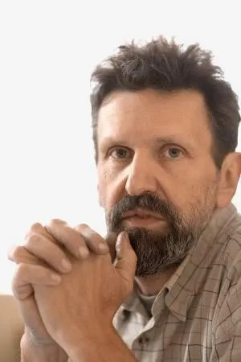

# Режиссер Александр Петров: «Уходит время, и болезнь не оставляет шансов...». Подпишите петицию за право больных детей

- **URL:** https://novayagazeta.ru/articles/2020/02/05/83790-podpishite-petitsiyu-za-pravo-bolnyh-detey
- **Дата:** 2020-02-05
- **Автор:** Лариса Малюкова

## Режиссер Александр Петров: «Уходит время, и болезнь не оставляет шансов...»

## Подпишите петицию за право больных детей

Александр Петров

Режиссер анимационного кино, четырежды номинант и лауреат премии «Оскар»

— У нас отзывчивый народ. Люди готовы поделиться, часто скромными средствами, чтобы помочь больным детям. Соберут и сто тысяч и пять миллионов. Вопрос только, успеют ли через СМС пожертвования вовремя добыть их. Уходит время, и болезнь не оставляет шансов…Чтобы такая помощь пришла вовремя и в нужном объеме, нужна организованная сила.

И безусловно, эта сила есть у государства. В его сфере ответственности должны быть борьба за здоровье этих детей, равно как и борьба с причинами таких хронических недугов, как нищета, грязная атмосфера, плохое обеспечение лекарствами.

Я полностью поддерживаю письмо сотрудников Новой газеты. Все правильно.

Поддержите нашу работу!

1000 500 300 Нажимая кнопку «Стать соучастником», я принимаю условия и подтверждаю свое гражданство РФ

Если у вас есть вопросы, пишите [email protected] или звоните:+7 (929) 612-03-68
