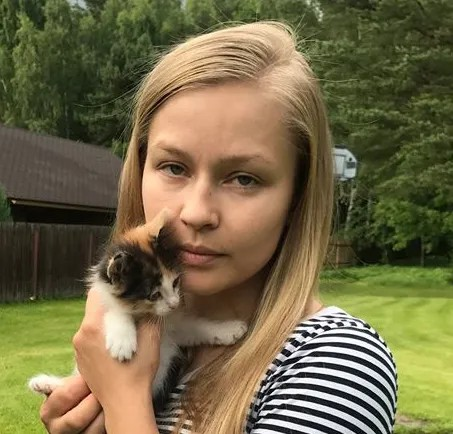

# Юлия Пересильд: «Хочется верить, что все-таки будут написаны законы для детей с редкими заболеваниями». Подпишите петицию за право детей на лечение

- **URL:** https://novayagazeta.ru/articles/2020/02/06/83803-yuliya-peresild-hochetsya-verit-chto-vse-taki-budut-napisany-zakony-dlya-detey-s-redkimi-zabolevaniyami
- **Дата:** 2020-02-06
- **Автор:** Лариса Малюкова

## Юлия Пересильд: «Хочется верить, что все-таки будут написаны законы для детей с редкими заболеваниями»

## Подпишите петицию за право детей на лечение

Юлия Пересильд

актриса театра и кино, заслуженная артистка РФ

### «Откуда вообще взять такие средства, чтобы ребенку помочь?»

— Дорогие друзья! Хочется верить, что чудо может происходить не только в новогодние праздники. Во что хочется верить? В то, что все-таки будут написаны законы для детей с редкими заболеваниями.

Поддержите нашу работу!

1000 500 300 Нажимая кнопку «Стать соучастником», я принимаю условия и подтверждаю свое гражданство РФ

Если у вас есть вопросы, пишите [email protected] или звоните:+7 (929) 612-03-68

Потому что невозможно себе представить, что чувствуют родители, которые сталкиваются с этими проблемами. Непонятно, ни что делать, ни куда идти, ни где эти специалисты.

А самый главный вопрос: откуда вообще взять такие [огромные] средства, чтобы ребенку помочь? Я думаю, что помочь — возможно. Поэтому я и хотела бы подписать эту петицию.

Поддержите нашу работу!

1000 500 300 Нажимая кнопку «Стать соучастником», я принимаю условия и подтверждаю свое гражданство РФ

Если у вас есть вопросы, пишите [email protected] или звоните:+7 (929) 612-03-68
