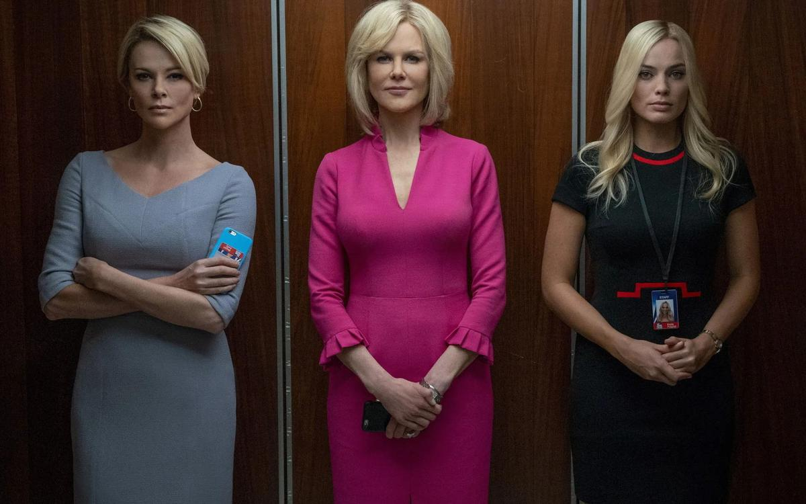

# #MeToo снова захватывает Голливуд. «Скандал» на оскаровской неделе

- **URL:** https://novayagazeta.ru/articles/2020/02/08/83824-metoo-snova-zahvatyvaet-gollivud
- **Дата:** 2020-02-08
- **Автор:** Лариса Малюкова

## #MeToo снова захватывает Голливуд

## «Скандал» на оскаровской неделе

Кадр из фильма «Скандал»Только что о сексуальном насилии и сексизме размышляли во флагманском сериале Apple «Утреннее шоу» или в напряженной восьмисерийной драме Netflix «Невероятное», сериале HBO «Самый громкий голос в комнате». «Скандал» ожидаемо не заставил себя ждать. Джей Роуч снял его по сценарию оскароносца Чарльза Рэндольфа. В его основе — ​истории сотрудниц одного из крупнейших телеканалов Fox News, обвинивших в сексуальных домогательствах своего генерального директора Роджера Айлза. Айлз возглавлял и формировал канал, принадлежащий Руперту Мердоку, со дня его основания. В 2017-м, через год после позорного увольнения, Роджер Айлз скончался. Тогда и было объявлено о начале работы над проектом. Авторы разговаривали с бывшими корреспондентками и ведущими Fox News, читали показания женщин о сексуальных домогательствах в телекомпании.

Фильм «Скандал» — ​это прежде всего бенефис трех талантливых блондинок: Шарлиз Терон, Николь Кидман и Марго Робби.

Николь Кидман — ​в роли Гретхен Карлсон, бывшей ведущей и комментатора телеканала, первой подавшей против Айлза иск, в котором обвинила его в сексуальных притязаниях. Она заявила, что могущественный босс «разрушил ее карьеру после отказа ублажать его желания». В 2017-м Карлсон вошла в сотню самых влиятельных людей в мире по версии журнала Time.

Кадр из фильма «Скандал»Шарлиз Терон непостижимым образом перевоплотилась в известную телезвезду Мегин Келли — ​ту самую американскую журналистку, которая задавала провокационные вопросы и уличала в мизогинии Трампа (а еще дважды интервьюировала Путина). В июле 2016 года Келли назвала себя еще одной жертвой сексуальных домогательств гендиректора Fox News.

Марго Робби здесь — ​вымышленный собирательный персонаж. Ее Кайла из патриархальной консервативной семьи, «христианский авторитет» в Instagram. Мечтает о карьере ведущей на самом консервативном канале Америки и почти готова расплатиться за успех унижением.

В самом начале фильма экскурсию по многоэтажной телекомпании проводит Келли (Терон). В обтягивающем платье она уверенной походкой хозяйки идет по этажам и коридорам, комментируя мужские комплименты и взгляды.

Кадр из фильма «Скандал»Рассказывает об особых правилах, установленных главой канала Роджером Айлзом, опытным лисом с большим животом (Джон Литгоу). Советник Никсона, Рейгана, Буша, сторонник Трампа.

«Камера — ​на ноги ведущей!» — ​орет Айлз на режиссера. Главное в кадре — ​ножки на каблуках. Кто откажется от его особой милости, пусть пеняет на себя.

Например, Гретхен Карлсон (Николь Кидман). После публичного унижения и увольнения она вместе с адвокатами пускается в опасный поход против могущественного телемагната, рассказывая, как на канале происходит обмен сексуальных услуг на профессиональные. А жирная свинья с раздутыми суставами Айлз продолжает охоту на молодых сотрудниц. Кто посмеет ему отказать? Ну уж точно не благонравная католичка Кайла. Путь к эфиру тернист, надо как минимум задрать до трусов платье, доказав боссу свою лояльность.

Поддержите нашу работу!

1000 500 300 Нажимая кнопку «Стать соучастником», я принимаю условия и подтверждаю свое гражданство РФ

Если у вас есть вопросы, пишите [email protected] или звоните:+7 (929) 612-03-68

Кадр из фильма «Скандал»Один из любопытных моментов в фильме — ​реакция коллектива. Того самого, что ради «корпоративной этики» и общего благополучия готов признать нормой сексуальные домогательства и психологическое давление. Готов превратиться в соучастника и свидетеля узаконенного принуждения к секс-услугам. Отвернуться от «выскочек», «тех, кто хочет пропиариться и прыгает в постель к боссам». Ну конечно, бывало всякое, но это лишь отдельные проблемы, а не часть континуума принуждения.

Вариантов для самооправдания море. Например: «А что? Разве мы не так хороши? Понятно, почему Роджер нас хочет!» В общем, не суди босса, да не судима будешь. Перед каждым хранителем молчания стоит непростой выбор: честность или карьера, мораль или зарплата. Назови извращенца извращенцем — ​немедленно будешь уволена. Признаешься, что стала жертвой абьюза, — ​не отмыться.

Мощнейшая работа Терон, которая неоднократно доказала способность к фантастическим трансформациям. Вспомните ее в роли страшной тетки-глыбы в «Монстре». И вот снова сложный пластический грим. У нее заостряется подбородок, раздуваются ноздри (ноздрям «этой красивой дурочки» Трамп посвятил отдельный твит), ее голос обретает металл, напор, даже надрывность. И вот уже не Терон, а амбициозная Мегин Келли ведет гладиаторские бои — ​сложнейшие дебаты с Трампом, уличая его в домашнем насилии, в настоящей войне против женщин.

Фильм Роуча — ​сплав документов и придуманной психодрамы о могущественном пауке и нарядных бабочках в мини-юбках, устроивших революцию и свергнувших секс-диктатора гигантской телеимперии.

Кадр из фильма «Скандал»С точки зрения новой идеологии «нейтрального общества» с массовой люстрацией провинившихся или подозреваемых абьюзеров, «Скандал» продуманно выверен. И скорее ставит вопросы, нежели занимается их решением. Впрочем, откровенных разоблачений картина не несет, случай с Роджером Айлзом широко известен. «Скандал» плакатно суров, словно у самих авторов-мужчин хватает смелости только на манифесты. Не дай бог неправильно пошутить — ​активистки#MeToo снесут фильм с афиши. Айлз изображен почти карикатурным чудовищем. При этом Руперт Мердок, владелец Fox News, который не мог быть «в неведении», смотрится в исполнении Малкольма Макдауэлла невинным и справедливым третейским судьей. Он, конечно же, благодарен Айлзу за верную службу, но что делать, такие времена.

В финале Мердок сочувственно говорит Айлзу: «Мне жаль, что до этого дошло». «Мне тоже», — ​отвечает получивший миллионы отступных уволенный директор. По-английски это звучит «Me too».

Выход «Скандала», где женщины свергают с трона злостного абьюзера, в России подгадали к оскаровской неделе. И Шарлиз Терон, и Николь Кидман — ​в числе номинантов. Но вот кому бы я точно дала статуэтку — ​визажисту Казухиро Цудзи. Тому самому Цудзи, который в «Темных временах» превратил Гари Олдмана в Уинстона Черчилля, за что и был вознагражден «Оскаром» в 2018 году.

Только тронь!

Женский бунт в октябре 17-го потряс Америку и мир

А пока «Скандал» только еще подбирается к нашим экранам, на них уже царят «Хищные птицы: Потрясающая история Харли Квинн», очередной спин-офф комикса «Отряд самоубийств» от киностудии DC. Здесь Марго Робин в дивном попугайском облике эксцентричной психопатки Харли Квинн разбирается с толпой головорезов, посмевших поднять руку (пистолет, автомат, биту, опасную бритву) на женщину. В период развитого феминизма и комиксы охватила волна эмансипации. И судя по всему, фильм, снятый Кэти Янь — ​этнической китаянкой, — ​станет началом трилогии, погружающей нас в женскую киновселенную внутри бесконечной вселенной Готэма.

Поддержите нашу работу!

1000 500 300 Нажимая кнопку «Стать соучастником», я принимаю условия и подтверждаю свое гражданство РФ

Если у вас есть вопросы, пишите [email protected] или звоните:+7 (929) 612-03-68
