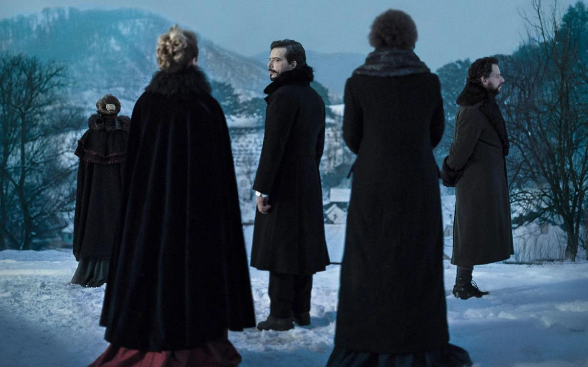

# «Мальмкрог» в поход собрался. Хотели радикальное кино на «Берлинале»? Получите!

- **URL:** https://novayagazeta.ru/articles/2020/02/23/84044-malmkrog-v-pohod-sobralsya
- **Дата:** 2020-02-23
- **Автор:** Лариса Малюкова

## «Мальмкрог» в поход собрался

## Хотели радикальное кино на «Берлинале»? Получите!

Кадр из фильма «Мальмкрог» . Фото: berlinale.deСреди главных новаций «Берлинале» программа «Столкновения», которую открыл «Мальмкрог» — фильм флагмана румынской волны, режиссера-новатора Кристи Пуйю. Что может быть решительней, чем философский диспут длиной в три часа двадцать минут от автора артхаусного хита «Смерть господина Лазареску», в котором он превратил смерть пожилого неряхи и выпивохи в магическое завораживающее таинство.

Киномарафон «Мальмкрог» основан на «Трех разговорах» философа-мистика Владимира Соловьева. Смотреть и слушать порой утомительно, при этом черно-белый, изощренно снятый оператором Тудором Владимиром Пандуру (кажется, что камера — сама действующее лицо) фильм затягивает, превращаясь в психоделический опыт со своим ритмом. Пую всегда в напряженном поиске, открывает новые территории кино как искусства. В его «Сьераневада» крошечная квартира в блочном доме превращалась динамичное пространство социалистической жизни, точнее ее осколков. В «Смерти господина Лазареску» — он превращает монотонное действие в трагикомическое шествие смерти по кромке жизни.

Режиссер Кристи Пуйю. Фото: EPA-EFE Новый фильм вдохновлен текстом русского философа 1910-го года «Война и христианство: три разговора о прогрессе и конце всемирной истории», написанным на рубеже веков как пророчество грядущих катаклизмов. Почти классическое единство: загородное поместье русского аристократа Николая в Трансильванском селе Мальмкроге в конце XIX века. Камера лишь изредка выглядывает на зимние пейзажи с заснеженными горами и стадами овец. Аристократы и дворяне — хозяева и гости. Здесь и генерал, и политик, и эмансипированные начитанные дамы — Ингрида, Ольга, Мадлен. Здесь западники и русофилы. Интеллектуалы говорят поочередно на всех языках: французском, немецком, английском, русском, румынском. Здесь все безупречно: манеры, одежда, сервировка, дворецкий в белых перчатках разливающий вино и воду в хрустальные бокалы и специальным гасильником торжественно накрывающий свечи. Завтрак, обед, ужин, требующие смены туалетов. Десерты.

Коньяк в гостиной. И страстные споры. О политике. О Боге и человеке и человеке в Боге. О справедливой войне, которая может быть благом, и о плохом мире.

О патриотизме. О христианстве, насаждающем себя огнем и мечом. О современном варварстве. Порой кажется, что все эти люди спорят о том, что сегодня тревожит, волнует, не может обрести четких ответов, потому что их нет. Не химера ли понятие «объединенная Европа» и европейский союз? Насколько Россия с ее «особым путем» — часть Европы? Может ли война быть справедливой и насколько архаична идея толстовского непротивления?

Поддержите нашу работу!

1000 500 300 Нажимая кнопку «Стать соучастником», я принимаю условия и подтверждаю свое гражданство РФ

Если у вас есть вопросы, пишите [email protected] или звоните:+7 (929) 612-03-68

Один из вопросов, мучающих столующихся у графа Николая гостей — проблема русской идентичности, в которой — микст европейской идеологической надстройки и азиатской ментальности. Любопытна дискуссия об оппозиции культуры — элитарного сокровища и религии (с обширными цитатами из Евангелия). Дамы и господа полемизируют об истинных ценностях веры и схоластике, порочащей религию. И о природе зла, разумеется. Зачитывают письма с турецкой войны с пугающими подробностями геноцида армян и зверства башибузуков.

Шесть актов, на протяжении которых, как говорил Чехов, — люди обедают, а в это время разрушаются их воззрения на мир, да и сам хрупкий мир вот-вот готов рухнуть. Как это бывает в фильмах Пуйю, постепенно взвинчивается напряжение в этом бесконечном приглушенном застолье. Происходит нечто малозаметное на заднике торжественного философского диспута. Пока дамы и господа в бриллиантах, кружевах и галстуках полемизируют о вечном, незаметно нагнетается тревога, которая вот-вот взорвется то ли падением одной из дам в обморок, то ли внезапными выстрелами в гостиной, то скорой смертью (немощного генерала моют и перекалывают в постель, а тот вдруг интересуется смыслом текста «Интернационала»), то ли скорой революцией.

Похоже, что показанный в зачине фестиваля «Мальмкрог» для нового арт-директора Карло Шатриана и его команды больше чем просто фильм, это манифест их курса: сдвиг от мейнстрима к маргинальному кино, в котором бал правит демиург автор. Удержит ли на плаву этот радикальный крен сам «Берлинале», который зрители на протяжении многих лет массово посещают — покажет время.

Берлин

### P.S.

Поддержите нашу работу!

1000 500 300 Нажимая кнопку «Стать соучастником», я принимаю условия и подтверждаю свое гражданство РФ

Если у вас есть вопросы, пишите [email protected] или звоните:+7 (929) 612-03-68
