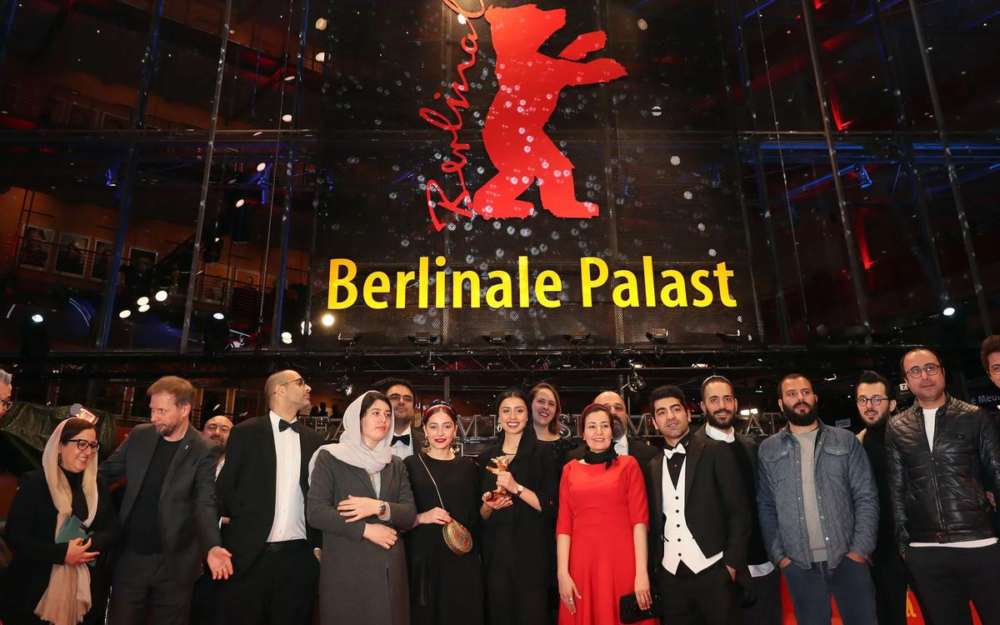

# «Все как в жизни. Только намного быстрее». Завершился 70-й фестиваль «Берлинале». Главные итоги

- **URL:** https://novayagazeta.ru/articles/2020/03/01/84121-vse-kak-v-zhizni-tolko-namnogo-bystree
- **Дата:** 2020-03-01
- **Автор:** Лариса Малюкова

## «Все как в жизни. Только намного быстрее»

## Завершился 70-й фестиваль «Берлинале». Главные итоги

Фото: EPAПришедший на смену Дитеру Косслику директор Карло Шатриан и его команда действительно предприняли колоссальные усилия, чтобы вдохнуть новую жизнь в увядающий семидесятилетний фестивальный организм. Может, это и не полная перезагрузка, но вектор изменений очевиден. Смотр получился во многом неожиданным, спорным, интересным.

Сохраняя преданность политическим бескомпромиссным высказываниям (отнесем к ним и картины, связанные с Россией, такие как «Котлован» Андрея Грязева или «Добро пожаловать в Чечню» Дэвида Франса при участии Аскольда Курова), стремление к актуальности — отборщики увлечены поиском новых форм, киноязыка, идей, расширением границ возможного.

Правда, что касается формотворчества, то иранский фильм «Без зла», получивший главный приз, эстетскими изысками не отличается. Это по-настоящему протестное кино режиссера-диссидента Мохаммада Расулофа.

После показа в Каннах его «Честного человека» — про коррупцию — он был арестован за «подрыв национальной безопасности» и «распространение пропаганды». Несмотря на запрет на профессиональную деятельность, снял новую картину, еще более радикальную. В ней он критикует милитаристскую систему, превращающую людей, призванных на военную службу, в палачей, а правозащитников — в жертв.

В фильме несколько новелл. Лучшая — первая. Заботливый муж и отец, проводящий в семейных хлопотах целый день (даже кошку успевает спасти из бойлерной и покормить ребенка пиццей), ночью едет на работу. С удовольствием выпив чаю и переодевшись, включает автоматическое устройство.

Рывок… и мы видим дергающиеся в предсмертных конвульсиях ноги шестерых казненных.

И кажется, его работа вполне его удовлетворяет.

Кадр из фильма «Без зла». Фото: berlinale.deГерою другой части, тщедушному юноше в форме охранника, приказано стать палачом, и тогда он совершает немыслимый побег из тюрьмы. Вырвавшись на волю в машине со своей невестой, он будет, захлебываясь от счастья, орать боевой хит «Белла чао!». Кино о свободе при деспотичном режиме , о моральном выборе в отсутствии выбора. Может быть, «Золотой Медведь» поможет смягчению участи режиссера-оппозиционера? Тогда я не против.

Принимая награду, члены съемочной группы сожалели, что режиссер не смог приехать, так как ему, запрещено покидать пределы страны. Знакомая история.

Один из участников съемочной группы «Без зла» получает приз за Расулофа. Фото: EPAНа этом рубежном фестивале скандалов, споров вокруг показов, да и вокруг самого смотра было немеряно. 70-й «Берлинале» прорывался через штормовое предупреждение надвигающегося призрака коронавируса; через оглушительное известие о связях экс-директора Альфреда Бауэра с нацистами; сквозь бурю вокруг гомофобных высказываний президента жюри британского актера Джереми Айронса, который, впрочем быстро отказался от своих слов.

Даже закрытие едва не было сорвано «климатическими активистами», пообещавшими занять красную дорожку. С ними сумели договориться, хотя эта акция отлично бы вписалась в контекст «фестиваля про нас и про сейчас», про вопиющий из всех трансляторов, пожирающий сам себя мир, в котором голос отдельного человека можно услышать… только с экрана «Берлинале».

Самой непримиримой оказалась дискуссия вокруг конкурсного фильма «Дау. Наташа» Ильи Хржановского. Фильму досталось и от консерваторов (за возмутительную провокационность и откровенность ряда сцен) и слева (за режиссерское злоупотребление властью над непрофессиональными актерами, за «насилие на площадке»), и от нашего Минкульта (показ фильма запрещен из-за «пропаганды порнографии»).

Кадр из «Дау. Наташа». Фото: berlinale.deПо моему субъективному ощущению, показ «Наташи» — отдельной частицы киноэпоса — был не самым верным продюсерским решением. Вырванный из кинопотока «Дау», из контекста жизни Института, сюжет о двух буфетчицах и гэбэшном мучителе теряет объем, выпадает из общей мифологии. При этом клаустрофобическое вязкое советское пространство, в котором ретро сплавлено с современностью, все равно завораживает. Не случайно оператор Юрген Юргес снимавший картины Вендерса, Фассбиндера, Клика, удостоен «Серебряного Медведя» за выдающееся художественное достижение. Таким образом, к показу в России запрещен фильм, удостоенный одной из главных наград Берлинского кинофестиваля.

Поддержите нашу работу!

1000 500 300 Нажимая кнопку «Стать соучастником», я принимаю условия и подтверждаю свое гражданство РФ

Если у вас есть вопросы, пишите [email protected] или звоните:+7 (929) 612-03-68

«Правда, что, кроме убийств, все остальное было настоящее?»

Запрещенный к показу в России фильм «Наташа» из проекта «Дау» добрался до «Берлинале». Интервью режиссера Ильи Хржановского

Под занавес в программе спецпоказов смотрели одну из финальных глав проекта «Дау. Дегенерация» - мощный шестичасовый эпик о крушении Института, возглавляемого уже не учеными, но чекистом Ажиппо (мрачное и прозорливое пророчество) — по сути про распад и разрушение всего «Парка советского периода» членами группировки Марцинкевича, приставленными для наблюдения за учеными.

До последнего момента эксперты не могли предсказать победителя. Конкурс оказался настолько разновекторным, что выбор той или иной картины не означал ее убедительного превосходства над другими, скорее свидетельствовал о вкусе судей. Это как с выбором любимого художника в галерее: Климт, Шагал, Мунк…

Кадр из «Дегенерации». Фото: berlinale.deК примеру, к киноискусству с большой буквы можно отнести безупречные минималистские «Дни». Медитативная гей-драма классика тайваньского кино Цая Минляна о встрече стареющего героя, тело которого угнетено болезнью, и юноши из деревни.

«Дни» — статика, превращенная в поэзию. Картина, наполненная до края одиночеством, дождем, меланхолией, исповедальный монолог автора о скоротечности жизни. В финале юноша на людной автобусной остановке будет заводить вновь и вновь маленькую шарманку, подаренную ему встреченным и потерянным другом. Чаплинская мелодия связывает картину Минляна с высокой кинематографической традицией, которая казалось, почти исчезла. Обидно, что жюри фильм проигнорировало.

Бал в конкурсе, да и в других программах, в соответствии с новыми временами правили женщины. Хотя, в отличие от иных смотров, «Берлинале» не руководствуется гендерными квотами. Выбраны работы действительно талантливых постановщиц с индивидуальным почерком. Из лучших – американская инди-драма в духе братьев Дарденн «Никогда, редко, иногда, всегда» Элайзы Хиттман (в «Сандэнсе» фильм получил спецприз, здесь Гран-при жюри). Очевидны параллели этого фильма с фестивальным хитом «4 месяца, 3 недели и 2 дня» Кристиана Мунджиу.

Сидни Фланиган в «Никогда, редко, иногда, всегда». Фото: berlinale.deСама Хиттман признавалась, что вдохновлялась картиной Мунджиу. Две несовершеннолетние девушки — Отомн и ее кузина — тайком от родителей едут из провинции в Нью-Йорк. Там без официального разрешения мамы и папы Отомн могут сделать аборт. Название фильма — это варианты ответов в вопроснике об интимной жизни. На приеме у психолога и гинеколога Отомн вынуждена отвечать на них, переступая границы закрытости, стыда, обиды (мощная роль дебютантки Сидни Фланиган сыграна на полутонах). При холодноватой, сдержанной режиссерской манере, это, наверное, самый тактильный фильм конкурса. Сочувствие к переживаниям двух девочек с чемоданом в жерле суетного города, в самые тяжелые минуты держащихся за руки, накапливается с каждым кадром. Очень женский взгляд на токсичный равнодушный, урбанистский, мужской мир.

Язык трагедии

Премьеры «Берлинале»: о чем «Уроки фарси», «Ундина», «Прописные истины» и «Гунда»

Волшебство картины «Женщина, которая убежала», создано корейским магом Хон Сан Су (приз за режиссуру) «из ничего, из ниоткуда». Молодая женщина Гам Хи (Ким Мин Хи, возлюбленная и муза режиссера) встречается поочередно со своими подругами, потому что муж ее уехал в командировку. Три встречи: необязательная болтовня, вино, барбекю, яблоки без шкурки, кошка, которая огорчает соседей, сама того не желая. Лакуны между словами — фирменное свойство этого тихого кино, в котором печаль переливается из тени в свет. И только в глубине недосказанного проявляется очевидное сомнение героини в ее светлом семейном будущем.

Редкий случай, когда на подобных фестивалях награждают комедию. Причем заслуженно. Премию в честь 70-летия «Берлинале» получила картина «Удали историю» от мастеров остросоциальных трагифарсов — бельгийцев Бенуа Делепина и Гюстава Керверна. Трое неудачников — жертвы технореволюции. Дочь Бертрана (Дени Подалидес) страдает от кибербуллинга, сам он влюблен в голос автоответчика, нежно предлагающего ему мебель. Обаятельная выпивоха Мари (Бланш Гарден) становится жертвой шантажиста, уложившего ее в койку и теперь грозящего выложить в сеть компромат. У шумной таксистки Кристин (Корина Масьеро) позорный рейтинг на Uber и зависимость от сериалов.

Бенуа Делепин и Гюстав Керверн c «Серебряным медведем». Фото: EPAСпасти всех их может только Бог… то есть всесильный хакер с ником «Бог», восседающей в ветрогенераторе. Почти на небе. В одном из эпизодов фильма можно увидеть Мишеля Уэльбека, сыгравшего хозяина автомобиля, который срочно требуется починить… для самоубийства. По-настоящему смешная черная комедия — не только сатира на современное, обвязанное сетевыми и цифровыми связями общество, но и философская сказка о трех чудаках, которым для счастья необходимо стереть прошлое. Ведь там их слабости, зависимости, трудно исправимые проступки. И, кажется, нет в их решимости страха стереть нечто важное, что не подвластно восстановлению.

Как-то новый директор смотра Карло Шатриан признался:

«Было крайне сложно свести разнообразие такой обширной программы к общему знаменателю, найти определенный девиз. Но, простите за банальность, фильмы, которые мы выбирали, действительно сейсмографы реальности. А нашу реальность трудно назвать светлой. Вот отчего так много картин мрачных соцветий. Но ведь есть и комедии! В общем, у нас все, как в жизни. Только намного быстрее».

«...В бессилии берешь камеру»

На «Берлинале» показали «Котлован» — фильм, целиком составленный из обращений к Путину на Youtube

Поддержите нашу работу!

1000 500 300 Нажимая кнопку «Стать соучастником», я принимаю условия и подтверждаю свое гражданство РФ

Если у вас есть вопросы, пишите [email protected] или звоните:+7 (929) 612-03-68
