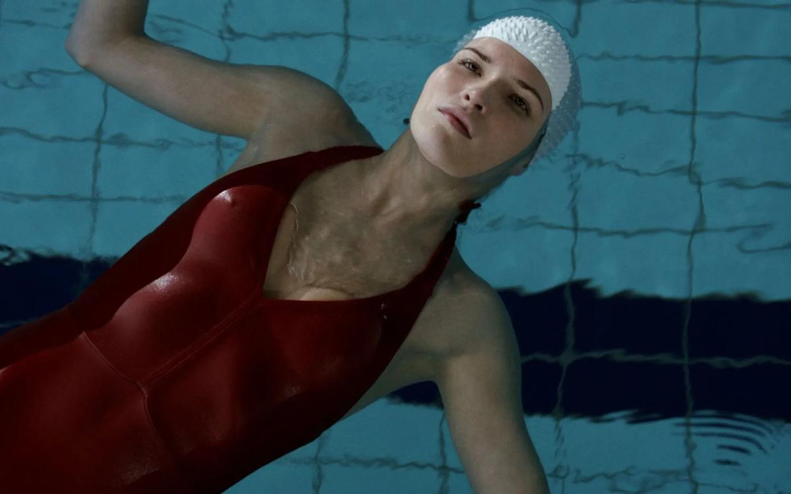

# Чего хотят женщины в кино. Экс-слабый пол отвоевал свое место на большом экране. Но пока только на нем

- **URL:** https://novayagazeta.ru/articles/2020/03/06/84194-chego-hotyat-zhenschiny-v-kino
- **Дата:** 2020-03-06
- **Автор:** Лариса Малюкова

## Чего хотят женщины в кино

## Экс-слабый пол отвоевал свое место на большом экране. Но пока только на нем

«Очень женские истории»В эпоху#MeToo и феминитивной революции мировая киноиндустрия спешно трансформируется. И дело не в гендерных квотах в фестивальных жюри, конкурсных программах, открытии новых профессиональных возможностей для женщин. Вспомним, что руководство ведущих мировых киносмотров подписало документ, составленный организацией «5050x2020». Цель — добиться гендерного паритета в кино к 2020 году (в числе учредителей — актрисы Лея Сейду и Лили Роуз Депп, режиссеры Селин Сьямма и Ребекка Злотовски).

Насколько кино наше опаздывает от тенденций мирового кинематографа?

Вроде бы формально идем в ногу со временем. У нас достаточно ярких, перспективных постановщиц. Смотрите: Рената Литвинова, Авдотья Смирнова, Валерия Гай-Германика, Анна Меликян, Наталья Мещанинова, Анна Пармас, Екатерина Шагалова, Оксана Бычкова, Оксана Карас, Нигина Сайфуллаева, Ангелина Никонова, Наталья Кудряшова, Наталья Назарова, Тамара Дондурей, Таисия Игуменцева, Оксана Михеева (список можно длить). У всех есть фестивальные награды, замыслы с надеждой на воплощение.

Вовсе не всех их объединяет женский взгляд на мир. И все же в картинах этого года можно отличить и субъективную оптику, и храбрость — в отличие от коллег-мужчин — погружаться в табуированные проблемы, в том числе в тему секса (которого у нас снова нет). «Верность» Нигины Сайфуллаевой — исследование чувственности, сферы скрытого, связанности кризиса отношений со сферой интимного. Авторов фильма обвинили, с одной стороны, в объективации мужчины, с другой — в мизогинии. Ну ладно, время такое у нас — спорное. На мой взгляд, героиня фильма — не только жертва, но и сама рассматривает мужчин в качестве «объектов желаний».

В русле общих с европейскими тенденций женщины в фильмах наших режиссерок крупнее, объемней. В комедии «Давай разведемся!» Анны Пармас героиня Анны Михалковой — притягательный центр вселенной. С ее точки зрения, мы не только видим и оцениваем мир вокруг, но должны согласиться и с ее выбором — остаться одной с детьми. Надо сказать, в зоне лирической комедии решение парадоксальное. Как же продюсеры уговаривали: «Давайте, раз уж муж к ней не вернется, пусть она хотя бы другого принца встретит!» Не вышло. Отчасти потому, что Михалкова и Пармас создали характер столь цельнокроенный-самодостаточный, что все мужчины вокруг — мелковаты, мешковаты, ищут возможность к ней прилепиться.

Кажется, что наконец-то и трудности с запуском фильма возникают у нас не по «половому признаку» (достаточно других препон и запретов). Едва ли не все режиссеры, которых я назвала, снимают полнометражные картины. Правда, касается это прежде всего авторского малобюджетного кино — на территорию блокбастеров женщин по-прежнему не пускают. Там большие деньги и сугубо «мужской разговор».

Для женщин придумали другую нишу — альманах. Продюсеры собирают женские отряды для тематических сборников, доверяя режиссеркам, так сказать, не романную форму, но небольшой рассказ. Творите, девушки!

Альманах «Петербург. Только по любви»— принципиальный и жалостливый коллективный взгляд на «колыбель революции», составленный из семи новелл. Попытка создать портрет города. Конфликт взрослой дочери и матери на приеме у гинеколога, киносъемки фильма об Иосифе Бродском на «Ленфильме», роман с глухонемым поклонником, театрализация суицида, отчаянные поиски спутника с помощью колдуна.

Когда эти личные сюжеты со сквозной темой женского одиночества складываются в общую историю, в минусе остается сам город — Петербург мужского рода единственного числа. Город с его воздухом, настроением, энергией выпадает на обочину фильма.

Поддержите нашу работу!

1000 500 300 Нажимая кнопку «Стать соучастником», я принимаю условия и подтверждаю свое гражданство РФ

Если у вас есть вопросы, пишите [email protected] или звоните:+7 (929) 612-03-68

И вот сейчас в праздник солидарности женщин за равные права и эмансипацию на экраны вышел альманах «Очень женские истории». Пять новелл. Десять современниц. Ведущие актрисы. Вроде бы вопрос старый: чего хочет женщина?

Но если б она сама знала!

«Очень женские истории»Продюсер Юлия Мишкенине задумала этот фильм несколько лет назад. Вместе с режиссером Натальей Меркуловой («Интимные места») они сняли лучшую новеллу «Сестры». Старшая сестра — строгая, благополучная, положительная, семейная. Младшая — бесшабашная оторва, тонущая в алкогольных парах, заливающая строгий костюм сестры блевотиной. Невыносимая. Неуправляемая. Лживая. Две отважные актерские работы. Кажется, две Виктории — Толстоганова и Исакова — здесь друг от друга подзаряжаются, как батарейки. Они играют необъяснимую словами запредельную близость, в которой смешались любовь и вина. Сцена в ванной — сестры во весь голос орут «Дельтаплан»: «Меж нами памяти туман, ты как во сне». Мешает только скудность сценарного материала, недотягивающего до таланта актрис. Увы, это общая проблема большинства фильмов.

В менее убедительных новеллах альманаха встречаются девушки, которые не могут поделить возлюбленного. В фильме Анны Сарухановой«Выставка»брошенная бойфрендом девушка (Полина Виторган), инсталлирующая свое тело в статичные композиции на арт-перформансе, неостановимо ведет внутренний монолог с собой. Даже когда встречает разлучницу. Даже когда обнимает разлучницу — вместе они должны представить единую скульптуру. Режиссер вместе с героиней вступает в слепую зону в попытке расчувствовать то, что вчера еще было невидимым, бесчувственным. Попытаться услышать и понять себя. Сорокалетняя героиня Любови Толкалиной («Уроки рисования для взрослых»Лики Ятковской) встречает юную соперницу Веру (Лукерья Ильяшенко) в изостудии. Их дружба, обмен платьями, доверительные беседы похожи на лабораторные испытания над собой. «Стиралку»снял затесавшийся в женский лагерь Антон Бильжо. Впрочем, Антон любит рассказывать историю через женщину, ее оптику, психологию. Например, в «Сказании о нас с Евгенией» женщина подстреливала подходящего себе мужчину в пролетающем над головой косяке. В «Рыбе-мечте» героиня-русалка пыталась приручить потомственного корректора. В «Амбивалентности» женщина влюбляется в друга своего сына и осознанно ломает свою жизнь. В «Стиралке» есть здравомыслящая замужняя Вета и ее подруга Лиза — шалава, ищущая на свою голову приключений. На самом деле Лиза готова реализовать стыдные тайные желания Веты. В анекдоте-антиутопии «Эс как доллар, точка, джи»Оксаны Михеевой действие происходит в ближайшем будущем. Героиня Анны Михалковой, завязанная с ног до бровей в черное, приходит в офис, чтобы в соответствии с законом об аренде мужчин сдать супруга обратно.

«Очень женские истории»В царстве женщин альманаха мужчинам практически нет места. А если они вторгаются в действие, то в роли ублюдков-насильников, изменщиков, арендованного товара. Впору вслед за Ларисой Огудаловой беднягам воскликнуть: «Уж если быть вещью, так одно утешение — быть дорогой, очень дорогой».

Может показаться, что рушится мир базовых ценностей.

Но нет, это лишь внутри киноновеллы, снятой женщиной, женщина управляет миром, решая судьбы мужчин. Но не в российской киноиндустрии. Продюсер киноальманаха «Очень женские истории» Юлия Мишкенине считает, что российское кино по-прежнему связано путами гендерных стереотипов и надо потратить много сил, чтобы гармонизировать ситуацию.

Вопрос: сколько должно пройти времени, чтобы в непроницаемую касту продюсеров-лидеров впустили «продюсерку»? Чтобы доверили бюджет масштабной картины режиссерке? Как говорила командор Британской империи и мэр Оттавы Шарлотта Уиттон: «Любое дело женщине приходится делать вдвое лучше мужчины, чтобы заслужить хотя бы половинное уважение». К счастью, это нетрудно.

Поддержите нашу работу!

1000 500 300 Нажимая кнопку «Стать соучастником», я принимаю условия и подтверждаю свое гражданство РФ

Если у вас есть вопросы, пишите [email protected] или звоните:+7 (929) 612-03-68
