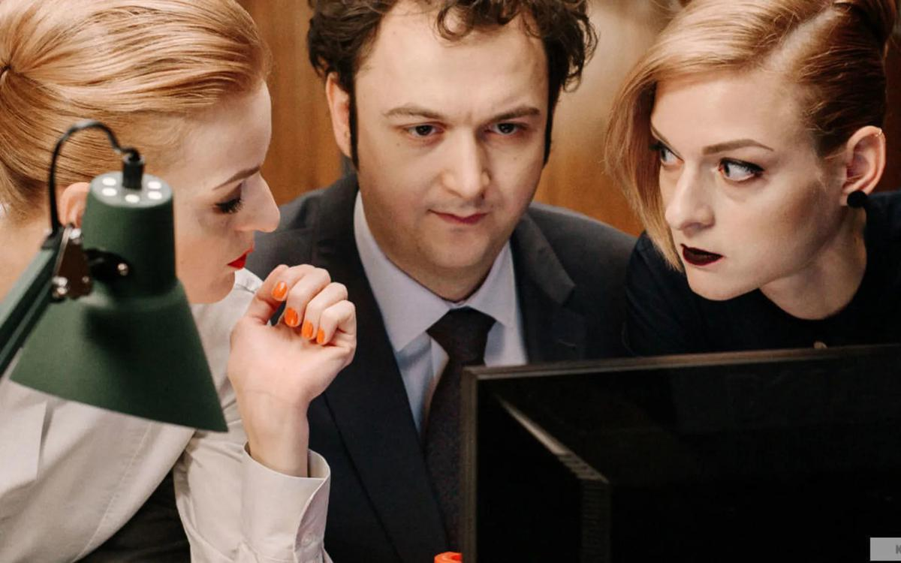

# Кино уползает в стриминг. Российская индустрия, пораженная COVID-19, претерпевает кардинальные перемены. Как они повлияют на зрителей и будущее?

- **URL:** https://novayagazeta.ru/articles/2020/04/15/84911-kino-upolzaet-v-striming
- **Дата:** 2020-04-15
- **Автор:** Лариса Малюкова

## Кино уползает в стриминг

## Российская индустрия, пораженная COVID-19, претерпевает кардинальные перемены. Как они повлияют на зрителей и будущее?

Фото: Kinopoisk…Иначе и быть не могло. Пока кинозалы, отрезанные от аудитории, погрузились в кромешную тьму, а продюсеры и дистрибуторы ломают голову — как без катастрофических потерь показать зрителю кино, молодые и зубастые VoD-сервисы пользуются моментом, чтобы расширить аудиторию. Впрочем, платформы Ivi, Оkko, Мegogo, Tvzavr с начала десятых приучают пользователей к легальному смотрению. А недавно ворвавшийся в рынок онлайн-кино КиноПоиск HD отбирает зрителей у своих конкурентов. Сервисы уже не только показывают, но и заказывают, и снимают фильмы и сериалы. «ТНТ Premier» выпускает «Домашний арест», «Звоните ДиКаприо» (только сейчас фильм вышел на телеканале), «Год культуры», «Мертвое озеро», кинодраму «Секта».

В мае вроде бы обещали (если не передумали) сделать премьерный показ «Грозы» Григория Константинопольского. А пока в диком темпе сняли в формате screenlife (все действие на экране монитора) «#СидЯдома» — первый в стране сериал про то, как живет страна на карантине. 10 дней с момента идеи и до премьеры в этот четверг на Premier.

КиноПоиск представляет свои первые сериалы «Последний министр», «Анна Николаевна». Онлайн-кинотеатр Ivi задумал инвестировать в производство сериалов и фильмов более 1 млрд рублей.

«Последний министр». Кадр: KinopoiskПоказ в онлайне фильмов с колес параллельно с премьерами в кинотеатрах скоро станет нормой — как бы ни огорчались киносети и Каннский кинофестиваль, несколько лет ведущий позиционные бои со стриминговой платформой Netlix.

Netlix не считает обязательным отдавать свои фильмы большому экрану.

Недавно компания Universal Pictures объявила, что будет показывать свои картины в интернете. Просмотр хорроров «Охота», «Человек-невидимка» и комедийной экранизации романа Джейн Остин «Эмма» Отема де Уайлда, на которые вы бы пошли в кино, обойдется вам дома примерно в 20 долларов.

Вот и первая премьера высокобюджетного полнометражного мультфильма в стриминге. Конфетно-яркие музыкальные тридэшные «Тролли. Мировой тур» студии DreamWorks (сиквел «Троллей», собравших в мире почти $347 млн) должны были выйти к людям в кинотеатрах 10 апреля, но в этот же день они сбежали в Сеть.

«Тролли. Мировой тур». Кадр: Kinopoisk«Мы надеемся и верим, что люди по-прежнему будут ходить в кинотеатры там, где это все еще возможно, — говорится в заявлении студии. — Но мы понимаем, что для людей в разных уголках мира это становится все сложнее». Параллельно фильм вышел в США в 25 драйв-инах (зрители в своих автомобилях не рискуют заразить друг друга).

Вслед за мировыми мейджорами новое российское кино, изолированное от кинотеатрального показа, поспешило в Сеть. Правда, еще летом фильм «Дылда» Кантемира Балагова, обладатель двух каннских призов, параллельно с прокатом появился в онлайне. Но тогда это было своевольное и неожиданное решение продюсеров.

Сегодня утечка каждой новой картины в интернет вызывает споры и возмущенные крики.

Например, фантастический триллер «Спутник» Егора Абраменко (бюджет около 200 млн рублей) сразу же выйдет в онлайн-формате 23 апреля (IFC Midnight уже приобрела североамериканские права на триллер). Уход в Сеть — не только вынужденное решение, но и выгодное коммерческое соглашение между продюсерами компании Sony Pictures и платформами more.tv, Wink и Ivi.

«Спутник». Кадр: KinopoiskУвы, сорвалась нарядная мировая премьера картины с российскими звездами — Петром Федоровым, Оксаной Акиньшиной и Федором Бондарчуком — на международном кинофестивале «Трайбека» в Нью-Йорке. «“Спутник” — один из самых интересных и зрелищных проектов наших компаний, — говорит сопродюсер фильма Федор Бондарчук. — Поэтому с коллегами и партнерами мы приняли решение пойти по нестандартному пути: не переносить кинотеатральный релиз, а сделать премьеру в онлайн-кинотеатрах, чтобы его смогли посмотреть зрители по всей стране».

Кино про советского космонавта, чудом выжившего после мистической катастрофы, вернувшегося на Землю на корабле «Орбита-4» с инопланетной формой жизни. Этого космонавта отправляют в засекреченный центр под присмотр спецслужб и нейрофизиолога Татьяны Климовой, которая должна определить, насколько опасна чужеродная природа землянам.

Гендиректор и основатель онлайн-кинотеатра Ivi Олег Туманов полагает, что трансформация мира, которую мы переживаем, вынуждает киноиндустрию и онлайн-видеосервисы искать новые решения в условиях отсутствия кинопроката: «Мы считаем, что этот первый и беспрецедентный в России случай откроет новые возможности как для создателей контента, так и для зрителей».

Это решение взбудоражило и даже возмутило киносети, их владельцы опасаются, что летом и зритель не будет торопиться в «места скоплений», и показывать будет нечего.

Зрители перед началом сеанса в кинотеатре. Фото: РИА Новости«Вы рано похоронили офлайн-кинотеатры, — пишет в открытом письме Бондарчуку кинотеатральный менеджер и предприниматель Юлия Солдатова. — Пандемия пройдет, люди устанут от гаджетов и захотят теплого человеческого общения. Обязательно вернутся в кинотеатры, театры и рестораны. Конечно, это не произойдет 23 апреля 2020 года, но через месяца два вполне вероятно… Верю в то, что бросать своих во время общей беды нехорошо. Ни за какие коврижки и проценты».

Скептики считают, что подобное соглашение между кинопродюсерами и платформами, скорее всего, разовая сделка,

Поддержите нашу работу!

1000 500 300 Нажимая кнопку «Стать соучастником», я принимаю условия и подтверждаю свое гражданство РФ

Если у вас есть вопросы, пишите [email protected] или звоните:+7 (929) 612-03-68

потому что в России число зрителей, готовых платить за кино в Сети, слишком мизерно, чтобы компенсировать затраты на фильм.

В онлайне пройдет и премьера долгожданного нового фильма «Фея» Анны Меликян с Константином Хабенским и Екатериной Агеевой. 30 апреля фильм можно будет посмотреть на КиноПоиске HD.

Третья часть трилогии («Русалка», «Звезда») — о том, как встреча двух людей превращается в тайну преображения не только их самих, но и мира вокруг. Герои: владелец крупной компании видеоигр (Константин Хабенский), решивший, что он творец, и фея — молодая активистка, мечтающая стать актрисой (Екатерина Агеева).

«Фея». Кадр: KinopoiskВ «городской истории» — излюбленный жанр Анны Меликян — снялись Ингеборга Дапкунайте, Юрий Борисов, Алиса Хазанова, Мария Шалашова.

Еще недавно армия сторонников большого экрана была неисчислима, но альтернативные показы (вспоминается теория Даниила Дондурея о пяти экранах: от кинотеатрального до гаджета) завоевывают пространство. И вот уже Тимур Бекмамбетов снимает новое кино о подвиге летчика Девятаева в вертикальном формате. Чтобы владельцы смартфонов могли его смотреть с комфортом.

Бекмамбетов убежден, что смена формата диктует и новые эстетические задачи — в частности возможность сосредоточиться на герое. На протяжении последних лет режиссер последовательно снимает и продюсирует кино в screenlife-формате.

Сегодня мы все волей-неволей эмигрировали в Третью реальность: работаем и общаемся, учимся, выпиваем, ссоримся, прощаемся, посещаем премьеры и вернисажи.

Сергей Сельянов: «И вот — бац! А потом будет куча мала на рынке»

В какой степени вирусом травмирован отечественный кинематограф и как ему можно помочь, рассказывает один из ведущих продюсеров

Какими мы вернемся в офлайн? Председатель Ассоциации владельцев кинотеатров Олег Березин уверен, что кинотеатр остается местом коллективного переживания. Возможно, для определенного типа фильмов это верно. Прежде всего для зрелищных блокбастеров.

Согласится ли зритель смотреть скромное авторское кино, в том числе и фильмы, селекционированные «Кинотавром», на большом экране? Или предпочтет гогочущим соседям, рассыпающим попкорн, тишину домашнего кинотеатра?

Здесь кстати, еще раз посетуешь на мизерное число в стране кинозалов, настроенных на авторское кино, воспитавших свою аудиторию.

Тем более что и способов коллективных просмотров становится все больше. К примеру, в моду входит серия Twitter Watch Party. Время начала сеанса заранее анонсируется, чтобы фанаты не пропустили событие. Устраиваются виртуальные ночи зрительского и авторского кино, твиттер-вечеринки с участием режиссеров, живые твиты критиков, обсуждающих фильм.

А вот и триумф кинокарантина: зрители, вынужденно осевшие в своих квартирах, превращаются в создателей фильмов. Причем они и кастинг режиссеров вольны проводить. Ведь за их домашнее видео борются дебютанты, документалисты и режиссеры с мировыми именами. Андрей Кончаловский предложил снять дома небольшие видеофрагменты с ответами на вопросы, которые его волнуют: «Каждый ответ важен, каждое переживание уникально, а все вместе они дадут нам картину жизни нашей страны». Снимать следует горизонтально на телефон, также он просит показать любимое место в доме и рассказать про него.

Студия Тимура Бекмамбетова затеяла киноальманах «Истории карантина», который покажет мир во время пандемии и вынужденной самоизоляции через экраны смартфонов и ноутбуков — в формате Screenlife, а идеи для него соберут через конкурс, в котором принять участие сможет каждый из заточенных.

Причем на сайте студии можно с помощью самоучителей освоить программное обеспечение для грамотной съемки в режиме Screenlife. Документальный фильм с рабочим названием «ВиRus» снимают на студии Горького.

В «новом ощущении реальности» пытаются с помощью видеодневников в изоляции и дистанционных съемок разобраться режиссеры Алексей Кобылков, Денис Шабаев, Татьяна Чистова, Андрей Сильвестров, Анисия Борисенко и многие другие.

Вот только вопрос: захочется ли вышедшим на волю смотреть кино про временную карантинную тюрьму?

### P.S.

Поддержите нашу работу!

1000 500 300 Нажимая кнопку «Стать соучастником», я принимаю условия и подтверждаю свое гражданство РФ

Если у вас есть вопросы, пишите [email protected] или звоните:+7 (929) 612-03-68
