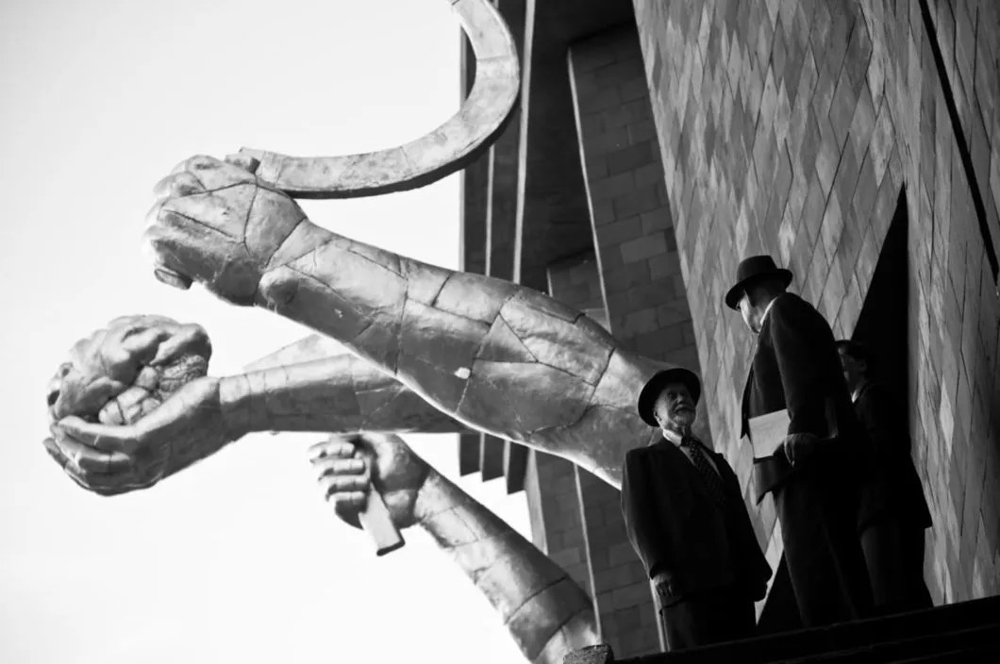

# Джинн из бутылки советского производства. 21 апреля «Дау» пришел в Сеть и прописался там по адресу dau.movie

- **URL:** https://novayagazeta.ru/articles/2020/04/21/85019-dzhinn-iz-butylki-sovetskogo-proizvodstva
- **Дата:** 2020-04-21
- **Автор:** Лариса Малюкова

## Джинн из бутылки советского производства

## 21 апреля «Дау» пришел в Сеть и прописался там по адресу dau.movie

Кадр из фильма «Дау». Kinopoisk.ru«Дау» — это Главное кинособытие года. Не кино вообще. Самое скандальное явление. Многолетний антропологический эксперимент над людьми, заселенными в аквариум для наблюдений. Свобода творчества. Манипуляции и абьюз. Сплав фикшна с нон-фикшном. Самая безумная киносъемка века. Сотни реальных людей самых разных профессий как действующие лица. Порнография. Искусство, не скованное рамками. Одно из самых сложных и масштабных художественных событий десятилетия. Киноплощадка, на которой ученые с мировыми именами спорят и занимаются наукой. Исполнители — импровизирующие соавторы сюжета… подневольные рабы… влюбленные в арт-пространство объекты… Читайте первую рецензию на проект в «Новой газете».Чего только за это время мы ни наслушались о «Дау», который лучше один раз увидеть. Тем более что

стоимость одного сеанса всего 3 доллара.

Вопрос в том, насколько один кинофрагмент позволит сложить представление о проекте. В этом смысле «Дау» следует аристотелевской максиме о целом, которое больше суммы его частей. Теперь каждый волен сам складывать эту мозаику.

## Почему сейчас?

Илья ХржановсскийДумаю, это коллегиальное решение продюсеров и режиссера Ильи Хржановского мотивировано несколькими причинами.

Причина первая.Пандемия заперла нас дома, превратив даже самого завзятого кинозрителя в пользователя. Связанное одной Сетью человечество смотрит примерно одни и те же сериалы, поглощает тонны необходимой, лишней и фейковой информации.

Самоизолированный более чем на 10 лет проект про замкнутое, отрезанное от внешнего мира пространство в какой-то мере становится зеркалом не прошлого, но настоящего. Закупоренные в бутылку жесточайшего времени джинны пытаются быть счастливыми, предавая друг друга, быть верными, страшась — быть «смелыми людьми».

Это состояние двойственности — основное вещество «Дау». Впрочем, современность так или иначе проникает едва ли не в каждый эпизод, она в речи, в приметных деталях (как мундштуки в алых ноготках практически всех женщин), в нарочитой условности. То есть коллективный герой «Дау» — это не наши дедушки с бабушками, но современник с генотипом советского человека. А советский человек, как показывает последнее время, никуда не девается. Черты советизма в «постсоветском социальном гибриде» становятся еще очевиднее, чем во времена Зиновьева. И охота быть оболваненными, и готовность к жертвам, и острое желание обрекать других на жертвы, и доносительство. Да и сам секретный НИИ — многоэтажное строение «образцового содержания»: от «верхних этажей» именитых академиков с орденами до судов и подвалов для опытов и допросов с пристрастием все больше напоминает «текущий момент».

Причина вторая.Мировая премьера проекта уже состоялась. Сначала — в Париже, затем два фильма стали участниками официальной программы Берлинале, вызвав серию хвалебных и убийственных статей. «Дау. Наташа» стал обладателем «Серебряного медведя» за выдающиеся художественные достижения. Приз был вручен оператору Юргену Юргесу, снимавшему фильмы Хайнеке, Фассбиндера, Вендерса, придумавшему специальную световую систему, позволяющую снимать днем и ночью без привычного оборудования.

После фестивальных показов обычно фильмы выходят на экраны. Но как выпускать «Дау»? Отдельными блоками 14 фильмов? В этом смысле удобней всего свой виртуальный кинотеатр-дом, в котором будет жить только «Дау».

Три дня «Дау»

Репортаж Александра Гениса с уникального кинопоказа в Берлине

Причина третья. В ноябре 2019 года Министерство культуры России отказалось выдать прокатные удостоверения «Наташе» и еще трем фильмам из проекта: «Новый человек», «Нора/Сын» и «Саша/Валера». В министерстве заявили, что они содержат пропаганду порнографии.

В феврале 2020 года кинокомпания Phenomen Films, занимающаяся производством «Дау», подала в Арбитражный суд Москвы иск к Министерству культуры. Создатели картины требуют признать незаконным отказ в выдаче прокатных удостоверений. Было понятно, что в увечном виде Илья Хржановский проект выпускать на экраны не будет. Впрочем, на следующий день после запрета тогдашний министр культуры Владимир Мединский предположил, что кино, запрещенное к показу в кинотеатрах, «на интернет-ресурсах может, наверное, демонстрироваться с соответствующими предупреждениями». Его рекомендациям, в частности, и последовали.

Поддержите нашу работу!

1000 500 300 Нажимая кнопку «Стать соучастником», я принимаю условия и подтверждаю свое гражданство РФ

Если у вас есть вопросы, пишите [email protected] или звоните:+7 (929) 612-03-68

Недавно ушедший из жизни замечательный кинокритик, эссеист Александр Тимофеевский в тексте для «Новой» писал: «Разумеется, фильмы «Дау», художественно очень сильные, должны быть доступны в кинотеатрах. Разумеется, никакое министерство не имеет права никому ничего запрещать. Запрещена по нашей Конституции именно и только цензура. Но ведь это бессмысленно объяснять. Бессмысленно и безнадежно. Поэтому я бы плюнул на кинотеатры и ушел бы в Сеть. Интернету никто не указ, как и вилле Фарнезина. Создать там большой портал «Дау» — сложная и увлекательная задача, в результате которой проект может получить новую жизнь. Законченную или бесконечную, это открытый вопрос».

«ДАУ». Увечный показ

Комментарии к запрету четырех фильмов из масштабного проекта Ильи Хржановского

## Что показывают

Кадр из проекта «Дау». Фото предоставлено организаторами кинопоказаУже можно смотреть засвеченные Берлинале фильмы «Дау. Наташа» и «Дау. Вырождение». «Вырождение» — это переименованная буквально перед онлайн-премьерой «Деградация». Следом выйдут 12 глав картины, которые уже анонсируются на сайте: «Дау. Нора мать», «Дау. Три дня», «Дау. Смелые люди», «Дау. Катя Таня», «Дау. Новый человек», «Дау. Саша Валера», «Дау. Империя», «Дау. Теория струн», «Дау. Никита Таня», «Дау. Конформисты». Потом будут сериалы и, наконец, опубликуют все 700 часов отснятого на пленку материала.

Любопытно, что показ начинается с «Дау. Наташи», одного из «запрещенных» фильмов.

Истории завбуфетом Наташи, ее, скажем так, противоречивых отношений с буфетчицей Ольгой, заезжим ученым Люком Биже и, наконец, с генералом КГБ Владимиром Ажиппо. В четырехчасовом мощном эпике «Вырождение» власть органов над миром ученых становится «непреодолимой силой», хотя на дворе уже вроде оттаявшее постсталинское время. Со слабаками вроде талантливой перспективной молодежи расправляются «шутя» — слегка пугают в подвале, выстригают «длинные патлы». После унижения те просто исчезнут из института вместе с наивными и безумными идеями, интеллигентным флиртом с девушками, песнями Визбора. Исчезнет будущее.

На его место придут мышцеголовые погромщики, нацисты во главе с реальным Марцинкевичем.

Поначалу они вроде как тоже подопытные для психофизических экспериментов. Но вскоре подопытные шакалы сами станут дирижировать процессом строительства нового человека, разрушающего вселенную, которую он сам построил.

## Как смотреть

Так проходила премьера «Дау» в США в январе 2020 годаНа сайте есть краткие синопсисы фильмов, но никакой локации. И хотя в проекте существует внутренняя история («Дау» начинается в 20-е годы ХХ века и заканчивается в 1968-м), которая выражена даже в свете и цвете, — сталинские времена сняты в сумрачных, с тенями тонах, в хрущевские годы цвет становится более интенсивным… Тем не менее зритель предоставлен собственному выбору. И одна из заключительных глав «Вырождение» открывается одной из первых.

Авторы проекта «Дау» не желают снабжать излишними титрами и программками зрителя, который входит в одну из дверей этого лабиринта, а потом ищет оттуда выход.

Смотреть незавершенные, как бы эскизные картины можно в любом порядке. Сборку целого совершает сам зритель. Из осколков увиденного монтирует метакино у себя в голове (при всей будто бы необработанности монтаж здесь продуманный).

Первоначальный сценарий к картине написал Владимир Сорокин на основе мемуаров вдовы гениального академика Коры Ландау.

Но этот сценарий скорее похож на взлетную площадку, с которой проект улетел в разных направлениях. Фильм «Дау» — совместное производство Германии, России, Украины и Швеции. Съемки картины проходили с 2008-го по 2011-й в Харькове, которые завершились символичным взрывом гигантских декораций. Возможно, когда-нибудь Владимир Сорокин, отошедший от проекта, напишет сюрреалистический док «как снимали Дау».

### P.S.

Поддержите нашу работу!

1000 500 300 Нажимая кнопку «Стать соучастником», я принимаю условия и подтверждаю свое гражданство РФ

Если у вас есть вопросы, пишите [email protected] или звоните:+7 (929) 612-03-68
