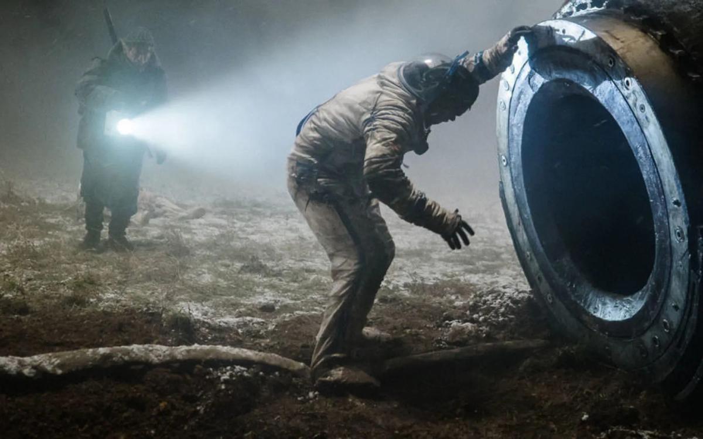

# Антидонкихоты и паразиты. Премьеры в онлайне: российский хоррор «Спутник» и биовестерн «Подлинная история банды Келли»: смотреть или нет?

- **URL:** https://novayagazeta.ru/articles/2020/04/23/85064-antidonkihoty-i-parazity
- **Дата:** 2020-04-23
- **Автор:** Лариса Малюкова

## Антидонкихоты и паразиты

## Премьеры в онлайне: российский хоррор «Спутник» и биовестерн «Подлинная история банды Келли»: смотреть или нет?

Кадр из фильма «Спутник»ПаразитФильм Егора Абраменко и сценаристов Олега Маловичко и Андрея Золотарева «Спутник» можно рассматривать как продолжение трилогии Бондарчука (здесь он в роли одного из продюсеров) с односложными названиями предыдущих глав: «Притяжение», «Вторжение».

1983-й. Два советских космонавта начинают спуск на Землю, напевая родной хит «Миллион алых роз»… но тут сверху постучали.

Выживший Константин Вешняков (Петр Федоров) окажется на базе военного института в полной зависимости от седого полковника Семирадова. Отзвук фамилии Семичастного у персонажа Федора Бондарчука неслучаен, в нем служение оружию давно превратилось в манию. Амнезию «возвращенца» исследуют нейрофизиологи: традиционалист (Антон Васильев) и новатор Татьяна Климова (Оксана Акиньшина умеет оправдывать даже самые невозможные обстоятельства), разумеется, под пристальным присмотром военных. Выясняется, что Вешняков привез в своем теле склизкое неизвестное существо трубчатой формы, по сути, космического паразита.

Когда смотришь фильм на карантине, невольно возникает коронавирусная оптика. Приземлившегося космонавта тошнит кровью, до него дотрагиваются земляне — хочется немедленно вымыть руки, хотя зараза через экран не проникает.

Впрочем, биотриллер, космическая фантастика с элементами хоррора, действие которой, по сути, развивается в замкнутом пространстве, в изоляции будет смотреться особенно остро (на экраны фильм тоже выйдет, но после отмены карантина). «Чужие» или «Оно» здесь ходят, безусловно.

И ксеноморф, которым обременен герой Советского Союза, не просто опасен, он пожиратель людей.

«Спутник» сделан, в общем, крепко, хотя и грешит сценарными дефектами. Да и мелодраматическая подкладка о детских и юношеских травмах главных героев чрезмерно педалируется. Но есть в фильме, который вырос из авторской короткометражки Абраменко «Пассажир», подлинная среда советской страны. С убитым цветом стен, зэками в телогрейках, шуршащей радиоточкой, запахом линолеума и тушеной капусты детдома, синими спортивными костюмами, жесткими кедами и… разлитым в воздухе страхом. С девизом «если герой — значит, готов к жертвенности».

Это столкновение пропавшей в небытие, по-своему уже фантастической реальности с космической иножизнью — самое убедительное в картине. Да и герои здесь, как в хорошей фантастике, вроде Азимова или Стругацких, борются не с мирозданием и даже не столько друг с другом (тема милитаризма здесь самая неинтересная), но с самими собой и со страхом, который необязательно приходит из космоса.

«Неточно произнесенное слово может разрушить твою карьеру»

Федор Бондарчук — о своей новой картине «Вторжение», власти медиа и цензуре, которой вроде бы нет

## «Подлинная история банды Келли»

«Подлинная история банды Келли» Джастина Курзеля — экранизация романа Питера Кэрри, получившего в 2001 году Букеровскую премию.

Поддержите нашу работу!

1000 500 300 Нажимая кнопку «Стать соучастником», я принимаю условия и подтверждаю свое гражданство РФ

Если у вас есть вопросы, пишите [email protected] или звоните:+7 (929) 612-03-68

Что общего между фильмом Курзеля об одном из знаменитых разбойников Неде Келли и «Джокером»? Обе картины — гимны мстителям, превратившим безумие в рок-н-ролл возмездия. Курзель, полностью опровергая название, которое сам же и предложил, предуведомляет свою историю титром: ничего похожего на настоящую историю банды Келли вы не увидите.

Нед Келли, бушрейнджер и грабитель банков, повешенный в 1880 году в 26 лет, успел не только прославиться, но и стать национальным героем наравне с первым австралийским полководцем Джоном Монашем. Как вам это понравится?

Прозвища «Ребенок-убийца» и «Маленький Мясник» прилипли к будущему нацгерою в детстве. Рассказывают, что впервые он убил человека в 12 лет. Но для австралийцев он еще и

фольклорный персонаж вроде жестокого Робин Гуда.

Не только убийца 16 полицейских, но символ сопротивления полицейскому произволу и колониальному режиму. Не просто грабитель банков, но благородный разбойник, который сжигал закладные, освобождая бедняков от кабалы долгов.

Впрочем, режиссер не романтизирует Келли, он демонтирует миф и реальную историю бандита, складывая из осколков его биографии и вымысла свою мрачную балладу. В ней три куплета: «Мальчик», «Мужчина» и «Монитор» (так именует себя сам разбойник, варганя железный прикид-броню перед битвой с полицией, — эта «броня» с дырками от пуль до сих пор хранится в Государственной библиотеке Виктории в Австралии).

Для кинематографистов история Келли — магнит, притягательней иных комиксов. Неслучайно ее так любят экранизировать. Именитого убийцу играли и Хит Леджер (Банда Келли), и Мик Джаггер (Нед Келли). И теперь британец Джордж МакКей. Его Нед жесток и инфантилен: Курзель показывает, как в обиженном, обозленном, недолюбленном мальчишке, которого мать продает опытному преступнику Гарри Пауэру (Рассел Кроу), просыпается гнев. Как из травм и любви к жестокой матери формируется безрассудный, отчаянный характер мстителя. Юная банда выезжает на дело в женских платьях, чтобы ошеломить, выбить почву из-под ног растерявшегося противника.

«Если ты наденешь платье на бой, они подумают, что ты сумасшедший, — говорит его младший брат Дэн. — Ничто так не пугает человека, как сумасшествие».

Так начинается крутой спуск Неда в преступную жизнь, в туман с расползающимися кровавыми пятнами безумия. В мир, в котором он пытается удержать власть с помощью платья, пистолета и самодельных доспехов. Курзель сгущает ощущение карнавальности в битвах местного значения между бандитами и бестрепетными хранителями закона.

Антидонкихот в самодельных доспехах, головорезы в женских платьях и насилие как единственный способ расплатиться с подлым миром, в котором военизированная полиция ассоциируется исключительно с террором.

Злой и тревожный фильм Курзеля дает зрителю простор для полярного отношения к деяниям Келли и его криминальному «бойз-бэнду»: от чудовищно преступных до революционных. Некоторые из экспертов даже увидели в фильме критический портрет народа и страны, сформированных насилием и жестокостью.

Курзель заряжает экран панковской энергией героя. Изображение вдруг неровно мерцает, будто задыхается, или вместе с бандой в развевающихся платьях несется по бесприютным просторам и пустошам, мимо выжженных солнцем деревьев. А в один знаковый момент картинка суживается до узкой полоски света в кромешной тьме — мы смотрим через прорезь в шлеме Неда Келли. Весь мир превращается в эту тонкую дрожащую полоску.

Поддержите нашу работу!

1000 500 300 Нажимая кнопку «Стать соучастником», я принимаю условия и подтверждаю свое гражданство РФ

Если у вас есть вопросы, пишите [email protected] или звоните:+7 (929) 612-03-68
