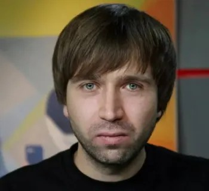

# «Путин навсегда?» Документальный фильм. К годовщине массовых протестных акций в Москве 2012 года

- **URL:** https://novayagazeta.ru/articles/2020/05/06/85247-putin-navsegda-dokumentalnyy-film
- **Дата:** 2020-05-06
- **Автор:** Лариса Малюкова

## «Путин навсегда?» Документальный фильм

## К годовщине массовых протестных акций в Москве 2012 года

Кирилл Ненашев

режиссер-документалист

— Я не очень интересовался политикой. Сходил на парламентские выборы 4 ноября 2011 года, проголосовал не помню уже за кого, но против «Единой России». А вечером появились первые видео фальсификаций. На следующей день в офисе я не работал, а продолжал смотреть видео, которые появлялись весь день. Наглость «вбросов» просто зашкаливала. Вечером я вышел на первый в своей жизни митинг к Чистым прудам. И был поражен.

Поддержите нашу работу!

1000 500 300 Нажимая кнопку «Стать соучастником», я принимаю условия и подтверждаю свое гражданство РФ

Если у вас есть вопросы, пишите [email protected] или звоните:+7 (929) 612-03-68

Тогда и появилась идея снять «Путин навсегда?», тогда я и начал вовлекаться в политику. С камерой мы пережили протесты 2011 — 2012 гг., как и рядовые участники, сначала — с надеждой на победу, так же испытали страх от первых жестких задержаний в марте 2012 года, так же были опустошены после разгона 6 мая 2012 гг. Дата стала ключевой, именно тогда массовый протест был побежден властью. Протестующих разогнали, Болотную площадь вымыли поливальные машины, а СК возбудил «Болотное дело».

С тех пор я так и снимаю протесты. Вышли сериал «МАРТ.ДОК», про разные региональные протесты от Челябинска до Краснодара, и фильм «Про героев и людей», который часто называют «Путин навсегда – 2». И в фильме, и в сериале отражены протесты 2017 – 2018 гг. Сейчас я снимаю условно третью часть «Путин навсегда» — про молодых ребят в политике. В 2011 году в России появилась массовая оппозиция, которая проиграла 6 мая 2012 года, а с 2017-го протест укрепился в регионах и стал более осознанным, началось его полноценное возрождение и, возможно, настоящее становление, не зря сейчас все больше молодежи появляется в политике и обращает на себя внимание.

Во время съемок фильма мы не могли найти антагониста для нашего главного героя Севы Чернозуба, активиста и лидера Молодежной Солидарности. Много кто поддерживал партию власти, но почему-то никто не хотел говорить об этом на камеру. В итоге, когда мы практически отчаялись найти героя с провластной позицией, после «путинга» на Поклонной горе мы встретили Виталия Морозова, православного хиппи. Виталий, бородатый мужчина средних лет, стоял в русском тулупе, шапке-ушанке и с иконой на груди. Виталий и стал протагонистом. Нас потом много упрекали, говорили, что это несерьезно, власть защищает скоморох, вы что не могли найти более серьезного человека? Очень искали, но не смогли. И Виталий, на мой взгляд, наша большая удача.

Виталий победил, назло Голливуду, а наш Сева проиграл вместе с протестом.

Точка была поставлена 6 мая 2012 года, ровно 8 лет назад. И «вечность пахнет нефтью», поет Егор Летов на финальных титрах, «но слово Люди пишется с большой буквы», продолжает Егор. А в названии нашего фильма и сегодня стоит знак вопроса.

Поддержите нашу работу!

1000 500 300 Нажимая кнопку «Стать соучастником», я принимаю условия и подтверждаю свое гражданство РФ

Если у вас есть вопросы, пишите [email protected] или звоните:+7 (929) 612-03-68
