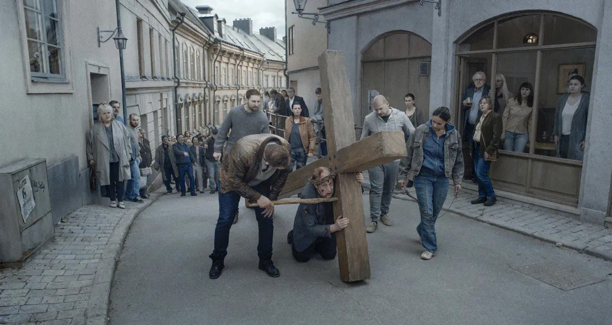

# Бесконечность в онлайне. В видеосервисах выходит призер Венеции

- **URL:** https://novayagazeta.ru/articles/2020/05/09/85309-beskonechnost-v-onlayne
- **Дата:** 2020-05-09
- **Автор:** Лариса Малюкова

## Бесконечность в онлайне

## В видеосервисах выходит призер Венеции

Кадр из фильмаЕще одна меланхолическая и невозмутимая песнь о человечестве, размышление о бытии. Интонация «Похвалы глупости», абсурд Беккета и Ионеско, поэзия скальдов и сухая проза газетной заметки вшиты в мозаику примерно из тридцати виньеток. По сути, «О бесконечности» — ремейк андерссоновской трилогии на тему «Как нелегко быть человеком»: «Песни со второго этажа», «Ты, живущий» и «Голубь сидел на ветке, размышляя о бытии». С другой стороны, может, это вовсе и не ремейк — просто еще одна глава долгого киноромана, который на протяжении многих лет экранизирует режиссер. Он и не спорит: «Мне говорят, что я всю жизнь делаю один огромный фильм». Минималистские философские пространные картины Андерссона восхищают нетривиальностью и ставят в тупик отсутствием сюжета, столпотворением и набором гротесковых скетчей, вызывающих массу вопросов у неискушенного зрителя.

Невидимая Шахерезада невозмутимым тоном комментирует увиденное как бы сверху, с облака. «Я видела человека, который сбился в пути», «Я видела мужчину, который хотел накормить жену вкусным ужином», «Я видела человека, умолявшего о пощаде». «Я видела женщину, которая думала, что ее никто не ждет». И что вы думаете, женщина действительно стоит на платформе и растерянно оглядывается. Мимо мужчины с продуктовыми пакетами проходит человек, не здороваясь. Это друг детства, не простивший обиды. «Я видела женщину, менеджера по коммуникациям, неспособную испытывать стыд». Эта самая «специалист по коммуникациям» стоит на своих упертых каблучках в строгом костюме и безвылазном одиночестве перед гигантским окном в высотке, а перед ней серый город без людей. «Я видела мужчину, умолявшего о пощаде». «Я видела женщину, которая очень, очень сильно любила…»

Рой АндерссонЭта Шахерезада — скорей всего сестра «Голубя, сидящего на ветке», соскользнувшего на экран с полотна Питера Брейгеля Старшего «Охотники на снегу», где он невозмутимо наблюдал на многонаселенным миром. «Птица, — говорит Андерссон, — изумлена тем, что сидящие под деревом охотники не видят хаоса, который неизбежно приближается».

Чаще всего эти наикратчайшие трагикомические и абсурдистские скетчи — про неудачу, неуспех, потерю контакта. Или про неоправданную, немотивированную радость молодости. Три девчонки-подростка проходят мимо уличного кафе и, услышав музыку, словно завороженные, начинают танцевать.

Единственный сквозной сюжет — о священнике, потерявшем веру и вынужденном беседовать о Боге с людьми. Еженощно ему снится кошмар, в котором он вместо Иисуса тащит на себе крест и его побивают плетями и камнями. Успеет ли странного пациента выслушать психиатр, если он боится опоздать на автобус?

Поддержите нашу работу!

1000 500 300 Нажимая кнопку «Стать соучастником», я принимаю условия и подтверждаю свое гражданство РФ

Если у вас есть вопросы, пишите [email protected] или звоните:+7 (929) 612-03-68

Фирменная эстетика Андерссона — сдержанная по цвету гамма, звуковое крещендо в эпизодах от тишины до массивного звука, просторные кадры, временами почти безлюдные, сосредоточенная камера. Калейдоскоп причудливых новелл кружит с обманчивой холодностью, готовый сорваться в крик.

Абсурдистский юмор (один из персонажей предполагает возможность реинкарнироваться в помидор), меланхолическая отстраненность связывают сценки в притчу о невыносимости и прекрасности бытия. Если абсурд жизни сгустить до степени безграничной, до дециллионов, до сверхвселенских размеров… получится правда жизни.

Кадр из фильмаАндерссон создает панораму почти пустынного города с редкими прохожими в своей собственной студии, он строит улицы, кухни, рестораны с белыми скатертями, кабинет стоматолога, церковь, магазин. В этом пространстве бродят разорванные потерянные души в поисках смысла…

«Целое больше, чем сумма частей». Фразой, приписанной Аристотелю, можно было бы описать кино шведского классика. И бесконечность, по Андерссону, состоит из ничего не значащих и поворотных в истории моментов, из унылого шествия пленных немцев в сибирские лагеря и песни голубя, сидящего на ветке. Это и есть хрупкая вязь сиюминутного и вечности.

Человеческие усилия бессмысленны и прекрасны. И общее настроение экзистенциальной меланхолической трагикомедии — утешающее. Ну да, мы всего лишь люди, копошащиеся в своих комплексах, страхах и ожиданиях перемены участи под пристальным взглядом Шахерезады. Но может быть, в этих бесплодных усилиях, ожидании неизведанного, немотивированной боли и радости и заключен секрет бессмертия?

И над разбомбленным городом Шагал тихо пролетят влюбленные Шагала.

Кто бы спорил, для Андерссона этот путь уже исхожен, пройден в предыдущих фильмах. Но он продолжает двигаться в одном ему известном направлении по собственной дороге, не забывая нас утешить, укрыть еще одним лоскутным одеялом из своих философских небылиц. Поселить надежду, что в момент приближения хаоса можно превратиться если не в помидор, то в голубя, сидящего на ветке.

Фестиваль «Короткий метр» в «Новой газете» завершен. Спасибо 42 000 зрителей!

Один день — один фильм

Поддержите нашу работу!

1000 500 300 Нажимая кнопку «Стать соучастником», я принимаю условия и подтверждаю свое гражданство РФ

Если у вас есть вопросы, пишите [email protected] или звоните:+7 (929) 612-03-68
