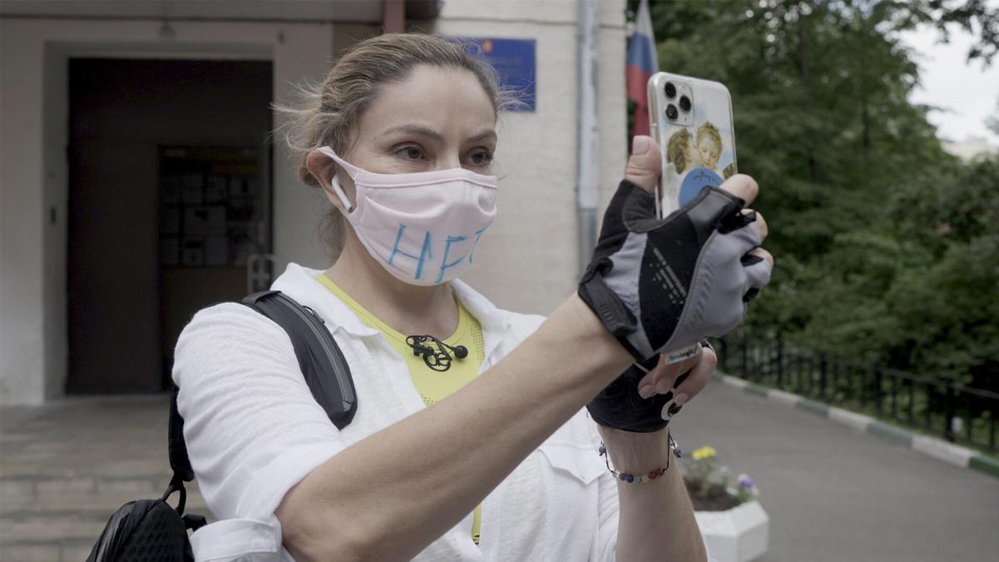

# F@ck this job! Артдокфест завершился без скандалов. На закрытии показали фильм о Наталье Синдеевой

- **URL:** https://novayagazeta.ru/articles/2021/04/10/f-ck-this-job
- **Дата:** 2021-04-10
- **Автор:** Лариса Малюкова

## F@ck this job!

## Артдокфест завершился без скандалов. На закрытии показали фильм о Наталье Синдеевой

Наталья Синдеева. Кадр из фильма «F@ck this job!», закрывшего Артдокфест-2021Прямо не верится: Артдокфест завершился без очередного скандала, устроенного Милоновым, ФСБ, SERBами, [Роспотребнадзором](https://novayagazeta.ru/articles/2021/04/06/artdokfest-otkryl-platnyi-onlain-prosmotr-filmov-posle-otmeny-pokazov-v-peterburge) и [ряжеными юродивыми](https://novayagazeta.ru/articles/2021/04/09/v-moskve-na-artdokfeste-aktivisty-serb-napali-na-rezhissera-vitaliia-manskogo), размахивающими трусами, на которых кровью написано название фестиваля. Программа из 150 фильмов завершилась восклицательным знаком — овацией. Сначала аплодировали фестивальной команде под управлением Виталия Манского. Тем, кто и дни простояли, и ночи продержались.«Отстаньте от документалистов!» Это самый странный и трудный кинофестиваль.

Когда каждый день — плохая новость.

Когда ощущение, что фестиваль физически уничтожают.

Могу представить себе, что чувствовали девочки из фестивальной команды, когда в момент открытия опечатывали залы питерского Дома кино, а они вместе с продюсером Евгением Гиндилисом охраняли двери, давая возможность зрителям досмотреть фильм про самого свободного документалиста Александра Расторгуева.

Когда «Лендок» закрылся сам — кабы чего не вышло.

Когда представители чеченской диаспоры ласково попросили снять один из фильмов и скупили одной карточкой все билеты на его сеансы.

Когда сразу несколько картин пришлось уводить из кинотеатра, окруженного мракобесием, в онлайн.

Когда активисты SERBа врывались в кинозалы, чтобы сорвать показы, провокаторы вызывали полицию, записные артисты, и раньше отмечавшиеся инсценированными погромами, оскорбляли организаторов фестиваля, нападали на Манского. Потом нападавшие спокойно уходили, чтобы вернуться.

Слушайте, это всего лишь кинофестиваль. К чему вся эта беспрецедентная серия провокаций, вредоносных законодательных актов, мешающих жизни искусства, и даже открытых нападений?

Манский, конечно, боец, стена. Вел себя безупречно, в самых критических ситуациях оставаясь корректным. И программу они с Викторией Белопольской собрали отменную. Чего только стоит показанный под занавес фильм на сложнейшую тему армяно-азербайджанского конфликта вокруг Карабаха «Под одним солнцем» Франсуа Жакоба! Попытка рассмотреть полыхающий конфликт с двух сторон. Кино про то, как в век колонизации Марса людей, живших рядом, перенастроили на войну, реальность обратили в «каменный сон», а центр идентичности двух народов — в горячую точку. И только единицы, личности масштаба известного азербайджанского писателя Акрама Айлисли способны в одиночку противостоять сложившейся системе войны и погромов.

Теперь вопрос. Найдет ли силы и желание документалист с мировым именем Виталий Манский проводить лучший фестиваль в стране, впадающей в сон разума? Ведь Артдокфест уже существует и в Риге, где его президенту не угрожают камуфлированные и реальные юродивые и депутаты, пишущие доносы.

Читайте также

«Опасность документального кино — в доступности и вседозволенности»

Виталий Манский — о программе «Артдокфеста» и перспективах документалистики

На закрытии была нарезка из высказываний экс-судей Артдокфеста: Александра Митты, Татьяны Друбич, Гарри Бардина, Алвиса Херманиса, Светланы Сорокиной… Смысл высказываний: «Прекратите срывать фестиваль! Отстаньте от документалистов! Дайте нам возможность смотреть честное кино!»

Свобода — это еще и право говорить людям то, что они хотят и чего они не хотят слышать.

…На фильм закрытия билеты были распроданы за несколько часов.

Поддержите нашу работу!

1000 500 300 Нажимая кнопку «Стать соучастником», я принимаю условия и подтверждаю свое гражданство РФ

Если у вас есть вопросы, пишите [email protected] или звоните:+7 (929) 612-03-68

Читайте также

Артдокфест гонимый

Линию нападения на фестиваль укрепили чеченские власти

## «F@ck this job»

«F@ck this job» Веры Кричевской — о Наталье Синдеевой, 13 лет назад вместе с единомышленниками создавшей независимое «телевидение для нормальных». Рок-н-рол в эпоху военных маршей. На наших глазах солнечный, грибной «дождь» — телеканал «хорошего настроения» — превращался в честное телевидение для людей с активной гражданской позицией. Главный слоган — «Для тех, кому не наплевать».

Русский вариантназвания фильма Кричевской: «На … такую работу!» — фраза, которую в прямом эфире прокричал журналист Тимур Олевский, попавший под обстрел на Грушевского во время массовых протестов на Майдане.

Вера Кричевская — соосновательница «Дождя» — придумала свой кинороман в стиле танго длиной 126 минут.

Режиссер Вера Кричевскаяпро что фильмО превращении прелестной фифы в розовом авто, неуемной стрекозы, мечтающей о принце, танцующей в темноте и на свету каждую свободную минуту, — в мощную силу, в стоика, в электричество в 360 ватт. О новейшей истории России, о наших бумажных надеждах и идеализме, которые светились в улыбках на Болотной, на Чистых прудах и Сахарова, на лицах ведущих «Дождя». О России, которая крутится заезженной пластинкой под ловкими руками бессрочного диджея: _ни при каких обстоятельствах не менять Конституцию! необходимо внести поправки в Конституцию!_ Об исключении из новых заградительных правил. О телевидении, единственном сохранившем осанку среди строя прогнувшихся каналов, забывших, что новости имеют самое непосредственное отношение к реальности. О непомерно высокой цене свободы, репортажах из автозаков и умении собирать себя из обломков.А началось все с чистой авантюры. Они сочиняли и пересочиняли телевидение, способное менять мир. Альтернативное, перпендикулярное госканалам, которые во время взрывов в Домодедово показывают «Ефросинью» и «Федерального судью». Первые эфиры на коленке. Неоправданная, инфантильная вера в показательного «свободоборца» Медведева. Изгнание с «Красного Октября», бездомность и вещание из квартиры. Интервью на подоконнике у Навального. Первые наезды и угрозы. Скандал вокруг опроса о ленинградской блокаде и последовательное отключение от эфира спутниковыми и кабельными операторами. Неотступное давление госмашины. Слежка. Погромы. Вызовы на допросы в СК. Аресты. Долги.

Это все — факты биографии Синдеевой. «Дождь» для его создателей — больше чем профессия: внутренняя свобода, личная вовлеченность, эмоциональное переживание. И кажется, рак, который настигнет Наталью Синдееву, станет еще одним испытанием на прочность.

А еще… Им предстоит отказаться от надежды на свободное будущее, ради которого и создавали телеканал. Ни розовому цвету, ни потокам чистого дождя не изменить мир.

«Мы выиграли много битв, — скажет героиня фильма, — но главную войну мы проиграли».

А еще профессиональное выгорание… Когда стихают внешние натиски, падает адреналин в крови. Тогда невидимые стороннему взгляду коллизии начинают жечь, разъедать изнутри. Как странный, мучительный, долгоиграющий конфликт Синдеева vs Зыгарь.

И все же они строили-строили и построили. Себя прежде всего. Они и есть «Дождь». Телевидение для меньшинства. Они сами из этого меньшинства. Поэтому «Дождь» — не просто главное дело жизни, а сам вкус жизни. Как танго с выкрутасами, которое никак не давалось Наташе Синдеевой, и все-таки она его докрутит. И принц, разумеется, в этой несказочной сказке есть. Бизнесмен Александр Винокуров, которому в жизни выпало колоссальное испытание — понять, принять, любить такую исключительную и своенравную Синдееву.

Режиссер Вера Кричевская сказала перед показом, что мы смотрим еще не окончательную версию фильма. Возможно, он еще подсоберется, есть ощущение провиса темпоритма в середине. К тому же картина рассчитана вроде бы на зарубежную аудиторию, что подтвердили и продюсеры со звездными титулами. Мне же кажется, что такая лента очень нужна именно здесь и сейчас, когда «цвет настроения черный», а про «завтра» даже думать не хочется. И значит, нет другой надежды, как на солидарность тех, кто в меньшинстве. На «оптимистичный канал», плывущий 11 лет в условиях шторма и тотальной депрессии. Кстати, одним из эпиграфов к картине Веры Кричевской была строка из оруэлловского романа: «Возможно, безумец был просто одним из меньшинства».

Поддержите нашу работу!

1000 500 300 Нажимая кнопку «Стать соучастником», я принимаю условия и подтверждаю свое гражданство РФ

Если у вас есть вопросы, пишите [email protected] или звоните:+7 (929) 612-03-68
