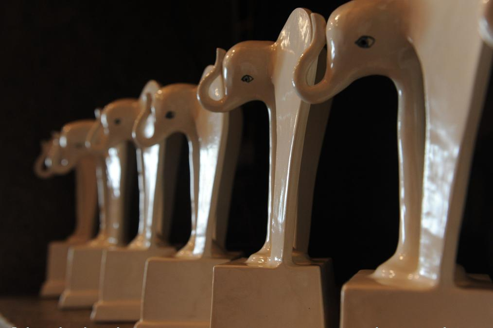

# Как слонов вручали «не таким». Самой яркой и смысловой премии за все время существования «Белого слона» не помешали ни провокаторы, ни срочная эвакуация

- **URL:** https://novayagazeta.ru/articles/2021/04/11/kak-slonov-vruchali-ne-takim
- **Дата:** 2021-04-11
- **Автор:** Лариса Малюкова

## Как слонов вручали «не таким»

## Самой яркой и смысловой премии за все время существования «Белого слона» не помешали ни провокаторы, ни срочная эвакуация

Как теперь принято, «Белый слон» проводился в гибридном режиме. К студии в Сахаровском центре подключались онлайн Греция. Якутия, Петербург, Лос-Анджелес, Берлин…

Фото: Марина СычеваИ было бы несправедливым свести все к политике или скандалу. Ну да, решили критики среди прочих наград и номинаций отметить фильмы Алексея Навального в категории «Событие года». Так ведь и правда — событие. Одних просмотров десятки миллионов. И впечатлений. И обсуждений во всем мире. Я могу себе легко представить «Разговор с отравителем» в документальной Панораме Берлинского кинофестиваля. Это настоящий детектив, разворачивающийся на наших глазах, только в роли сыщика выступает жертва.

Яна Троянова и Александра Дубровская (справа). Фото: Марина СычеваБыли разные мнения, но большинство — «за». Что тут поделаешь… Или? Тут началось. Занервничало Правление гильдии Союза кинематографистов во главе Кириллом Разлоговым — ему же объясняться с руководителем Союза кинематографистов Никитой Михалковым. Единственный возможный выход Разлогов нашел в том, чтобы выдворить нелояльный экспертный совет премии с территории официальной Гильдии при СК (вспомнилось, что у Союза кинематографистов и Следственного комитета — одна аббревиатура).

Выпущенный в свободное плавание Экспертный совет Разлогов назвал навальнистами, Михалков вовсе отказался считать критиками.

А между тем, в Экспертном совете самые авторитетные кинокритики страны: Плахов и Долин, Аркус и Степанов, Абдуллаева, Ратгауз… И неожиданно рецензенты и историки кино проявили солидарность. Прежде всего, этическую. Как пошутил писатель и журналист Михаил Шевелев: «Мы ждали этого от урологов, но нет. Как правильно не ссать научили кинокритики и киноведы».

Награды вручали редакторы ведущих киноизданий: «Сеанса» и «Искусства кино», Кольты», Кино-Театр.Ру, «Профисинема». Новое поколение критиков присудило свою премию «Голос» дебютанту Максиму Печерскому за фильм о трудном диалоге поколений «Год белой луны». Леша Артамонов, программный директор Международного фестиваля дебютов «Новая Голландия», сказал, что молодые критики голосовали исключительно по эстетическим критериям. Но иметь свою политическую позицию это нормально. Мир, в котором транслируется только одна картина мира не оставляет пространства для сомнения, а задача любой критики, в том числе и кинокритики, учить и учиться, ставить под вопрос главенствующее положение вещей. Поэтому любая платформа может и должна быть местом для выражения своей политической позиции.

Редактор сайта Кино-Театр.Ру Жан Просянов и известная белорусская постановщица Даша Жук вручили приз за Лучший дебют Филиппу Юрьеву («Китобой»), который признался, что получить премию в нынешнем году — особая честь. То, что происходит с «Белым слоном» помогает премии стать по-настоящему независимой.

Андрей Звягинцев вместе с критиком Аленой Солнцевой объявляли лауреатов в категориях «Лучшая режиссура» («Пугало» Дмитрия Давыдова) и «Сценарий» («Глубже!» Михаила Сегала). Андрей был вынужден признать, что последний раз на съемочной площадке он был в 2016-м. Ну нет в стране денег, чтобы запуститься со своим проектом лауреату множества фестивалей и члену Американской и Европейской киноакадемий. Михаил Сегал удивился, что был отмечен его сценарий «Глубже!». Ведь это не арт-хаус — нормальное прокатное кино, более того, комедия. И такой выбор со стороны критиков — посыл снимающим: можно говорить о серьезных вещах простым языком.

Андрей Звягинцев. Фото: Марина СычеваАндрей и Елена Плаховы вместе с актерами Еленой Лядовой и Владимиром Вдовиченковым награждали актеров: Викторию Исакову («Человек из Подольска»), Валентину Чыскыырай-Романову («Пугало») и Александра Паля («Глубже).

Поддержите нашу работу!

1000 500 300 Нажимая кнопку «Стать соучастником», я принимаю условия и подтверждаю свое гражданство РФ

Если у вас есть вопросы, пишите [email protected] или звоните:+7 (929) 612-03-68

Александр Паль и Михаил Сегал. Фото: Марина СычеваВиктория Исакова. Фото: Марина СычеваПаль поспорил с Викторией Исаковой, признавшейся в нелюбви к критикам, позволяющим себе оценочные бездоказательные суждения: «А вот я люблю критиков, в отличие от Виктории. Особенно, когда они аргументированно разносят твою работу в пух и прах. Меня это вдохновляет. По его мнению, приз ФБК (мы вынуждены указать, что эту организацию минюст внес в список иноагентов — ред.) — не просто смелое решение, но исключительно правильное, особенно ценное сегодня.

Яна Троянова и Виктор Матизен. Фото: Марина СычеваЯна Троянова и Виктор Матизен вручали награды в самой сложной номинации «Событие года» (награду получила режиссер ФБК Александра Дубровская). Яна даже привезла своего хрустального слоника, опасаясь, что у независимых критиков может не хватить призов. Тему неоднозначного выбора продолжил Илья Хржановский, заметивший, что его долгоиграющий проект «Дау» соседствует с фильмами Навального в номинации. И это свидетельствует о том, что

кино способно выходить за рамки стандартов, вопрос в том, что ты можешь пережить, что ты чувствуешь.

А формы жизни могут быть разными, как и формы взаимодействия с кинокритиками, которые не только пишут о кино, они очень помогали ему во время работы.

В это время в зале Сахаровского центра уже были представители НОД — суровые мужики в черной одежде и с бородами под черными масками. Устроители премии и представители центра долго с ними разговаривали, пытаясь объяснить, что это исключительно кинематографическое мероприятие. И момент объявления крамольной номинации они просто пропустили — когда узнали, что ФБК уже получил приз, развернулись и ушли. Не с актерами же им воевать.

В самых возвышенных тонах говорили Александр Сокуров — о выдающемся документалисте, «достоянии европейского кинематографа» Викторе Косаковском (фильм «Гунда»), Юрий Норштейн — о поэтике Андрея Хржановского (приз за «Вклад в развитие киноискусства»), сам Косаковский — о необходимости гуманизации человечества, истребляющего животных и друг друга.

В питерском «Сеансе» начали церемонию награждением Федора Бондарчука за сериал «Псих». А завершить должны были представители журнала «Искусстве кино». Но во время церемонии в редакции отключили электричество. Пришли охранники и потребовали срочно эвакуироваться из здания. Конверт Антон Долин, Зара Абдуллаева и Зинаида Пронченко открывали в соседней кофейне «Старбакс»: Нет, это не «Ла-ла Ленд»! и не «Конформист»! Это — картина Андрея Кончаловского «Дорогие товарищи»!

Читайте также

Когда слона охватит гнев?

Кризис и раскол в российской гильдии киноведов и кинокритиков — в преддверии очередной церемонии вручения призов «Белый слон»

«Мы ужасно рады за Андрея Сергеевича, — сказал Антон Долин, — и спешим его утешить. Вы решили снять свой фильм с номинации. Но ведь мы и не ставили ваш фильм… Мы вообще «не выставляем на номинации». Просто критики выбирают среди вышедших в прокат в течение года работы, которые показались им интересными. И поскольку «Дорогие товарищи» понравились не всем критикам, но многим, они за него и проголосовали. Причем, еще неделю назад Андрей Кончаловский не возражал против участия своего фильма в конкурсе премии. Но за три дня до церемонии передумал! Мы верим: пройдет еще не более трех дней, он снова передумает и заберет этого красивого белого слона, который мы не разобьем, несмотря на все эвакуации!»

Удивительно, что фрагментами фильма «Нос или Заговор «не таких!», которые показывали во время церемонии, можно было бы иллюстрировать все происходящее сегодня. Не только колонны в противогазах, пионерские марши, окрики: «Не позволим!»… Но кто такие, «не такие»? Ведь Шостакович, Филонов, Мейерхольд, Хармс — не диссиденты, но выбивающиеся из общего ряда, из-под одной гребенки чувством собственного достоинства. Они не хотели быть особенными, тем более отверженными. Они просто занимались искусством. И за это были оболганы, уличены в формализме, «сумбуре вместо музыки», отрыве от масс. «Не такие» — сегодня это Сокуров, Норштейн, Звягинцев и Дмитрий Геллер, получивший награду за лучший анимационный фильм. И все способные выйти за рамки традиций, классического нарратива, почувствовать ток времени.

Поддержите нашу работу!

1000 500 300 Нажимая кнопку «Стать соучастником», я принимаю условия и подтверждаю свое гражданство РФ

Если у вас есть вопросы, пишите [email protected] или звоните:+7 (929) 612-03-68
