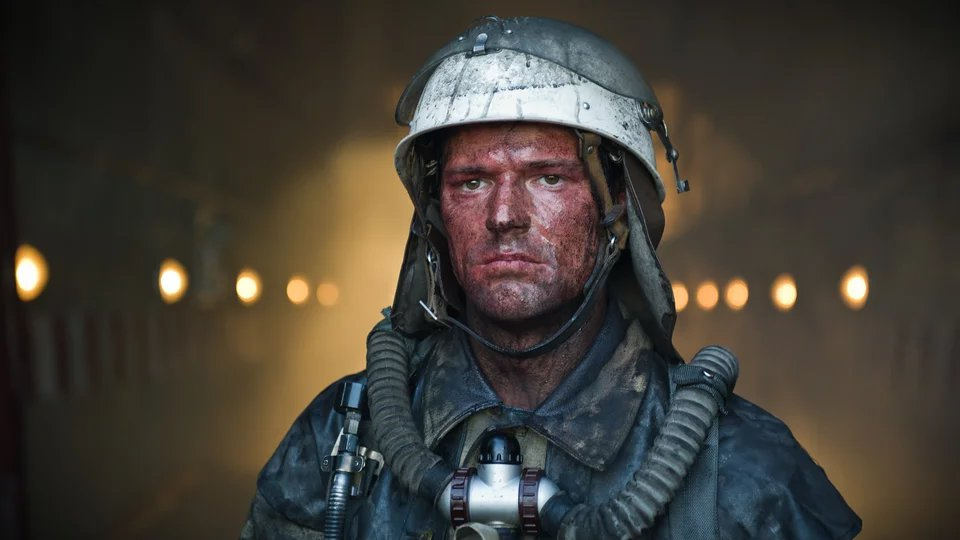

# Приговоренные к подвигу. Почему фильм-катастрофа «Чернобыль» Данилы Козловского и Александра Роднянского вызывает много вопросов

- **URL:** https://novayagazeta.ru/articles/2021/04/15/prigovorennye-k-podvigu
- **Дата:** 2021-04-15
- **Автор:** Лариса Малюкова

## Приговоренные к подвигу

## Почему фильм-катастрофа «Чернобыль» Данилы Козловского и Александра Роднянского вызывает много вопросов

Данила Козловский. Кадр из фильмаПроизводство кино — долгий процесс. Пока амбициозный фильм готовился, вышел замечательный сериал HBO под тем же названием. Реконструирующий с документальной дотошностью события почти 35-летней давности. Рассказывающий о катастрофе, ускорившей развал СССР. Анализирующий ее причины. Выписывающий коллективный портрет советских людей, строящих «светлое будущее» у порога раскаленной от бесстыдства лжи, которая и рванет в 26 апреля в четвертом реакторе.

Козловского не занимает расследование, он не ищет виновных, сдвигает оптику, снимает фильм-реквием, посвящая его ликвидаторам аварии. Хотя и трудные вопросы не обходит стороной.

Вначале — титр: «Фильм вдохновлен реальными событиями». Именно что вдохновлен. Авторы не претендуют на документальное воспроизведение «как это было». Хотя благодаря воспоминанию о времени в подробностях есть ощущение присутствия. Разумеется, снимали экшен, поэтому в отличие от атмосферного фильма Миндадзе «В субботу», в котором завороженность мира, загипнотизированного катастрофой, здесь все крупно, даже преувеличенно ярко (особенно в бравурном зачине) — как в журнале «Огонек» поздних 80-х. Время как коллективная память, сконцентрировано в деталях — восклицательных знаках. Стадион, плакаты-воззвания к строителю социалистического общества, чертово колесо, забытый детский гомон во дворах, магнитофон на площади, кумачовые стяги и облупленные девятиэтажки, жареная картошка в малогабаритной кухне, торт «Киевский» и дефицитные духи «Опиум». «Жизнь играет с нами в прятки». Мирный атом притворяется, что служит советскому человеку, который отвергает вероятность смерти, ведь передовая наука неуязвима. Мы вместе с звездами падаем, падаем вниз. Это Припять, ударно голосующая за ХI пятилетку. Партия наметила, выполним с честью! А звездной ночью Цой — над пустой дорогой в никуда.

Если формулировать коротко, то кино Козловского — о любви под распаленным реактором. Той любви, что последним ярким полыханием вспыхивает, как цветы в радиацию. И о маленьком человеке, посмевшем взглянуть в глаза бездне.

Оксана Акиньшина и Данила Козловский. Кадр из фильмаАлексей Карпушин (Данила Коловский) — пожарный на атомной станции — решает восстановить прерванные на долгие годы отношения со своей возлюбленной Олей (Оксана Акиньшина). Тут-то и происходит одна из самых страшных техногенных катастроф в истории человечества. Надо предотвратить повторный взрыв реактора, спуститься под ядерный блок и выпустить воду. Так было: активная зона реактора медленно прожигала отделяющую ее от воды плиту… Коснись она воды — массивный радиационно-паровой взрыв страшной мощности разошелся бы по всей Европе. Было решено в затопленные камеры четвертого реактора отправить трех добровольцев, чтобы открыть запорные клапаны и выпустить воду.

Понятно, что идущие с ранцами-аквалангами в воду 56 градусов, бредущие и плывущие темными коридорами затопленного помещения под тоннами расплавленного радиоактивного месива — жертвы, приговоренные к подвигу. Кстати, Козловский не демонстрирует в героическом кино показного героизма. Каждый, прежде чем сделать бросок в «зону», сомневается, силится преодолеть страх и инстинкт самосохранения, оглядывается, ища поддержки, и в конце концов делает мучительный выбор. И выбор мотивирован: спасти товарища, ребенка, людей — выкрутить этот чертов проржавевший вентиль.

Парень — цветастая рубаха — Леха не просто «пожарный надзор», он хранитель реактора, мечтающий от него уехать, вырваться из проржавевшей жизни, попасть на концерт главной звезды СССР — Пугачевой. У него есть три желанья — нету рыбки золотой. И есть страшной силы ночной взрыв, на который дети смотрят завороженно с близкого расстояния. И есть Оля — парикмахерша из 80-х: цыганские серебряные сережки, розовая плиссированная юбка, мороженое в вафельном стаканчике за 19 копеек.

Козловский вернулся к своему амплуа ослепительного, лучшего из лучших: Шпиона, Харламова, Дубровского, Тренера, который из второсортных игроков делает команду чемпионов. И вот Леха-Прометей, который должен погасить огонь.

Кадр из фильмаЛучшее в трехчастном блокбастере (мирная жизнь, катастрофа и попытка выхода из нее) — экспозиция и начало апокалипсиса. Поразительные кадры, когда мертвые птицы падают, ударяясь о лобовое стекло. Рыжеющий лес по всей округе до горизонта. Ошеломленные, зараженные и обожженные люди — привкус стронция во рту — дезориентированы, бредут как зомби, застревая ботинками в раскаленном битуме и рвоте. Летящий по городу пепел. И советские люди, которых везут автобусами в Киев, как обычно, ничего не объяснив. И привычная тотальная растерянность перед необъяснимым, непредсказуемым будущим.

Дальше начинаются сценарные сбои, прокручивание сюжета на холостом ходу и даже на одном месте (повторные погружения в зараженную воду). Хронометраж 2 часа 16 минут — это слишком. Неубедительный второй план, некоторые персонажи, такие как радиолог Равшан Курковой, выглядят нагрузкой к истории. При отличном кастинге местами ощущение сильного перебора, когда актеры играют навзрыд. Несуразный финал. При этом стопроцентно убедительные эпизоды, в которых авторы находят точные метафоры и рифмы. Смотря эту несовершенную, но при этом мощную картину, важную для киноиндустрии, понимаешь, как вырос режиссер Данила Козловский по сравнению с его же «Тренером». Наверное, с опытом придет и умение отсекать лишнее, чтобы ненужные подробности не застилали необходимое.

Поддержите нашу работу!

1000 500 300 Нажимая кнопку «Стать соучастником», я принимаю условия и подтверждаю свое гражданство РФ

Если у вас есть вопросы, пишите [email protected] или звоните:+7 (929) 612-03-68

Важно, что авторы верны позиции «правда без ура-патриотизма», и им удается не впасть в истерику славословия, востребованного в сегодняшнем российском кино.

Не отводят глаз от нахватавших смертельных доз пожарных. Не скрывают вечного желания партократов не только все скрыть, но и заткнуть живыми парнями дырку в реакторе. Из страха, что Кремль рассвирепеет. Поэтому закономерно: радостный первомайский парад на Крещатике — дети, шары, бодрые реляции телеведущих. Ползущая и неотступающая радиация — это сама система, разъедающее все живое: так было, так будет.

Кадр из фильмаЖивая, нервная камера Ксении Середы («Дылда»): в ней и внимание к человеку, и техничность, и визуальная изобретательность, и, как всегда, искусная работа с цветом. Сложнейшие подводные съемки, все по-честному, без компьютера. Смертоносное зеленовато-мутное пространство. Поэтому барахтающиеся в нем люди напоминают грешников-страдальцев в кругах ада.

Из открытий фильма — музыка Олега Карпачева. Временами оглушительная, спорящая с диалогами героев. Но со своей продуманной, чрезвычайно свежей партитурой и драматургией, сопоставимой с работой больших композиторов в советском кино — Прокофьевым в «Александре Невском» и Крюковым в «Неотправленном письме». И в то же время современная музыка (для подводных сцен Олег Карпачев изобретал инструменты, издающие странные, диковатые звуки). Представляю себе эту ораторию «Чернобыль» в концертном зале. В ней звериный вой и механический скрежет мистических сил, отчаяние и рев скрипок. И сильный контрапункт: солирующий человеческий голос клавишных. Изображение соединяется с музыкой, напоминая страстностью масштабные симфонии вроде бетховенской Героической или Шестой Маллера с их предчувствием катастрофы или оперу «Сила судьбы»: Альваро бросается в пропасть, в «роковое вместилище судьбы». Вот и здесь — маленький человек бросает вызов ядерному аду, «опасной воде» (рабочее название фильма).

Кадр из фильмаПри всей очевидной безнадежности финал не черный. Может, благодаря документальным кадрам того самого вымечтанного концерта Пугачевой, приехавшей вскоре после аварии и выступившей по просьбе ликвидаторов для 9000 спасателей в поселке Зеленый Мыс под Припятью. Она потом вспоминала, как ее инструктировали: надеть защитный костюм, специальную шапочку, чтобы радиация не осела, цветы не брать! Но артистка нарушила все запреты. Присобрала волосы черным бантом. Активно общалась с аудиторией. Получила дозу, которая сказалась и на эндокринной системе, и на голосе. Директор ее коллектива Чуйкин умер от рака. В финале фильма этим хриплым голосом она поет песню Татьяны Снежкиной «Мы в этой жизни только гости» в аранжировке Олега Карпачева.

Рассказывают, что фильм тепло приняли ликвидаторы и атомщики в Курчатове, работающие на АЭС. Его хорошо продают за рубеж.

Но уже сейчас эксперты спорят: удастся ли окупиться картине с бюджетом 689 млн рублей? Не уверена. По двум причинам. Сомневаюсь, что главный зритель — юное поколение, жаждущее острых развлечений, — захочет смотреть хоть и зрелищную, но трагедию. Сомневаюсь, что телевизионным боссам, ответственным за пропаганду, захочется демонстрировать кино про систему-монстра. В подобных случаях, когда фильм хоть и огрехами, но честно и эмоционально рассказывает историю страны и людей, ее спасающих, Минкульт или Фонд кино могли бы существенно поддержать его в прокате.

В ликвидации аварии приняло участие свыше 600 тысяч человек. Вместе с семьями это значительно больше миллиона. Героев и жертв. В нашей истории эти понятия связаны неразрывно.

Поддержите нашу работу!

1000 500 300 Нажимая кнопку «Стать соучастником», я принимаю условия и подтверждаю свое гражданство РФ

Если у вас есть вопросы, пишите [email protected] или звоните:+7 (929) 612-03-68
