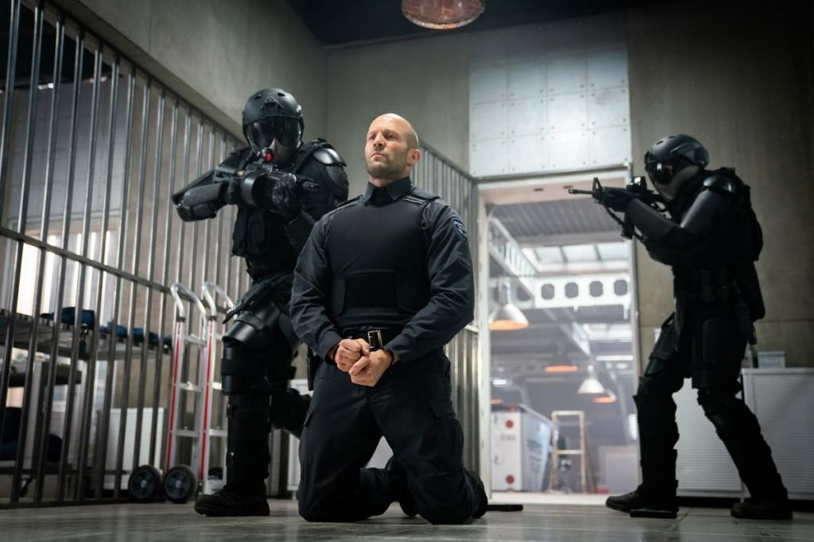

# Деньги, печень и много стволов. Новый фильм Гая Ричи «Гнев человеческий» с рейтингом ожидания на «Кинопоиске» 98% выходит на экраны

- **URL:** https://novayagazeta.ru/articles/2021/04/16/dengi-pechen-i-mnogo-stvolov
- **Дата:** 2021-04-16
- **Автор:** Лариса Малюкова

## Деньги, печень и много стволов

## Новый фильм Гая Ричи «Гнев человеческий» с рейтингом ожидания на «Кинопоиске» 98% выходит на экраны

Кадр: film.ruСпустя 15 лет они снова встретились. Собственно, именно знаток криминального чтива Гай Ричи и открыл пуленепробиваемого Джейсона Стэйтема, совмещавшего карьеру модели с уличной торговлей фальшаком и краденым. Тот самый случай, когда «темное прошлое» подсобило актерской карьере. Роль «Бекона» отдали «лицу бренда French Connection» после того, как Джейсону на пробах предложили убедить режиссера приобрести гарнитур поддельных драгоценностей. Тут-то невозмутимый уличный барыга и впечатлил развесившего уши режиссера. Счастливчик с накачанными кубиками пресса украсил кастинг хитов «Карты, деньги, два ствола», «Большой куш», продемонстрировав не только рискованные трюки, но и фирменную самоиронию.

После «Револьвера» они вместе не работали.

И вот Защитник, Аферист, Игрок, Перевозчик, сверкающий лысиной Адреналинщик — одним словом, неудержимый британец снова в игре. Правда, кого бы ни сражал наповал неубиваемый Джейсон, лучше всего он чувствует себя на территории боевиков кокни. И даже когда его заносит в Лос-Анджелес, кажется, что Карлсон в расцвете сил с пистолетом вместо пропеллера сейчас разберется со всеми несправедливостями мира, утешит нас — малышей, да и вернется в свой Лондон к нелегальным боксерским поединкам и заложникам с грелкой на голове.

Кадр: film.ruВ инкассаторской службе небедного Лос-Анджелеса Fortico Securities новый сотрудник Патрик Хилл по прозвищу Эйч (восьмая буква алфавита H). Тихушник с хрипловатым полушепотом и режущим взглядом, от которого уносятся прочь грабители.

Огонь, пылающий в сосуде льда мести. Из тех, кто слово «справедливость» выжигает каленым железом на лбу бэд-гайс.

Некомпанейский домосед. Одиночка. С сотрудниками не ладит, себе на уме. В сплоченном коллективе быстро просекают: тупорогий бриташка — не тот, за кого себя выдает. И чего этот фрик забыл в инкассаторской машине, набитой мешками с миллионами долларов? Прикрытие? Бывают места и поспокойней. «Мы здесь не хищники, — сразу объяснят новенькому, — мы здесь добыча». А Эйч в самых опасных ситуациях действует не по инструкции, словно нарывается. «Где они нашли этого психа?» — интересуются у надежного и осмотрительного напарника Эйча, бывшего военного, а ныне сотрудника фирмы Пулемета (колоритный Холт Маккэллани). Кажется, свой в доску Пулемет, поначалу единственный, кто готов проникнуться симпатией к новичку.

Who is мистер H? — узловой вопрос криминального триллера. Как связаны многомиллионные ограбления с его личной жизнью? Через пару недель имя «лучшего работника месяца» — на устах всех инкассаторов: H — как Христос? Или как Хиросима? Cпаситель, смертью пренебрегающий, идущий по воде аки по суху? Или — жертва, зараженная и заряженная взрывным устройством. От названия фильма до трактовки некоторых характеров и сюжетных поворотов авторы жонглируют библейскими и мифологическими мотивами. Уже титрах крафтовая сепия готических средневековых манускриптов: символы Апокалипсиса, черненое серебро иллюстраций: огненные всадники, танцующие скелеты, монстры, горгульи и химеры. И, наконец, портрет Эйча на фоне весов справедливости (на которых и «злодеяния рук ваших на земле», и «страдания мои»).

Кадр: film.ruТема смертных грехов и нарушения заповедей, тема преступления и наказания вплетены в историю, как и мотив «выжженной земли» — расплаты детей за вину отцов.

Поддержите нашу работу!

1000 500 300 Нажимая кнопку «Стать соучастником», я принимаю условия и подтверждаю свое гражданство РФ

Если у вас есть вопросы, пишите [email protected] или звоните:+7 (929) 612-03-68

12-й фильм и первый американский проект Ричи — не совсем ремейк, но дальнее эхо французской криминальной драмы «Инкассатор» (2004) Николя Бухрифа с Дюпонтелем и Дюжарденом. Начало «Гнева…» практически буквальная цитата — беззаботная болтовня инкассаторов в кабине бронированного грузовика вбрасывает нас сразу в пламя ограбления.

Стэйтем здесь вроде бы дежурный, узнаваемый. Самурай без страха и упрека. Злой дух, агент мщения. А месть, как известно, блюдо, которое следует подавать холодным. Вот он и замер вроде бы безразличный, побитый ненасытной преступной молью. Да и жив ли он, или это какая-то постжизнь, как у тарантиновской Невесты, когда ангел мести возвращается установить в мире справедливость — в том искалеченном виде, в каком она ему представляется. «Я человек гневливый», — признается в смертном грехе сам Эйч, камера вглядывается в него снизу вверх, за лицом — небо. А когда он открывает лицо грабителям, те в панике смываются.

Но кого наказывать мстителю, когда под подозрением все? Это кино не про грабеж, это война. И Эйч — не охранник, а собранный в кулак воин. Поэтому не спрашивайте, зачем ему пистолет, если нападающие — вооруженные до зубов отморозки. Знали бы они — бабло в голову, бес в ребро — что невозмутимый Стэйтмен в деле, и пуля уже медленно летит навстречу их печени…

Кадр: film.ruКороля играет свита, и свита здесь порой убедительнее несколько однообразного героя. Рядом со Стэйтемом — роскошный жизнелюб с мощнейшей харизмой и отрицательным обаянием Холт Маккэллани. А среди антагонистов — самый запоминающийся человек со шрамом, любитель роскоши Джен (Скотт Иствуд). Опасней и острее бритвы, вспыльчив, непредсказуем.

Ричи ломает последовательность нарратива, сохраняя напряженный ритм действия. Время назойливо кружится, убегает вперед и возвращается, как преступник на место своего преступления. Напряженное и тщательно продуманное повествование перемещается по временным шкалам, замирает. А потом история снова скачет в перестрелках и погонях, застывая в паузах в перекрестных взглядах персонажей. Даже основная музыкальная тема из семи низких нот кружится монотонно, как зубная боль. Ты остановился съесть буритто в неправильном месте… фатум уже подловил тебя, и вертит тобой, пока не метнет в адский котел необратимости.

Экшн-триллер «Гнев человеческий» почти лишен юмора фирменных ричевских Cockney Gangster Comedy «Большого куша» и «Джентльменов», да и смертоносной европейской иронии «Инкассатора». Зато взрывы, драки, перестрелки и настоящие битвы в комплекте. Так устроен мужской мир Ричи, что к финальным титрам ряды персонажей ощутимо редеют.

Минимум диалогов, но в русском дубляже и оставшиеся раздражают. В нашем прокате запрещен обсцен, поэтому повторяющееся «Твою мать!» к финалу осточертеет. А пенис здоровые дядьки предпочитают называть писюном. Думаю, чуткий к слову Ричи сильно бы удивился.

Известный ирландский стенд-ап комик Дилан Моран считает, что фильмы со Стэйтемом, поражающим стельками из туфель десятки противников — лишь упражнения в убийственной мужественности, поэтому так любят их смотреть на диване желеобразные мужчины, как именует их Моран — «мешки с гландами». Он все за них сделает: накажет полицейского за выписанный штраф, тупорылого начальника — за хамство, выберет сэндвич и сразит кубиками пресса симпатичную официантку. Можно окончательно расслабиться, Эйч разрулит копящиеся несправедливости мира. Лишь бы не оказаться под огнем его нечеловеческого гнева.

Поддержите нашу работу!

1000 500 300 Нажимая кнопку «Стать соучастником», я принимаю условия и подтверждаю свое гражданство РФ

Если у вас есть вопросы, пишите [email protected] или звоните:+7 (929) 612-03-68
