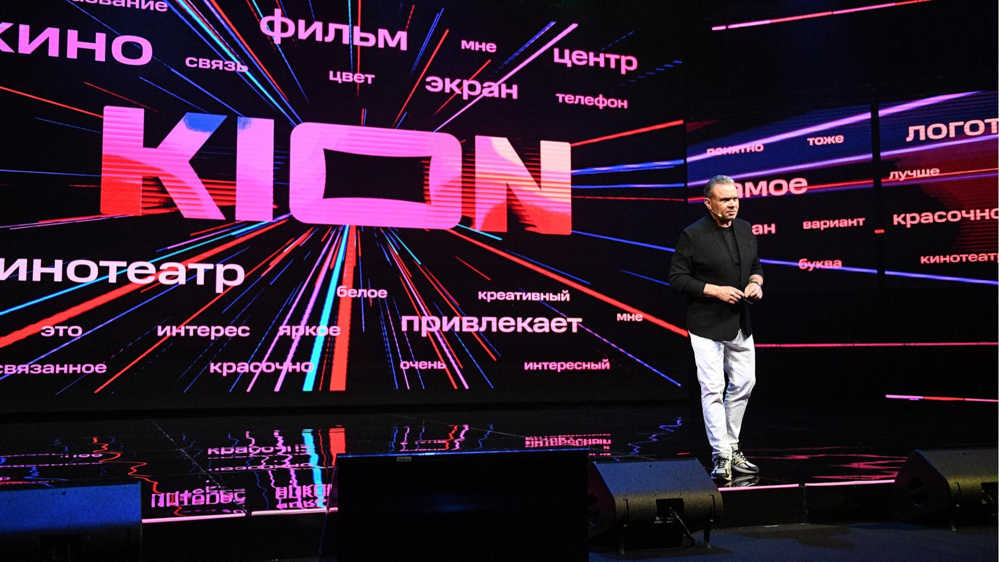

# «Смело, честно, необычно». Глава компании «МТС Медиа» Игорь Мишин о новом онлайн-кинотеатре и грядущем изменении расклада  сил в видеоиндустрии

- **URL:** https://novayagazeta.ru/articles/2021/04/20/smelo-chestno-neobychno
- **Дата:** 2021-04-20
- **Автор:** Лариса Малюкова

## «Смело, честно, необычно»

## Глава компании «МТС Медиа» Игорь Мишин о новом онлайн-кинотеатре и грядущем изменении расклада сил в видеоиндустрии

Игорь Мишин представляет новый онлайн-кинотеатр KIONНа «Мосфильме» состоялась пышная презентация нового онлайн-кинотеатра KION. Вероятно, с его приходом в российской онлайн-видеоиндустрии произойдет очередная революция. Выход столь мощного игрока с такой обоймой потенциальных хитов и новыми форматами изменит расклад сил в онлайн-видеоиндустрии.— Можно ли сказать, что KION — это ребрендинг вашей медиаплатформы?

— По формальному признаку — да. Но это не смена вывески, а изменение статуса, качества предложения. Вывод на рынок нового онлайн-кинотеатра, поэтому совместили два события — появление нового названия и распространение нового знания: мы начинаем выпускать свои проекты — originals. Запускаем онлайн-кинотеатр, где будут полные метры, которые мы спродюсируем, наши оригинальные сериалы, документальные фильмы.

— Как расшифровывается KION? Частица Бога?

— Просто эквилибр со словом «кино». Мы проверили слово на фокус-группах, в качестве ассоциативного ряда у респондентов всплывают слова «фильм», «экран», «кинотеатр».

Презентация онлайн-кинотеатра KION— Ваш слоган: «Смело, честно, необычно». Не слишком ли смело и честно для сегодняшнего дня?

— Абсолютно нет. Это обещание. Мы себя представляем рынку как «гипермаркет впечатлений». «Честно, смело, необычно» — характеристика нашего выхода с originals, аккумулирующая общий индустриальный опыт. Вспомним, какие премьеры сериалов на OTT-сервисах стали массовыми, принесли славу и успех. Это сериалы, сделанные необычно, смело. Мы вступаем в этот рынок, подтверждая свой путь внутри цифровой индустрии.

— То есть табу на темы, на политику и актуальность, на проблемы молодежи, в том числе со свободой слова… не существует? Будет ли реальность отражена в ваших originals?

— Более чем. У нас много проектов титруются «основано на реальных событиях». А на фильме Романа Супера о Сахарове, который 21 мая, в день 100-летия Андрея Дмитриевича выходит, кроме титра «основано на реальных событиях», написано «основано на реальных словах»…

— «Сахаров. Две жизни» — любопытный формат: документальный фильм + игровое кино + театральная постановка.

— Не понимаем, к какому разряду его отнесут критики. Сахарова играет актер Алексей Усольцев, но все, что говорит Сахаров как персонаж в игровой части — реальные слова Андрея Дмитриевича, собранные из воспоминаний, хроники, интервью и т.д.

Другая категория проектов — «истории, подсказанные жизнью», как триллер «Хрустальный». То, что мы делаем, в мировой медийной практике обозначается англоязычным термином social impact entertainment — развлечение социального влияния. Цифровая среда, в отличие от кинопроката, где главенствует аттракцион, и от эфирного телевидения — дает возможность делать интересные экспериментальные рискованные проекты. С одной стороны, это должно быть увлекательно, с другой — инициировать общественные дискуссии: внутри какой-то социальной страты людей.

Кадр из сериала «Хрустальный»— Некоторое время назад вы объявили о прямых инвестициях в кинопроизводство, среди заявленных проектов не только триллеры о серийных убийцах «Коса» Волошина и «Хрустальный» Глигорова, но драмеди о сексологе «Клиника счастья» с Дарьей Мороз, провокационная лавстори «Секреты семейной жизни», соцдрама «Немцы» по роману Терехова, ироническая комедия Бориса Хлебникова «Товарищ Майор», кинороман «Маша» Анастасии Пальчиковой, триллер Алисы Хазановой о группах смерти в интернете «Белый список», дискуссионный док «Спросите Сталина», фильмы Парфенова, портрет Павла Дурова. Среди совместных с Первым каналом сериал «Вертинский» Авдотьи Смирновой…

— Онлайн-кинотеатр, претендующий на лидерские позиции, не может сосредотачиваться на одном жанре, интересе одной адресной аудитории. Социальная цифровая среда сформировала новую тенденцию, когда аудитория того или иного сериала или фильма формируется не по социально-демографическим характеристикам, что привычно для эфирного телевидения, а, извините за модное слово, по психографике потребления контента.

— Объясните поподробнее.

— Это изучение потребителей на основе их деятельности, интересов и ценностей, переживаний. Мы видим, что аудитория того или иного сериала, вышедшего на OTT-платформах, смешанная. Традиционные социально-демографические характеристики перестают определять целевые группы.

Поэтому необходимо разнообразие жанров, дифференциация аудитории. Диапазон нашего интереса — от знаковых, смысловых картин, типа «Блокадный дневник» до блокбастера «Девятаев», который мы сделали с Тимуром Бекмамбетовым. Приключенческий военный экшн, основанный на реальном подвиге летчика Михаила Девятаева. А центр этого диапазона — арт-мейнстрим.

Мы осторожно делаем первые инвестиции в кино, это рискованно: трудно угадать прокатную судьбу и успех фильма.

— Но рынок онлайн-кинотеатров более чем насыщен. За счет чего питаются амбиции лидерства при столь жесткой конкуренции?

— Мы не формулируем претензии стать единственным лидером. Я сказал, что мы должны ворваться в лидерскую группу, которая будет меньше, чем нынешнее число онлайн-кинотеатров.

Для любой новой индустрии полезно появление большего количества игроков, претендующих на лидерство, чем рынок в состоянии прокормить.

Так бывает, когда открываются новые технологические ниши, образуются рынки. Возросшая конкуренция приводит к тому, что зритель начинает получать больше качественных предложений за меньшие деньги. Конфигурация нынешних игроков претерпит изменения в ближайшие несколько лет. Нас ждут интересные сделки по слиянию, поглощению, объединению ресурсов. Как OTT-индустрия мы в начале пути.

— Так все-таки в чем преимущество KION перед уже существующими?

— Есть три вида онлайн-кинотеатров. Независимые от телеканалов и экосистем, как сегодняшний лидер рынка Ivi, онлайн-кинотеатры, существующие в рамках телевизионных холдингов, и онлайн-кинотеатры — живущие в рамках экосистемы. Таких в стране три — мультимедийный сервис Okko, КиноПоиск HD и мы. Экосистемность дает неоспоримые преимущества. Человек, использует онлайн-кинотеатр как гейт в экосистему. И в результате может получать огромный перечень разных услуг — от финансовых до экзотических, типа «умный ошейник» на собаку, покупки билетов на развлечения, из тех, что предлагают современные цифровые сервисы. Удобно иметь один вход, чтобы пользоваться услугами, выходящими за рамки «посмотреть кино».

Кадры из сериала «Секреты семейной жизни», который покажет KION— Вы так и будете работать?

— Мы родились внутри МТС как естественный логичный ход развития экосистемы. Сегодня у нас более 2 млн потребителей, их значительная часть пришла на нашу платформу.

— То есть они и станут вашими зрителями?

— Мы не ограничиваем свое предложение. Мы называем его «два по сто»: подпишись за 100 рублей и получи 100% кэшбэка по системе «МТС кэшбэк». Эти деньги можешь тратить на покупку смартфона, билеты на концерт, любую дополнительную услугу.

— В том числе просмотр фильма…

— Фактически онлайн-кинотеатром начинаешь пользоваться бесплатно.

— Можно ли сказать, что западные гиганты, вроде Netflix и Amazon обогнали нас навсегда? Или, наоборот, мы набираем темп?

— Я сторонюсь комментариев на подобные вопросы. На мой взгляд, они несколько схоластичны. В чем обогнали? Netflix как лидер по качеству производства сериалов? Безусловно да. Netflix как бизнес на территории РФ? Далеко нет. Смотря, с какой стороны смотреть.

— Я про объем библиотеки, содержательные предложения.

— Трудно прогнозировать конкретную конфигурацию в течение двух-трех ближайших лет. Если о сегодняшнем дне, то бизнес Netflix в России близко не подошел к показателям, достигнутым российскими лидерами OTT-рынка… сколько они генерируют средств, сколько у них подписчиков. Что случится в ближайшие несколько лет, кто с кем о чем договорится, кто кого купит, сольется, как будет выглядеть тройка лидеров к концу 2023 года — никто не знает. Параметры индустрии сегодня не в состоянии спрогнозировать ни один человек.

— Это-то и интересно.

— Все мы с вами будем участниками, наблюдателями или в вашем случае обозревателями интереснейших событий, сценарии которых еще даже не написаны.

— Да мы вообще сегодня оказались внутри непредсказуемого сценария, хотя бы в связи пандемией.

— В этом острота и «прелесть момента»…

— Кстати, пандемия — один из участников, стимулирующих ОТТ- индустрию?

— Безусловно. Для многих индустрий пандемия нанесла необратимый ущерб, не говоря о здоровье и психике людей. Для индустрии потребления контента в интернете она дала мощный толчок.

Люди, ограниченные в передвижении, развлечениях, могут развиваться, расслабляться, не выходя из дома.

Кадр из фильма «Клиника счастья» — из премьер KIONПоддержите нашу работу!

1000 500 300 Нажимая кнопку «Стать соучастником», я принимаю условия и подтверждаю свое гражданство РФ

Если у вас есть вопросы, пишите [email protected] или звоните:+7 (929) 612-03-68

— Я работаю не в индустриальном издании, поэтому хотела бы за словами «гипермаркет», «потребитель», «пользователь», «продукт» рассмотреть что-то смысловое, художественное, боюсь сказать слово «искусство». Есть ли у вас амбиции и желание создавать фильмы, поднимаясь до высот подлинного арта?

— Это вопрос баланса. Каждая платформа в активе имеет какие-то значимые имиджевые проекты, ставшие общественными откровениями, но, с коммерческой точки зрения, неэффективные. С другой стороны, есть коммерчески успешные релизы сериалов и картин на платформах. Каждая платформа, OTT-сервис этот баланс будет настраивать индивидуально. Жизнь подтвердит правильность выбора. В этом балансе найдется место и для аудиовизуальных произведений, обладающих художественной ценностью.

Фактически вся мощная драма ушла в сериалы. На этой поляне тон задают OTT-сервисы, а не кинопрокатные компании или эфирное телевидение.

— Но путь — это еще и выбор авторов, режиссеров, сценариев.

— Мне кажется, сегодня этот процесс не то, чтобы начался, скорее завершается. Самые сильные авторы, сделавшие имя и карьеру в кино, пишут и снимают драматические или детективные сериалы для платформ.

— А вот к слову, Игорь, нет ли желания, к примеру, пригласить Андрея Звягинцева, который не снимает пока сериалов?

— У нас пока не снимает. Все-таки это не столько приглашение со стороны платформ, скорее личная созревшая творческая потребность такого сильного автора, как Андрей. И у нас таких примеров много. К нам пришли талантливые режиссеры из артового сегмента… Если взять лидеров того же «Кинотавра» последних трех-четырех лет во всех номинациях: «Лучший фильм», «Лучший режиссер», «Лучший автор сценария» — они работают на платформах, в том числе и у нас.

— Сигарев, Смирнова, Хлебников, Волошин, Гай-Германика, Константинопольский…

— Мещанинова, Бычкова, Хазанова… OTT-сервис дал возможность этим людям быть услышанными, реализовать свои чаяния. Такова общемировая тенденция.

— Думаю, что «Девятаевым» Бекмамбетова и Трофимова вы заинтересовались еще и из-за вертикального формата для просмотров в смартфонах.

— Этот бонусный плюс не главный аргумент для принятия решения. OTT-сервисы должны предоставлять людям новые возможности восприятия, связанные с удобством цифровых технологий. Наш новый формат «Киносториз», который мы выводим на российский рынок, и хотелось бы, чтобы коллеги поддержали этот термин. Россия стала бы родоначальником такого формата: мы объединили полнометражный художественный фильм с форматом веб-сериала.

Все привыкли, что веб-сериал — индустриальный термин. 10 серий по 10 минут. Со скромным бюджетом, юными командами и обычно для бесплатных хостингов. Что такое 10 серий по 10 минут? Час сорок, то есть полнометражный фильм. OTT-сервис дает возможность выбрать вариант просмотра. Нажимаешь кнопку «смотреть как фильм», садишься дома на диване, включаешь полнометражное кино. Но если ты в дороге, ждешь рейс, нажимаешь кнопку «смотреть как сериал». Это не разрезанный на части длинный фильм, каждая серия сделана как законченный драматургический акт. У такого проекта полноценные киношные бюджеты с хорошим кастингом, объектами, графикой, со всеми слагаемыми прокатного кино. Мы примерно проектов восемь в таком формате в этом году выпустим.

Это первые опыты. В ближайшие годы, надеюсь, что наш призыв «Смело, честно, необычно» станет универсальным. Мы призываем OTT-сервисы идти нехожеными тропами, придумывать форматы, не зная, понравятся ли они зрителю.

Если не рисковать, не придумывать что-то необычное, мы не поймем, что будет предпочитать зритель завтра.

Надо максимально использовать цифровые технологии с их возможностями иной коммуникации по сравнению с кинотеатром или с эфирным телевидением.

— Какой фильм/сериал будет первым в этой линейке?

— «Афера» — народная посткарантинная кинокомедия о приключениях в деревне. В киносториз же четкие жанровые градации: комедия, хоррор, триллер, вампирский триллер… А часовые современные сериальные драмы становятся миксом разных жанров… Короткие формы позволяют поддерживать зрительский интерес к жанровому кино.

— Вспоминаются скандалы Netflix с Каннским фестивалем. Каковы будут взаимоотношения онлайн-платформ и кинотеатрального проката? Как будут развиваться конкурентные отношения?

— Мы видим, что релизы полных метров все чаще происходят в цифровой среде. Прежде всего это касается невысокобюджетных арт-мейнстримовых картин. Зачастую продюсерам выгоднее продать их на платформу или на две платформы, чем рисковать с прокатом. Особенно в условиях карантинных ограничений.

— Тем более прокат — это две недели в репертуаре кинотеатра.

— И вот новая реальность, данная нам в ощущениях, как классики писали. Прокат останется для высокобюджетных блокбастеров, аттракционного кино. Для аттракциона большой экран и звук 5.1 играют решающую роль, за это люди и платят.

— Мне кажется, еще и для арт-хауса, картин Бела Тарра, Роя Андерссона, требующих концентрации внимания.

— А это любопытный вопрос. Когда человек дома смотрит эфирное телевидение и когда человек дома смотрит сериал или кино, включая его на OTT-сервисе, в онлайн-кинотеатре — это два разных типа смотрения. Эфирный телик дома превратился в фон, люди занимаются домашними делами, разговаривают, готовят еду и т.д. Но те же люди, покупающие просмотр, подписку, ждущие премьеры сериала, садятся в том же доме у того же экрана… И возникает коммуникация, близкая к ощущению, которое вы испытываете в обычном кинозале.

— Минус — коллективное переживание.

— Тоже дискуссионный вопрос. Сильные арт-хаусные фильмы части аудитории любопытны прежде всего личными переживаниями. Это комедия —

зал хохочет, и ты заражаешься смехом. Поэтому комедии тоже относятся к аттракционам и будут долго показываться в кинотеатрах.

Кадры из сериала «Секреты семейной жизни»— А отношения с телевизором? Знаю, что в отличие от пессимистов, у вас есть своя концепция выживания телика.

— Телевидение как социокультурный феномен никуда не денется, будет нас сопровождать еще десятки лет, трансформируясь технологически. Традиционная технология ТВ умирает, ей в конце концов сто лет. Сейчас мы приблизительно в той же ситуации, как Москва в 20-е годы сто лет назад: уже появились первые такси, но еще ездят извозчики. Появились такси — это OTT-сервисы, но продолжают ездить дилижансы… Период мирного сосуществования продлится еще какое-то количество лет. Эфирное телевидение рано списывать со счетов. Более того, когда онлайн-кинотеатры задрали планку качества, наблюдаем, как эфирное телевидение начинает эти вызовы принимать, подтягиваться, чтобы не потерять аудиторию. Усиление конкуренции происходит не только между онлайн-кинотеатрами, которых излишне много для российского рынка, конкуренция растет между цифровой средой и традиционной. Выигрывает зритель.

— Но в цифровой среде пока свободы побольше. И на уровне тем, и даже в лексике.

— Я бы не сказал, что разница в свободе. Если сейчас эфирному телевидению сказать: «Делайте, что хотите», не выйдет. Потому что каналы прикормили аудиторию, которая привыкла к определенному контенту, если начинаешь резко менять репертуар, аудитория может уйти. Вопрос не в административном наличии свободы или несвободы, а в том, что общая телеаудитория тает с годами, каналы не позволяют себе резких движений, смысловых и эмоциональных рисков. Уже непонятно, что первично — курица или яйцо…

— Каналы сначала кормят определенными блюдами свою аудиторию, а потом становятся рабами специфической «диеты».

— Рекламный бизнес, продажа аудитории — в этом финансовый механизм существования. OTT-сервисы провоцируют их на поиски, как минимум в сериальной сетке.

Эфирный телик еще ответит, мы в начале конкурентных битв.

— Да вы оптимист. Несколько слов про интерактив. Каким он будет на вашей платформе?

— Хотя бы в выборе просмотра: киносториз — как фильм или как сериал — это уже элемент интерактива, шаг в сторону непассивного потребления.

— Я-то себе вообразила спецпредложения для зрителя участвовать в нарративе: выборе финала фильма, выборе героя для спин-оффа.

— Сейчас и подобное начнет появляться. Мы входим в период, когда возникающих технологических новшеств будет больше тех, которые из них приживутся, которые зритель примет и полюбит.

— Производство — дорогая вещь. Понимаю, что за вами МТС. И все же, качественные фильмы, триллеры, комедии… Вы думаете об окупаемости, как будете выживать?

— Мало того, что «МТС Медиа» — компания, существующая в рамках экосистемы и поэтому у нас консолидированный бюджет с МТС — прибыльной компанией. Кроме того, внутри нас — «дочки» «МТС Медиа» — OTT-сервис. Это инвестиционная часть нашего бизнеса. У нас традиционные три среды — кабель, IPTV — спутник, где «МТС Медиа» продолжает предоставлять услуги по доставке телевизионных каналов для населения. Успешный финансовый бизнес с хорошей маржинальностью. Заработки инвестируются. Плюс дополнительные инвестиции со стороны материнской компании.

— А какая компания среди ваших конкурентов для вас привлекательна, чей опыт вы принимаете и преобразуете?

— Не открою Америки, зафиксирую общее индустриальное мнение. Безусловно, есть пионеры рынка — Ivi, Okko, Megogo, возникшие, когда сама задача развивать бизнес платного потребления контента в интернете была фантастикой. Мне это напоминает мою телевизионную юность. В 1990-м я сказал: «О! Можно делать эфирное телевидение! Давайте создадим частную телекомпанию». На меня смотрели, как на сумасшедшего. Зачем на это время тратить? Лучше редкоземельные металлы будем продавать или алкоголь из Польши завозить. Какое эфирное телевидение?! Так же десять лет назад воспринимались пионеры OTT-бизнеса. Есть онлайн-кинотеатр Premier, первым у нас открывший originals. Мы же помним феерический успех «Домашнего ареста» в 2018-м. Сейчас наблюдаем, как онлайн-кинотеатр «Кинопоиск» наращивает объемы качественного репертуара, предлагая все больше оригинальных сериалов. В адрес практически каждого игрока, а их сегодня плюс-минус десяток, можно сказать комплиментарные слова. Возьмите хотя бы More.tv, прогремевшее с их «Чиками» в прошлом году. Относимся ко всем ним с уважением, в некотором смысле они протоптали для нас дорожку.

— Сколько надо времени, чтобы заговорили о платформе KION?

— Индустрия об этом заговорила уже утром 20 апреля после нашей презентации. А зрительская популярность — процесс накопительный. Нам надо сделать несколько ярких релизов за первые два месяца работы. У нас необычный график выпуска оригинальных новинок: документальное кино и сериалы, киносториз и полный метр, которые мы спродюсировали. Надеюсь, к ноябрю месяцу мы станем заметным игроком. Вы о нас еще услышите. Вы нас увидите.

Поддержите нашу работу!

1000 500 300 Нажимая кнопку «Стать соучастником», я принимаю условия и подтверждаю свое гражданство РФ

Если у вас есть вопросы, пишите [email protected] или звоните:+7 (929) 612-03-68
